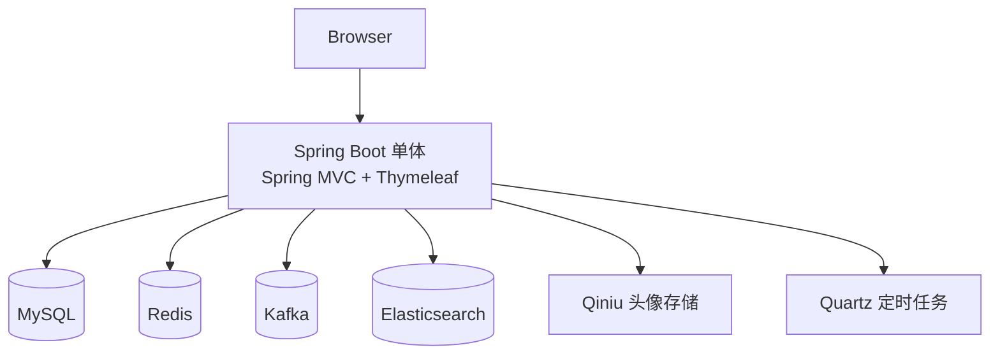
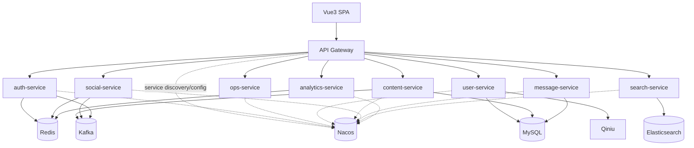
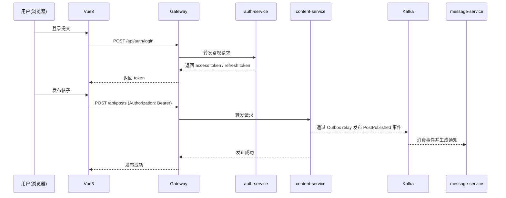

# 架构设计

## 1. 当前总体架构（微服务全链路）

```mermaid
flowchart TD
    Browser[Browser] --> SPA[Vue3 SPA\n(frontend)]
    SPA --> GW[Gateway]

    GW --> Auth[auth-service]
    GW --> Ops[ops-service]
    GW --> User[user-service]
    GW --> Content[content-service]
    GW --> Social[social-service]
    GW --> Msg[message-service]
	    GW --> Search[search-service]
	    GW --> Ana[analytics-service]

	    GW -. service discovery/config .-> Nacos[(Nacos)]
	    Auth -. dubbo registry .-> Nacos
	    Ops -. dubbo registry .-> Nacos
	    User -. dubbo registry .-> Nacos
	    Content -. dubbo registry .-> Nacos
	    Social -. dubbo registry .-> Nacos
	    Msg -. dubbo registry .-> Nacos
	    Search -. dubbo registry .-> Nacos
	    Ana -. dubbo registry .-> Nacos

    Auth --> MySQL[(MySQL)]
    User --> MySQL
    Content --> MySQL
    Msg --> MySQL
    Search --> MySQL

    Auth --> Redis[(Redis)]
    Social --> Redis
    Content --> Redis
    Ana --> Redis

	    Content --> Kafka[(Kafka)]
	    Social --> Kafka
	    Msg --> Kafka
	    Search --> Kafka
	    Kafka --> ZK[(Zookeeper)]

    Search --> ES[(Elasticsearch)]

    Prom[Prometheus] -. scrape .-> GW
    Prom -. scrape .-> Ops
    Prom -. scrape .-> Auth
    Prom -. scrape .-> User
    Prom -. scrape .-> Content
    Prom -. scrape .-> Social
    Prom -. scrape .-> Msg
    Prom -. scrape .-> Search
    Prom -. scrape .-> Ana
```

## 1.1 历史单体说明（已归档）

历史单体源码已从仓库主干移除；历史决策/迁移记录保留在 `.helloagents/archive/`，用于追溯与对照。

建议的验证路径：
- 全依赖启动：`deploy/docker-compose.yml`
- 自动化门禁：`mvn test`（后端）+ `npm -C frontend test`（前端）

---

## 2. 历史架构（单体）



---

## 3. 目标总体架构（Boot 3 + 微服务 + 前后端分离）



---

## 4. 技术栈
- **Backend：** Java 17 / Spring Boot 3.x / Spring Cloud / Nacos / Dubbo
- **Frontend：** Vue 3
- **Data/Infra：** MySQL / Redis / Kafka / Elasticsearch / Qiniu / Zookeeper（Kafka 依赖）

---

## 5. 核心流程示例（目标态）



---

## 6. 一致性与幂等（旁路服务）

本项目的搜索/通知/统计等能力属于“旁路能力”，核心原则是 **最终一致**，而不是强一致：

- **写路径（核心域）：** `content-service` / `social-service` 在写入主存储后发布事件（Kafka）。
- **P0 修复（幽灵事件）：** 当写路径处于 DB 事务中时，Kafka 发送必须延后到事务提交后（After-Commit），避免“DB 回滚但事件已发出”。
- **读路径（旁路域）：** `search-service` / `message-service` / `analytics-service` 消费事件或由 gateway 采集写入，异步更新旁路数据。
- **最终一致窗口：** 允许短时间内“已发帖但搜索未命中”“已点赞但通知稍后到达”等现象，通过重试/重建索引等手段补偿。

幂等与去重策略（最低要求）：

- **事件 envelope 统一携带 `eventId` / `traceId` / `version`**（详见 `.helloagents/archive/2026-01/202601161428_boot3_ms_vue3_nacos/event-contract.md`）。
- **消费端幂等：** message-service 采用 `consumed_event` 表记录已消费 `eventId`，避免重复通知/重复副作用。
- **索引重建：** search-service 提供 reindex 能力用于迁移期冷启动与修复（对外运维入口：`/api/ops/search/reindex`；legacy：`/api/search/internal/reindex` 固定返回 410 并提示迁移），重建数据通过 content-service Dubbo RPC 拉取。

治理补充（2026-02-25）：
- **Outbox Pattern（默认开启）：** content-service / social-service / user-service 默认启用 outbox，使“DB 提交后事件可重试投递”成为默认安全态；保留开关可回滚到 after-commit 直发（应急止血用途）。
- **去投影（RPC 回源）：** 取消 `content/message/social` 之间的本地投影（`*_projection` 表、Redis 投影、投影消费者与 backfill 入口），跨域校验/聚合统一改为 Dubbo RPC 回源 SSOT（例如：content/message 写路径拉黑校验、content 读路径点赞查询、social 写路径 entity resolve、写路径处罚状态校验）。
- **同步依赖风险（content ↔ social）：** 当前存在 `content-service ↔ social-service` 双向 Dubbo 依赖；必须显式 `timeout` + `retries=0`，并对写路径与读路径分别制定 fail-open/fail-closed 策略，避免级联超时放大与部署牵制。
- **unknown-handling 对齐：** search-service 等消费者统一采用 `EventEnvelopeParser` + `UnknownEventAction`，降低版本演进时的 DLQ 噪声与阻塞风险。
- **感知一致性（Perceived Consistency）：** 对“点赞/搜索”等对用户敏感的链路，在前端做短 TTL 覆盖与预期管理（read-your-writes + 最终一致提示），降低“写成功但读侧未更新”的可见不一致。
- **幂等 TTL 可配置：** `IdempotencyGuard` 的 processing/success TTL 支持按环境配置，降低慢链路下锁过期的重复副作用风险；同时提供脚本示例帮助第三方正确传递 `Idempotency-Key`。
- **配置护栏（doctor）：** 提供 `scripts/doctor.sh` 进行部署前自检（不输出敏感值），快速发现 JWT/prod profile/旁路暴露等误配，并提示清理已废弃的 internal/ops token 配置。
- **gateway analytics 有界化：** 网关侧 UV/DAU 去重仅用于降噪，应使用有界 TTL 缓存（多实例不共享），最终以 analytics-service Redis 去重/聚合为准；并确保采集失败可观测且不影响主业务链路。
- **Dubbo 调用治理：** traceId/traceparent 通过 Dubbo attachment 透传；调用次数/时延通过统一 Filter 埋点（consumer/provider 侧口径一致），与 Prometheus/Micrometer 指标体系对齐。

### 6.1 架构护栏（Guardrails）
说明：按需求变更，当前仓库已移除扫描式门禁测试（gate tests）。以下护栏以 **文档 SSOT + code review + 编译/单测** 方式执行。
- **contracts 纯化（协议与运行期隔离）：** `contracts-core` 仅承载稳定协议与纯工具类（如 `TraceHeaders`/`TraceIdCodec`），禁止 ThreadLocal/MDC/Spring Web/Reactor 等运行期实现细节。
- **Reactive 禁止 ThreadLocal trace 上下文（gateway）：** gateway 生产代码禁止依赖 `TraceContext/TraceId`（ThreadLocal/MDC），trace 传播必须通过 header/attachment。
- **跨域依赖治理（ErrorCode ownership / payload 不泄漏）：** 禁止跨域 import 域错误码枚举、禁止 infra/contracts/common/gateway/ops 依赖域事件 payload。
- **Outbox-only 默认安全态：** 允许保留“事务提交后直发”作为应急能力，但必须被显式开关保护（`events.outbox.direct-send-enabled`，默认关闭）。
- **Security 去漂移（SSOT 下沉到 starter）：** JWT authorities converter 统一由 `infra-security-starter/src/main/java/com/nowcoder/community/infra/security/jwt/AuthoritiesConverterFactory.java` 提供，各服务 `*SecurityConfig` 仅表达授权矩阵。
- **服务实现级耦合约束（Maven 依赖层面）：** 禁止 service 模块在 pom 中直接依赖其他 service 模块，强制经由 `*-api` 或事件契约协作。

---

## 6. 重大架构决策（ADR 索引）

| adr_id | title | date | status | affected_modules | details |
|--------|-------|------|--------|------------------|---------|
| ADR-001 | Boot 3 + Java 17 + Nacos 微服务底座 | 2026-01-16 | ✅Adopted | gateway/auth/user/content/social/message/search/analytics | [Link](archive/2026-01/202601161428_boot3_ms_vue3_nacos/how.md#adr-001-boot-3--java-17--nacos-微服务底座) |
| ADR-002 | SPA 鉴权采用 JWT + Refresh Token，网关统一校验 | 2026-01-16 | ✅Adopted | gateway/auth | [Link](archive/2026-01/202601161428_boot3_ms_vue3_nacos/how.md#adr-002-spa-鉴权采用-jwt--refresh-token网关统一校验) |
| ADR-003 | Kafka 事件序列化（迭代 1）采用 JSON + 字段级契约 | 2026-01-16 | ✅Adopted | content/search/message/social | [Link](archive/2026-01/202601161428_boot3_ms_vue3_nacos/how.md#adr-003-kafka-事件序列化迭代-1采用-json--字段级契约) |
| ADR-004 | UV/DAU 采集（迭代 1）由 Gateway Filter 采集，写入 analytics-service | 2026-01-16 | ✅Adopted | gateway/analytics | [Link](archive/2026-01/202601161428_boot3_ms_vue3_nacos/how.md#adr-004-uvdau-采集迭代-1由-gateway-filter-采集写入-analytics-service-redis) |
| ADR-005 | auth-service 与 user-service 职责边界（迭代 3） | 2026-01-16 | ✅Adopted | auth/user | [Link](archive/2026-01/202601161428_boot3_ms_vue3_nacos/how.md#adr-005-auth-service-与-user-service-职责边界迭代-3) |
| ADR-006 | 页面聚合策略：Vue3 直连多服务，经由 Gateway 路由 | 2026-01-16 | ✅Adopted | frontend/gateway | [Link](archive/2026-01/202601161428_boot3_ms_vue3_nacos/how.md#adr-006-页面聚合策略vue3-直连多服务经由-gateway-路由) |
| ADR-007 | 数据拆分策略阶段（共享库 → 独立库） | 2026-01-16 | ✅Adopted | user/content/social/message/search/auth | [Link](archive/2026-01/202601161428_boot3_ms_vue3_nacos/how.md#adr-007-数据拆分策略阶段共享库--独立库) |
| ADR-008 | P0 选择 After-Commit 而非 Outbox（先止血） | 2026-01-18 | ✅Adopted | common/content/social/message | [Link](archive/2026-01/202601182111_prod_hardening_p0/how.md#adr-008-p0-选择-after-commit-而非-outbox先止血) |
| ADR-009 | 从仓库主干移除历史单体模块源码（微服务终局） | 2026-01-19 | ✅Adopted | build/knowledge-base | [Link](archive/2026-01/202601191556_remove_legacy_community/how.md) |
| ADR-010 | Outbox 默认开启（可靠投递作为默认安全态） | 2026-02-01 | ✅Adopted | content/social/user | [Link](archive/2026-02/202602011327_event_consistency_hardening/how.md#adr-010-outbox-默认开启可靠投递作为默认安全态) |
| ADR-011 | Like 事件契约可逆化（LikeCreated + LikeRemoved） | 2026-02-01 | ✅Adopted | social/content/user/message | [Link](archive/2026-02/202602011327_event_consistency_hardening/how.md#adr-011-like-事件契约可逆化likecreated--likeremoved) |
| ADR-012 | message 拉黑校验采用“投影优先 + SSOT 回源” | 2026-02-01 | ✅Adopted | message/social | [Link](archive/2026-02/202602011327_event_consistency_hardening/how.md#adr-012-message-service-拉黑校验采用投影优先--ssot-回源) |
| ADR-013 | 对外 API 禁止直接暴露实体；错误语义统一 | 2026-02-01 | ✅Adopted | message/social/user/content | [Link](archive/2026-02/202602011327_event_consistency_hardening/how.md#adr-013-对外-api-禁止直接暴露实体错误语义统一) |
| ADR-014 | Outbox relay 采用 lease + 回收机制，避免 SENDING 永久卡死 | 2026-02-01 | ✅Adopted | content/social/user | [Link](archive/2026-02/202602011327_event_consistency_hardening/how.md#adr-014-outbox-relay-采用-lease--回收机制避免-sending-永久卡死) |
| ADR-015 | 互动写路径拉黑校验统一为“投影优先 + 缺失回源 + 回填” | 2026-02-01 | ✅Adopted | content/message/social | [Link](archive/2026-02/202602011327_event_consistency_hardening/how.md#adr-015-互动写路径的拉黑校验统一为投影优先--缺失回源--回填) |
| ADR-016 | 社交事件 payload 禁止信任客户端注入字段（服务端解析为准） | 2026-02-01 | ✅Adopted | social/content/user/message | [Link](archive/2026-02/202602011327_event_consistency_hardening/how.md#adr-016-社交事件-payload-禁止信任客户端注入字段服务端解析为准) |
| ADR-017 | post:score 刷新队列至少一次语义（避免异常丢失） | 2026-02-01 | ✅Adopted | content | [Link](archive/2026-02/202602011327_event_consistency_hardening/how.md#adr-017-postscore-刷新队列至少一次语义避免异常丢失) |
| ADR-018 | 服务间同步调用采用 Dubbo RPC（保留 gateway HTTP） | 2026-02-09 | ✅Adopted | gateway/auth/user/content/social/message/search/analytics | [Link](archive/2026-02/202602091808_dubbo_rpc_migration/how.md#adr-018-保留-spring-cloud-gateway-http-路由仅迁移服务间同步调用为-dubbo) |
| ADR-019 | Dubbo Registry 收敛到 Nacos（替代 Zookeeper registry） | 2026-02-20 | ✅Adopted | gateway/auth/user/content/social/message/search/analytics | [Link](archive/2026-02/202602201009_dubbo_registry_to_nacos/how.md) |
| ADR-020 | content 写路径采用 Domain Event + BEFORE_COMMIT 统一 Outbox 入队 | 2026-02-22 | ✅Adopted | content | [Link](archive/2026-02/202602212345_content_domain_event_outbox/how.md) |
| ADR-021 | contracts 纯化 + trace/security/outbox 去漂移（Guardrails First） | 2026-02-24 | ✅Adopted | contracts-core/common/infra-security-starter/infra-outbox/gateway | [Link](archive/2026-02/202602241115_architecture_deep_refactor/how.md) |
| ADR-022 | 互动写路径拉黑校验去同步点查（scan 自举 + 投影默认态） | 2026-02-24 | ✅Adopted | social/message/content | [Link](archive/2026-02/202602241314_architecture_deep_refactor_phase3/how.md) |
