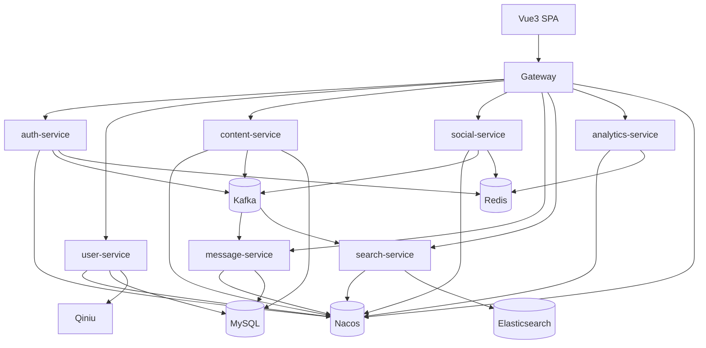

# 技术设计：Boot 3 + Java 17 + Vue3 + Nacos 微服务化拆分

## Technical Solution

### Core Technologies
- Java 17 / Spring Boot 3.x
- Spring Cloud / Spring Cloud Alibaba Nacos（注册发现/配置中心）
- Spring Cloud Gateway（统一入口）
- Spring Security 6（资源服务器模式）
- JWT（Access Token + Refresh Token）
- MyBatis + MySQL（核心数据）
- Redis（高频关系与统计/缓存）
- Kafka（领域事件）
- Elasticsearch（全文搜索）
- Quartz（热帖分数刷新，目标态可迁移为 content-service 内部任务）
- Vue 3（前端，Vite 构建）

### Implementation Key Points
1. **先统一基础设施与规范：** 统一 API 返回、错误码、traceId、配置加载方式。
2. **网关统一治理：** CORS、鉴权前置、限流、灰度路由、日志与 trace 透传。
3. **事件驱动为主：** 搜索索引、通知生成、热帖分数刷新触发等优先通过事件解耦。
4. **数据归属清晰：** 一个服务拥有自己的数据模型与表归属，跨服务只走 API/事件。

---

## Architecture Design

---

## Architecture Decision ADR

### ADR-001: Boot 3 + Java 17 + Nacos 微服务底座
**Context:** 项目必须升级到 Boot 3；并希望进行微服务化拆分以支持独立部署与前后端分离。  
**Decision:** 采用 Java 17 + Spring Boot 3.x + Spring Cloud + Spring Cloud Alibaba Nacos，建立微服务底座（Gateway + 服务注册发现 + 配置中心）。  
**Rationale:** 统一基础设施能力，减少自建成本；与前后端分离（Vue3）配套；对后续服务扩展与治理更友好。  
**Alternatives:**  
- 继续单体（拒绝原因：无法满足拆分目标与治理诉求）  
- 维持 Boot 2（拒绝原因：与“必须升级 Boot 3”约束冲突）  
**Impact:** Jakarta 迁移与依赖升级工作量大；需要严格控制版本矩阵与回归成本。

### ADR-002: SPA 鉴权采用 JWT + Refresh Token，网关统一校验
**Context:** 微服务下不适合复制单体的 cookie ticket + ThreadLocal 认证方式。  
**Decision:** 采用 JWT Access Token（短期）+ Refresh Token（长期，建议旋转刷新）；Gateway 作为统一入口进行鉴权与路由。  
**Rationale:** 服务间无需共享 session 状态；利于前后端分离；便于统一安全策略与治理。  
**Alternatives:**  
- Redis Session（拒绝原因：服务间耦合与扩展性差，且不利于多语言/跨边界扩展）  
**Impact:** 需要补齐 token 失效策略、刷新策略与安全风险控制（XSS/CSRF/重放）。

### ADR-003: Kafka 事件序列化（迭代 1）采用 JSON + 字段级契约
**Context:** 迁移期需要快速拆分旁路服务（search/message/analytics），且事件契约需要可读可调试。  
**Decision:** 迭代 1 事件序列化采用 JSON，并统一 Envelope 字段（`eventId/traceId/type/version/occurredAt/producer/payload`）。  
**Rationale:** 便于调试与演进；不强依赖 schema registry；对早期变动更友好。  
**Alternatives:**  
- Avro/Protobuf（暂不采用原因：需要引入 schema registry/兼容策略/工具链，前期成本更高）  
**Impact:** 需要在文档中固化字段级契约与版本演进规则；后续升级到 Avro/Protobuf 时需要并行 topic 或升级版本并双写。  

### ADR-004: UV/DAU 采集（迭代 1）由 Gateway Filter 采集，写入 analytics-service（Redis）
**Context:** UV/DAU 的采集点需要统一且不侵入各业务服务；同时需要保留服务化边界。  
**Decision:** Gateway 通过 Filter 采集 UV/DAU，并调用 analytics-service 的 `/internal/analytics/*/record` 写入 Redis；analytics-service 负责查询接口与范围校验。  
**Rationale:** 采集点集中、实现简单；analytics-service 可独立扩展与限流；避免 Gateway 直接依赖 Redis 的 reactive 写入复杂度。  
**Alternatives:**  
- Gateway 直接写 Redis（暂不采用原因：Gateway reactive + Redis 写入/限流/失败处理复杂度更高）  
**Impact:** analytics-service 需要提供内部写入口并做最小鉴权（internal token）；Gateway 需要配置 internal token 并容忍 analytics-service 不可用时降级。  

### ADR-005: auth-service 与 user-service 职责边界（迭代 3）
**Context:** 微服务化后需要明确“登录发证”和“用户资料/注册/密码归属”边界，否则容易出现跨服务直连 DB、权限来源不一致、数据归属不清等问题。  
**Decision:**  
- `auth-service`：只负责登录校验、签发/刷新 JWT（Access/Refresh），并管理 refresh token 的存储与失效策略。  
- `user-service`：负责用户创建/注册、用户资料与头像维护、密码存储策略（hash/rehash），以及用户权限/角色来源的“事实数据”。  
- **迁移期折中：** `auth-service` 可暂时直连 `user` 表用于登录校验；迭代 3 目标态逐步切换为调用 `user-service` 内部接口获取凭据与权限信息。  
**Rationale:** 将“身份凭据与用户资料”作为 user-service 的数据归属，auth-service 聚焦 token 生命周期，可降低耦合并便于未来接入多端/多语言与权限治理。  
**Alternatives:**  
- auth-service 继续拥有 user 表（拒绝原因：与“用户域拆分”目标冲突，且 user/profile/头像逻辑会不断侵入 auth）  
- 引入第三方 IAM（暂不采用原因：迁移期成本与工程复杂度偏高）  
**Impact:** 需要补齐 auth-service ↔ user-service 的内部调用契约与超时/降级策略；并在数据拆分阶段规划好“权限来源”的最终一致性。  

### ADR-006: 页面聚合策略（Vue3 直连多服务，经由 Gateway 路由）
**Context:** 目标态是 Vue3 SPA，面对多服务后，需要决定“前端直接编排”还是引入 BFF 聚合层。  
**Decision:** 迭代 3 采用“Vue3 直连多服务（统一经由 Gateway）”策略；暂不新增 BFF 聚合服务。  
**Rationale:** 迭代 0~3 优先完成拆分闭环与服务能力落地，减少新增服务与协议成本；前端在 MVP 阶段可接受多接口编排。  
**Alternatives:**  
- BFF（暂不采用原因：需要新增服务与维护成本；早期需求未稳定）  
**Impact:** 前端需要处理多接口并发与错误聚合；后续若出现“页面组合过重/跨服务聚合频繁”的痛点，可再引入 BFF 并逐步迁移。  

### ADR-007: 数据拆分策略阶段（共享库 → 独立库）
**Context:** 直接将单体数据库拆成多库会引入迁移、双写、数据一致性与运维复杂度；但不拆库又会造成边界不清。  
**Decision:** 采用分阶段策略：  
1) **共享库阶段：** 各服务在同一个 MySQL 库中按“表归属”治理（服务内只操作归属表，跨域通过 API/事件）。  
2) **独立库阶段：** 当服务稳定后，逐服务迁移到独立数据库（配合数据迁移脚本、灰度、回滚）。  
**Rationale:** 先把边界与契约跑通，再做物理拆分，降低一次性风险。  
**Alternatives:**  
- 一步到位独立库（拒绝原因：迁移与一致性风险过高，且会拖慢迭代 0~3 的交付）  
**Impact:** 需要在 `.helloagents/data.md` 中持续维护“表归属/Redis key 归属”，并在拆库时提供可回滚的数据迁移方案与验证用例。  

---

## API Design（目标态约定）

### 统一约定
- 所有业务 API 统一前缀：`/api`
- 统一返回：`code/message/data/traceId`
- 认证：`Authorization: Bearer <access_token>`

### 示例
- `POST /api/auth/login`
- `GET /api/posts`
- `POST /api/posts`
- `POST /api/likes`

---

## Data Model（目标态策略）

### 迁移期建议
- 先做到“逻辑归属清晰”：服务内 DAO 只操作归属表。
- 数据库拆分策略可分阶段：
  1) 共享数据库（不同 schema/表归属清晰）  
  2) 服务独立库（需要数据迁移与运维配套）

### 事件可靠性
- 建议逐步引入 Outbox Pattern（本地事务写业务表 + outbox 表，异步投递 Kafka）
- 消费端基于 `eventId` 幂等去重，避免重复通知/重复索引

---

## Security and Performance
- **Security：**
  - 网关统一 CORS、限流、黑白名单与鉴权
  - Refresh Token 建议使用 HttpOnly Cookie 或旋转刷新策略
  - 禁止在仓库中提交 Nacos/DB/Redis/Kafka/七牛等敏感配置
  - 输入校验与权限控制必须在服务端完成（前端只做体验增强）
- **迁移期能力开关/降级策略（迭代 0 已落地最小集）：**
  - legacy-community：迁移期移除旧 Elasticsearch 代码路径（后续迭代 1 由 search-service 重写）
  - legacy-community：Kafka Listener 默认不自动启动（避免本地无 Kafka 时阻塞启动）
- **Performance：**
  - 高频关系域（点赞/关注）优先走 Redis
  - 读多写少旁路能力（搜索/通知/统计）优先事件驱动异步化

---

## Testing and Deployment
- **Testing：**
  - 单元测试：领域逻辑
  - 集成测试：Kafka/Redis/ES/DB 关键链路（建议 Testcontainers 或 docker compose）
  - 回归验收：Vue3 + Gateway + 核心服务的冒烟链路（登录、发帖、点赞、搜索）
- **Deployment：**
  - 本地：docker compose 启动 Nacos/MySQL/Redis/Kafka/ES
  - 生产：各服务独立部署，Gateway 支持灰度与回滚

---

## 附录（本方案包的可执行细化）

- 版本矩阵与依赖升级清单：`.helloagents/archive/2026-01/202601161428_boot3_ms_vue3_nacos/version-matrix.md`
- 多模块改造 Runbook：`.helloagents/archive/2026-01/202601161428_boot3_ms_vue3_nacos/multi-module-migration.md`
- JWT 策略与权限矩阵（迭代 0）：`.helloagents/archive/2026-01/202601161428_boot3_ms_vue3_nacos/auth-jwt-strategy.md`
- 事件契约与幂等（迭代 1）：`.helloagents/archive/2026-01/202601161428_boot3_ms_vue3_nacos/event-contract.md`
- CI 与回归入口（建议 GitHub Actions）：`.helloagents/archive/2026-01/202601161428_boot3_ms_vue3_nacos/ci-plan.md`
- 验收清单（DoD + 用例矩阵）：`.helloagents/archive/2026-01/202601161428_boot3_ms_vue3_nacos/acceptance.md`
