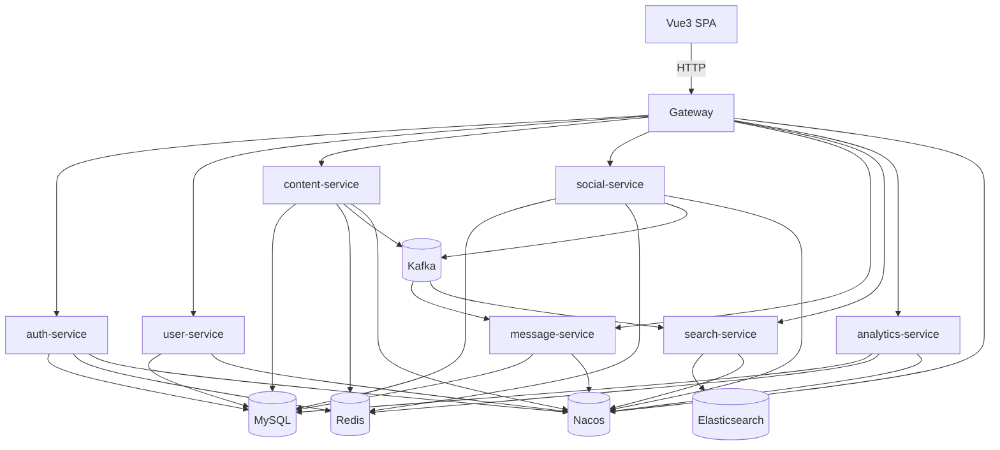

# Technical Design: legacy 下线生产级收尾（Big-bang）

## Technical Solution

### Core Technologies
- Java 17 / Spring Boot 3.x
- Spring Cloud（Gateway / LoadBalancer）+ Spring Cloud Alibaba Nacos（Discovery + Config）
- MySQL 8 / Redis 7 / Kafka 3.x / Elasticsearch 8.x
- Vue3（Vite + Router + Pinia + Axios）
- CI：GitHub Actions

### Implementation Key Points
1. **功能对齐矩阵驱动**：把旧单体所有入口（Controller/页面/行为）映射到新体系的 API/页面/事件，并以回归用例作为切换门禁。
2. **API 与行为兼容策略（Big-bang）**：
   - 新体系优先提供目标态 REST API + Vue3 页面；
   - 对旧路径（如 `/register`、`/kaptcha`、`/discuss/*`）的兼容：在切换窗口前完成“等价入口”，切换后不再需要 legacy。
3. **全依赖真实接入**：所有服务在默认 profile 下接入 Nacos/MySQL/Redis/Kafka/ES；测试通过 Testcontainers 或 docker compose 运行完整链路。
4. **生产级交付要素**：观测（metrics/log/trace）+ 告警，灰度/回滚脚本，备份/恢复与演练，权限审计与限流风控，容量基线与压测脚本。

## Architecture Design

## Architecture Decision ADR

### ADR-101: Big-bang 切换策略（一次性切走 legacy）
**Context:** 目标要求旧单体 100% 功能等价，且最终不再部署 legacy-community。  
**Decision:** 采用 Big-bang：在切换前把新体系功能补齐并通过全量回归；切换窗口内完成网关/入口切换。  
**Rationale:** 符合“最终不部署 legacy”的目标，减少长期双跑与维护成本。  
**Alternatives:** Strangler 逐步替换 → 拒绝原因：用户选择 Big-bang，且要求全量等价一次性交付。  
**Impact:** 需要更严格的门禁与演练（回归、备份、回滚、压测、告警），交付周期更长。

### ADR-102: 观测与告警栈（docker compose）
**Context:** 需要监控指标与告警、日志与 Trace 追踪，且部署形态为 docker compose。  
**Decision:** 选择可 compose 化的观测组件组合（Prometheus + Grafana + Loki/Promtail + Tempo/Jaeger + Alertmanager），并把关键仪表盘/告警规则纳入仓库。  
**Rationale:** 生态成熟、可本地与 CI 复现、便于演练。  
**Alternatives:** 仅依赖日志排障 → 拒绝原因：不满足“监控告警/追踪”要求。  
**Impact:** 需要统一 trace 传播（推荐逐步支持 W3C traceparent），并规范指标命名与告警阈值。

### ADR-103: 数据备份与恢复策略
**Context:** Big-bang 切换必须可演练回滚与恢复；依赖包括 MySQL/Redis/Kafka/ES。  
**Decision:** 以 MySQL 为业务 SSOT；Redis 为可重建缓存；ES 可通过 reindex 重建；Kafka 保留一定周期用于回放。提供脚本化备份与恢复，并在预发布环境演练。  
**Rationale:** 降低“不可逆操作”风险，确保切换可控。  
**Alternatives:** 不做演练，仅文档描述 → 拒绝原因：不满足“生产级”要求。  
**Impact:** 需要明确备份窗口、数据一致性窗口与回放策略。

## API Design

### Auth（对齐旧单体）
- [POST] /api/auth/register：注册并触发激活流程
- [GET] /api/auth/activation/{userId}/{code}：激活账号
- [GET] /api/auth/kaptcha：获取验证码（或验证码 challenge）

### Content（对齐旧单体审核能力）
- [POST] /api/posts/{postId}/top：置顶（ADMIN/MODERATOR）
- [POST] /api/posts/{postId}/wonderful：加精（ADMIN/MODERATOR）
- [POST] /api/posts/{postId}/delete：删除（ADMIN/MODERATOR）

### Message（对齐旧单体交互）
- [POST] /api/messages/by-username：按用户名发送私信（兼容旧交互）
- [GET] /api/messages/conversations：会话列表（含未读数、消息数、对端用户信息）

## Data Model

本阶段优先以“旧库结构兼容”为过渡（允许共享库但明确表归属），并补齐必要索引；逐步在后续阶段再演进为彻底拆库。

## Security and Performance
- **Security：**
  - 密钥/连接串不入库：仅环境变量或 Nacos 注入
  - 网关与服务双层鉴权、管理接口审计、内部接口 token
  - 登录爆破防护：限流 + 验证码 + 失败计数策略
  - Kafka/ES 运维接口最小权限与隔离
- **Performance：**
  - 关键列表分页与索引优化（帖子列表、会话列表、通知列表、搜索）
  - 热点数据缓存策略（Redis）与降级（ES/Kafka 不可用时的可用性策略）

## Testing and Deployment
- **Testing：**
  - 单元/集成测试：覆盖关键业务与安全边界
  - 端到端：docker compose 拉起全依赖，执行回归验收（覆盖旧单体用例矩阵）
  - 性能：压测脚本与容量基线（p95 延迟、错误率、吞吐）
- **Deployment：**
  - 提供“全栈 docker compose”（基础设施 + 微服务 + 观测组件）
  - 提供切换与回滚脚本（网关路由/前端入口/数据恢复）
