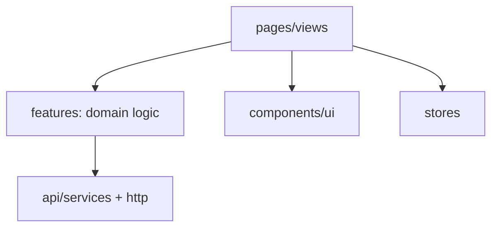

# Technical Design: UI 全量等价（信息架构 + 组件库优先）

## Technical Solution

### Core Technologies

- **Frontend:** Vue 3 + Vite + Vue Router + Pinia
- **HTTP:** Axios（封装统一 Result 解析与 traceId 透传）
- **Testing:** Vitest（组件/工具函数）+ Playwright（UI 自动化回归，建议）
- **Style:** 继续沿用现有轻量 CSS（`frontend/src/styles.css`），在此基础上抽象 Design Tokens 与组件库

### Implementation Key Points

1. **信息架构（IA）与路由设计**
   - 路由按功能域分组：`/auth/*`、`/posts/*`、`/search`、`/messages/*`、`/notices/*`、`/analytics`、`/settings`、`/admin/*`
   - 公共布局：导航栏 + 主内容区；支持 404/无权限页。
   - 页面元信息：`requiresAuth`、`roles`（例如 ADMIN/MODERATOR）用于 UI 体验控制与导航显示。

2. **组件库优先（内部 Design System）**
   - 建议新增目录：`frontend/src/components/ui/`
   - 基础组件最小集合（先满足等价交付）：
     - `UiButton` / `UiInput` / `UiTextarea` / `UiSelect`
     - `UiCard` / `UiDivider` / `UiTag`
     - `UiModalConfirm`（删除/置顶/加精确认）
     - `UiPagination`（列表分页）
     - `UiToast`（全局提示）
     - `UiEmpty` / `UiSkeleton`（空状态与加载状态）
   - 统一交互策略：表单校验提示、禁用态、加载态、错误态视觉规范。

3. **API Client 分层与错误处理**
   - 在 `frontend/src/api/` 增加：
     - `result.js`：统一解析后端 `Result`（`code/message/data/traceId`）
     - `errors.js`：统一映射业务码到用户可读提示
     - `services/*.js`：按域封装（auth/posts/social/messages/notices/search/analytics/users）
   - 统一策略：
     - `code !== 0` 视为业务错误（抛出可读异常，UI 捕获展示）
     - 透传 `traceId` 到 UI 顶栏（当前已有事件机制，可固化为全局 store）
     - 401 自动 refresh 逻辑保留（现有 `http.js`），并补齐并发刷新保护（已有 `refreshingPromise`）

4. **登录态与权限（体验层）**
   - `auth` store 增加：
     - `me` 信息缓存（`userId/username/authorities`）
     - `isAdmin/isModerator` 计算属性
   - route guard：
     - 未登录访问受保护页 → 跳转登录
     - 已登录访问登录页 → 跳转帖子列表
     - 需要角色的页面：无角色则展示 403 页面（后端仍会 403）

5. **避免 N+1 的数据策略（UI 等价必须考虑）**
   - 第一阶段（最小可行）：前端并发 + 缓存
     - 用户摘要缓存（key=userId）
     - 点赞数缓存（key=entityType+entityId）
   - 第二阶段（推荐）：补齐聚合 API / BFF（视性能与复杂度而定）
     - `GET /api/posts` 返回 `PostCard`（包含作者摘要、点赞数/状态）
     - 评论树返回 `CommentVO`（包含作者摘要、点赞信息、回复聚合）
     - followees/followers 返回带用户摘要与 hasFollowed 的列表项

---

## Architecture Design

```mermaid
flowchart TD
  U[Browser] -->|GET / (SPA)| EDGE[edge nginx]
  U -->|/api/**| EDGE
  EDGE -->|/api/**| GW[gateway]
  GW --> AUTH[auth-service]
  GW --> USER[user-service]
  GW --> CONTENT[content-service]
  GW --> SOCIAL[social-service]
  GW --> MSG[message-service]
  GW --> SEARCH[search-service]
  GW --> ANA[analytics-service]
```

前端内部推荐分层（避免“页面堆砌”）：


---

## Architecture Decision ADR

### ADR-201: 前端采用“信息架构 + 内部组件库优先”的分层重构

**Context**
- 当前前端页面数量少且以联调为主，缺少统一信息架构与可复用组件，难以快速补齐 legacy 全量页面并保持一致体验。
- 直接堆页面会带来路由混乱、重复 UI、错误处理不一致、权限控制分散等问题。

**Decision**
- 先建立全局布局与路由分层，再建设内部组件库（最小集合），最后按功能域逐页补齐 UI 等价能力。

**Rationale**
- 降低长期维护成本与返工概率。
- 让“页面补齐”成为可流水线化工作：新页面主要由“组合组件 + 调用 service + 加验收用例”组成。

**Alternatives**
- 方案 A：直接补页面（拒绝原因：重复代码与交互割裂，后期很难统一）。
- 方案 B：引入大型第三方 UI 组件库（暂缓原因：依赖与主题改造成本高，且现有样式已足够支撑最小可行等价交付；可在 UI 等价稳定后再评估）。

**Impact**
- 初期会涉及前端目录结构调整与部分页面迁移；需要配套 UI 回归用例。

---

## API Design（UI 等价所需的接口清单与潜在缺口）

### 已有且直接可用（优先复用）

- Auth（`auth-service`）
  - `POST /api/auth/login`
  - `POST /api/auth/register`
  - `GET /api/auth/activation/{userId}/{code}`
  - `GET /api/auth/captcha`
  - `POST /api/auth/captcha/verify`
  - `GET /api/auth/me`
  - `POST /api/auth/logout`

- Posts/Comments（`content-service`）
  - `GET /api/posts?order&page&size`
  - `POST /api/posts`
  - `GET /api/posts/{postId}`
  - `GET /api/posts/{postId}/comments`
  - `POST /api/posts/{postId}/comments`（entityType=1/2）
  - `GET /api/posts/{postId}/comments/{commentId}/replies`
  - `POST /api/posts/{postId}/top|wonderful|delete`（受角色保护）

- Social（`social-service`）
  - `POST /api/likes` + `GET /api/likes/status|count|users/{id}/count`
  - `POST /api/follows` + `DELETE /api/follows` + `GET /api/follows/status`
  - `GET /api/follows/{userId}/followees|followers(+count)`

- Message/Notice（`message-service`）
  - `GET /api/messages/conversations/detail`
  - `GET /api/messages/conversations/{conversationId}`
  - `POST /api/messages`（支持 toName）
  - `PUT /api/messages/read`
  - `GET /api/notices/summary`
  - `GET /api/notices?topic=...`
  - `PUT /api/notices/read`

- Search（`search-service`）
  - `GET /api/search/posts?keyword&page&size`
  - `POST /api/search/internal/reindex`（ADMIN）

- Analytics（`analytics-service`）
  - `GET /api/analytics/uv?start&end`（ADMIN/MODERATOR）
  - `GET /api/analytics/dau?start&end`（ADMIN/MODERATOR）

- User（`user-service`）
  - `GET /api/users/{userId}`（含 likeCount/followCount/hasFollowed）
  - `GET /api/users/resolve?username=...`
  - `GET /api/users/{userId}/avatar/upload-token`
  - `PUT /api/users/{userId}/avatar`

### 潜在缺口（为 UI 等价/性能/体验建议补齐）

> 这些不是“有没有功能”的硬缺口，而是“UI 页面要做得像 legacy 那样可用”时可能遇到的聚合/展示缺口。

1. **帖子列表的作者信息与点赞数**
   - 现状：`GET /api/posts` 不返回作者摘要与点赞数；UI 可能产生 N+1 调用。
   - 方案：新增 `PostCardResponse` 或扩展现有 `PostSummaryResponse`（需评估兼容性）。

2. **评论/回复的用户信息与点赞信息**
   - 现状：评论接口返回 `Comment` 实体；未聚合作者/目标用户/点赞信息/回复树。
   - 方案：新增聚合接口（例如 `/api/posts/{postId}/comment-tree`）或前端缓存 + 并发拉取。

3. **关注/粉丝列表的用户摘要与 hasFollowed**
   - 现状：follow list 返回 `targetId + followTime`；UI 需要补齐用户信息与关注状态。
   - 方案：扩展 `FollowItem` 或新增“带摘要”的专用 DTO。

---

## Security and Performance

- **Security**
  - 角色校验以后端为准（gateway/content-service 已对审核接口做 `ADMIN/MODERATOR` 限制）。
  - 前端仅做“体验层”控制：隐藏/禁用按钮、展示无权限提示。
  - 验证码建议后端可配置强制校验（避免仅 UI 层校验可绕过）。
  - XSS：前端展示富文本需谨慎；当前后端已对发帖/评论做 `HtmlUtils.htmlEscape` + 敏感词过滤，前端仍不应 `v-html` 渲染不可信内容。

- **Performance**
  - 列表页采用分页 + 增量加载；避免一次性加载过多。
  - 对用户摘要、点赞数等使用 cache（内存 Map 或 Pinia store）。
  - 如性能仍不足，引入聚合接口/BFF，避免 N+1。

---

## Testing and Deployment

- **Testing**
  - 前端：Vitest 覆盖核心工具函数（Result 解析、权限判断、路由守卫）。
  - UI 自动化回归：Playwright 打开 UI（microservices 模式）进行真实浏览器回归（登录/发帖/评论/点赞/关注/私信/通知/搜索/管理）。
  - 后端：以单元/集成测试为主做回归门禁。

- **Deployment**
  - 本地联调：`deploy/docker-compose.yml` + `deploy/Dockerfile.edge`（同域 `/api`）减少跨域问题。
  - CI：新增 UI 自动化 job（可选但推荐），或先将“手工验收矩阵”作为 required checklist。
