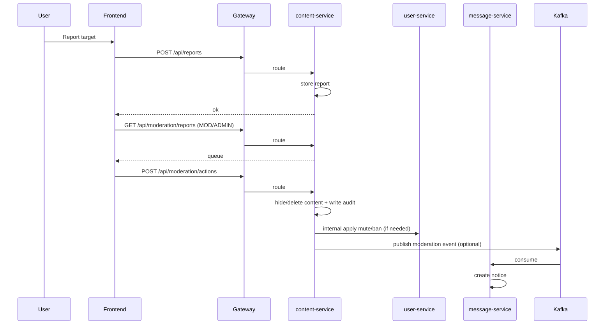
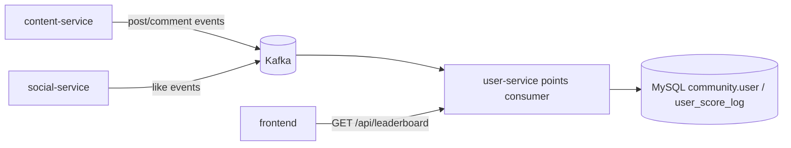

# Technical Design: BBS 核心运营能力（治理 + 内容生命周期 + 收藏订阅 + 成长体系）

## Technical Solution

### Core Technologies
- Backend: Spring Boot 3 / Spring Security / Spring Cloud Gateway / MyBatis
- Storage: MySQL（content/user 扩展）/ Redis（拉黑关系）/ Kafka（通知与积分事件）
- Frontend: Vue3 + Router + Pinia + Axios

### Implementation Key Points
1. **不新增微服务**：优先在现有模块内分域落地，降低部署与链路复杂度（见 ADR-201）。
2. **治理动作强审计**：举报、处置、处罚必须写审计记录，并具备可检索字段（目标/操作者/时间）。
3. **处罚在写路径强制生效**：发帖/评论/私信等写接口在业务服务侧校验“禁言/封禁”状态，避免仅靠前端控制。
4. **收藏/订阅用 MySQL 持久化**：保证可审计与可扩展（分页、排序、后续推荐/个性化）。
5. **积分采用事件驱动**：避免在核心写路径引入跨服务强耦合同步调用；消费侧幂等 + DLQ（见 ADR-202）。

## Architecture Design

### Moderation: report → review → action → notice (eventual)

### Growth: domain events → points consumer → leaderboard

## Architecture Decision ADR

### ADR-201: No New Microservice (Moderation/Bookmark/Growth in Existing Services)
**Context:** 需求覆盖治理、生命周期、收藏订阅、成长体系；新增服务会显著扩大部署与联调成本。  
**Decision:** 不新增 moderation-service，按现有边界落地：  
- `content-service`：举报与内容处置、收藏/订阅、内容编辑/软删除  
- `user-service`：用户处罚状态（禁言/封禁）+ 积分/等级/榜单  
- `social-service`：拉黑关系（Redis）  
**Rationale:** 最小化服务数量变化，减少路由/compose/配置改动，同时保持领域相对清晰。  
**Alternatives:** 新增 moderation-service（更纯粹边界） → 拒绝原因：交付与运维复杂度显著上升。  
**Impact:** 需要明确跨服务调用（content → user）与权限边界；后续如治理增长，仍可演进拆分。

### ADR-202: Points are Event-driven with Idempotency
**Context:** 积分计算如果同步耦合在发帖/评论/点赞链路，会增加延迟与故障耦合。  
**Decision:** user-service 订阅 Kafka 事件并幂等更新积分与日志。  
**Rationale:** 写路径更稳定；积分最终一致可接受（短暂延迟）。  
**Alternatives:** 同步 RPC（强一致） → 拒绝原因：链路耦合与可用性风险高。  
**Impact:** 需要补齐事件契约、幂等表/键、DLQ 处理与回放策略。

### ADR-203: Bookmarks/Subscriptions Persist in MySQL (content-service)
**Context:** 收藏/订阅需要分页/排序/后续扩展，且应可审计。  
**Decision:** 使用 MySQL 表存储收藏与订阅关系，读写在 content-service 内完成。  
**Alternatives:** Redis-only（性能好） → 拒绝原因：持久性与审计/查询能力不足。  
**Impact:** 需要增加表与索引；热点读可再做缓存。

## API Design（草案）

### 举报与治理（content-service）
- `POST /api/reports`
  - Request: `{ targetType: "post"|"comment"|"user", targetId: number, reason: string, detail?: string }`
  - Response: ok
- `GET /api/moderation/reports?page=&size=&status=&targetType=...`（MOD/ADMIN）
- `POST /api/moderation/actions`（MOD/ADMIN）
  - Request: `{ reportId: number, action: "reject"|"hide"|"delete"|"warn"|"mute"|"ban", reason: string, durationSeconds?: number }`

### 拉黑（social-service）
- `POST /api/blocks`（block）
- `DELETE /api/blocks?userId=...`（unblock）
- `GET /api/blocks`（list blocked userIds）

### 内容生命周期（content-service）
- `PUT /api/posts/{postId}`（作者，24h）
- `PUT /api/posts/{postId}/comments/{commentId}`（作者，15min）
- `DELETE /api/posts/{postId}`（作者软删）/ 复用现有 `/api/posts/{postId}/delete`（MOD/ADMIN）

### 收藏/订阅（content-service）
- `PUT /api/posts/{postId}/bookmark` / `DELETE /api/posts/{postId}/bookmark`
- `GET /api/bookmarks?page=&size=`
- `PUT /api/categories/{categoryId}/subscribe` / `DELETE /api/categories/{categoryId}/subscribe`
- `PUT /api/tags/{tag}/subscribe` / `DELETE /api/tags/{tag}/subscribe`（可选）
- `GET /api/subscriptions`（返回订阅列表）

### 成长（user-service）
- `GET /api/leaderboard?limit=`
- 扩展 `GET /api/users/{userId}`：附带 `score` / `level`（或新增 `/api/users/{userId}/stats`）

## Data Model（草案）

> 实际落地以 `deploy/mysql-init/*.sql` 为准，并保持“可重复执行（idempotent）”。

### community_content（content-service）
- `discuss_post`：新增 `update_time`、`edit_count`、`deleted_by`、`deleted_reason`（按最小需要取舍）
- `comment`：新增 `update_time`、`edit_count`、`deleted_by`、`deleted_reason`
- `report`（新增）：举报记录（reporter_id、target_type、target_id、reason、detail、status、create_time）
- `moderation_action`（新增）：处置记录（report_id、actor_id、action、reason、duration、create_time）
- `post_bookmark`（新增）：收藏关系（user_id、post_id、create_time）
- `user_subscription_category`（新增）：订阅分类（user_id、category_id、create_time）
- `user_subscription_tag`（新增）：订阅标签（user_id、tag_id、create_time）

### community（user-service / identity）
- `user`：新增 `score`（int）、`mute_until`（timestamp）、`ban_until`（timestamp）
- `user_score_log`（新增）：积分流水（user_id、delta、reason、event_id(unique)、create_time）

### Redis（social-service）
- `social:block:<userId>`：set，保存 userId 拉黑的目标用户集合（或双向 key 设计）

## Security and Performance
- **权限控制**：
  - Gateway 路由层增加 `/api/moderation/**` 的角色限制（ADMIN/MODERATOR）。
  - 业务服务侧二次校验：作者编辑/删除校验；处罚状态校验（mute/ban）。
- **输入校验**：举报 reason 使用枚举；detail 长度限制；编辑内容过滤/转义沿用现有敏感词与 HTML escape 策略。
- **反滥用**：
  - 举报去重（同一用户对同一目标重复举报限制）。
  - 积分每日上限与互刷限制（最小实现：按日计数或按事件去重）。
- **审计与隐私**：治理后台仅对 MOD/ADMIN 可见，公开页面不泄露举报人身份与处置细节。
- **性能**：列表过滤（拉黑/订阅）优先前端一次性拉取关系集合并本地过滤；后续再演进为后端聚合过滤以减少 N+1。

## Testing and Deployment
- **Testing**：
  - 后端：为举报/处置、编辑窗口、收藏、订阅、积分消费增加集成测试（含幂等与权限）。
  - 前端：为新页面与关键操作补齐最小行为测试（路由守卫/接口封装/关键交互）。
- **Deployment**：
  - 更新 `deploy/mysql-init` 增量 SQL；必要时补齐 Kafka topic init（moderation/points 若新增 topic）。
  - 通过 docker compose 本地联调跑通端到端链路（举报→处置→限制生效/通知；收藏→列表；积分→榜单）。
