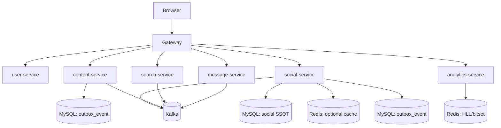

# Technical Design: 后端架构治理（5项问题）

## Technical Solution

### Core Technologies
- Java 17 + Spring Boot 3.x
- Spring Cloud Gateway（统一入口、治理与可观测）
- MyBatis + MySQL（关系数据 SSOT、Outbox 持久化）
- Redis（可选缓存、UV/DAU 去重/聚合）
- Kafka（事件驱动，最终一致）
- Micrometer + Prometheus（指标与告警）
- 可选：Caffeine（gateway 有界 TTL 缓存）、Resilience4j（熔断/隔离）

### Current State Snapshot（基于代码现状）
> 本方案以“已存在能力”为基线，重点解决：默认值固化、配置治理与剩余断裂点。

- social-service：已具备 MySQL schema（`deploy/mysql-init/025_schema_social.sql`）与 DB Repository（Like/Follow/Block），但 Redis Repository 仍为 `matchIfMissing=true` 的缺省兜底，存在误配风险。
- content/social：已具备 Outbox 生产与 relay job，但部署侧默认 `outbox.enabled=false`（Nacos 配置），可靠投递未形成默认安全态。
- internal clients：`InternalClientSupport` 已存在，但错误码透传/降级语义/配置命名仍不完全一致；user-service 仍存在调用 social-service `/api/**` 并透传 Authorization 的聚合路径。
- gateway analytics：已具备 timeout/并发限制与基础指标，但 UV/DAU 去重仍采用进程内静态 Set（多实例不共享，且存在高基数内存风险），并缺少明确的 traceId 透传约定。
- internal-token：`InternalTokenFilter` 已支持按服务 segment 的 token 与 previous 轮转窗口，但配置侧仍普遍允许 fallback 到全局 `INTERNAL_TOKEN`，缺少轮转 runbook 与启动期校验策略。

### Implementation Key Points
1. **社交域 SSOT 治理（默认值固化）**
   - 将 DB 作为“缺省实现”（matchIfMissing=true）并移除 Redis Repository 的缺省兜底，避免配置漂移导致 Redis-only 模式被误启用。
   - 继续保留 `social.storage=redis|memory` 作为显式开关（仅限非 prod/压测/演示），但不作为缺省。
2. **Outbox 可靠投递默认开启（保留灰度/回滚）**
   - 在部署（Nacos）层默认开启 `outbox.enabled=true`，从而将“DB 提交后事件可重试投递”作为默认安全态。
   - 补齐运维面：至少要能观测 backlog/failed 数量，并支持重放 failed（internal-token 保护）。
3. **内部调用治理（统一契约 + 收敛 user-service 聚合调用）**
   - `InternalClientSupport.unwrap` 需要保留下游 `code/message/traceId`（避免错误语义丢失），并对降级（fail-open）统一记录 outcome=degraded。
   - user-service 聚合调用从 `/api/** + Authorization` 收敛到 internal API：由 user-service 在本地解析 JWT/用户上下文，再使用 internal-token 调用 social-service internal read API（减少权限耦合，明确调用链）。
4. **网关统计链路治理（有界化 + traceId）**
   - 用 Caffeine 有界 TTL 缓存（或采样策略）替代静态 Set，避免高基数内存风险与“阈值清空”的突刺行为。
   - gateway → analytics-service 的内部调用补齐 traceId（`X-Trace-Id`/`traceparent`）透传，提升排障效率。
5. **internal-token 配置治理（最小爆炸半径 + 轮转 runbook）**
   - 推进按服务 token（`<segment>.internal-token`）为主；逐步减少对 `INTERNAL_TOKEN` 全局兜底的依赖（尤其是生产环境）。
   - 给出轮转/回滚步骤与灰度窗口（current + previous），并为关键服务增加启动期校验（fail-fast 或至少 warn）。

## Architecture Design

## Architecture Decision ADR

### ADR-001: social-service 存储默认值固化（DB 为缺省 SSOT）
**Context:** social-service 同时提供 DB/Redis/Memory 三套实现，Redis Repository 默认 `matchIfMissing=true`。尽管当前配置显式 `social.storage=db`，仍存在配置漂移导致 Redis-only 被误启用的风险。  
**Decision:** DB Repository 作为缺省（matchIfMissing=true）；Redis Repository 不再作为缺省兜底，只有显式 `social.storage=redis` 时启用。  
**Rationale:** “默认安全态”优先，避免可靠性被配置误差破坏。  
**Impact:** 需要明确说明 redis/memory 模式用途与边界（非 prod），并补齐必要的文档与校验策略。

### ADR-002: Outbox 默认开启（可靠投递作为默认安全态）
**Context:** content/social 已具备 Outbox 能力，但部署侧默认关闭，导致可靠投递无法作为一致性链路的治理基线。  
**Decision:** 在 Nacos 配置层默认开启 outbox（保留开关以便回滚到 after-commit 直发）。  
**Rationale:** 统一生产端可靠性标准，降低“偶发丢消息”导致的数据一致性事故风险。  
**Impact:** 需要确认消费者幂等基线，并补齐 outbox backlog/failed 的观测与重放能力。

### ADR-003: user-service 聚合调用从 /api+Authorization 收敛到 internal API
**Context:** user-service 目前通过透传 Authorization 调用 social-service `/api/**` 获取计数/状态，耦合鉴权与调用链，增加排障复杂度。  
**Decision:** social-service 提供必要的 internal read API；user-service 自行解析 JWT/用户上下文后，使用 internal-token 调用 internal API。  
**Rationale:** 明确“用户身份解析”边界，减少跨服务 Authorization 透传，统一 internal 调用治理。  
**Impact:** 需要补齐 internal API 设计、调用方配置（token/base-url/timeout）与回归测试。

### ADR-004: 网关统计链路先“有界化”，再“事件化”
**Context:** gateway analytics 去重仍基于进程内静态 Set，多实例不共享且存在高基数内存风险。  
**Decision:** 起步用 Caffeine 有界 TTL 缓存（或采样策略）替代静态 Set，并补齐 traceId 透传；后续可演进为 Kafka 事件化采集。  
**Rationale:** 快速消除资源风险，同时保留演进空间。  
**Impact:** 需要补齐测试与指标，避免治理逻辑本身引入新风险。

## API Design（拟新增/调整）

> 说明：internal API 统一由 `InternalTokenFilter` 保护（`X-Internal-Token`）。

- **[GET] /internal/social/read/likes/users/{userId}/count**
  - 用途：user-service 聚合展示所需的“获赞数”读取（不依赖 Authorization 透传）。
- **[GET] /internal/social/read/follows/{userId}/followees/count?entityType=3**
- **[GET] /internal/social/read/follows/{userId}/followers/count?entityType=3**
- **[GET] /internal/social/read/follows/status?userId={actorUserId}&entityType=3&entityId={targetUserId}**
- **[GET] /internal/content/outbox/health**（新增）
- **[POST] /internal/content/outbox/replay?limit=200**（新增）

## Data Model
- social/content 的 outbox 表与 social 关系表已在部署脚本中存在；本方案不再重复给出 SQL，按需补充索引与字段，并以 `deploy/mysql-init/*.sql` 为准。

## Security and Performance
- **Security**
  - internal-token：按服务 token 为主，逐步减少全局 `INTERNAL_TOKEN` 兜底；支持 previous token 灰度窗口。
  - internal 运维接口：除 token 外，建议在部署层增加来源网段 allowlist（gateway 或服务侧）。
  - 避免把 token 写入日志；对外错误响应避免泄露内部信息。
- **Performance**
  - gateway：采集链路要有界（TTL/size/采样），并保证超时/并发上限不会影响主链路。
  - outbox：批量 claim、合理 batch-size、指标驱动调参；必要时增加 backlog 告警阈值。

## Testing and Deployment
- 测试侧重点：
  - user-service 聚合链路：替换为 internal API 后，确保功能等价且不会引入鉴权漏洞。
  - gateway analytics：高基数场景下内存不膨胀，timeout/并发限制生效，指标正确打点。
  - outbox：Kafka 不可用时写入不丢，恢复后可补发；failed 可观测可重放。
- 部署侧重点：
  - 先灰度开启 outbox（Nacos 开关），观察 backlog 与消费者幂等表增长/清理策略。
  - internal-token 轮转按 runbook 执行（current + previous 窗口），避免调用中断。
