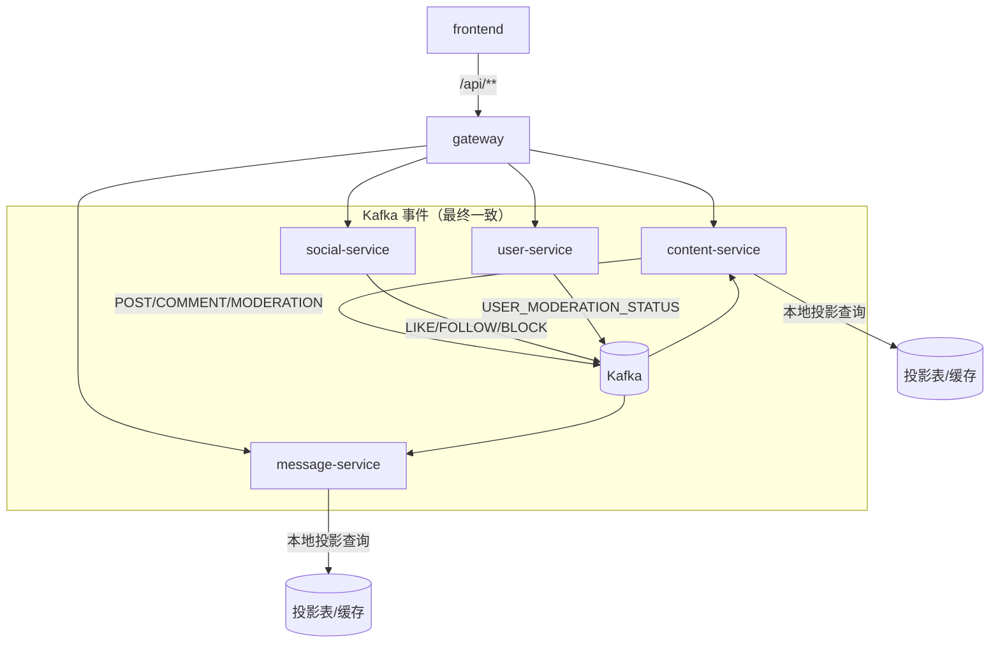

# Technical Design: 后端架构治理（5 类系统性问题 + 扩展治理项）

## Technical Solution

### Core Technologies
- Backend: Spring Boot 3.x / Spring Security / Spring Cloud Gateway / Spring Kafka / MyBatis
- Data: MySQL / Redis
- Eventing: Kafka（`EventEnvelope` + topic v1）
- Observability: Micrometer / Prometheus / Loki（现有体系保持）
- Frontend: Vue3 + Axios（统一处理 HTTP status + `Result`）

### Implementation Key Points

#### 1) 写路径解耦：本地投影（Read Model）+ 事件同步（最终一致）
- **原则：** 写路径不做跨服务同步 RPC 依赖；跨域状态通过事件同步到本地投影表/缓存，写入时只读本地。
- **状态范围：**
  - 用户处罚状态（禁言/封禁有效期、状态版本）
  - 拉黑关系快照（A↔B 的关系，或“是否互相拉黑”的投影）
- **事件来源：**
  - user-service：用户处罚状态变化事件（或复用 `MODERATION_EVENTS_V1`，但需明确语义为“状态变更”而非仅通知）
  - social-service：拉黑关系变化事件（可扩展 `SOCIAL_EVENTS_V1`，新增 BLOCK 相关 type/payload）
- **投影落地：**
  - content-service/message-service：新增投影表（MySQL）或 Redis 结构（按查询模式选择），并实现消费端幂等（eventId）与顺序约束（版本号/更新时间）。
- **冷启动与纠偏：**
  - 提供 internal 扫描/对账接口：按 userId 范围拉取全量或增量状态，回填本地投影。
  - 定时对账 job：对关键用户/热点关系抽样校验，发现滞后触发回填。
- **事务边界：**
  - 禁止在本地 DB 事务中执行跨服务“副作用型调用”（例如处罚/封禁命令），避免出现“本地回滚但远端已生效 / 本地已提交但远端未生效”的不一致。
  - 推荐使用 outbox/after-commit：本地事务提交后再投递命令事件，由对方服务幂等消费并落库，再以“状态变更事件”广播给各写服务投影。

#### 2) 错误协议统一：HTTP status 表达类别，Result.code 表达业务细分
- **目标：**
  - 消除“业务错误 HTTP 200”的不一致现象
  - 保持 `Result` 结构稳定（前端与内部调用可解析 `code/message/traceId`）
- **策略：**
  - `CommonErrorCode` 继续以 400/401/403/429/500/503 等表达 HTTP 类别（同时作为默认 `Result.code`）
  - 业务错误码（例如 `AuthErrorCode` 10001+）必须映射到明确 HTTP status（例如 401/400/403），由统一异常映射器负责
  - internal client 必须能够在非 2xx 响应中解析 `Result`（避免被默认错误处理器吞掉）
- **兼容性：**
  - 前端 Axios 需要统一处理：非 2xx 仍尝试解析 `Result` 并展示 message/traceId；401 触发 refresh 时需识别是否为可刷新场景（避免登录失败被误触发 refresh）

#### 3) 网关默认安全态：生产 fail-closed + 可信代理边界
- **安全关键能力：** Origin Guard、Rate Limit、IP 解析
- **默认策略：**
  - 生产默认 fail-closed：allowlist 漏配/依赖不可用时拒绝访问，并返回可解释错误（403/503）与可观测指标
  - IP 解析仅在“可信代理启用 + CIDR 明确”时信任 `X-Forwarded-For`；否则只使用直连 remote address
- **职责收敛：**
  - 统计采集（UV/DAU）属于“非安全关键”能力，应与转发链路严格隔离：确保不阻塞、不影响鉴权与限流；更推荐异步化（日志/事件驱动写入 analytics-service）

#### 4) internal-token 分域与内部调用标准化
- **token 分域：**
  - 强制每个 segment 使用独立 token（例如 `content.internal-token`、`search.internal-token`），禁止默认依赖全局 `INTERNAL_TOKEN` 作为生产兜底
  - 轮转窗口保留 current/previous 两把 token（由 `InternalTokenFilter` 支持）
- **内部调用标准化：**
  - 统一 RestTemplate/WebClient 的超时、错误映射、指标 tags 口径（success/error/timeout/degraded/forbidden）
  - 统一错误透传：对方返回的 `Result.code/message/traceId` 必须尽可能保留（尤其是 401/403/400 等）

#### 5) 环境一致性与 SSOT 修复（以 search 为代表）
- **原则：** 默认值、部署配置、文档三者一致；实现可切换但必须显式声明并有测试保障。
- **search 存储切换：**
  - 明确 `search.storage` 在各环境的默认值与要求
  - 避免“matchIfMissing=memory”导致配置缺失时隐式退化到内存实现（语义差异大）
- **文档同步：**
  - 更新 `docs/ARCHITECTURE.md`、`docs/SYSTEM_DESIGN.md`、`.helloagents/project.md` 与 `.helloagents/modules/*.md`，把配置矩阵与默认值写成 SSOT

#### 6) search-service 事件消费可靠性（至少一次语义 + 幂等点位修正）
- **问题根因：** 当前 insert-first 幂等在索引副作用之前完成，且 DB 异常被当作“已处理”返回，会在故障/重试场景下形成“消息被 ack 但副作用未落地”的窗口。
- **推荐策略：**
  - 将幂等标记后移：先执行 ES 的 upsert/delete（幂等操作），成功后再写入 `search_consumed_event`。
  - 幂等表写入异常应视为错误并触发重试/DLQ，而不是吞掉并跳过。
  - 对“不支持版本/类型”明确丢弃策略：不要写入 consumed 表，避免未来升级后无法回放；或者单独记录为 skipped 并可运维清理。

#### 7) social-service DB 异常治理（禁止 silent failure）
- **原则：**
  - 仅对“唯一约束冲突”（重复点赞/重复关注/重复拉黑）按幂等处理并返回 false。
  - 其余 DB 异常必须显式抛出（由统一异常映射成 503/500），并记录指标/日志。
  - 读路径是否降级需显式设计：降级必须带可观测标记（degraded），避免把故障伪装成“业务为空”。

#### 8) 敏感配置占位默认值与全局兜底治理
- **目标：** 防止生产环境在“未显式配置密钥/token”时使用占位默认值或全局 token 兜底而仍可启动。
- **建议措施：**
  - 清理 `deploy/nacos-config/*.yaml` 中 `JWT_HMAC_SECRET` 的占位默认值（强制通过环境变量注入）。
  - 清理 internal-token 的 `${...:${INTERNAL_TOKEN:}}` 兜底路径，改为每个服务/segment 显式配置。
  - 保留 dev 便捷性：通过 `.env.example`/脚本提供开发密钥，但明确仅用于 dev。

#### 9) 登录态存储与会话安全基线（refresh token / cookie）
- **问题根因：**
  - auth-service 的 refresh token 存储当前默认兜底为内存实现（配置缺失即启用），在多实例/重启场景会导致 refresh 失效与用户频繁重新登录。
  - refresh cookie 默认 `Secure=false`，若生产采用 HTTPS 而未显式覆盖，会引入安全与兼容性问题（cookie 可能被错误传输或策略不符合预期）。
- **推荐策略：**
  - refresh token 存储：默认使用 Redis（或在非 dev 环境缺失配置即失败），内存实现仅允许在 dev/单机演示场景显式启用。
  - refresh cookie：在生产强制 `Secure=true`，并明确 `SameSite`（建议 Lax/Strict 取舍需结合 refresh 交互与 OriginGuard/CSRF 方案），同时保持 `HttpOnly`。
- 与网关策略联动：对携带 refresh cookie 的敏感端点（login/refresh/logout），结合 OriginGuard + SameSite，避免“无 Origin 头即放行”成为绕过面。

#### 10) 跨服务枚举/常量 SSOT（entityType/targetType）
- **问题根因：** entityType/targetType 等关键枚举值以魔法数字散落在多个模块（例如 1/2/3），与 Kafka 事件 payload 强相关，容易在演进时产生隐性不一致。
- **推荐策略：**
  - 在 `common` 统一定义枚举/常量（例如 `EntityTypes`、`TargetTypes`），并作为跨服务契约的一部分写入 SSOT 文档。
  - 关键消费者在解析事件 payload 时做合法性校验：非法值进入 DLQ 或记为 bad_event，并输出指标与 traceId 便于排障。

#### 11) 聚合接口 N+1 治理（DB + RPC）
- **问题根因：** 部分聚合接口在循环内发起多次 DB 查询与跨服务请求（N+1），在高并发下会放大尾延迟与下游负载。
- **推荐策略：**
  - DB 侧：将 per-item 查询改为批量 SQL（按 conversationId/postId 等维度 group/IN 聚合）。
  - RPC 侧：优先使用 `/internal/**` 的批量接口（如 `POST /internal/users/batch`），一次性拉取 user summary；必要时引入短 TTL 缓存。
  - 降级策略：若批量 user 查询失败，允许返回缺省用户信息但必须可观测（degraded 指标），避免 silent failure。

#### 12) 事件版本治理一致化（envelope version + unknown handling）
- **问题根因：** `EventEnvelope.version` 在不同消费者的处理不一致，unknown type/version 的策略也不统一，会降低事件演进能力，并可能造成“跳过但不可回放”的缺口。
- **推荐策略：**
  - 在 `common` 提供统一的 envelope 解析与校验工具（version/type/required fields），消费者复用。
  - unknown version：建议进入 DLQ（或显式 skip 但不写入 consumed 表），并记录指标与样本。
  - unknown type：按业务选择 DLQ/skip，但必须统一记录与可回放策略（runbook）。

#### 13) 运维/管理入口统一（降低攻击面）
- **问题根因：** 运维能力可能同时暴露在 `/api/**/internal/**`（JWT 管控）与 `/internal/**`（token 管控）两套入口，增加攻击面与授权策略复杂度。
- **推荐策略：**
  - 外部入口统一由 gateway 承担（管理员 JWT + 审计 + 限流 + 可关闭开关）。
  - 下游服务仅保留 `/internal/**` 运维接口（internal-token 最小权限），并通过 gateway 以 internal-token 调用下游完成动作。
  - 对高成本操作（reindex/回填/对账）增加二次确认/幂等 key（可选）与并发保护。

#### 14) 配置中心与启动策略（生产 fail-closed）
- **问题根因：** 当前各服务使用 `spring.config.import=optional:nacos:...`，在配置中心不可用/缺失配置时可能静默退化为本地默认配置运行；叠加“占位默认密钥/全局 token 兜底”等现象，会放大安全与语义漂移风险。
- **推荐策略：**
  - 通过 profile 区分 dev/prod：
    - dev：允许 optional（便于本地启动）。
    - prod：配置中心依赖改为必需（required/fail-fast），缺失则 fail-closed。
  - 增加启动期校验（Startup Validation）：对 JWT secret、internal-token 分域、关键外部依赖地址等做“非 dev 环境缺失即失败”的清单化校验。
  - 提供 runbook：在报错中输出缺失项与修复步骤，降低因 fail-closed 带来的排障成本。

#### 15) 可观测性端点治理（actuator/prometheus）
- **问题根因：** 各服务启用了 `management.endpoints.web.exposure.include=health,info,prometheus`，但 Spring Security 未统一放行/保护 `/actuator/prometheus`；导致 Prometheus 抓取在本地/演练环境可能失败，或未来扩展 actuator 暴露面时存在误暴露风险。
- **推荐策略（优先级从高到低）：**
  1) **Basic Auth（推荐默认）**：仅对 `/actuator/prometheus`（及必要的 health/info）启用 Basic Auth；Prometheus scrape 配置同步加入 basic_auth。
  2) **管理端口内网专用**：将 actuator 绑定到独立 management 端口且仅在内网暴露（不对公网/宿主机发布端口），由网络策略保证安全。
  3) **JWT/服务网格 mTLS**：适用于更复杂的生产环境，但引入成本更高。
- **原则：** 统一口径、最小暴露面、可回滚；禁止 `permitAll(/actuator/**)` 这类宽松策略作为长期默认。

#### 16) Kafka DLQ fail-closed 与标准化
- **问题根因：** 当前 `DefaultErrorHandler` 的 recoverer 使用 `kafkaTemplate.send(...)` 异步发送 DLQ；若 DLQ 发布失败，仍可能提交 offset，形成“失败即丢”的窗口；且各服务的 DLQ 记录结构重复且缺少 traceId 等排障字段。
- **推荐策略：**
  - DLQ 发布改为可确认（acknowledged）：`send(...).get(timeout)` 确认成功后才视为已恢复；失败则抛出异常触发 fail-closed（不提交 offset）并告警。
  - DLQ schema 统一下沉到 common（含 traceId/eventId/original offset 等），并对 payload 做可选裁剪/脱敏，避免把敏感信息原样落到 DLQ。
  - 为 DLQ 发布失败提供熔断/暂停策略与 runbook（避免长期卡死但仍保持“不丢消息”的默认语义）。

#### 17) 环境 profile 与配置覆盖治理（确保 prod 策略生效）
- **问题根因：** 目前仅 gateway 提供了 `application-prod.yml`，但部署未强制启用 prod profile；同时各服务依赖 Nacos 覆盖配置且使用 optional import，存在“profile 未生效/配置中心不可用 → 退回 dev 默认值”的风险。
- **推荐策略：**
  - 在所有部署入口强制 `SPRING_PROFILES_ACTIVE=prod`（或等价机制），并在 runbook 中把它作为“必须项”。
  - 明确配置优先级：本地 `application-prod.yml` 兜底安全关键默认值；Nacos 用于环境差异与可运营开关；启动期校验用于阻断缺失配置。
  - 对“必须在 prod 生效”的安全策略（例如 fail-closed）避免仅依赖 Nacos，确保在 Nacos 不可用时仍按安全默认态运行或直接 fail-closed。

#### 18) 防旁路与 cookie 安全边界固化（OriginGuard/CSRF）
- **问题根因：** gateway 实现了 OriginGuard，但 auth-service 自身未做等价防护；若 auth-service 被误暴露或存在旁路访问，cookie/refresh 等入口将依赖网络假设而非代码 fail-closed。
- **推荐策略：**
  - auth-service 增加“服务侧 OriginGuard”（仅覆盖 login/refresh/logout 等 cookie 会话相关敏感入口），与 gateway 同源配置（allowlist + prod 默认 fail-closed）。
  - 明确 cookie 策略与部署形态：优先同站（same-site）部署以使用 `SameSite=Lax/Strict`；如必须跨站（SameSite=None），则必须配套更强 CSRF 防护（OriginGuard + 双提交 token / CSRF token 等）。
  - 运维侧补充“禁止旁路”的网络策略与验收项（例如仅 gateway/ingress 暴露到公网）。

#### 19) API DTO 化与字段暴露控制（避免 entity 直出）
- **问题根因：** 部分公共 API 直接返回 entity（例如评论/回复），entity 含治理字段（deletedBy/deletedReason 等）；当前虽查询过滤 `status=0`，但接口契约仍与表结构强绑定，未来易产生误暴露与兼容性问题。
- **推荐策略：**
  - 对公共 API 返回 DTO 字段白名单；治理/审计字段仅在管理员接口或 internal API 暴露。
  - 为关键公共接口补齐契约测试，确保字段演进可控且前端可预测。

#### 20) common 自动装配化（Boot AutoConfiguration）与一致性
- **问题根因：** 多数服务通过 `scanBasePackages=com.nowcoder.community` 扫描 common 的组件，但 gateway 未扫描 common；导致 cross-cutting 能力难以下沉并在服务间一致生效。
- **推荐策略：**
  - 将通用能力以 Boot AutoConfiguration 形式下沉到 common（并补齐 `META-INF/spring/...AutoConfiguration.imports`），避免依赖 component scan 习惯差异。
  - 对 servlet/reactive 使用条件装配（`@ConditionalOnWebApplication`），避免在 gateway（reactive）装配 servlet Filter 等不适用组件。
  - 以“最小集”开始：先把 StartupValidation、DLQ Publisher、internal client 规范等下沉；再逐步迁移其他 cross-cutting 组件。

#### 21) 对象级鉴权（OwnerGuard）与 IDOR 治理（高优先级）
- **问题根因：** message-service 存在典型对象级鉴权缺失：
  - 会话详情按 `conversationId` 直接查询，不校验当前用户是否为会话成员 → 任意用户可读他人私信；
  - “标记已读”按 ids 直接 update，不校验 `to_id` → 任意用户可修改他人消息/通知状态。
- **推荐策略（原则：fail-closed + DB 可证明）：**
  1) **Controller 层：** 所有敏感读/写接口必须获取 `userId`（JWT subject）并传递给 service，避免 service 使用“无上下文”的调用方式。
  2) **Service 层：** 对资源访问做统一断言（OwnerGuard）：
     - conversationId：解析为 `a_b` 并校验 `userId == a || userId == b`；不满足则返回 404（推荐）或 403；
     - ids：对请求 ids 做去重/限长，避免大 SQL；并记录 `requestedCount/updatedCount` 指标以观测越权尝试。
  3) **DAO/SQL 层（关键）：** 所有查询/更新都必须带 owner 条件，确保“绕过 controller 也无效”：
     - listLetters：`where conversation_id=? and (from_id=? or to_id=?)`
     - markRead（私信）：`update message set status=READ where id in (...) and to_id=? and from_id != SYSTEM`
     - markRead（通知）：`update message set status=READ where id in (...) and to_id=? and from_id = SYSTEM`
  4) **审计与告警：** 对 owner mismatch（请求 ids 与实际更新不一致、非法 conversationId）计数并告警，便于发现恶意探测。

#### 22) 服务侧 IP 解析一致化（可信代理：XFF Trust Boundary）
- **问题根因：** auth-service 当前直接信任 `X-Forwarded-For` 作为客户端 IP（用于登录限流），与 gateway 的“可信代理才解析 XFF”策略不一致；在旁路访问或代理链路配置不严时可被伪造 header 绕过限流/风控。
- **推荐策略：**
  - 在 common 下沉统一的 `ClientIpResolver`（servlet + reactive 两套实现），并共享 `TrustedProxyProperties`（enabled + cidrs）。
  - auth-service 对“是否信任 XFF”的判断必须基于可信代理链路（remoteAddr ∈ CIDR）；否则忽略 XFF，使用 remoteAddr。
  - 将 `ip_source`（remote/xff）作为指标 tag 打点，便于验证代理链路是否正确、以及发现旁路/伪造。
  - 与 R18 联动：旁路访问本就不应存在；但即便发生旁路，也不应让 XFF 伪造绕过限流。

#### 23) 资源关系校验固化（Path Semantics）
- **问题根因：** content-service 的 `GET /api/posts/{postId}/comments/{commentId}/replies` 目前仅“校验 postId 存在”，实际查询按 commentId 直接取回复，未校验 commentId 是否属于 postId；会破坏“路径语义=访问边界”的约束，并使枚举更容易。
- **推荐策略：**
  - 统一约定：凡路径携带父资源 id（postId），子资源查询必须做父子关系校验（DB exists/join），不满足返回 404（推荐）或 400（可选）。
  - 校验位置：优先在 service/DAO 层提供可复用断言（例如 `assertCommentInPost(postId, commentId)`），避免 controller 手写遗漏。
  - 回归测试：覆盖“合法父子关系返回数据/非法关系返回 404”，并把它作为后续权限能力演进的基线。

#### 24) 输入校验与 payload 限额（防 DoS / 数据污染）
- **问题根因：** 多数 DTO 仅做 `@NotBlank/@Min` 等存在性校验，缺少字段长度、列表数量等上限；同时网关/服务端缺少统一的请求体大小限制，导致超长文本或异常 payload 可能放大内存/DB 压力，甚至成为 DoS 手段；也会让数据“脏写入”难以回收。
- **推荐策略（原则：fail-closed + 统一口径）：**
  - **common 下沉 SSOT：** 定义 `ValidationLimits`（max title/content/message/password/tags 等），作为全服务共享常量（便于统一与演进）。
  - **服务侧 validation：** 在请求 DTO 上固化 `@Size(max=...)`、`@Size(max=...)`（列表数量）等约束；超限统一返回 HTTP 400（与 R2 的错误协议一致）。
  - **网关侧上限：** 增加全局/按路由的 request body size limit（尤其是发帖/评论/私信/注册等写接口），超限直接拒绝，避免进入下游服务造成资源消耗。
  - **观测与审计：** 对 oversize/bad_request 计数并按 endpoint 打点，便于评估攻击/误用与调整上限。

#### 25) 头像上传与更新链路 fail-closed（可验证 + 限额）
- **问题根因：**
  - 前端头像上传页面存在 demo 兜底：上传失败仍继续调用“更新头像”接口 → 会把不可验证的数据写入 DB（fail-open）。
  - user-service 更新头像仅依赖 `fileName` 拼接 URL，缺少“fileName 属于该用户且已上传”的可证明性；upload token 缺少大小/类型限制，存在对象存储滥用风险。
- **推荐策略（原则：fail-closed + 最小可验证闭环）：**
  - **前端：** 上传失败即失败（不允许模拟更新）；若需本地 demo，必须显式 dev flag 开启且不能进入 prod 构建。
  - **服务侧绑定：** upload-token 签发时将 `fileName` 写入短 TTL 存储（Redis），key=用户；`PUT /avatar` 时必须匹配并一次性消费（匹配失败直接拒绝）。
  - **对象存储策略：** upload token policy 增加 `fsizeLimit`、`mimeLimit`（或等价能力）并限定 key 前缀，防止大文件/非图片滥用。
  - **观测：** 记录头像更新的 `issued/matched/rejected` 指标，便于发现绕过与攻击。

#### 26) 敏感词过滤资源加载 fail-fast（生产 fail-closed）
- **问题根因：** content-service 的 `SensitiveFilter` 在 `sensitive-words.txt` 缺失或读取异常时静默退化（无日志/无 fail-fast），会把“治理能力是否生效”变成不可观测的隐患。
- **推荐策略：**
  - **生产 fail-fast：** 非 dev 环境要求词典资源存在且可读；失败直接阻断启动（与 R14 启动期校验联动）。
  - **可观测性：** 启动时输出加载词条数量，并作为指标暴露（例如 `sensitive_words_loaded_total`），便于验收与回归。
  - **灰度策略：** 若担心误报，可允许在 staging 先以 warn + 指标观察，再在 prod 改为 fail-fast（但默认目标为 fail-closed）。

#### 27) HTTP 写接口幂等与重复提交治理（Idempotency-Key）
- **问题根因：** 当前发帖/评论/私信等写接口缺少“重复提交保护”；在弱网重试、浏览器重复点击、客户端超时重试等场景下可能产生重复数据与重复事件副作用（计数/通知/索引），造成用户体验与数据一致性问题。
- **推荐策略（原则：幂等语义可证明 + 可观测 + 与错误协议一致）：**
  - **协议：** 约定写接口支持 `Idempotency-Key`（UUID/雪花等），同一用户 + 同一 endpoint + 同一 key → 只允许一次副作用。
  - **实现：** common 下沉 `IdempotencyGuard`（Filter/Interceptor + 可选注解），以 Redis/DB 作为共享幂等存储，记录状态（PROCESSING/SUCCEEDED/FAILED）与响应（例如 postId/commentId）。
  - **冲突处理：** 同 key 并发请求：返回 409（或等待至超时）；已成功则直接返回缓存响应；失败可允许重试（按策略）。
  - **fail-closed：** 对标记为“必须幂等”的关键写接口，当幂等存储不可用/超时 → 返回 503，避免在无法保证幂等时继续写入造成重复副作用。
  - **观测：** 指标区分 `first_time/duplicate/concurrent_conflict/store_error`，并禁止把 key 作为 tag（避免高基数）。

#### 28) internal 运维/内部写接口防滥用治理（single-flight + 双人确认）
- **问题根因：** `/internal/**` 存在高风险操作（reindex/outbox replay/改密码/治理处置等），目前主要依赖 internal-token；缺少并发/频率控制与单飞锁，且缺少“高风险操作的二次确认/默认关闭”机制。一旦 token 泄露或误暴露，破坏力极大。
- **推荐策略（原则：最小权限 + 可回滚 + 可审计）：**
  - **分级：** 将 internal 能力分为 READ（只读聚合）、AUTH（鉴权相关）、OPS（运维/破坏性操作）。
  - **更强的访问边界（推荐组合）：** ops 类接口除 internal-token 外，再要求：ops-token（独立可轮转）+ 来源网段 allowlist + 频率限制（至少其一，推荐多重）。
  - **single-flight：** 对 reindex、replay 等重成本操作引入分布式锁/作业表（Redis/DB），同一时间只运行一个 job；重复触发返回已有 jobId/409，避免 DoS 与资源争用。
  - **双人确认（可选加强）：** 高风险操作（reindex、批量 replay、改密码）采用“两步提交”：提交申请 → 第二个管理员确认 → 执行；所有步骤都落审计与 traceId/jobId。
  - **默认关闭与 break-glass：** ops 接口支持 runtime 开关（默认关闭），仅在演练/事故时短期开启，并提供 runbook（开启、执行、回滚、关闭）。

---

## Architecture Design

---

## Architecture Decision ADR

### ADR-301: 写路径跨服务同步校验 → 事件驱动本地投影（最终一致）
**Context:** content/message 写路径需要校验禁言/封禁与拉黑关系，现状依赖同步 RPC，存在级联故障风险。  
**Decision:** 将跨域状态通过事件同步到写服务本地投影，写路径仅读本地投影；提供 internal 回填/对账。  
**Rationale:** 降低链路耦合与雪崩面，改善 P99 延迟与可用性；符合“最终一致”约束。  
**Alternatives:** 保持同步调用并引入熔断/重试 → 仍保留强耦合与依赖脆弱性。  
**Impact:** 引入最终一致窗口；需要定义 SLA、告警与对账回填机制。

### ADR-302: 错误语义采用 HTTP status（A）并保留 Result.code 细分业务码
**Context:** 现状业务码与 HTTP status 混用，部分错误返回 HTTP 200，影响监控与一致处理。  
**Decision:** 统一异常映射：HTTP status 表达错误类别；`Result.code` 保留细分业务码；前端与 internal client 统一在非 2xx 解析 `Result`。  
**Rationale:** 更符合 Web 语义与可观测性实践；利于网关、浏览器与告警系统。  
**Alternatives:** 永远 HTTP 200 → 需要全链路定制监控/代理策略，且与生态不一致。  
**Impact:** 需要调整 internal client 的错误读取策略与前端 Axios 处理逻辑。

### ADR-303: 网关安全关键能力生产默认 fail-closed
**Context:** Origin Guard/RateLimit 等存在可配置 fail-open，生产默认态不明确有安全风险。  
**Decision:** 生产默认 fail-closed；对非关键能力（统计采集）强隔离，避免影响转发链路。  
**Rationale:** 最小惊讶原则与安全优先；故障应以可解释的错误暴露并告警。  
**Alternatives:** fail-open → 容易在配置/依赖故障时静默放行。  
**Impact:** 依赖故障可能扩大不可用范围，需要清晰的 SLO 与告警策略支撑。

### ADR-304: internal-token 分域隔离，禁止全局 token 作为生产兜底
**Context:** 全局 token 兜底会扩大泄露爆炸半径，并掩盖配置缺失。  
**Decision:** 强制按 segment 配置 token 并支持轮转；非 dev 环境缺失即失败或拒绝。  
**Rationale:** 最小权限与可控爆炸半径。  
**Alternatives:** 继续允许全局 token → 运维风险长期存在。  
**Impact:** 需要统一更新 `deploy/nacos-config/*.yaml` 与 runbook。

### ADR-305: search-service 事件消费幂等采用“副作用成功后再标记”
**Context:** search-service 消费帖子事件后需要写 ES 索引。当前 insert-first 幂等在副作用之前，且 DB 异常被吞掉，会在失败重试场景导致索引更新永久丢失。  
**Decision:** 将幂等标记移动到 ES upsert/delete 成功之后；幂等表写入失败应触发重试/DLQ；不支持版本/类型不写入 consumed 表。  
**Rationale:** 保证至少一次语义下的可恢复性；ES 写入本身可幂等，允许重复执行。  
**Alternatives:** 使用“processing/success”状态表并做两阶段 → 实现更复杂且仍无法与 ES 原子。  
**Impact:** 会增加少量重复写 ES 的可能，但换取“不丢索引更新”的可靠性。

### ADR-306: 数据访问异常处理策略（仅吞 DuplicateKey，其他显式失败）
**Context:** social-service DB repository 当前吞掉广义 DataAccessException，导致故障伪装成业务结果，难以告警与排障。  
**Decision:** 仅对唯一约束冲突视为幂等重复；其余异常向上抛出并由统一异常映射处理（建议 503）。  
**Rationale:** 保障正确性与可观测性；与“DB 为 SSOT”的边界一致。  
**Alternatives:** 全量吞异常做 best-effort → 会长期积累数据一致性与信任问题。  
**Impact:** 用户在 DB 故障时会看到明确错误，需要前端/网关配合提示与重试策略。

### ADR-307: 敏感配置禁止占位默认值在生产生效
**Context:** 部署配置提供了 `JWT_HMAC_SECRET` 的占位默认值与部分 internal-token 的全局兜底，生产误配时仍可启动且存在安全隐患。  
**Decision:** 移除占位默认值与全局 token 兜底作为生产路径；缺失即失败；dev 通过显式 `.env` 提供开发密钥。  
**Rationale:** 最小权限与安全基线，避免“看似运行但实际不安全”。  
**Alternatives:** 仅做长度校验 → 占位默认值仍可通过校验。  
**Impact:** 本地/测试环境需要补齐 env 配置，但可通过脚本与文档降低门槛。

### ADR-308: refresh token 存储默认使用 Redis（内存仅 dev 显式启用）
**Context:** auth-service refresh token 存储当前默认兜底为内存实现，配置缺失时会在多实例/重启场景导致 refresh 失效，影响可用性与体验。  
**Decision:** 将 Redis 作为默认实现（或在非 dev 环境缺失配置即失败）；内存实现只允许在 dev 场景显式启用。  
**Rationale:** 与微服务部署形态一致，避免隐式单点状态；降低运维误配概率。  
**Alternatives:** 继续默认内存 → 仅适用于单机演示，且容易在扩容/重启时暴露为线上问题。  
**Impact:** 需要更新 `deploy/nacos-config/auth-service.yaml` 并提供本地配置指引。

### ADR-309: refresh cookie 在生产强制 Secure=true，并明确 SameSite 策略
**Context:** refresh cookie 默认 `Secure=false`，生产 HTTPS 下若未显式覆盖，会造成安全与行为不确定。  
**Decision:** 生产强制 `Secure=true`；SameSite 策略作为显式配置项（建议与 OriginGuard 联动），默认值仅适用于 dev。  
**Rationale:** 避免隐式不安全默认值；与浏览器安全模型对齐。  
**Alternatives:** 继续使用 dev 默认值 → 在生产下存在误配风险。  
**Impact:** 需要更新部署配置与文档，并补齐回归测试（cookie 属性与跨域行为）。

### ADR-310: entityType/targetType 在 common 统一定义并固化为 SSOT
**Context:** entityType/targetType 等枚举值分散在多个模块且与事件 payload 强相关，演进时存在隐性不一致风险。  
**Decision:** 在 common 统一定义（常量或 enum），并通过测试与文档固化；消费端对非法值做可观测处理。  
**Rationale:** 降低魔法数字漂移与排障成本，提升事件契约可演进性。  
**Alternatives:** 继续分散定义 → 风险长期存在且难以通过 review 全面发现。  
**Impact:** 需要逐模块迁移与兼容窗口（可通过测试强约束）。

### ADR-311: 聚合接口采用批量查询与批量内部调用，消除 N+1
**Context:** 聚合接口在循环内执行多次 DB/RPC（N+1）会放大尾延迟并引入级联负载风险。  
**Decision:** DB 使用批量 SQL；跨服务使用 internal 批量接口（优先 `/internal/**`）；失败时显式 degraded。  
**Rationale:** 可预测的性能与更好的韧性。  
**Alternatives:** 仅加缓存/仅加并发请求 → 复杂度上升且难以稳定控制下游负载。  
**Impact:** 需要新增批量 API 与 SQL 变更，并补齐回归与压测。

### ADR-312: 事件消费者统一执行 envelope version 校验与 unknown handling 策略
**Context:** 不同消费者对 `EventEnvelope.version` 与 unknown type 的处理不一致，会导致演进困难与潜在数据缺口。  
**Decision:** 提供 common 解析校验工具并统一策略：unknown version/type 进入 DLQ 或显式 skip（但不烧掉回放机会），并强制可观测。  
**Rationale:** 提升事件契约可演进性与排障能力。  
**Alternatives:** 各服务自行处理 → 难以形成一致行为与 runbook。  
**Impact:** 需要更新消费者实现与 DLQ 监控规则。

### ADR-313: 运维入口统一由 gateway 对外暴露，下游仅保留 /internal/**
**Context:** 双入口（/api/**/internal/** 与 /internal/**）增加攻击面与授权复杂度，且易产生策略不一致。  
**Decision:** gateway 作为唯一外部入口；下游只保留 internal-token 保护的 `/internal/**` 运维接口；gateway 以 internal-token 调用下游。  
**Rationale:** 收敛攻击面与权限模型，便于审计与限流。  
**Alternatives:** 保留双入口 → 长期策略漂移风险。  
**Impact:** 需要改造路由/鉴权与相关 UI/脚本调用方式，并提供迁移窗口。

### ADR-314: 生产环境配置中心依赖必需（fail-fast），关键配置缺失 fail-closed
**Context:** 当前各服务 `spring.config.import=optional:nacos:...` 会在配置中心不可用时退化到本地默认配置运行，叠加占位默认值/全局兜底容易产生安全与语义漂移。  
**Decision:** 通过 profile 将生产环境的配置中心依赖改为必需（required/fail-fast）；并新增启动期校验清单，非 dev 缺失关键配置直接失败。  
**Rationale:** 用“启动失败”替代“静默不安全运行”，符合 fail-closed 约束并降低长期运维风险。  
**Alternatives:** 继续 optional + 运行期告警 → 仍可能在告警被忽略时以不安全默认值运行。  
**Impact:** 部署需要更严格的配置管理与 runbook 支撑；staging 必须先演练。

### ADR-315: /actuator/prometheus 采用 Basic Auth 统一保护，Prometheus 同步配置
**Context:** Prometheus 抓取需要稳定访问 `/actuator/prometheus`，但不应把 actuator 端点对外公开；目前各服务安全配置不一致且可能导致抓取失败/误暴露。  
**Decision:** 默认对 `/actuator/prometheus` 采用 Basic Auth（health/info 视需要开放或同样保护），Prometheus scrape 配置同步加入 basic_auth。  
**Rationale:** 实施成本低、跨 servlet/reactive 一致、与 Prometheus 原生能力匹配；可在后续演进到内网专用端口或 mTLS。  
**Alternatives:** 仅靠网络隔离 → 对“端口误暴露/未来扩展 actuator”不够稳健；JWT/mTLS → 成本更高。  
**Impact:** 需要管理一套 metrics 凭据并提供轮转策略；需要同步修改 compose/运维脚本。

### ADR-316: Kafka DLQ 发布失败默认 fail-closed，并统一 DLQ schema（含 traceId）
**Context:** 消费失败后的 DLQ 发布若不可确认，会形成“失败即丢”的窗口，且 DLQ 结构重复/缺少 traceId 不利于排障回放。  
**Decision:** DLQ 发布改为可确认（等待 send ack）；失败抛出异常使 offset 不提交（fail-closed），并统一 DLQ schema 下沉到 common，包含 traceId/eventId 等字段。  
**Rationale:** 对最终一致系统而言，“不丢消息”优先级高于“消费组不卡住”；卡住是可观测且可处理的，丢消息往往不可逆。  
**Alternatives:** DLQ 发布失败仍提交 offset（fail-open） → 直接丢消息；本地落盘/DB outbox → 更可靠但实现成本更高。  
**Impact:** DLQ 故障会导致消费暂停，需要配套告警、退避与应急流程；可选引入“本地 DLQ outbox 兜底”作为后续增强项。

### ADR-317: 生产环境强制启用 prod profile，并固化配置覆盖优先级
**Context:** gateway 的 `application-prod.yml` 提供了关键 fail-closed 默认值，但若部署未显式启用 prod profile，则这些默认值不会生效；同时 optional Nacos import 会在配置中心不可用时退化到本地默认值。  
**Decision:** 生产部署必须显式启用 prod profile；同时固化配置优先级：本地 prod 文件兜底安全关键默认值 + 启动期校验阻断缺失配置 + Nacos 承载环境差异与运营开关。  
**Rationale:** “显式 > 隐式”，避免 profile 漏配造成的安全事故；符合 fail-closed 约束。  
**Alternatives:** 仅依赖 Nacos 配置覆盖 → 配置中心故障时仍可能退化到不安全默认值。  
**Impact:** 部署脚本/容器环境变量需要统一；staging 必须先演练并补齐缺失配置。

### ADR-318: cookie 会话相关敏感入口在 auth-service 也实施 OriginGuard（防旁路）
**Context:** gateway 已实施 OriginGuard，但 auth-service 若被误暴露/旁路访问，login/refresh/logout 等入口的安全边界将弱化。  
**Decision:** auth-service 对 cookie 会话相关敏感入口实施与 gateway 等价的 OriginGuard/CSRF 防护（生产默认 fail-closed），并将 allowlist 与 cookie 策略写入 SSOT。  
**Rationale:** 防御深度（defense-in-depth），把“网关必须存在”从隐式假设变为可验证的安全边界。  
**Alternatives:** 仅依赖网络隔离与 SameSite → 对误暴露/策略变更不够稳健。  
**Impact:** 需要与前端/运维协同配置 allowlist；对非浏览器调用提供 internal-token 路径或白名单策略。

### ADR-319: 公共 API 返回 DTO 白名单，禁止 entity 直出
**Context:** entity 直出会把表结构变动直接扩散到 API 契约，并可能暴露治理/审计字段。  
**Decision:** 公共 API 只返回 DTO（字段白名单）；治理/审计字段仅管理员接口或 internal API 暴露；用契约测试固化返回结构。  
**Rationale:** 降低“无意泄露”与“无意破坏兼容性”风险，提升可演进性。  
**Alternatives:** 继续 entity 直出 + 靠 review 兜底 → 风险长期存在且难以审计全面。  
**Impact:** 需要调整部分 controller/service，并同步更新前端字段映射。

### ADR-320: common 以 Boot AutoConfiguration 下沉 cross-cutting 能力，并区分 servlet/reactive
**Context:** 当前 common 的 cross-cutting 能力主要依赖 component scan 生效，但 gateway 未扫描 common，导致能力无法一致复用；且 servlet/reactive 混用需要条件装配避免不适用 Bean 被加载。  
**Decision:** 在 common 中引入 Boot AutoConfiguration（AutoConfiguration.imports）下沉通用能力，并使用 `@ConditionalOnWebApplication` 区分 servlet/reactive。  
**Rationale:** 统一装配机制，消除 gateway 特例；为后续治理项（启动校验、DLQ、internal client）提供可复用基座。  
**Alternatives:** 逐服务手工 `@Import` → 易漂移且维护成本高。  
**Impact:** 需要新增 common resources 与 auto-config 类，并在各服务启动验证中覆盖装配顺序与冲突。

### ADR-321: 对象级鉴权（OwnerGuard）必须在 DB 层可证明，修复 message-service 的 IDOR
**Context:** message-service 的会话详情与标记已读接口未校验资源归属，属于高危越权（IDOR）。  
**Decision:** 引入 OwnerGuard（service 断言）+ SQL owner 条件（DB 可证明）双重约束；对越权访问默认返回 404/403（fail-closed），并记录指标/审计。  
**Rationale:** 仅在 controller 做校验不可靠（未来新增入口/复用 service 容易绕过）；DB 层约束可从根上消除越权面。  
**Alternatives:** 仅靠前端隐藏/路由限制 → 不构成安全边界；仅靠 controller 校验 → 易因重构/遗漏产生回归。  
**Impact:** 需要调整 message-service 的 mapper SQL 与接口签名，并补齐回归测试；前端需处理 404/403 的友好提示。

### ADR-322: 服务侧 IP 解析遵循可信代理边界（与 gateway 一致），禁止无条件信任 XFF
**Context:** auth-service 直接信任 `X-Forwarded-For` 会导致登录限流/风控被伪造 header 绕过；gateway 已有可信代理模型但未统一复用到服务侧。  
**Decision:** 下沉统一 `ClientIpResolver`（servlet/reactive）与 `TrustedProxyProperties`；仅在 remoteAddr 属于可信代理 CIDR 时解析 XFF，否则忽略 XFF 使用 remoteAddr。  
**Rationale:** 把“信任边界”显式化并可配置验证；避免旁路/误配导致绕过。  
**Alternatives:** 始终信任 XFF → 风险高；完全不信任 XFF → 在多级代理场景无法获得真实来源。  
**Impact:** 需要配置可信代理 CIDR 并在 staging 演练；需要观测指标验证 ip_source=remote/xff 的比例是否符合预期。

### ADR-323: 资源嵌套路径必须校验父子关系（Path Semantics），默认返回 404 防枚举
**Context:** replies 接口路径包含 postId 但未校验 commentId 的归属，会破坏 API 语义并提升枚举能力；未来引入权限/私密能力时会放大数据泄露风险。  
**Decision:** 对嵌套资源路径强制做父子关系校验（service/DAO 层复用），不匹配返回 404（推荐）或 400，并补齐回归测试。  
**Rationale:** 把“资源关系”作为访问边界的一部分固化，降低未来权限演进的回归风险。  
**Alternatives:** 仅在 controller 校验或不校验 → 易遗漏且难以审计。  
**Impact:** 需要新增 DAO exists/join 查询与测试；可能暴露少量历史数据异常（通过指标监控与数据修复收敛）。

### ADR-324: 输入校验与 payload 限额在 DTO + 网关两层固化（fail-closed）
**Context:** 多处写接口仅做存在性校验，缺少字段长度/列表数量/请求体大小的统一上限；依赖 DB 截断或下游失败会导致资源消耗放大、数据污染与不可预期的错误语义。  
**Decision:** 统一在 common 定义 `ValidationLimits`，并在服务侧 DTO validation 与网关 request body size limit 两层固化上限；超限统一返回 HTTP 400，记录可观测指标。  
**Rationale:** 把“输入上限”作为系统基线能力，既能防 DoS/误用，也能提升错误语义一致性与排障可预测性。  
**Alternatives:** 只在 DB 层限制（错误语义不稳定）/只在网关限制（旁路访问无效）/只在服务端限制（资源已消耗）。  
**Impact:** 需要修改多个 DTO 与配置；需补齐回归测试与上限变更的发布说明（避免对合法用户产生意外影响）。

### ADR-325: 头像上传/更新必须形成可验证闭环（fail-closed）
**Context:** 前端存在“上传失败仍更新”的 demo 兜底；服务端仅凭 fileName 更新头像 URL，缺少已上传/归属证明与限额；容易造成脏数据、滥用对象存储与不可观测的安全风险。  
**Decision:** 前端取消 fail-open 兜底；服务端将 upload-token 签发的 fileName 绑定到用户（Redis TTL），更新头像必须匹配并一次性消费；upload token policy 增加大小/类型限制。  
**Rationale:** 以最小实现闭环提升正确性与安全性：既防止“未上传也更新”，也能把滥用控制在对象存储入口处。  
**Alternatives:** 只改前端（旁路/脚本可绕过）/只改后端（用户体验仍会因前端兜底产生脏数据）/改为服务端直传（更安全但成本更高）。  
**Impact:** 需要 Redis 依赖或复用现有 store；需更新前端交互与 runbook；上线需关注兼容窗口。

### ADR-326: 敏感词词典资源在生产必须可验证且 fail-fast
**Context:** `SensitiveFilter` 词典加载失败会静默退化，导致“治理能力是否生效”不可观测且难以回归。  
**Decision:** 非 dev 环境强制词典资源可读；失败启动期直接阻断；同时暴露加载数量与结果指标。  
**Rationale:** 把内容治理能力从隐式假设升级为可验证的基线能力，减少打包/配置漂移带来的隐患。  
**Alternatives:** 仅记录日志（仍可能被忽略）/运行时禁言所有写入（对用户影响更大）。  
**Impact:** 可能提升部署门槛（必须带词典资源）；需要在 CI/发布流程中增加校验与说明。

### ADR-327: 关键写接口采用 Idempotency-Key 实现可证明幂等（fail-closed）
**Context:** 发帖/评论/私信等写接口在重试/重复点击下会产生重复写入与重复副作用，缺少统一幂等语义。  
**Decision:** 对关键写接口引入 `Idempotency-Key`，并使用共享幂等存储记录处理状态与响应；存储不可用时对“必须幂等”的写接口返回 503（fail-closed）。  
**Rationale:** 以“协议 + 存储可证明”方式实现端到端幂等，减少重复数据与二次副作用放大，同时保持错误语义一致。  
**Alternatives:** 只靠前端禁用按钮（旁路/重试无效）/只靠 DB 去重（需要大规模 schema 变更）/允许重复（数据污染与用户体验差）。  
**Impact:** 需要引入幂等存储与统一中间件；需要前端配合发送 key；上线需关注兼容与开关。

### ADR-328: internal OPS 接口采用最小权限 + single-flight +（可选）双人确认
**Context:** internal 运维/内部写接口缺少并发/频率控制与强保护，一旦 token 泄露或误暴露，风险极高。  
**Decision:** 识别 OPS 类 internal 接口并要求更强访问边界（ops-token/来源网段/频率限制），对重成本操作引入 single-flight 锁与 jobId；可选实现双人确认与 break-glass 开关。  
**Rationale:** 把“高风险操作”治理从隐式约束升级为系统性基线，降低误触发与攻击面，同时保证可审计与可回滚。  
**Alternatives:** 仅靠 internal-token（爆炸半径大）/仅靠网络隔离（配置漂移风险）/仅靠人工流程（不可审计、易失效）。  
**Impact:** 需要新增配置项与 runbook；可能影响运维操作习惯（需要显式开启与审批），但换取显著风险下降。

---

## API Design

- internal 回填/对账（示例方向，具体以实现阶段确认为准）：
  - `GET /internal/user/moderation/snapshot?afterId=&limit=`：拉取处罚状态快照（user-service）
  - `GET /internal/social/blocks/snapshot?afterId=&limit=`：拉取拉黑关系增量（social-service）
  - `POST /internal/content/projections/reconcile`：触发投影对账（content-service）

---

## Data Model

- 投影表（示例方向）：
  - `content_user_moderation_projection(user_id, mute_until, ban_until, version, updated_at)`
  - `content_block_relation_projection(user_id_a, user_id_b, blocked, version, updated_at)`
  - `message_user_moderation_projection(...)` / `message_block_relation_projection(...)`
- 消费幂等：
  - 复用现有 consumed_event / search_consumed_event 模式，按 retention-days 定期清理

---

## Security and Performance

- **Security：**
  - 网关安全关键能力 fail-closed（生产默认）
  - internal-token 分域隔离 + 轮转 runbook
  - 可信代理（CIDR）边界明确后才信任 XFF
- **Performance：**
  - 写路径只读本地投影，降低 P99 延迟与尾部抖动
  - 事件消费具备幂等与背压策略，避免积压扩大

---

## Testing and Deployment

- **Testing：**
  - 错误协议：HTTP status 与 `Result.code` 的一致性测试（含前端与 internal client）
  - 投影一致性：事件消费幂等、滞后纠偏、边界条件（缺失投影/乱序事件）
  - 网关安全：Origin allowlist、限流 Redis 故障、XFF 可信边界测试
- **Deployment：**
  - 分阶段落地：先统一错误协议与 internal client，再落地投影与事件契约，最后收敛配置与 SSOT 文档
  - 所有关键变化提供灰度开关与回滚路径（尤其是网关 fail-closed 与 search 存储默认值）
