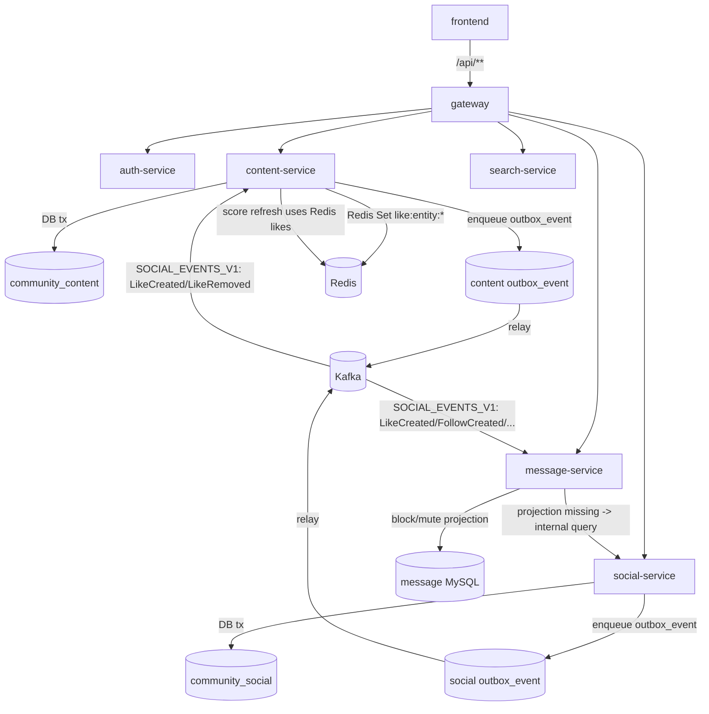

# Technical Design: 事件一致性与契约治理（Outbox + Like 投影 + API/错误语义）

## Technical Solution

### Core Technologies
- Spring Boot 3.2.x / Java 17（多模块微服务）
- Kafka（事件总线；envelope v1：eventId/type/version/occurredAt/payload）
- MySQL（业务 SSOT + Outbox 表 `outbox_event`）
- Redis（点赞投影、热帖分数刷新队列等）
- Spring Security（JWT Resource Server；网关统一校验）
- `X-Internal-Token`（服务间 internal API 最小权限）+ ops-guard（break-glass）

### Implementation Key Points

#### 1) Outbox 作为默认事件生产路径（可靠投递）
- 将 `content.events.outbox.enabled` / `social.events.outbox.enabled` / `user.events.outbox.enabled` 在“默认配置”层面改为 true（与 Nacos 部署配置保持一致，避免本地/测试环境默认为 best-effort）。
- 保留开关：支持在极端情况下回滚到 after-commit 直发（用于应急止血，但不作为默认态）。
- 强制可观测：Outbox relay backlog 指标与投递 outcome 指标作为告警基础。

#### 1.1) Outbox relay 健壮性：SENDING 卡死回收 + SENT 清理（可选）
目标：避免 relay 崩溃/重启导致事件永久停留在 `SENDING`，以及 outbox_event 长期膨胀带来的性能与运维风险。

- **SENDING 回收（lease 超时）**
  - 现状：candidate 只选择 `NEW/RETRY`，`markSending` 后崩溃会导致事件长期卡在 `SENDING` 且不会再被认领。
  - 方案：基于 `updated_at` 实现 lease：当 `status=SENDING` 且 `updated_at <= now - sending-stale-ms` 时，回退到 `RETRY`（可选择 `retry_count+1`，并写入 last_error=stuck-sending-recovered）。
  - 语义：引入“至少一次”投递是可接受的（本项目已有 eventId 幂等与幂等写路径）；关键是避免“永远不投递”。
- **SENT 清理（保留期）**
  - 方案：增加可开关的 cleanup job（或 ops 内部入口），删除 `status=SENT` 且 `created_at < now - retentionDays` 的历史事件。
  - 默认策略：默认关闭（保守）；建议在 prod 由运维评估后开启（例如保留 7/14/30 天）。
  - 约束：只清理 `SENT`，不自动清理 `FAILED`（避免误删仍需重放/排障的事件）。

#### 2) 点赞事件契约补齐：`LikeCreated` + `LikeRemoved`
- 在 `common` 中新增 `EventTypes.LIKE_REMOVED`。
- `social-service` 在“取消点赞成功”时发布 `LikeRemoved`（对称于 `LikeCreated`）。
- 兼容性：旧消费者不认识 `LikeRemoved` 时应保持 SKIP，不应导致消费失败（默认已支持 unknown-type-action=SKIP 的模式；需补齐少量 consumer 的策略与日志噪声控制）。

#### 2.1) 社交写路径契约可信：服务端解析 entity 元信息，禁止客户端注入
问题：`social-service` 的 like/follow 写接口会把请求中的 `entityUserId/postId` 直接写入事件与计数，下游再基于这些字段发通知/加积分/刷新热度；这在信任边界上不成立（外部客户端可伪造字段）。

解决目标：
- 事件 payload 中的关键字段（entityOwner、postId）必须由服务端事实生成；
- 写入 like/follow 等关系前必须校验 entity 存在性（避免悬空关系污染下游）；
- 依赖不可用时 fail-closed（503），避免写入脏关系后续无法纠偏。

落地策略：
- 在 content-service 增加 internal resolve 接口：按 `(entityType, entityId)` 返回 `exists/entityUserId/postId`（对 POST/COMMENT 支持），作为“内容域事实来源”；
- social-service 在 like 写路径中调用 resolve：
  - entity 不存在：返回 404（NOT_FOUND），不写入 social_like；
  - resolve 不可用：返回 503（SERVICE_UNAVAILABLE），不写入 social_like；
  - resolve 成功：使用解析出的 `entityUserId/postId` 更新 `social_user_like_count` 并写入 LikePayload（覆盖/忽略客户端传入值）。
- follow 写路径收敛：
  - 若 follow 仅支持 USER：强制 `entityType=USER`，并将 `entityUserId=entityId`（不再接受客户端注入）；
  - 若未来需要 follow POST/COMMENT：复用 resolve 机制。

#### 3) content-service 维护点赞 Redis 投影，统一读源
目标：`PostDetail.likeCount/liked` 与 `PostScoreRefresher` 的 likeCount 使用同一份数据（Redis Set）。

- 在 content 的 `SocialEventConsumer` 中处理：
  - `LikeCreated`（POST）：`SADD like:entity:{EntityTypes.POST}:{postId} {actorUserId}`
  - `LikeRemoved`（POST）：`SREM like:entity:{EntityTypes.POST}:{postId} {actorUserId}`
  - 二者都应触发 `postScoreQueue.add(postId)`，确保热度可逆刷新。
- 投影幂等：Set add/remove 天然幂等；重复事件不会导致错误计数。
- 冷启动/历史数据：提供 backfill 路径（内部接口或演练脚本），从 social-service 扫描 likes 回填 Redis Set；避免仅靠“未来事件”导致历史帖子点赞长期缺失。

#### 3.1) 热帖分数刷新队列可靠性：避免 pop 后异常导致永久丢失
现状：`post:score` 使用 Redis Set + `SPOP`，消费侧 `PostScoreRefresher` 在 pop 后若发生异常，该 postId 会被永久移除，形成“分数刷新丢失窗口”（at-most-once）。

建议改造（两档可选）：
- **A 档（最小改动）**：`PostScoreRefresher.refresh(postId)` 包裹 try/catch；遇到“可重试异常”（DB/Kafka/Redis 短暂故障）时将 postId 重新 `add` 回队列，并打指标；遇到“不可重试异常”（NOT_FOUND/已删除）则丢弃并打指标。
- **B 档（更可靠）**：将队列实现升级为带 ack 的结构（Redis List + processing list，或 ZSET+nextRetryAt），实现真正的至少一次与退避。

本方案优先落地 A 档，保留 B 档作为后续迭代方向。

#### 4) message-service 拉黑校验：投影优先 + 缺失回源 + 回填
- 增加 `BlockGuard`（或扩展现有 guard）：
  - 先查本地投影表 `user_block_projection`
  - 若投影缺失/不可判定：调用 `social-service` internal API `/internal/social/blocks/relation`
  - 根据结果 fail-closed：blocked=true -> 403；blocked=false -> 允许
  - 将查询结果回填到投影（降低后续回源次数）
- 兼容性：保持现有 Kafka 投影 consumer（`BlockRelationChanged`）持续修正最终状态；回填仅用于“缺失窗口”。

#### 5) API 契约与错误语义治理
- message-service：将对外 `Message` 实体返回替换为 DTO（如 `LetterItemResponse`），字段在兼容窗口内与现状保持一致（id/fromId/toId/content/status/createTime/conversationId）。
- 鉴权语义：当 `Authentication` 缺失时返回 `CommonErrorCode.UNAUTHORIZED`；当 token subject 解析失败/参数非法时才返回 `INVALID_ARGUMENT`。
- internal client 降级默认值：所有写路径相关 client 的 `fail-open` 默认应为 false（必须显式开启降级），避免把依赖故障伪装成参数错误。

#### 6) 积分链路对齐 LikeRemoved（防刷分）
背景：user-service 的积分/排行榜以事件驱动方式累积，若只处理 `LikeCreated` 而忽略 `LikeRemoved`，用户可通过“点赞开关”反复刷分，导致积分与真实获赞量脱钩。

落地策略：
- `PointsEventConsumer` 对 `LikeRemoved` 做对称处理：对 `entityUserId` 扣减积分（delta=-1），并保持与 `LikeCreated` 相同的“自赞不计分”规则。
- `PointsService` 保持幂等策略（以 eventId 唯一约束）；同时在 SQL 层对 `user.score` 做非负保护，避免边界场景出现负数积分。

#### 7) internal 运维入口 break-glass 对齐（likes backfill 纳入 ops-guard）
背景：回填类 internal 入口（如 `/internal/content/likes/backfill`）可能触发跨服务扫描与 Redis 写入，属于“误触风险”较高的运维动作，应统一纳入 break-glass 策略。

落地策略：
- `InternalOpsGuardFilter` 扩展：将 `/internal/*/likes/backfill` 识别为 ops 动作（opName=`like-backfill`）。
- 默认行为：**仍然默认关闭**（需要同时满足 `ops.guard.like-backfill.enabled=true` + allowlist + `X-Ops-Token` + internal-token 才允许执行）。

## Architecture Design

## Architecture Decision ADR

### ADR-010: Outbox 默认开启（可靠投递作为默认安全态）
**Context:** After-commit 异步直发 Kafka 在抖动时会丢事件，导致永久不一致。  
**Decision:** `content/social` 的事件发布默认走 Outbox（入库 + relay 重试），并保留开关作为回滚路径。  
**Rationale:** 把“永久丢失”降级为“延迟可见/可重放”；同时可观测/可运维。  
**Alternatives:** After-commit 直发 → Rejection reason: 无重试/无补偿，无法保证下游一致性。  
**Impact:** 需要保证 outbox 表与 relay job 可用；需增加运维观测与告警。

### ADR-014: Outbox relay 采用 lease + 回收机制，避免 SENDING 永久卡死
**Context:** 当前 relay 认领只处理 `NEW/RETRY`；若实例在 `markSending` 后崩溃，事件会永久停留 `SENDING`，形成“隐性丢事件”。  
**Decision:** 基于 `updated_at` 增加 `SENDING` lease 超时回收：超时后回退到 `RETRY` 重新投递；并提供可选 `SENT` 保留期清理策略。  
**Rationale:** 把“永不投递”降级为“至少一次”；并控制 outbox 表增长，保证长期可运维性。  
**Alternatives:** 仅人工介入/手工改表 → Rejection reason: 依赖人工、不可控、恢复慢。  
**Impact:** 引入重复投递可能性（要求下游幂等）；需要可观测（SENDING backlog、recovered 计数）。

### ADR-011: Like 事件契约可逆化（LikeCreated + LikeRemoved）
**Context:** 仅有 LikeCreated 会导致投影不可逆（取消点赞无法回落），热度分数无法准确反映真实互动。  
**Decision:** 增加 LikeRemoved，并保持 payload 兼容；消费者默认 SKIP 未知 type。  
**Rationale:** 支持最终一致的可逆投影与热度回落。  
**Alternatives:** 仅定期全量重算 → Rejection reason: 成本高/实时性差。  
**Impact:** 跨服务兼容窗口与事件回放策略需要明确。

### ADR-012: message-service 拉黑校验采用“投影优先 + SSOT 回源”
**Context:** 冷启动/漏消息时投影缺失导致 fail-open，可能绕过拉黑限制。  
**Decision:** 私信写路径在投影缺失时回源 social-service internal，并回填投影。  
**Rationale:** 在不把同步依赖引入常态链路的前提下，消除关键写路径的安全窗口。  
**Alternatives:** 全量同步查询 SSOT → Rejection reason: 高 QPS 下放大链路依赖与成本。  
**Impact:** 需要 social-service internal 稳定可用，并确保超时/降级策略为 fail-closed。

### ADR-015: 互动写路径的拉黑校验统一为“投影优先 + 缺失回源 + 回填”
**Context:** message/comment 等互动写路径若仅依赖本地投影，投影缺失/滞后时会出现反骚扰规则失效窗口。  
**Decision:** 对“私信发送/评论回复”等互动写路径统一采用：投影命中则直接判定；投影缺失则回源 social-service internal，并将结果回填投影。  
**Rationale:** 保持常态链路低耦合，同时在缺失窗口做到 fail-closed。  
**Impact:** 首次互动可能触发一次回源调用；需对回填策略与表增长做告警与评估。

### ADR-016: 社交事件 payload 禁止信任客户端注入字段（服务端解析为准）
**Context:** like/follow 写接口把 `entityUserId/postId` 作为请求字段直接进入事件与计数，下游据此发通知/加积分/刷新热度，存在明显信任边界漏洞（可被客户端伪造）。  
**Decision:** 对跨域 entity（POST/COMMENT）的 owner/postId 由 content-service 作为事实源提供 internal resolve；social-service 写路径必须基于 resolve 结果构造 payload，并校验 entity 存在性。  
**Rationale:** 在事件驱动架构下，payload 一旦发布会污染多个下游；必须在源头保证“事实可信”。  
**Alternatives:** 下游自行回源校验 → Rejection reason: 多下游重复依赖、复杂度与成本更高、且仍可能存在漏校验。  
**Impact:** social-service 写路径引入对 content-service 的 internal 依赖，需要超时与可观测，并制定降级与演练策略。

### ADR-017: post:score 刷新队列至少一次语义（避免异常丢失）
**Context:** Redis Set + pop 属于 at-most-once；刷新任务异常会导致 postId 永久丢失，热帖分数/索引可能长期滞后且难以排查。  
**Decision:** 先落地最小改动：刷新失败时按“可重试/不可重试”分流处理，可重试则 re-enqueue 并打指标；后续可升级为带 ack 的队列结构。  
**Rationale:** 保持实现成本可控的同时显著降低长期不一致风险。  
**Impact:** 可能引入重复刷新（可接受）；需要避免不可重试场景的死循环。

### ADR-013: 对外 API 禁止直接暴露实体；错误语义统一
**Context:** 直接暴露实体导致协议锁死；错误语义不一致增加排障成本。  
**Decision:** 对外 API 逐步 DTO 化；认证缺失统一 401。  
**Rationale:** 提升可演进性与可维护性。  
**Impact:** 需要兼容窗口与前端适配/契约测试。

## API Design

### Kafka（SOCIAL_EVENTS_V1）
- **Topic:** `EventTopics.SOCIAL_EVENTS_V1`
- **Types:**
  - `LikeCreated`（已存在）
  - `LikeRemoved`（新增）
- **Payload:** 复用 `LikePayload`（包含 actor/entityType/entityId/entityUserId/postId/createTime）
- **Consumer 行为：**
  - message-service：仅对 `LikeCreated` 生成通知；`LikeRemoved` 视为 no-op（允许 SKIP）
  - content-service：对 POST entity 维护点赞 Redis Set，并触发热度刷新入队

### 内部回填/运维（internal）
- 保留现有 Outbox 运维接口：
  - `POST /internal/content/outbox/replay`
  - `POST /internal/social/outbox/replay`
  - `GET /internal/*/outbox/health`
- 新增（建议）：social-service 提供 likes 扫描 internal API，用于 content-service backfill Redis 投影（按 keyset pagination）。
- 新增（建议）：content-service 提供 entity resolve internal API，用于 social-service 写路径解析 owner/postId（避免信任客户端传参）。

### message-service DTO 化（兼容窗口）
- `GET /api/messages/conversations/{conversationId}`：返回 `LetterItemResponse[]`（字段与现状保持一致）
- `GET /api/messages/conversations`：同上，逐步废弃或迁移为明确 DTO

## Data Model
- **Outbox：** 复用现有 `outbox_event`（content/social），无需新增表。
- **Outbox 索引：** 为 `SENDING` lease 回收与 `SENT` 保留期清理新增查询口径（`status + updated_at/created_at`），建议补齐 `(status, updated_at, id)` 与 `(status, created_at, id)` 索引，避免 outbox 积压/长期运行时触发全表扫描。
- **social_like 扫描：** 若增加 backfill，需要补齐适合 keyset 扫描的索引（例如 `(entity_type, entity_id, user_id)`），避免全表扫描。
- **Redis：** `like:entity:{entityType}:{entityId}` 作为投影（Set 成员为 userId 字符串）。

## Security and Performance
- **Security：**
  - internal 继续由 `X-Internal-Token` fail-closed 保护。
  - outbox replay/reindex 等高风险入口继续由 ops-guard（break-glass + allowlist + `X-Ops-Token` + single-flight + rate-limit）保护。
  - 私信拉黑回源在依赖不可用时应 fail-closed（503/403 视语义），避免静默放行。
  - 社交写路径对跨域 entity 必须做存在性/owner 校验，避免脏关系与通知/积分被刷。
- **Performance：**
  - Outbox relay 批量投递、指数退避，避免雪崩式重试。
  - 点赞投影写入为 O(1) Redis Set 操作；热度刷新批处理（现有 `PostScoreRefresher`）。
  - 避免在常态读路径引入跨服务同步调用；仅在投影缺失时回源。
  - 若 social-service 引入 entity resolve 调用：建议短超时 + 缓存（可选）以降低放大效应。

## Testing and Deployment
- **Testing：**
  - social-service：LikeRemoved 发布单测/集成测（toggle/set 两种语义）。
  - social-service：entity resolve 校验单测（伪造 entityUserId/postId 应被服务端覆盖；entity 不存在应返回 404）。
  - content-service：SocialEventConsumer 对 LikeCreated/LikeRemoved 的投影更新与热度入队测试。
  - content-service：post:score 刷新失败回补测试（可重试异常 re-enqueue；不可重试异常 drop）。
  - message-service：投影缺失时回源校验（blocked/ok 两分支）测试。
  - outbox：SENDING lease 超时回收测试（避免永久卡死）；SENT 清理策略测试（仅在 enabled 时生效）。
  - API 契约：message DTO 输出字段保持兼容的快照测试。
- **Deployment：**
  1) 先上线消费者兼容（允许未知类型 SKIP），再上线生产者（LikeRemoved）；
  2) 开启/确认 Outbox relay 正常运行（可先在非关键域灰度开启）；
  3) 执行点赞投影 backfill（如采用），完成后再开启“严格依赖投影”的链路优化；
  4) 最后推进 message API DTO 化与错误语义统一（保持兼容窗口与回滚开关）。
