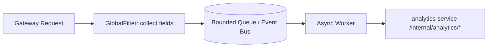

# Technical Design: 现有功能问题修复与一致性加固（fix_known_issues）

## Technical Solution

### Core Technologies
- Backend: Java 17 / Spring Boot 3 / Spring Cloud Gateway（WebFlux）/ Spring Security（JWT Resource Server）
- Frontend: Vue 3 / Vite / Pinia / Axios
- Infra: Nacos / MySQL / Redis / Kafka / Elasticsearch / Prometheus + Grafana + Loki

### Implementation Key Points
1. **内容渲染契约统一**
   - 目标：避免二次转义，同时保持 XSS 安全与历史数据兼容。
   - 建议路线（推荐）：后端逐步停止写入 `HtmlUtils.htmlEscape`；在“读取/响应组装”阶段对历史数据做一次性 HTML entity 解码（受配置开关控制），前端继续以“先 escape 再生成白名单标签”的方式渲染 Markdown。
2. **可信代理 IP 解析配置与校验**
   - 保持安全默认态：默认不信任 `X-Forwarded-For`。
   - 提供明确的生产配置开关与校验：启用时必须配置可信 CIDR；否则启动失败或告警（避免 silent misconfig）。
3. **网关 analytics 采集脱链副作用治理**
   - 把“触发采集”从 WebFlux filter 里抽离：filter 只负责收集必要字段并投递到有界队列/事件总线。
   - 单独的异步 worker 执行 WebClient 调用：统一超时、并发、重试策略与 metrics。
4. **internal client 统一**
   - 复用 `common` 的 internal client 支持：headers、错误语义保真、指标命名与标签一致。
   - 统一 timeout 与 forbidden 映射：减少跨服务差异。
5. **最终一致 UX**
   - 在“发帖/编辑成功”后提示搜索与通知可能存在延迟，并提供“立即查看帖子/刷新搜索”等操作入口。
   - 管理员 reindex 流程保持 break-glass，并提供更明确的失败提示指引（已有基础，可补齐文案与 runbook 链接）。

## Architecture Design

（采集重构后）网关 analytics 采集链路建议如下：

## Architecture Decision ADR

### ADR-001: 内容渲染策略（store-raw + render-safe）
**Context:** 当前后端写入阶段进行了 HTML escape，前端 Markdown 渲染再次 escape，导致二次转义与可读性问题；同时系统需要防止 XSS。  
**Decision:** 以“存储原文（text）/展示端安全渲染”为长期契约；为了兼容历史数据，短期在读取阶段做一次性 HTML entity 解码（可配置开关），并配合可选的数据修复与索引重建。  
**Rationale:**  
- 消除二次转义，提升用户体验；  
- 安全边界清晰：API 返回原始文本，展示端负责 escape 与白名单渲染；  
- 兼容可控：避免一次性全量 DB 迁移带来的不可逆风险。  
**Alternatives:**  
- 方案 A：继续后端写入 escape，仅改前端解码再渲染 → 风险：多端/多消费方不一致，且前端需要识别“是否已 escape”。  
- 方案 B：全量 DB 解码迁移并立刻停止写入 escape → 风险：需要备份与回滚策略，迁移窗口与错误代价更高。  
**Impact:**  
- 需要新增/调整“历史数据解码”策略与开关；  
- 需要与搜索索引一致性配合（必要时 reindex）。  

### ADR-002: 网关采集副作用触发方式（event/queue over inline subscribe）
**Context:** WebFlux filter 内直接 `subscribe()` 会使副作用脱离请求链路，增加背压/上下文/可观测性复杂度。  
**Decision:** filter 仅做轻量字段收集并投递到有界队列；独立异步 worker 执行采集请求，并对失败/丢弃进行指标化。  
**Rationale:** 逻辑解耦、可观测、可控（有界/丢弃/并发/超时）。  
**Alternatives:**  
- 继续在 filter 内 `subscribe()`，仅加超时/计数 → 实现最小但长期隐性成本仍在。  
**Impact:** 新增一个网关内部异步组件；需要压测队列容量与丢弃策略。  

## API Design
- 默认不改现有对外 API 结构。
- 若需要兼容性字段（例如 debug：`contentEncoding` 或 `renderContractVersion`），仅在内部/可选字段提供，且不影响现有前端。

## Data Model
若后续决定做一次性数据修复：
- 对 `discuss_post.content/title` 与 `comment.content` 做 HTML entity 解码迁移（执行前必须备份）；  
- 执行后触发搜索索引重建（reindex）以保持一致性。

## Security and Performance
- **Security:**
  - trusted-proxy：严格 allowlist（CIDR）+ fail-closed；禁止使用 `0.0.0.0/0` 作为默认值。
  - 内容渲染：仅允许白名单标签（已存在的 `<em>` 高亮与受控 Markdown 渲染），审查所有 `v-html` 点位。
  - internal client：统一 `X-Internal-Token` 与错误映射，避免泄露敏感配置值。
- **Performance:**
  - analytics 采集：有界队列、并发上限、超时上限；避免对业务请求增加额外 RTT。
  - 渲染：前端渲染维持 O(n) 复杂度；历史解码尽量只在必要字段上执行并可缓存。

## Testing and Deployment
- **Testing:**
  - 增加“特殊字符/Markdown/XSS”内容渲染的用例覆盖（后端 + 前端）。
  - 增加 trusted-proxy 配置的单测/启动校验用例。
  - 增加 analytics 异步队列在失败场景下的指标与不影响主链路的回归用例。
  - 复用现有脚本：`scripts/security-check.sh`、`scripts/smoke-i0-auth.sh` 等。
- **Deployment:**
  1) 先上线“读取阶段解码（兼容开关开启）”，观察线上内容展示与 error rate；  
  2) 再上线“停止写入 escape”，保持兼容开关一段时间；  
  3) 可选：执行数据修复迁移 + reindex；最后关闭兼容开关。  

