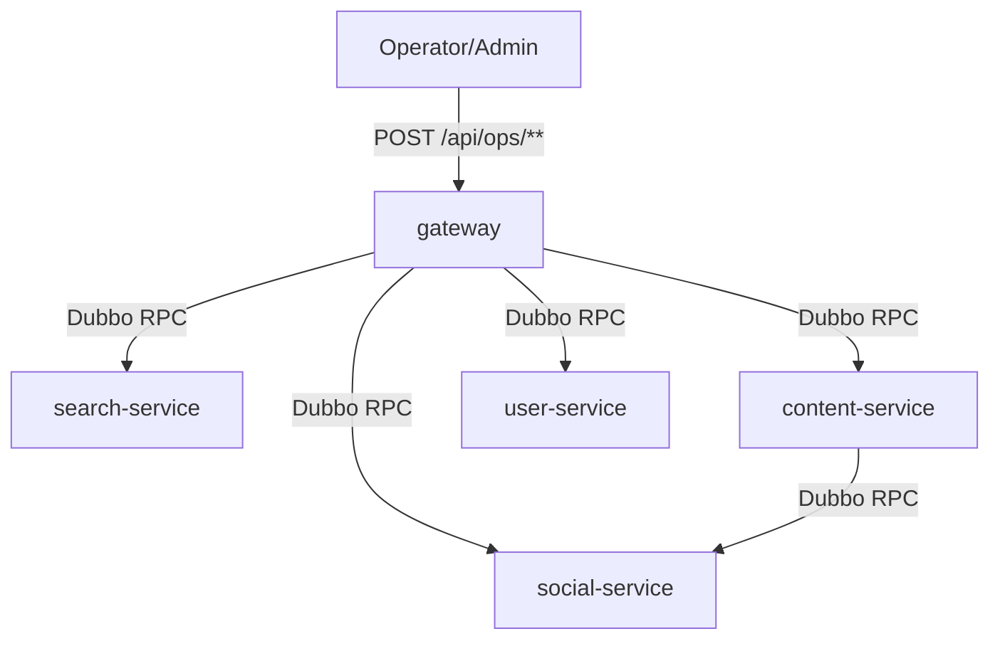

# Technical Design: internal_ops_dubbo_unification

## Technical Solution

### Core Technologies
- Java 17 / Spring Boot 3.x
- Spring Cloud Gateway（WebFlux）
- Apache Dubbo 3.x（Zookeeper registry）
- 统一返回协议：`Result<T>`

### Implementation Key Points

1. **新增/补齐 Ops 类 Dubbo RPC 契约**
   - 为 reindex/outbox replay/like backfill 等运维动作新增 RPC 接口与 DTO（沉淀在 `*-api` 模块）。
   - search-service 补齐缺失的 `search-api` 契约模块，避免 gateway 依赖实现模块。

2. **gateway 以 Controller 承载 `/api/ops/**`**
   - 删除 gateway `routes` 中“SetPath 到 `/internal/**`”的转发逻辑；
   - 新增 `@RestController`，对外暴露 `/api/ops/**` 并通过 Dubbo 调用各服务执行运维动作；
   - 统一：
     - ADMIN 鉴权（复用现有 `GatewaySecurityConfig`）
     - 审计（复用 `AuditLogGlobalFilter`）
     - 限流与强关闭（复用 `GatewayRateLimitGlobalFilter` 的 rules/blocked-path-patterns）

3. **避免 WebFlux 事件循环被阻塞**
   - ops Controller 内所有 Dubbo 调用使用 `Mono.fromCallable(...).subscribeOn(Schedulers.boundedElastic())`；
   - 将 `traceId` 写入 `TraceContext`，确保 Result.traceId 与日志可串联。

4. **移除 internal HTTP Controller 与默认放行配置**
   - 删除各服务中 `/internal/**` Controller（功能重复或仅用于运维的入口）；
   - SecurityConfig 移除对 `/internal/**` 的 permitAll，避免未来误新增 internal 入口。

5. **legacy 入口下线**
   - 移除 `POST /api/search/internal/reindex` 的路由；
   - 在 gateway `blocked-path-patterns` 中默认阻断并返回 410 迁移提示。

## Architecture Design

## Architecture Decision ADR

### ADR-1: 运维入口与内部调用统一到 Dubbo RPC
**Context:** `/internal/**` HTTP 与 Dubbo RPC 并存导致多主路径、治理/鉴权/审计/契约测试成本高，且易产生长期半迁移。
**Decision:** 删除/禁用 `/internal/**` 功能入口；gateway 以 `/api/ops/**` 为唯一对外运维入口，并通过 Dubbo RPC 调用各服务执行运维动作；不保留 legacy 外部入口。
**Rationale:**
- 契约集中在 `*-api`，演进更可控；
- 运维入口集中在 gateway，鉴权/审计/限流只需覆盖一处；
- 删除 `/internal/**` 入口降低误暴露风险与治理面。
**Alternatives:**
- 方案 A：保留 `/internal/**` 并由 gateway 转发（HTTP）→ 拒绝原因：仍存在 HTTP internal 主路径，治理面不收敛。
- 方案 B：保留 `/internal/**`，重新引入 internal token/ops guard → 拒绝原因：配置复杂且仍是多入口体系，易漂移。
**Impact:**
- gateway 对 Dubbo 的依赖扩大（search/content/user/social），需为 ops 调用设置更长 timeout；
- 删除 internal HTTP 可能影响脚本/运维习惯，需要同步迁移指引与脚本更新。

## API Design

### [POST] /api/ops/search/reindex
- **行为：** 触发 search-service 重建索引
- **实现：** gateway Controller → Dubbo `SearchOpsRpcService.reindex()`

### [GET] /api/ops/{service}/outbox/health
- **行为：** 查询 outbox 队列健康状态（NEW/RETRY/SENDING/FAILED）
- **实现：** gateway Controller → Dubbo `{Service}OutboxRpcService.health()`

### [POST] /api/ops/{service}/outbox/replay?limit=
- **行为：** 重放 FAILED outbox 事件
- **实现：** gateway Controller → Dubbo `{Service}OutboxRpcService.replayFailed(limit)`

### [POST] /api/ops/content/likes/backfill?entityType=&maxItems=&batchSize=
- **行为：** 回填 Redis 点赞投影
- **实现：** gateway Controller → Dubbo `ContentLikeOpsRpcService.backfill(...)`

## Security and Performance

- **Security:**
  - `/api/ops/**` 仅允许 ADMIN（gateway 侧收敛）
  - legacy `/api/search/internal/reindex` 默认 410 拒绝（blocked-path-patterns）
  - 删除 `/internal/**` 功能入口，降低旁路暴露风险
- **Performance:**
  - WebFlux 中 offload 阻塞 Dubbo 调用到 `boundedElastic`
  - 为高成本 ops RPC 设置更长 timeout，避免误判失败
  - gateway rate-limit 增加针对 replay/backfill 的规则（防误触/脚本重试风暴）

## Testing and Deployment

- **Testing:**
  - 单测：新增 gateway ops Controller 合约测试（200/4xx/traceId）
  - 单测：新增各服务 ops RPC provider 的单元测试（mock service，验证 Result 协议与错误映射）
  - 回归：`mvn test` 覆盖 gateway + search/content/user/social 相关模块
- **Deployment:**
  1. 先发布 `*-api` 契约模块（含 `search-api`）
  2. 再发布各服务 provider（search/content/user/social）
  3. 最后发布 gateway（启用新的 `/api/ops/**`，并默认阻断 legacy）

