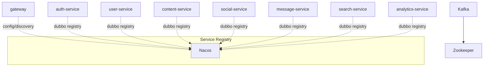

# Technical Design: Dubbo 注册中心收敛到 Nacos

## Technical Solution

### Core Technologies
- Java 17 / Spring Boot 3.2.6
- Spring Cloud 2023.0.3 / Spring Cloud Alibaba 2023.0.1.0
- Apache Dubbo 3.2.12
- Nacos（Config + Discovery + Dubbo Registry）

### Implementation Key Points
1. **“默认 Nacos + 应急覆盖”配置模型：**
   - 默认 registry 使用 Nacos：仅依赖 `NACOS_SERVER_ADDR`
   - 保留 `DUBBO_REGISTRY_ADDR` 作为显式覆盖（用于紧急回滚或迁移窗口“先发版不切换”）
2. **环境隔离与命名对齐：**
   - namespace：推荐按环境隔离（dev/test/prod），通过 `NACOS_NAMESPACE` 统一注入
   - group：推荐复用 `NACOS_GROUP`（避免 Spring Cloud 与 Dubbo group 不一致）
3. **依赖与运行时收敛：**
   - Maven 将 `dubbo-registry-zookeeper` 替换为 `dubbo-registry-nacos`
   - docker-compose 业务服务默认不再注入 `DUBBO_REGISTRY_ADDR`，避免双栈常态化
4. **可观测与排障路径统一：**
   - Nacos UI 作为统一入口：同时观察 Spring Cloud Discovery 与 Dubbo registry 的注册信息
   - 日志关键字与验证步骤固化到文档/任务中，避免“换 registry 之后靠猜”

### Configuration Conventions（统一变量与默认值）
**统一约定：所有服务的 Nacos 相关配置均通过同一组环境变量注入，减少环境漂移。**

- `NACOS_SERVER_ADDR`：Nacos 地址（例如 `nacos:8848` 或 `127.0.0.1:8848`）
- `NACOS_GROUP`：逻辑分组（默认 `DEFAULT_GROUP`）
- `NACOS_NAMESPACE`：可选，按环境隔离（例如 dev/test/prod 对应的 namespace id）
- `NACOS_USERNAME` / `NACOS_PASSWORD`：可选，生产环境建议启用鉴权时使用
- `DUBBO_REGISTRY_ADDR`：**仅应急/迁移窗口使用**，显式设置时覆盖 Dubbo registry（例如 `zookeeper://...` 或 `nacos://...`）

### Dubbo Registry 配置建议（application.yml 目标形态）
推荐以“占位符嵌套”的方式表达默认值与应急覆盖，避免在 compose 里注入两套变量：

```yaml
dubbo:
  registry:
    # 语义：如果显式设置 DUBBO_REGISTRY_ADDR，则覆盖默认 registry；否则使用 Nacos（与 Spring Cloud 共用 NACOS_SERVER_ADDR）
    address: ${DUBBO_REGISTRY_ADDR:nacos://${NACOS_SERVER_ADDR:127.0.0.1:8848}}
    # parameters 对非 Nacos registry 通常会被忽略；用于对齐隔离维度（namespace/group）与鉴权
    parameters:
      namespace: ${NACOS_NAMESPACE:}
      group: ${NACOS_GROUP:DEFAULT_GROUP}
      username: ${NACOS_USERNAME:}
      password: ${NACOS_PASSWORD:}
```

说明：
- 该写法让 **“默认只配 Nacos”** 成为常态，同时保留 **“可回滚”** 的运维抓手。
- 如果后续确认 `group` 需要使用 Dubbo registry 的专用字段（而非 parameters），可在实现阶段按 Dubbo/Nacos registry 的实际支持情况微调，但建议保持变量名不变（减少环境改动）。

### Rollout Plan（避免一次性全量替换带来的不可控）
由于 registry 属于跨服务强耦合基础设施，灰度的可操作性取决于是否支持“双 registry 并行”。这里给出两条可选路径：

**路径 A：短窗口一次性切换（推荐，实施最简单）**
1. 本地/测试：移除 compose 中的 `DUBBO_REGISTRY_ADDR` 注入，默认使用 Nacos 跑通全链路。
2. 生产：在发布窗口内一次性对所有服务切换（确保 provider/consumer 同时切换），并保留 `DUBBO_REGISTRY_ADDR=zookeeper://...` 的快速回滚能力。

**路径 B：双 registry 并行灰度（可选，复杂但更稳）**
1. 迁移窗口临时引入“双 registry”配置（provider 同时向 ZK 与 Nacos 注册；consumer 同时订阅）。
2. 逐步把 consumer 的订阅流量切到 Nacos；确认稳定后下线 ZK registry。
3. 稳定后删除双 registry 配置，回到“默认 Nacos + 应急覆盖”的简化模型。

> 本仓库当前配置未显式使用多 registry；如要采用路径 B，需要在实现阶段确认 Dubbo 3.2.12 在本项目配置风格下的多 registry 写法与行为（并补充更严格的验证用例）。

## Architecture Design



## Architecture Decision ADR

### ADR-019: Dubbo Registry 收敛到 Nacos（替代 Zookeeper Registry）
**Context:** 当前系统同时依赖 Nacos（Spring Cloud）与 Zookeeper（Dubbo）作为注册中心，带来双栈治理与排障路径，长期维护成本高。知识库 `.helloagents/arch.md` 中也已给出“目标态：全部服务统一到 Nacos”的方向。

**Decision:** Dubbo registry 迁移为 Nacos registry，默认仅使用 `NACOS_SERVER_ADDR` 作为统一入口；docker-compose 不再注入 `DUBBO_REGISTRY_ADDR`。

**Rationale:**
- 降低注册中心分裂导致的排障与运维复杂度（单一可视化入口、统一隔离策略）。
- 与既有 Spring Cloud Nacos 的配置中心/服务发现链路保持一致，减少环境漂移。
- 改动范围可控：主要为依赖替换 + 配置项调整，不涉及对外 API 与数据模型变更。

**Alternatives:**
- 继续双栈（Nacos + Zookeeper）：→ 维护成本持续累积，故障定位与配置一致性风险长期存在。
- 反向收敛到 Zookeeper（Spring Cloud ZK）：→ 现有 `spring.config.import` 已深度依赖 Nacos，迁移面更大。
- 逐步移除 Dubbo，统一到 Spring Cloud HTTP/Feign：→ 改动更大，需要重做调用链语义与压测，本次不选。

**Impact:**
- Dubbo 服务注册发现路径变更，需要本地/测试/生产分环境验证。
- Nacos 承担更多注册负载，需要关注容量、隔离与权限策略。
- Zookeeper 仍将因 Kafka 保留（本次不做 Kafka KRaft 改造）。

## Security and Performance
- **Security:**
  - 生产环境建议使用 namespace 隔离，避免跨环境串扰。
  - 避免在日志中输出完整 registry 地址与敏感配置（token/密码）。
  - 保持“fail-closed”原则：关键配置缺失时启动失败，禁止静默退化。
- **Performance:**
  - Nacos 承载 registry 后需关注实例数增长与心跳压力；必要时开启集群并设置合理的心跳/过期策略。
  - Dubbo consumer/provider 的超时、重试参数保持现状，避免迁移期引入额外变量。

## Testing and Deployment
- **Testing:**
  - 单测：`mvn test`
  - 端到端：`deploy/docker-compose.yml` 启动全依赖后，验证关键 Dubbo 调用链（例如 search-service 的 reindex 拉取、各服务间同步只读调用）。
  - 可观测性：
    - Nacos UI 中确认服务注册信息可见
    - 对照 Spring Cloud 服务名（如 `auth-service`）与 Dubbo 服务键（通常为 Dubbo 接口维度）是否在预期的 namespace/group 下
- **Deployment:**
  - 本地/测试环境先切换并跑通全链路，再进入生产灰度。
  - 迁移窗口内保留紧急回滚开关（显式设置 `DUBBO_REGISTRY_ADDR`），并把“回滚动作/验证点”写入 runbook（避免线上靠记忆操作）。
  - 稳定后移除遗留注入与文档（确保双栈不会长期共存）。
