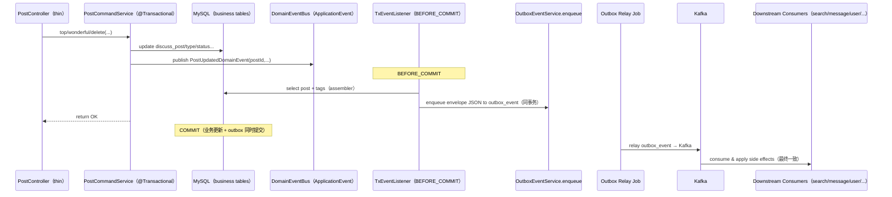

# Technical Design: content Domain Event + BEFORE_COMMIT Outbox 自动入队

## Technical Solution

### Core Technologies
- Spring Boot 3 / Spring Transaction（`@Transactional` + 事务同步回调）
- Spring ApplicationEvent + `@TransactionalEventListener(phase = BEFORE_COMMIT)`
- Outbox Pattern（`OutboxEventService.enqueue` 同事务写入 outbox 表，由 relay 可靠投递）
- MyBatis（业务表与 outbox 表写入复用同一 DataSource/TransactionManager）
- Micrometer（对 outbox enqueue / publish 结果打点，辅助迁移期双轨观测）

### Implementation Key Points

#### 1) 引入 Domain Event（写路径表达“发生了什么”）
在 `content-service` 内定义 posts 相关领域事件（示例）：
- `PostPublishedDomainEvent(postId, actorUserId, occurredAt)`
- `PostUpdatedDomainEvent(postId, actorUserId, occurredAt, reason)`
- `PostDeletedDomainEvent(postId, actorUserId, occurredAt, reason)`

约束：
- 领域事件应尽量小且不可变（仅携带必要标识）；payload 由统一 assembler 负责构造。
- 写路径只发布领域事件，不直接调用 `ContentEventPublisher`（避免散落 publish 点位）。

#### 2) Domain Event Publisher：无事务时 fail-fast，避免 silent drop
封装 `ContentDomainEventPublisher`：
- 发布前检查 `TransactionSynchronizationManager.isActualTransactionActive()`（或等价判断）
- 若无事务：抛出异常或记录 error 级别日志（可配置），阻断“业务已更新但事件无处投递”的隐性窗口

目的：把“事务边界不一致”从线上隐患变成开发期可见的错误。

#### 3) 统一桥接：`@TransactionalEventListener(BEFORE_COMMIT)` → `ContentEventPublisher`
新增桥接组件 `ContentDomainEventOutboxBridge`（示意）：
- `@TransactionalEventListener(phase = TransactionPhase.BEFORE_COMMIT, fallbackExecution = false)`
- 对不同 Domain Event 做 mapping：
  - 通过 `PostPayloadAssembler` 构造完整 `PostPayload`
  - 调用 `ContentEventPublisher.publishPostPublished/Updated/Deleted`

关键点：
- **BEFORE_COMMIT**：确保 Outbox 入队发生在同一事务提交之前；若 commit 失败，outbox insert 会随事务回滚。
- `fallbackExecution=false`：无事务时不执行监听器，配合 publisher 的 fail-fast 防止 silent drop。

#### 4) 引入 `PostPayloadAssembler`（payload SSOT）
将 payload 构造集中到单一组件，统一保证字段完整与语义一致：
- 输入：`postId`（必要时附带已加载的 `DiscussPost`、tags）
- 读取：同事务内可见的 `DiscussPost` + `TagService.getTagsByPostIds`
- 处理：`ContentTextCodec.decodeOnRead`（保持 “store-raw + render-safe” 契约）
- 输出：完整 `PostPayload`（至少包含 `postId/userId/categoryId/tags/title/content/type/status/createTime/score`）

迁移策略：
- 逐步替换掉 `PostController` / `PostCommandService` / `PostScoreRefresher` 等处的手写拼装，避免字段漂移与覆盖。

#### 5) 收敛命令入口：Controller 只做轻薄层
对 `PostController` 的管理动作（`top/wonderful/delete`）做收敛：
- Controller：鉴权、参数校验、审计日志
- 应用服务（`@Transactional`）：更新业务表 + 发布 Domain Event + after-commit 副作用（如 `postScoreQueue.add`）

#### 6) 修复旁路写路径：热度刷新也纳入事务 + 统一 payload
将 `PostScoreRefresher` 的 `updateScore + publishPostUpdated` 迁移为：
- 事务应用服务：`@Transactional` 更新 score
- 发布 `PostUpdatedDomainEvent`
- 由桥接层通过 assembler 构造完整 payload 入队 outbox

避免 score 刷新事件覆盖索引中的 `tags/categoryId` 等字段。

## Architecture Design

## Architecture Decision ADR

### ADR-020: 写路径采用 Domain Event + BEFORE_COMMIT 统一 Outbox 入队
**Context:** 写路径 publish 点位分散且存在非事务入口，Outbox 开启时会出现“业务已更新但 outbox 入队失败”的不一致窗口；同时 payload 手写拼装重复导致字段漂移与下游覆盖风险。  
**Decision:** content-service 写路径改为发布 Domain Event；通过 `@TransactionalEventListener(BEFORE_COMMIT)` 统一桥接到 `ContentEventPublisher`，并引入 `PostPayloadAssembler` 作为 payload SSOT。  
**Rationale:** 把“事件投递”纳入事务提交路径，保证 outbox 入队原子性；通过统一 assembler 消除 payload 漂移；Domain Event 让新增命令分支更难遗漏事件。  
**Alternatives:**  
- 继续手写 `ContentEventPublisher` 调用 → Rejection reason: 容易遗漏、事务边界难统一、payload 漂移持续存在。  
- 仅使用 After-Commit 直发 Kafka → Rejection reason: 缺少可靠重试，无法满足默认安全态（Outbox 默认开启）。  
- 仅靠 AOP around `@Transactional` flush → Rejection reason: 受 advisor 顺序影响大，易出现 flush 在 commit 之后执行的隐患。  
**Impact:** 引入领域事件与桥接层；迁移期需要分步骤替换旧 publish 点位并补齐测试/指标，避免双发/漏发。

## API Design
- 对外 HTTP API 不变（路由/DTO 兼容），仅改内部调用链
- Kafka topic/type/envelope v1 不变，payload 字段更稳定（补齐缺失字段）

## Data Model
- 不新增表结构
- 继续使用 outbox 表 `outbox_event` 作为可靠投递队列（同事务写入）

## Security and Performance
- **Security：**
  - assembler 严格只组装“允许下游使用”的字段，避免把审计原因/敏感文本误带入事件
  - 维持现有鉴权边界：Controller/应用服务仍负责权限校验与审计日志
  - outbox 入队失败时 fail-fast 并回滚，避免“状态已改但事件缺失”的隐性一致性漏洞
- **Performance：**
  - 事件桥接阶段尽量复用已加载实体；必要查询限制在主键查询 + tags 查询
  - 迁移期增加指标（queued/published/outbox_error）用于评估开销与稳定性

## Testing and Deployment
- **Testing：**
  - 单元测试：`PostPayloadAssembler` 输出字段完整性（特别是 `categoryId/tags` 不为空覆盖）
  - 集成测试：Outbox 开启时，模拟 enqueue 失败应触发事务回滚（状态不变 + outbox 无记录）
  - 回归测试：管理动作（top/wonderful/delete）事件仍可被下游消费（search 索引更新/删除）
- **Deployment：**
  - 采用分步骤迁移与灰度：先落地基础设施与桥接层，再逐条写路径切换到 Domain Event
  - 预留开关（可选）：`content.events.domain-event.enabled`（迁移期便于回滚/对比观测）

