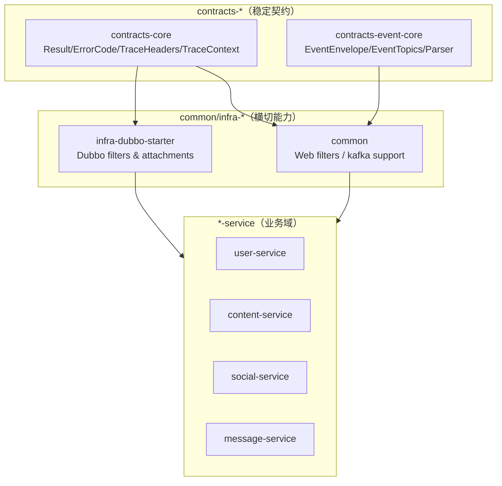

# 技术设计：架构治理（契约 SSOT + 漂移门禁 + 可观测性一致）

## 技术方案

### 核心技术
- Java 17 + Spring Boot 3（Servlet 服务）/ Spring Cloud Gateway（Reactive）
- Kafka（事件总线，topic 按 domain 聚合）
- Maven 多模块（contracts/common/infra/*-api/*-service）
- JUnit5 + AssertJ（门禁测试与回归）

### 实现要点

1. **Kafka topic SSOT**
   - 在 `contracts-event-core` 提供 `EventTopics` 作为唯一常量来源。
   - 生产/消费端统一改用 `EventTopics.*`；删除域内 topic 常量类。

2. **trace header SSOT**
   - 在 `contracts-core` 提供 `TraceHeaders` 统一定义 `X-Trace-Id/traceparent`。
   - gateway：`TraceIdSupport` 引用 `TraceHeaders`，并负责解析/规范化 traceId 与构造 traceparent。
   - Servlet：`TraceIdFilter` 统一解析 `X-Trace-Id/traceparent`，缺失则生成；写入 `TraceContext(MDC+ThreadLocal)` 并回写响应头。
   - Dubbo：attachment key 统一引用同一 SSOT（避免 hardcode）。

3. **事件 traceId 保证**
   - `EventEnvelope.of(...)` 读取 ThreadLocal traceId；缺失时生成并写入 envelope。
   - Kafka 消费端通过 `KafkaTraceSupport` 将 envelope.traceId 注入 `TraceContext`，finally 清理避免线程复用串线。

4. **投影缺失语义结构化**
   - 在各域 `*ErrorCode` 增加 `PROJECTION_MISSING`（HTTP 503）。
   - repository 抛 `BusinessException(PROJECTION_MISSING, ...)` 表达缺失语义。
   - guard 仅按 errorCode 分支，禁止 message 文案判断。

5. **架构门禁**
   - Maven 依赖门禁：禁止任意 service 模块依赖其他 service 模块（强制通过 `*-api`/contracts 协作）。
   - 源码 import 门禁：禁止跨域 import 域错误码；禁止 infra/contracts/common/gateway/ops 依赖 domain event payload（避免共享内核式耦合）。

## 架构设计

## 架构决策 ADR

### ADR-201：Kafka Topic 常量与 Trace Header 常量的 SSOT 中立化
**Context:** topic/header 常量若分散在多个模块，会产生反向依赖与漂移；排障与演进成本高。  
**Decision:** 将 topic 常量放入 `contracts-event-core`，将 trace header 常量放入 `contracts-core`，全仓统一引用。  
**Rationale:** contracts 层属于跨服务稳定契约，最适合作为 SSOT；可配合门禁测试防回潮。  
**Alternatives:**  
- 方案 A：各域自定义常量类 → 拒绝原因：重复定义与 drift 风险高  
- 方案 B：放入 common → 拒绝原因：common 容易变成“共享内核”，边界不清  
**Impact:** 需要一次性全仓替换引用并删除旧实现；脚本/文档同步更新。

## 安全与性能

- **安全：**
  - traceId 仅允许规范化后的值写入 MDC/响应头（避免日志污染/高基数指标爆炸）。
  - 门禁测试阻止 payload 泄漏到 infra/common/gateway，避免敏感字段在“共享层”扩散。
- **性能：**
  - 门禁测试采用轻量扫描/解析，避免引入额外框架造成构建开销。
  - trace 注入只做常量/字符串处理，对主链路影响可控。

## 测试与发布

- **测试：**
  - 执行 `mvn test`（全 reactor），确保 topic/trace/error/门禁测试全部通过。
  - Kafka 消费侧相关单测应覆盖 topic 引用与 envelope/version/type 校验的关键路径。
- **发布/运行：**
  - 本地 compose 的 `kafka-init` 需创建全部 topic 与 DLQ；脚本 `kafka-reset-topics.sh` 的清单必须与 SSOT 同步。

