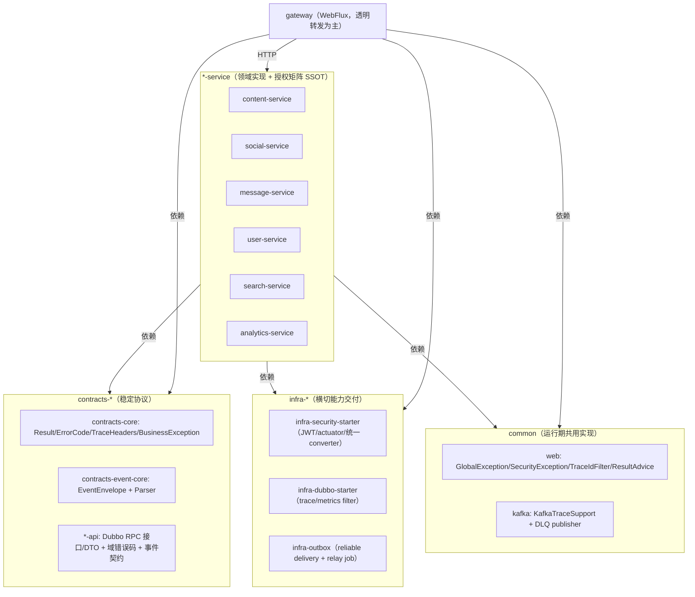

# 技术设计：架构深度重构（边界收敛 + 去漂移 + 去同步耦合）

## Technical Solution

### Core Technologies

- Java 17 / Spring Boot 3（Servlet + WebFlux）
- Spring Cloud Gateway（WebFlux）
- Apache Dubbo（同步 RPC）
- Kafka（事件驱动）
- MyBatis + MySQL（含 outbox）
- Micrometer + Prometheus（指标）
- Vue3（前端；本次以兼容为主）

### Implementation Key Points

本方案以“最终边界清晰 + 迁移可控”为目标，采用分阶段落地：

1. **Phase 0：护栏先行**
   - 先补齐架构门禁（contracts 纯化、双栈互斥装配、security 漂移、事件语义不分叉等），让后续重构可持续。
2. **Phase 1：契约与运行期解耦**
   - `contracts-core` 回归稳定协议（DTO/常量/异常/事件 envelope）。
   - trace/security/outbox 等运行期能力收敛到 `common`/`infra-*`，并通过 AutoConfiguration / SPI 提供。
3. **Phase 2：横切能力平台化**
   - 安全：`infra-security-starter` 输出统一的 decoder/converter/actuator 链；服务侧仅保留授权矩阵。
   - trace：统一 traceId 生成/解析/透传，servlet 与 reactive 语义一致；Dubbo/Kafka 由 filter/support 透传。
4. **Phase 3：事件投递语义收敛**
   - outbox-only：常态禁止 after-commit 直发；统一 relay 策略、指标口径、失败处理与运维开关。
5. **Phase 4：同步耦合治理**
   - 以“读路径批量化 + 写路径投影化”为主：高频校验/查询迁移到本地投影或 batch RPC；明确失败语义（默认 fail-closed）。

## Architecture Design

## Architecture Decision ADR

### ADR-1：contracts-core 纯化（契约与运行期解耦）
**Context:** `contracts-core` 中存在 ThreadLocal/MDC（如 `com.nowcoder.community.common.trace.TraceId/TraceContext`）以及 `Result` 直接读取 ThreadLocal，导致契约与运行期实现混叠，升级联动面大。

**Decision:** `contracts-core` 仅保留稳定协议（DTO/常量/异常/事件 envelope）；运行期 trace 上下文、注入点与自动装配迁移到 `common`/`infra-*`；对返回 `Result` 的 traceId 注入改为“运行期拦截/Advice/Filter”策略，避免业务代码遍地手写。

**Rationale:**
- 降低耦合：契约变更不再被运行期实现牵连。
- 降低漂移：注入点收敛后，servlet/reactive/Dubbo/Kafka 的语义统一由单点治理。

**Alternatives：**
- 方案 A：保留 ThreadLocal 与 `Result` 静态工厂现状 → 拒绝原因：契约模块持续膨胀且 reactive 风险无法从根上消除。

**Impact：**
- 需要分阶段迁移与兼容策略（避免一次性全量替换）。

### ADR-2：安全能力由 starter 交付，服务侧仅保留授权矩阵
**Context:** 多个 `*SecurityConfig` 重复实现 authorities 解析、异常处理与链路配置，容易出现公开端点误封/敏感端点误放行的漂移风险。

**Decision:** 扩展 `infra-security-starter` 输出统一的 JWT decoder + authorities converter + actuator 安全链；各服务 `*SecurityConfig` 只表达 `requestMatchers` 授权矩阵；新增“公开端点/敏感端点门禁测试”。

**Rationale:** 配置治理替代复制粘贴；服务侧 SSOT 明确；漂移可测试化。

### ADR-3：事件投递默认 outbox-only（可靠性作为默认安全态）
**Context:** 业务侧 publisher 同时支持 outbox 与 after-commit 直发，导致不同环境/配置下语义不一致，且极易在应急切换后“忘记切回”。

**Decision:** 常态路径统一为 outbox reliable delivery；直发仅保留为“应急止血”并通过显式开关 + 门禁测试约束；统一 relay 指标与失败处理。

**Rationale:** 一致性优先；可观测；避免“隐性降级”。

### ADR-4：同步调用治理（async-first + batch + projection）
**Context:** 多处 `@DubboReference` 处于请求路径，失败模式复杂且引入超时瀑布；部分场景存在 fail-open 争议。

**Decision:** 将高频/安全敏感校验迁移为事件投影与本地查询；必要的同步调用改为 batch RPC，并统一超时/重试/熔断策略与指标；默认 fail-closed（尤其是安全校验）。

**Rationale:** 降低跨域运行期耦合；减少请求链路不确定性；提升可测性与稳定性。

## Security and Performance

- **Security：**
  - 对安全校验类 RPC（拉黑/封禁/权限）默认 fail-closed，并补齐审计与指标。
  - 统一 `SecurityExceptionHandler` 行为与错误码/HTTP status 映射，避免网关/服务端语义分叉。
  - 对外保持 `Result` 字段兼容，避免前端与第三方调用方受影响。
- **Performance：**
  - 将高频同步校验迁移为本地投影/缓存，降低 p99 延迟与超时瀑布风险。
  - outbox relay 采用有界批量 + 可配置退避，保证主链路优先。
  - Dubbo 指标统一（`infra-dubbo-starter`）用于识别 N+1 与热路径。

## Testing and Deployment

- **Testing：**
  - 架构门禁：contracts 纯化、service 间实现依赖禁止、公开端点漂移、outbox-only 等。
  - 回归测试：对关键链路（login/refresh、发帖/评论、点赞/拉黑、私信）补齐 smoke 测试与 trace 断言。
- **Deployment：**
  - 分阶段发布：先 infra/starter，再逐服务迁移；每阶段可回滚。
  - 对应急开关（如直发）必须在发布窗口结束后自动/显式复位，并由门禁保护。

