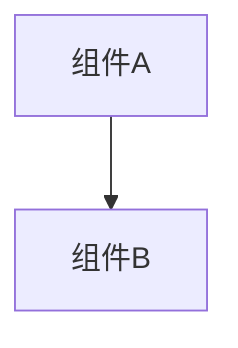

# 变更提案: business-service-boundary-splitting

## 元信息
```yaml
类型: 优化（架构评审）
方案类型: overview
优先级: P1
状态: ✅完成
创建: 2026-02-25
```

---

## 1. 需求

### 背景
用户希望从**业务角度**回答“应该怎么拆分服务”，而不是从技术栈/框架角度先行。

本项目当前为社区类系统的微服务形态（含 `gateway/auth/user/content/social/message/search/analytics/ops` 等），并已明确目标为：各服务可独立部署/扩容（真实微服务）。
因此需要一套能落到“职责、数据所有权、跨域协作方式（同步/异步）、以及为何如此拆分”的业务拆分建议。

### 目标
- 给出**业务能力域（Capabilities）**驱动的服务拆分：每个服务“做什么/不做什么”清晰。
- 给出每个服务的**数据所有权（SSOT）**：哪些实体/表/聚合归谁写入与最终状态负责。
- 给出跨服务协作方式：哪些走同步（HTTP/RPC），哪些走异步（事件），以及“最小同步调用集合”。
- 给出拆分背后的取舍（协作交付 / 治理边界 / 运行部署 3 维度）。
- 输出可归档的评审报告，供后续实施（或方案B 领域服务收敛）引用。

### 约束条件
```yaml
范围约束: 以社区业务为主（账号/内容/社交/消息/搜索/统计/运维），不扩展到支付/电商等域。
一致性约束: 默认最终一致（事件驱动），仅少量场景保留同步强校验。
交付约束: 本次仅评审与建议，不直接落地代码与目录结构改动。
```

### 验收标准
- [x] 输出服务清单与职责边界（每服务包含“做什么/不做什么”）
- [x] 输出数据所有权（SSOT）与跨服务协作方式（同步/异步）
- [x] 至少给出 2-3 条关键跨服务流程（登录/发帖/点赞评论通知）
- [x] 归档为 overview 方案包

---

## 2. 方案

### 总体结论（业务角度）
建议以“用户身份安全、用户画像、内容资产、关系互动、消息触达、发现入口、度量分析、运营治理、统一入口体验”九类业务能力域拆分服务：
- 写入边界清晰归属到单一服务（SSOT）
- 跨域读取尽量通过事件做只读投影
- 关键用户路径走同步（HTTP/RPC）以保证体验与正确性
- 非关键扩展（搜索/通知/分析）走异步（事件）以提升韧性与可扩展性

### 拆分原则（落地规则）
1. **SSOT（单一事实源）**：每类业务实体只归一个服务负责“写入 + 最终状态”。其他服务只保存 `id` 或投影快照。
2. **数据库边界**：每服务独立 schema/库；跨服务只用 `id` 关联，不跨库 join、不做跨库外键。
3. **一致性策略**：默认最终一致（事件驱动 + 幂等消费）；同步调用视为“例外”，需要写明原因。
4. **边界治理**：契约（HTTP/RPC/事件 schema）要版本化；`*-api` 只承载接口/DTO，不承载实现与 Spring runtime 依赖。

### 影响范围
```yaml
涉及模块:
  - gateway/auth-service/user-service/content-service/social-service/message-service/search-service/analytics-service/ops-service: 业务边界建议（只读评审）
  - contracts-*/contracts-event-core/*-api: 契约与事件协作方式建议（只读评审）
预计变更文件: 0（本次仅评审与建议，不落地改动）
```

### 风险评估
| 风险 | 等级 | 应对 |
|------|------|------|
| 边界划分不准导致“服务聊天化”/同步链路过长 | 中 | 优先事件驱动 + 读模型服务（减少运行时扇出），同步调用设上限与SLO |
| 最终一致带来短暂 UI 不一致 | 低 | 前端提示最终一致；提供重试/刷新；关键写路径保持强校验 |
| ops 权限过大导致越权写入/漂移 | 中 | ops 只下发策略/处置结论，不跨域写库；审计与最小权限 |
| common 继续膨胀成为“上帝模块” | 中 | common 准入清单 + 依赖门禁 + 定期审计 |

---

## 3. 技术设计（可选）

> 本方案为业务拆分建议（overview），不在本回合内输出详细技术实现设计。

---

## 4. 核心场景

### 场景: 注册/登录与首登建档
**模块**: gateway/auth-service/user-service (+ analytics-service/ops-service/search-service/message-service 旁路)
**条件**: 用户首次注册或登录
**行为**:
- 客户端 → Gateway → Auth 完成注册/登录（同步）
- 首登建档：Gateway → User 初始化/完善档案（同步）
- Auth/User 发布事件（异步）：UserCreated/UserLoggedIn/UserStatusChanged
**结果**:
- 主链路快速完成登录与建档
- 下游通过事件异步更新：分析统计/搜索用户索引/消息初始化等

### 场景: 发帖发布并被发现
**模块**: gateway/content-service (+ search-service/social-service/analytics-service/ops-service 旁路)
**条件**: 用户已登录且可发帖
**行为**:
- 客户端 → Gateway → Content 发布（同步写入）
- Content 发布 ContentPublished（事件）
- Search 异步建索引；Social 异步更新派生口径；Analytics 异步计数
- 命中策略/举报：Ops/Moderation 发布处置结论（事件），Content 异步更新可见性/审核状态
**结果**:
- 写入体验优先
- 发现/索引/统计最终一致，具备重放与恢复能力

### 场景: 点赞/评论触发通知与计数展示
**模块**: gateway/social-service/content-service/message-service (+ analytics-service)
**条件**: 用户对内容互动
**行为**:
- 点赞/关注：客户端 → Gateway → Social 写入互动边并发布 ReactionAdded/FollowCreated（事件）
- 评论：客户端 → Gateway → Content 写入评论并发布 CommentCreated（事件）
- Message 消费事件异步生成通知条目；Analytics 消费事件异步统计
- 内容详情展示：Content 提供内容事实；Social 提供计数与“我是否点赞”等状态（同步读取）
**结果**:
- 互动写入稳定可控
- 通知不阻塞主链路
- 展示侧同步读取最小集合，避免跨域 join

---

## 5. 技术决策

### business-service-boundary-splitting#D001: 以业务能力域拆分 + SSOT 数据所有权为第一原则
**日期**: 2026-02-25
**状态**: ✅采纳
**背景**: “业务拆分”要落地，必须回答三件事：谁写入、谁读、怎么协作。否则服务边界会退化为按技术分层/按团队随意切割，最终导致强耦合与漂移。
**选项分析**:
| 选项 | 优点 | 缺点 |
|------|------|------|
| A: 按业务能力域拆分（推荐） | 责任清晰，契约稳定，便于独立迭代与运维隔离 | 需要事件驱动与治理纪律（契约版本化/幂等） |
| B: 按技术层拆分（controller/service/dao 拆服务） | 代码结构表面“干净” | 业务耦合不变，调用链更长、运维成本更高 |
| C: 按现有组织/人力随意切割 | 初期推进快 | 长期口径漂移与跨域拉扯最严重 |
**决策**: 选择方案 A
**理由**: 能同时优化交付（独立迭代）、治理（边界稳定）与运行（故障隔离/韧性）。对社区业务，事件驱动 + 读模型是性价比最高的跨域协作方式。
**影响**: 后续若实施，将影响服务间 RPC/事件契约、数据库边界与 ops 权限模型；需配套契约版本化与可观测性基线。

---

## 3. 技术设计（可选）

> 涉及架构变更、API设计、数据模型变更时填写

### 架构设计


### API设计
#### {METHOD} {路径}
- **请求**: {结构}
- **响应**: {结构}

### 数据模型
| 字段 | 类型 | 说明 |
|------|------|------|
| {字段} | {类型} | {说明} |

---

## 4. 核心场景

> 执行完成后同步到对应模块文档

### 场景: {场景名称}
**模块**: {所属模块}
**条件**: {前置条件}
**行为**: {操作描述}
**结果**: {预期结果}

---

## 5. 技术决策

> 本方案涉及的技术决策，归档后成为决策的唯一完整记录

### business-service-boundary-splitting#D001: {决策标题}
**日期**: 2026-02-25
**状态**: ✅采纳 / ❌废弃 / ⏸搁置
**背景**: {为什么需要这个决策}
**选项分析**:
| 选项 | 优点 | 缺点 |
|------|------|------|
| A: {方案A} | {优点} | {缺点} |
| B: {方案B} | {优点} | {缺点} |
**决策**: 选择方案{X}
**理由**: {详细理由}
**影响**: {对哪些模块有影响}
