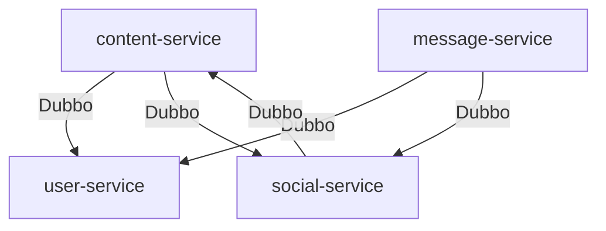

# 变更提案: remove-projections-rpc-only

## 元信息
```yaml
类型: 重构
方案类型: implementation
优先级: P0
状态: ✅已完成
创建: 2026-02-25
```

---

## 1. 需求

### 背景
本项目曾为降低跨服务同步依赖与拆除依赖环，引入了多处“本地投影（projection/read model/materialized view）”：由事件/Kafka/运维回填将 SSOT 状态同步到下游服务的本地表/缓存，然后写路径/读路径直接读取本地投影来完成校验或聚合展示。

你现在明确要求：**去除全仓库所有本地投影（含 `projection/*`、`*_projection` 表/Redis 结构、相关消费者/回填/错误码），统一改为 Dubbo RPC 实时回源**。

### 目标
- 移除所有本地投影相关代码与数据结构（代码层面不再读写 `*_projection` 读模型、不再消费投影事件、不再提供投影回填 ops 能力）。
- 所有原本依赖投影的关键路径，改为 **Dubbo RPC 回源到对应 SSOT 服务**（如：content → user/social；message → user/social；content → social（likes）；social → content（entity resolve））。
- 保持核心业务行为一致（权限校验、拉黑校验、点赞计数/状态、用户信息解析等）；若不可避免产生语义变化，在 KB 中明确记录。

### 约束条件
```yaml
时间约束: -
性能约束: 允许性能回退；但需避免明显的 N+1 RPC（优先批量 RPC 或轻量本地短 TTL 缓存）
兼容性约束: 以编译通过 + 单元测试通过为底线；不引入 SpringBootTest/Testcontainers 等重型测试基建
业务约束: 不新增/不保留任何“门禁测试（gate tests）”；架构约束仅写入 KB（.helloagents/）
```

### 验收标准
- [√] 代码中不再存在本地投影读写路径（删除 `content-service/message-service/social-service` 下 `projection/` 相关实现与消费者/回填入口）。
- [√] 关键路径改为 Dubbo RPC 回源且编译通过（`mvn test` 在受影响模块可通过）。
- [√] `docs/` 与 `.helloagents/` 中有关“本地投影/最终一致/回填”的描述被更新为 “RPC 回源” 的现状说明。

---

## 2. 方案

### 技术方案
按服务逐步替换：

- `social-service`：删除 `ContentEntityProjection`（本地表 + Kafka 消费者），`ContentEntityResolver` 改为 Dubbo 调用 `content-api: ContentEntityRpcService.resolveEntity(...)` 获取 POST/COMMENT 的 owner/postId/status。
- `content-service`：
  - 删除 `user_moderation_projection/user_block_projection` 的仓库、Kafka 消费者与 reconcile job。
  - 发言权限（禁言/封禁）校验改为 Dubbo 调用 `user-api: UserModerationRpcService.getStatus(...)` 直接判断。
  - 拉黑关系校验改为 Dubbo 调用 `social-api: SocialBlockRpcService.isEitherBlocked(...)`。
  - 点赞统计/是否点赞改为 Dubbo 调用 `social-api: SocialReadRpcService`（扩展接口：entityLikeCount/hasLiked），删除 Redis Set 点赞投影与消费逻辑。
- `message-service`：
  - 删除 `user_moderation_projection/user_block_projection/user_summary_projection` 的仓库、Kafka 消费者与 reconcile job。
  - 私信权限校验改为 `UserModerationRpcService.getStatus(...)`。
  - 拉黑关系校验改为 `SocialBlockRpcService.isEitherBlocked(...)`。
  - 用户信息解析改为 `UserReadRpcService`（resolve/batchSummary），删除 user summary 投影。
- `ops-service`：移除所有 backfill endpoints（原本用于投影冷启动/补洞），保留 reindex/outbox 相关 ops 能力。
- `*-api`：删除与投影写入相关的 ops-only RPC 接口与 DTO；若 `message-api` 仅承载投影接口，则移除该模块。

### 影响范围
```yaml
涉及模块:
  - social-service: 移除内容实体投影 + 写路径改为 RPC
  - content-service: 移除 moderation/block/like 投影 + 写路径/读路径改为 RPC
  - message-service: 移除 moderation/block/userSummary 投影 + 写路径/读路径改为 RPC
  - ops-service: 移除投影 backfill 端点
  - social-api/content-api/message-api: 合同接口变更/删除
  - deploy/docs/.helloagents: 文档与本地初始化 SQL 调整
预计变更文件: 40~80（以实际删除/替换为准）
```

### 风险评估
| 风险 | 等级 | 应对 |
|------|------|------|
| 同步依赖链增加，级联超时/故障放大 | 高 | RPC 超时/重试=0；关键路径优先 fail-closed；必要处加轻量缓存；监控埋点 |
| 热点页面产生 N+1 RPC（如帖子列表/详情） | 高 | 引入批量 RPC（如 user batchSummary 已存在）；likes 增加批量/缓存视需要 |
| 语义变化（从最终一致投影 → 实时回源） | 中 | 在 KB 中记录；对外错误码/HTTP status 保持一致或给出迁移说明 |
| 删除投影相关 ops 能力影响运维习惯 | 中 | 在 KB/runbook 中明确“已不再需要 backfill”；保留 outbox/reindex ops 能力 |

---

## 3. 技术设计（可选）

> 涉及架构变更、API设计、数据模型变更时填写

### 架构设计


### API设计
#### {METHOD} {路径}
- **请求**: {结构}
- **响应**: {结构}

### 数据模型
| 字段 | 类型 | 说明 |
|------|------|------|
| {字段} | {类型} | {说明} |

---

## 4. 核心场景

> 执行完成后同步到对应模块文档

### 场景: {场景名称}
**模块**: {所属模块}
**条件**: {前置条件}
**行为**: {操作描述}
**结果**: {预期结果}

---

## 5. 技术决策

> 本方案涉及的技术决策，归档后成为决策的唯一完整记录

### remove-projections-rpc-only#D001: 移除所有本地投影，统一改为 Dubbo RPC 回源
**日期**: 2026-02-25
**状态**: ✅采纳
**背景**: 需求明确要求“全仓库去投影 + RPC 回源”，以降低最终一致/回填/投影缺失等运维复杂度与语义分歧。
**选项分析**:
| 选项 | 优点 | 缺点 |
|------|------|------|
| A: 保留投影（事件驱动 + backfill） | 降低同步耦合与级联风险；写路径更稳 | 投影缺失/滞后会前移为可用性风险；需要回放/重建/告警 SOP；语义复杂 |
| B: 移除投影（RPC 回源） | 语义直观；实现与运维更简单 | 同步依赖链变长；可能 N+1；P99/可用性更依赖下游 |
**决策**: 选择方案 B
**理由**: 按需求执行；并通过 RPC 超时/重试策略与批量接口尽量控制风险。
**影响**: social/content/message/ops 及对应 api/contracts、docs、deploy SQL
