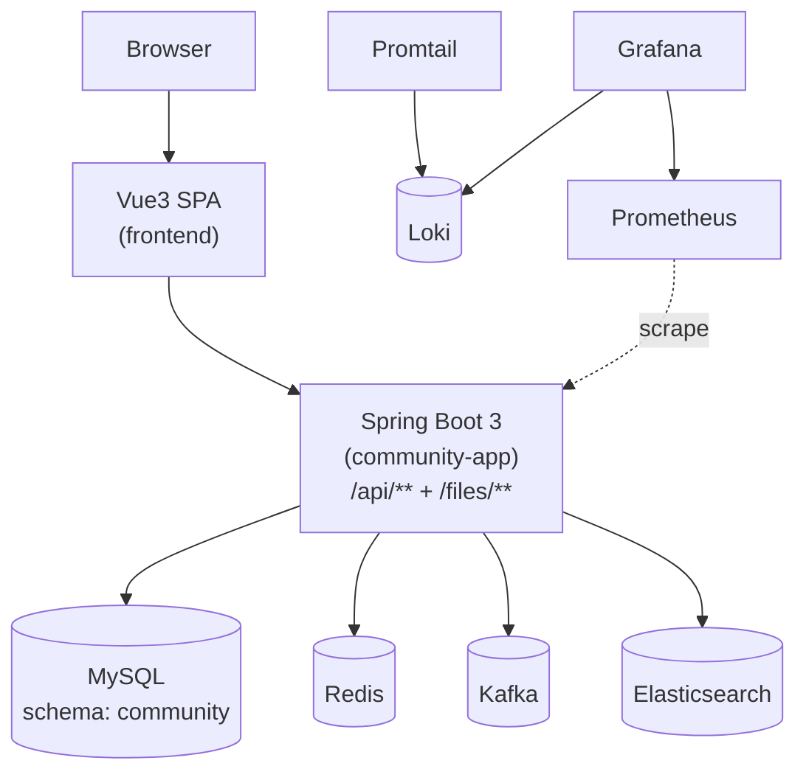

# 架构文档（与代码保持一致）

> 本项目当前形态：**A-1 模块化单体（Modular Monolith）** + 前后端分离。  
> 对外只有一个后端进程：`community-app`（Spring Boot 3，容器内默认 `8080`；本地 compose 映射为 `12882`）。  
> 对外 API 前缀稳定：`/api/**`；静态文件前缀稳定：`/files/**`。  
>
> 约定：本文档中的命令与路径默认以**仓库根目录**作为工作目录（除非特别说明）。

---

## 0. 边界 / SSOT 总表（速查）

> 目的：用一张表快速对齐“谁暴露 API / 谁 owns 数据 / 谁做鉴权（JWT 验签 + 授权矩阵）”。
>
> 说明：MySQL 已收敛为单一 schema（默认 `community`），但**数据所有权（SSOT）仍按模块划分**；
> 约束上建议保持“禁止跨模块 JOIN、跨模块只通过内部接口拿数据”，避免演化为“大泥球”。

| 能力/域 | 对外 API（入口） | 数据/状态 SSOT（owner） | 鉴权/授权 SSOT（执行位置） |
| --- | --- | --- | --- |
| 统一入口（edge） | `community-app`：`/api/**`、`/files/**` | - | `community-app`：统一 CORS；`/api/auth/login\|refresh\|logout` OriginGuard；统一异常/traceId/审计日志 |
| 认证与会话（auth） | `community-app`：`/api/auth/**` | refresh token：`user` 模块（MySQL `auth_refresh_token`）；验证码/重置码：`auth` 模块（Redis） | `community-app` SecurityFilterChain（JWT resource server）；cookie 会话入口额外 OriginGuard |
| 身份域（user） | `community-app`：`/api/users/**`、`/files/**` | `user` 模块（MySQL `user` 等） | `community-app` SecurityFilterChain（`/api/users/admin/**` 强制 ADMIN） |
| 内容域（content） | `community-app`：`/api/posts/**`、`/api/categories/**`、`/api/tags/**`、`/api/reports/**`、`/api/moderation/**` | `content` 模块（MySQL + Redis 缓存） | `community-app` SecurityFilterChain（写接口需登录；审核/置顶/加精/删除需 ADMIN/MODERATOR） |
| 社交域（social） | `community-app`：`/api/likes/**`、`/api/follows/**`、`/api/blocks/**` | `social` 模块（MySQL/Redis，见 `social.storage`） | `community-app` SecurityFilterChain（部分 GET 允许匿名） |
| 消息域（message） | `community-app`：`/api/messages/**`、`/api/notices/**` | `message` 模块（MySQL） | `community-app` SecurityFilterChain |
| 搜索域（search） | `community-app`：`/api/search/**` | `search` 模块（Elasticsearch + 幂等表） | `community-app` SecurityFilterChain（读 permitAll；reindex 走 `/api/ops/**`） |
| 分析域（analytics） | `community-app`：`/api/analytics/**` | `analytics` 模块（Redis） | `community-app` SecurityFilterChain（ADMIN/MODERATOR） |
| 运维平面（ops） | `community-app`：`/api/ops/**` | -（触发跨模块动作，如 reindex / outbox replay） | `community-app` SecurityFilterChain（ADMIN-only） |

---

## 1. 总体架构（模块化单体 + 前后端分离）

补充说明：
- **单体发布**：后端整体一起发布/回滚；因此“运行期耦合”是显式接受的取舍。
- **模块化**：顶层 Reactor 按 `community-bootstrap / platform / 各领域-service` 组织；领域契约统一收敛在各 `*-service` 模块内（保留 `.api` 包作为契约命名空间）。

---

## 2. 组件与职责边界

### 2.1 前端（仓库根：`frontend/`）
- 技术栈：Vite + Vue3 + Vue Router + Pinia + Axios
- 运行形态（本地 compose）：容器内执行 `vite build` 后用 `vite preview` 对外提供静态站点（端口 `12881`）。
- API 调用策略：
  - 优先使用 `VITE_API_BASE_URL`（如配置）。
  - 否则在 `localhost/127.0.0.1:12881` 场景默认推导 API 基址为 `http://<host>:12882`（详见 `frontend/src/api/http.js`）。

### 2.2 后端单体入口（`backend/community-bootstrap/`）
- 唯一 deployable：`community-app`（`mvn -pl :community-bootstrap -am package`）
- 组装方式：
  - `CommunityBootstrapApplication` 统一 `@ComponentScan(basePackages="com.nowcoder.community")`
  - 排除各模块历史的 `@SpringBootApplication`（防止“多入口同时启动”）
- 统一基础设施（一个进程/一份配置）：
  - 单一 `spring.datasource`（MySQL schema `community`）
  - Redis / Kafka / Elasticsearch（按需启用）
- 统一对外安全边界：`backend/community-bootstrap/.../CommunitySecurityConfig`
  - 对外路径稳定：`/api/**`、`/files/**`
  - `/api/ops/**` ADMIN-only（对高成本入口集中收敛）

### 2.3 领域模块（以 Maven 模块为编译期边界）

这些模块在历史上是“微服务”，现在作为库被 `community-app` 依赖并在同一 Spring 容器内运行：
- `backend/auth-service`：登录/刷新/登出、验证码、注册/激活、找回密码、登录风控（`auth.login-rate-limit`）
- `backend/user-service`：用户资料、角色管理（管理员）、头像上传与文件服务（`GET /files/**`）
- `backend/content-service`：帖子/评论/回复、审核、举报、内容分数刷新；并作为内容相关事件的 producer
- `backend/social-service`：点赞、关注、拉黑；并作为社交事件的 producer
- `backend/message-service`：私信、通知；消费事件生成通知
- `backend/search-service`：搜索投影（ES）；消费事件更新索引
- `backend/analytics-service`：统计/分析（Redis）
- `backend/ops-service`：运维平面（`/api/ops/**`），承载 reindex/outbox 回放等高成本动作（管理员入口）

> 命名提示：代码中仍存在 `*RpcService`/`*InternalClient` 等历史命名，它们在 A-1 下是**进程内接口调用**（不是网络 RPC）。
> 保留该形态的目的，是为未来可能的再拆分预留“契约层”，同时避免直接依赖实现模块导致编译期环。

### 2.4 platform（contracts / infra / common）
- **`backend/platform/contracts-core`（跨模块稳定协议）**：`Result<T>`、错误码、业务异常、内部 RPC 契约（例如 `EntityResolveRpcService`、`UserModerationRpcService`）
- **`backend/platform/contracts-event-core`（事件协议）**：统一 event envelope + 校验 + unknown handling（skip/DLQ 可配置）
- **`backend/platform/infra-*`（横切能力交付）**：
  - `infra-security-starter`：JWT decoder + authorities converter（SSOT）+ actuator/prometheus basic-auth（fail-closed）
  - `infra-outbox`：Outbox 可靠投递（同事务写 outbox + relay job 发布 Kafka，带 metrics/重试/DLQ）
- **`backend/platform/common`（运行期共享）**：traceId、全局异常映射、审计日志 filter、可信代理/客户端 IP 解析、启动期校验（prod 下 fail-closed）

---

## 3. 运行拓扑与端口规划（本地 docker compose）

### 3.1 Compose 文件分工（以 `deploy/README.md` 为准）
- `deploy/docker-compose.yml`：基础全栈（MySQL/Redis/Kafka/ES/观测 + `community-app`），默认不把业务端口暴露到宿主机（fail-closed）。
- `deploy/docker-compose.frontend-direct.yml`：本地入口覆盖（暴露 frontend `12881` 与 backend `12882`，并启动 `frontend` 容器）。
- `deploy/docker-compose.ports.yml`：仅暴露观测/日志入口（Grafana/Loki/Prometheus/Alertmanager，端口 `12883+`）。

### 3.2 对外暴露端口（默认推荐）
- frontend：`http://localhost:12881`
- backend（community-app）：`http://localhost:12882`

### 3.3 观测/日志端口（可选开启）
- Grafana：`http://localhost:12883`（默认账号密码 `admin/admin`）
- Loki：`http://localhost:12884`
- Prometheus：`http://localhost:12885`
- Alertmanager：`http://localhost:12886`

> 说明：Redis/MySQL/ES/Kafka 等内部依赖默认不暴露宿主机端口，避免误暴露与端口冲突。

---

## 4. 关键请求链路（端到端）

### 4.1 典型读路径：帖子列表
1. 浏览器请求 `http://localhost:12881`
2. 前端通过 Axios 请求 `http://localhost:12882/api/posts?order=latest&page=0&size=10`
3. `community-app` SecurityFilterChain 按路径规则鉴权（匿名读放行，写接口需登录/角色）
4. `content` 模块查询 MySQL/Redis 组装结果并返回

### 4.2 典型写路径：发帖 → 事件 → 搜索/通知更新（最终一致）
1. 前端 `POST /api/posts`
2. `content` 模块写入主存储后写入 outbox（`infra-outbox`，同事务）
3. relay job 在事务提交后可靠发布 Kafka 事件（payload/type/topic 以 producer 契约为 SSOT）
4. `search`/`message` 等模块消费事件，异步更新 ES 索引/通知

> 说明：即便当前运行在同一进程，事件仍走 Kafka：
> - 让“写路径”与“投影/通知”天然解耦，降低同步链路复杂度
> - 更容易观测（lag/DLQ/重放）
> - 为未来拆分保留演进空间

---

## 5. 可观测性与日志检索

### 5.1 日志
- 采集：Promtail 读取 Docker 容器 json log（见 `deploy/observability/promtail-config.yml`）
- 存储：Loki
- 检索：Grafana → Explore → 选择 Loki

建议的检索线索：
- traceId：`community-app` 注入并透传 `X-Trace-Id`（便于串联一次请求内的日志）
- 审计日志：`backend/platform/common` 的审计 filter 会对非 GET 的 `/api/**` 打印审计日志（前缀类似 `"[audit][service=community-app]"`）

### 5.2 指标与告警
- Prometheus 抓取 `community-app` 的 `/actuator/prometheus`（见 `deploy/observability/prometheus.yml`）
  - `/actuator/health|info` 默认 permitAll
  - `/actuator/prometheus` 需要 basic-auth（ROLE_PROMETHEUS），密码缺失会 fail-closed
- Alertmanager 接收告警（规则见 `deploy/observability/alerts.yml`）
- Grafana 预置数据源：Prometheus + Loki（见 `deploy/observability/grafana/provisioning/datasources/datasources.yml`）

---

## 6. 本地启动（推荐方式）

1. 准备环境变量：`cp deploy/.env.example deploy/.env`
2. 启动（前端直连后端单体）：
   - `docker compose -f deploy/docker-compose.yml -f deploy/docker-compose.frontend-direct.yml --env-file deploy/.env up -d --build`
3. （可选）开启观测/日志端口：
   - `docker compose -f deploy/docker-compose.yml -f deploy/docker-compose.frontend-direct.yml -f deploy/docker-compose.ports.yml --env-file deploy/.env up -d --build`

更完整的启动与运维说明见：`deploy/README.md`。

---

## 7. 与代码一致性的检查清单（建议）
- 对外入口与授权矩阵：以 `backend/community-bootstrap/src/main/java/.../CommunitySecurityConfig.java` 为准
- 端口：以 `deploy/docker-compose.frontend-direct.yml` 与 `deploy/docker-compose.ports.yml` 为准
- 观测：以 `deploy/observability/*` 与 `deploy/docker-compose.yml` 为准
