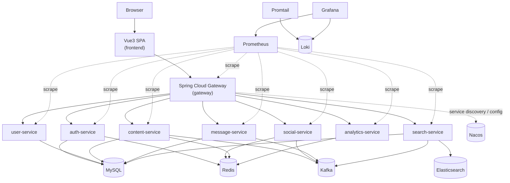

# 架构文档（与代码保持一致）

> 本文档以仓库当前实现为准，描述本项目的模块边界、运行拓扑、关键链路与可观测性。  
> 约定：本地默认采用“前端直连 gateway”模式（frontend `12881` / gateway `12882`）。

---

## 1. 总体架构（微服务 + 前后端分离）

---

## 2. 组件与职责边界

### 2.1 前端（`frontend/`）
- 技术栈：Vite + Vue3 + Vue Router + Pinia + Axios
- 运行形态（本地 compose）：容器内执行 `vite build` 后用 `vite preview` 对外提供静态站点（端口 `12881`）。
- API 调用策略：
  - 优先使用 `VITE_API_BASE_URL`（如配置）。
  - 否则在 `localhost/127.0.0.1:12881` 场景默认推导 API 基址为 `http://<host>:12882`（详见 `frontend/src/api/http.js`）。

### 2.2 网关（`gateway/`）
- 技术栈：Spring Cloud Gateway + Spring Security
- 职责：
  - 统一入口：对外暴露 `/api/**`，路由到各微服务
  - 统一能力：CORS、JWT 验签、统一错误返回、traceId 透传、审计日志、限流
  - 服务治理：通过 Nacos Discovery + Spring Cloud LoadBalancer 解析 `lb://{service}`
- 路由（以 `gateway/src/main/resources/application.yml` 为准）：
  - `/api/auth/**` → `lb://auth-service`
  - `/api/search/**` → `lb://search-service`
  - `/api/notices/**`、`/api/messages/**` → `lb://message-service`
  - `/api/analytics/**` → `lb://analytics-service`
  - `/api/likes/**`、`/api/follows/**` → `lb://social-service`
  - `/api/users/**` → `lb://user-service`
  - `/api/posts/**` → `lb://content-service`

### 2.3 业务微服务（`*-service/`）
- auth-service：登录/刷新/登出/验证码/注册与激活（JWT access + refresh cookie）
- user-service：用户资料与用户域能力（头像等扩展依赖七牛配置）
- content-service：帖子/评论等内容域；并负责发布内容相关事件
- social-service：点赞/关注关系等社交域（Redis 为主要存储介质之一）
- message-service：私信与通知（消费事件，生成通知）
- search-service：搜索域（Elasticsearch 索引 + reindex 能力；消费事件更新索引；默认 `search.storage=es`，CI/本地测试可显式切到 `memory`）
- analytics-service：UV/DAU 等统计能力（由 gateway 采集或事件驱动写入）

### 2.4 common（`common/`）
- 统一响应结构 `Result<T>`、错误码、全局异常处理
- traceId 工具与 Filter（便于跨服务关联日志）

---

## 3. 运行拓扑与端口规划（本地 docker compose）

### 3.1 Compose 文件分工
- `deploy/docker-compose.yml`：基础全栈（依赖 + 全微服务 + 观测栈）；默认不把依赖端口暴露到宿主机。
- `deploy/docker-compose.frontend-direct.yml`：前端直连模式（暴露 frontend `12881` 与 gateway `12882`）。
- `deploy/docker-compose.ports.yml`：仅暴露观测/日志入口（Grafana/Loki/Prometheus/Alertmanager，端口 `12883+`）。

### 3.2 对外暴露端口（默认推荐）
- frontend：`http://localhost:12881`
- gateway：`http://localhost:12882`

### 3.3 观测/日志端口（可选开启）
- Grafana：`http://localhost:12883`（默认账号密码 `admin/admin`）
- Loki：`http://localhost:12884`
- Prometheus：`http://localhost:12885`
- Alertmanager：`http://localhost:12886`

> 说明：Redis/MySQL/Nacos/ES/Kafka 等内部依赖默认不暴露宿主机端口，避免误暴露与端口冲突。

---

## 4. 关键请求链路（端到端）

### 4.1 典型读路径：帖子列表
1. 浏览器请求 `http://localhost:12881`
2. 前端通过 Axios 请求 `http://localhost:12882/api/posts?order=latest&page=0&size=10`
3. gateway 校验 JWT（若需要）并路由到 `content-service`
4. `content-service` 查询 MySQL/Redis 组装结果，返回到 gateway，再返回给前端

### 4.2 典型写路径：发帖 → 事件 → 搜索/通知更新（最终一致）
1. 前端 `POST /api/posts`
2. `content-service` 写入主存储后发布 Kafka 事件
3. `search-service`/`message-service` 消费事件，异步更新 ES 索引/通知
4. 读侧可能存在短暂延迟（允许最终一致窗口）

---

## 5. 可观测性与日志检索

### 5.1 日志
- 采集：Promtail 读取 Docker 容器 json log（见 `deploy/observability/promtail-config.yml`）
- 存储：Loki
- 检索：Grafana → Explore → 选择 Loki（可按关键字检索）

建议的检索线索：
- traceId：网关注入并透传 `X-Trace-Id`，便于跨服务串联
- 审计日志：gateway 会对非 GET 的 `/api/**` 打印审计日志（前缀 `"[audit][gateway]"`）

### 5.2 指标与告警
- Prometheus 抓取各服务 `/actuator/prometheus`（见 `deploy/observability/prometheus.yml`）
- Alertmanager 接收告警（规则见 `deploy/observability/alerts.yml`）
- Grafana 预置数据源：Prometheus + Loki（见 `deploy/observability/grafana/provisioning/datasources/datasources.yml`）

---

## 6. 本地启动（推荐方式）

1. 准备环境变量：
   - `cp deploy/.env.example deploy/.env`
2. 启动（前端直连网关）：
   - `docker compose -f deploy/docker-compose.yml -f deploy/docker-compose.frontend-direct.yml --env-file deploy/.env up -d --build`
3. （可选）开启观测/日志端口：
   - `docker compose -f deploy/docker-compose.yml -f deploy/docker-compose.frontend-direct.yml -f deploy/docker-compose.ports.yml --env-file deploy/.env up -d --build`

---

## 7. 与代码一致性的检查清单（建议）
- 路由表：以 `gateway/src/main/resources/application.yml` 为准（`/api/** -> lb://{service}`）
- 端口：以 `deploy/docker-compose.frontend-direct.yml` 与 `deploy/docker-compose.ports.yml` 为准
- 观测：以 `deploy/observability/*` 与 `deploy/docker-compose.yml` 为准
