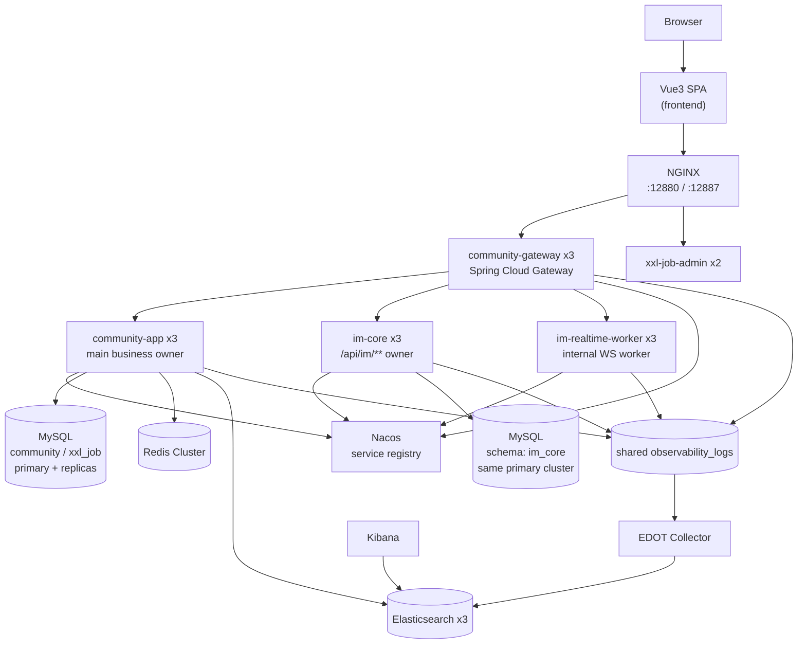

# 架构文档（与代码保持一致）

> 本项目当前形态：**Maven 多模块后端**，其中 `community-app` 是包级单体（Package-Scoped Monolith），`community-gateway` 负责统一入口，IM 保留独立运行模块。  
> 默认对外业务入口为本地 `NGINX` ingress（compose 映射为 `12880`），再转发到 `community-gateway` 副本池；`xxl-job-admin` 控制面则经 `NGINX :12887` 暴露。
> 业务服务之间的注册发现由三节点 `Nacos` 集群承担：`community-gateway` 的 HTTP 路由走 Spring Cloud Gateway `lb://serviceId`，`/ws/im` worker 列表也由 Nacos metadata 提供。
> `community-app` 继续作为主业务单体 owner，IM 作为独立服务保留：`im-realtime`（worker）与 `im-core`（HTTP）。
> 对外 API 前缀稳定：`/api/**`；静态文件前缀稳定：`/files/**`。  
>
> 约定：本文档中的命令与路径默认以**仓库根目录**作为工作目录（除非特别说明）。

---

## 0. 边界 / SSOT 总表（速查）

> 目的：用一张表快速对齐“谁暴露 API / 谁 owns 数据 / 谁做鉴权（JWT 验签 + 授权矩阵）”。
>
> 说明：MySQL 当前并非单一 schema：主站业务默认使用 `community`，IM 私信数据使用独立 `im_core`；但**数据所有权（SSOT）仍按模块划分**；
> 约束上当前应以“禁止跨模块 JOIN、跨模块同步协作默认通过 owner-domain `api.query` / `api.action` / `api.model` 回源拿数据”为目标边界，并继续收敛剩余迁移期调用点，避免演化为“大泥球”。

| 能力/域 | 对外 API（入口） | 数据/状态 SSOT（owner） | 鉴权/授权 SSOT（执行位置） |
| --- | --- | --- | --- |
| 统一入口（edge） | `community-gateway`：`/api/**`、`/files/**`、`/ws/im` | - | `community-gateway`：统一 CORS、traceId、HTTP/WS 路由、基础限流与灰度骨架 |
| 认证与会话（auth） | `community-gateway -> community-app`：`/api/auth/**` | refresh token：`user` 模块（MySQL `auth_refresh_token`）；验证码/重置码：`auth` 模块（Redis） | `community-app` SecurityFilterChain（JWT resource server）；cookie 会话入口额外 OriginGuard |
| 身份域（user） | `community-app`：`/api/users/**`、`/files/**` | `user` 模块（MySQL `user` 等） | `community-app` SecurityFilterChain（`/api/users/admin/**` 强制 ADMIN） |
| 内容域（content） | `community-app`：`/api/posts/**`、`/api/categories/**`、`/api/tags/**`、`/api/reports/**`、`/api/moderation/**` | `content` 模块（MySQL + Redis 缓存） | `community-app` SecurityFilterChain（写接口需登录；审核/置顶/加精/删除需 ADMIN/MODERATOR） |
| 社交域（social） | `community-app`：`/api/likes/**`、`/api/follows/**`、`/api/blocks/**` | `social` 模块（MySQL/Redis，见 `social.storage`） | `community-app` SecurityFilterChain（部分 GET 允许匿名） |
| 通知域（notice） | `community-app`：`/api/notices/**` | `community-app` notice owner；复用 `message` 表承载站内通知语义 | `community-app` SecurityFilterChain |
| IM 私信域（private message） | `community-im`：`/api/im/**`、`/ws/im` | `community-im` / `im-core`（MySQL `im_core` schema） | `im-realtime`/`im-core` 各自 Security 配置；浏览器入口仍经 `community-gateway` |
| IM 治理（private message governance） | `community-app`：`/api/im-governance/private-messages/validate` | `community-app` 治理规则（用户、拉黑、处罚等业务判定） | `community-app` SecurityFilterChain |
| 搜索域（search） | `community-app`：`/api/search/**` | `search` 模块（Elasticsearch + 幂等表） | `community-app` SecurityFilterChain（读 permitAll；reindex 走 `/api/ops/**`） |
| 分析域（analytics） | `community-app`：`/api/analytics/**` | `analytics` 模块（Redis） | `community-app` SecurityFilterChain（ADMIN/MODERATOR） |
| 运维平面（ops） | `community-app`：`/api/ops/**` | -（触发跨模块动作，如 reindex） | `community-app` SecurityFilterChain（ADMIN-only） |

---

## 1. 总体架构（多模块后端 + 前后端分离）

补充说明：
- **主业务 owner**：`community-app` 承载主站业务域与统一安全装配。
- **独立入口层**：浏览器 / 客户端先到本地 `NGINX`，再进入 `community-gateway` 副本池；`community-gateway` 负责 HTTP / WS 路由与边缘策略。
- **服务发现**：`community-gateway`、`community-app`、`im-core`、`im-realtime-worker` 都向三节点 `Nacos` 集群注册；HTTP 平面使用 Spring Cloud Gateway `lb://serviceId`，WS 平面使用 discovery metadata 生成 worker URI。
- **独立 IM 聚合**：顶层模块 `community-im` 负责组织 `im-common`、`im-core`、`im-realtime` 三个 IM 子模块。
- **包级边界**：领域仍按 `com.nowcoder.community.auth`、`content`、`social`、`search` 等顶层包组织；域内默认按 Spring Boot 分层思路组织（controller/service/dto/entity/mapper），安全/事件/错误码也按职责落在各自域包内。

---

## 2. 组件与职责边界

### 2.1 前端（仓库根：`frontend/`）
- 技术栈：Vite + Vue3 + Vue Router + Pinia + Axios
- 运行形态（本地 compose）：容器内执行 `vite build` 后用 `vite preview` 对外提供静态站点（端口 `12881`）。
- API 调用策略：
  - 优先使用 `VITE_API_BASE_URL`（如配置）。
  - 否则在 `localhost/127.0.0.1:5173|12881|12890|12888` 场景默认推导 API / IM HTTP 基址为 `http://<host>:12880`、IM WebSocket 为 `ws(s)://<host>:12880/ws/im`；其中 `12890` 是当前文档化的 Mock Data Studio compose 宿主机默认端口，`12888` 保留为 legacy/custom 兼容（详见 `frontend/src/api/http.js`、`frontend/src/api/imCoreHttp.js`、`frontend/src/im/imRealtimeClient.js`）。
  - 非本地部署默认回落为 same-origin，相对路径仍由 edge / ingress 处理。

### 2.2 主业务单体入口（`backend/community-app/`）
- 主业务 deployable：`community-app`（`mvn -pl :community-app -am package`）
- 同一后端仓库内另有独立 deployable：`community-gateway`、`im-core`、`im-realtime`
- 组装方式：
  - `CommunityAppApplication` 统一 `@ComponentScan(basePackages="com.nowcoder.community")`
  - 排除各模块历史的 `@SpringBootApplication`（防止“多入口同时启动”）
- 统一基础设施（一个进程/一份配置）：
  - 单一 `spring.datasource`（MySQL schema `community`）
  - Redis / Elasticsearch（按需启用）
- 统一对外安全边界：`backend/community-app/.../CommunitySecurityConfig`
  - 对外路径稳定：`/api/**`、`/files/**`
  - `/api/ops/**` ADMIN-only（对高成本入口集中收敛）
  - 在 gateway-first 形态下，`community-app` 不再直接面向浏览器默认流量，而是作为 `community-gateway` 的 HTTP upstream。

### 2.3 领域包（以包为边界）

`community-app` 内的主站领域能力位于 `backend/community-app/` 包树下；IM owner 则保留在独立 `community-im` 模块（`im-realtime`、`im-core`、`im-common`），不再由 `community-app` 的 message 包承担：
- `com.nowcoder.community.auth`：登录/刷新/登出、验证码、注册/激活、找回密码、登录风控
- `com.nowcoder.community.user`：用户资料、角色管理、头像上传与文件服务
- `com.nowcoder.community.content`：帖子/评论/回复、审核、举报、内容分数刷新
- `com.nowcoder.community.social`：点赞、关注、拉黑
- `com.nowcoder.community.notice`：站内通知对外 API、通知投影与已读语义
- `com.nowcoder.community.message`：通知底层 DTO / entity / `message` 表模型（仅承载 notice 语义，不再 owner 私信 API）
- `com.nowcoder.community.im`：IM 治理校验入口（`/api/im-governance/private-messages/validate`）
- `com.nowcoder.community.search`：搜索投影（ES）
- `com.nowcoder.community.analytics`：统计/分析
- `com.nowcoder.community.ops`：运维平面（`/api/ops/**`）

跨域同步协作统一通过 owner-domain 暴露的 `api.query`、`api.action`、`api.model` 完成；跨域异步协作统一通过 owner-domain 暴露的 `contracts.event` 完成。`service`、`entity`、`mapper` 以及 producer 域的 `event` 实现包均视为域内实现细节，不再作为默认跨域入口。当前分支上的 `DomainBoundaryArchTest` 与 `ControllerBoundaryArchTest` 已默认绿色；其中同步边界采用 allowlist 规则，遗留的非协作面依赖通过精确类名 migration baseline 冻结，后续只允许收缩不允许扩散。

需要明确的是：`community-app` 仍然是“靠包边界治理的单 deployable”，还不是靠 Maven 子模块强制执行的 modular monolith。当前阶段先稳定 use-case owner、projection owner 和 event contracts；下一阶段才考虑把 `api` / `contracts` / `impl` 拆成独立 artifact，并收紧 Spring 装配范围。

### 2.3.1 域内数据访问策略

`community-app` 对“跨域协作边界”和“域内持久化方式”采用两层规则：

- 跨域协作一律通过 owner-domain `api.query` / `api.action` / `api.model` / `contracts`；
- 域内持久化默认允许 owner-domain service 直接依赖本域 MyBatis mapper。

Repository / port 不是默认必选层，只有在下面场景才引入：

- 同一领域存在多套后端实现，需要按配置切换；
- 写路径存在后端特有的原子性、补偿或一致性语义；
- 测试需要可替换的内存实现，覆盖真实业务行为而不是只 mock mapper。

当前代码按这个规则解释如下：

- `content` / `user` / `growth` / `notice` 以单一 MyBatis SSOT 为主，`Service -> Mapper` 是合法默认路径；
- `social` 写侧存在 `DB / Redis / InMemory` 三套实现，因此保留 `Service -> Repository -> Adapter`；
- 一旦引入 repository，存储选择与补偿策略必须停留在 repository / adapter 抽象内，不再泄漏到 service 通过读取 `*.storage` 配置做分支判断。

### 2.4 共享基础设施（同模块内包）
- `com.nowcoder.community.common.*`：错误码、业务异常、trace、统一 Web 响应、通用事件 envelope 等横切能力
- `com.nowcoder.community.infra.*`：安全、trace、web、idempotency、scheduler、job（XXL executor handler）等横切能力
- `com.nowcoder.community.app.*`：启动入口与装配代码

---

## 3. 运行拓扑与端口规划（本地 docker compose）

### 3.1 Compose 文件分工（以 `deploy/README.md` 为准）
- `deploy/compose.yml` + 8 个 `deploy/compose.infra.*.yml` 文件 + 6 个 `deploy/compose.runtime.*.yml` 文件：组成默认本地 HA 演练栈（frontend + `NGINX` + `community-gateway x3` + `community-app x3` + IM + MySQL 主从 + Redis Cluster + Kafka KRaft / Elasticsearch 多节点 + `xxl-job-admin x2`），默认暴露统一业务入口 `12880`、前端 `12881`、Nacos 检查入口 `18848`、MailHog UI `8025`、XXL-JOB Admin `12887`、`mock-data-studio` 主机端口 `12890`（仅本机），依赖端口仍不暴露（fail-closed）。
- `deploy/compose.observability.yml`：可选 observability overlay，提供 Elasticsearch localhost 入口 / Kibana / EDOT collector；默认三层下 backend services 会把结构化 JSON 日志写入共享 `observability_logs` volume，因此只叠加这个 overlay 也能得到 fielded logs。

### 3.2 对外暴露端口（默认推荐）
- NGINX 统一业务入口：`http://localhost:12880`
- frontend：`http://localhost:12881`
- MailHog UI（dev mailbox）：`http://localhost:8025`（仅本机）
- NGINX XXL-JOB Admin 入口：`http://localhost:12887/xxl-job-admin`（仅本机）

### 3.2.1 本地 HA 关键形态
- `community-gateway`：3 副本，由 `NGINX` 统一接入
- `community-app`：3 副本，通过 `community-gateway` 的 `lb://community-app` 路由访问
- `im-core`：3 副本，通过 `community-gateway` 的 `lb://im-core` 路由和 `im-realtime` 的 service-id client 访问
- `im-realtime`：3 副本，以 `im-realtime-worker` 服务名注册到 Nacos，并由 gateway worker registry 发现
- `Nacos`：单节点服务注册中心，本机检查入口 `http://localhost:18848/nacos`
- MySQL：`mysql-primary` + `mysql-replica-1/2`；当前只承诺人工切主，不承诺自动写切换
- Redis：`redis-1..6`，由 `redis-cluster-bootstrap` 组装成 `3 主 + 3 从`
- Kafka：`kafka-1..3`（KRaft combined mode）+ `kafka-init`
- Elasticsearch：`elasticsearch-1..3` + `es-init`
- XXL：`xxl-job-admin-1/2` 共用 `xxl_job` schema，经 `NGINX` 暴露单一入口

### 3.3 观测/日志端口（可选开启）
- Elasticsearch localhost 入口（observability）：`http://localhost:12888`
- Kibana（observability）：`http://localhost:12889`

> 说明：Redis/MySQL/ES 等内部依赖默认不暴露宿主机端口，避免误暴露与端口冲突。

---

## 4. 关键请求链路（端到端）

### 4.1 典型读路径：帖子列表
1. 浏览器请求 `http://localhost:12881`
2. 前端通过 Axios 请求 `http://localhost:12880/api/posts?order=latest&page=0&size=10`
3. `community-gateway` 负责 CORS、traceId、路由判定，并通过 Spring Cloud Gateway `lb://community-app` 转发到 `community-app`
4. `community-app` SecurityFilterChain 按路径规则鉴权（匿名读放行，写接口需登录/角色）
5. `content` 模块查询 MySQL/Redis 组装结果并返回

### 4.2 典型写路径：发帖 → 本地编排 → 事件投影
1. 前端 `POST http://localhost:12880/api/posts`
2. `community-gateway` 将请求转发到 `community-app`
3. `content.controller.PostController` 通过 owner-domain 的 `content.api.action.PostPublishingActionApi` 进入写路径，当前由 `PostPublishingActionService` 负责参数清洗、幂等包装与命令编排
4. `PostCommandService` 在事务内写主存储并发布帖子领域事件，读路径仍通过 `content.api.query.*` 提供
5. 帖子领域事件继续驱动搜索、通知、积分等本地投影；跨域同步协作模型统一落在 `content.api.model` / `user.api.model` 等 owner-domain API 包下，跨域异步协作模型统一落在 `content.contracts.event` / `social.contracts.event`
6. 通知、积分、任务进度等投影的业务判定统一由 owner-domain projection service 负责（如 `NoticeProjectionService`、`PointsProjectionService`、`TaskProgressProjectionService`），`@TransactionalEventListener` 与 outbox adapter 只负责订阅、序列化和重试，避免本地监听与 outbox 双路径重复维护

### 4.3 典型后台运维路径：XXL-JOB 调度
1. 运维人员访问 `http://localhost:12887/xxl-job-admin`
2. `xxl-job-admin` 基于 `xxl_job` schema 管理任务定义、执行记录与调度状态
3. `community-app` 作为 phase 1 唯一 executor，注册 `pendingRegistrationUserCleanup` 与 `searchReindex`
4. 清理类/运维类离散任务通过 XXL handler 进入业务 service
5. 高频/持续 worker 仍保留在应用内：
   - `PendingRegistrationUserCleanupJob` 仅作为无 admin 的本地兜底
   - `PostScoreRefresher` 继续本地 `@Scheduled`
   - `OutboxWorkerScheduler` 继续本地 `@Scheduled`

---

## 5. 可观测性与日志检索

### 5.1 日志
- 采集：backend services 把结构化 JSON 日志写入共享 `observability_logs` volume
- 处理：EDOT collector 通过 `deploy/observability/edot-collector.yml` 从共享 volume 读取 filelog
- 存储 / 检索：Elasticsearch + Kibana

建议的检索线索：
- traceId：`community-app` 注入并透传 `X-Trace-Id`（便于串联一次请求内的日志）
- 审计日志：`backend/community-app/src/main/java/com/nowcoder/community/infra/web/AuditLogFilter.java` 会对非 GET 的 `/api/**` 打印审计日志（前缀类似 `"[audit][app=community-app]"`）

### 5.2 traces / metrics
- traces / metrics 通过 OTel -> EDOT collector -> Elastic
- 默认 `OTEL_ENABLED=false`，因此本地最小路径先保证 logs 可用；如需 traces / metrics，再显式打开 `OTEL_ENABLED=true`
- `/actuator/health|info` 仍保持本地排障友好；`/actuator/prometheus` 继续受应用自身安全配置约束，但当前本地 compose 不再额外挂载 Prometheus / Grafana stack

---

## 6. 本地启动（推荐方式）

1. 单机开发（推荐）：
   - `cp deploy/.env.dev.example deploy/.env.dev`
   - `./deploy/deployment.sh up --topology dev`
2. 本地 HA 演练（可选）：
   - `cp deploy/.env.ha.example deploy/.env.ha`
   - `./deploy/deployment.sh up --topology ha`
3. （可选）开启观测/日志端口：
   - observability：`./deploy/deployment.sh up --topology dev --observability`

默认访问方式：
- 页面入口：`http://localhost:12881`
- 统一 edge：`http://localhost:12880`
更完整的启动与运维说明见：`deploy/README.md`。

---

## 7. 与代码一致性的检查清单（建议）
- 对外入口与安全装配：以 `backend/community-app/src/main/java/.../CommunitySecurityConfig.java` 和各领域 `api/security/*SecurityRules.java` 为准
- 端口：以 `deploy/compose.yml` + `deploy/compose.infra.*.(dev|ha).yml` + `deploy/compose.runtime.*.(dev|ha).yml` 以及按需叠加的 `deploy/compose.*.yml` overlay 为准
- 观测：以 `deploy/observability/*`、`deploy/compose.observability.yml` 为准
