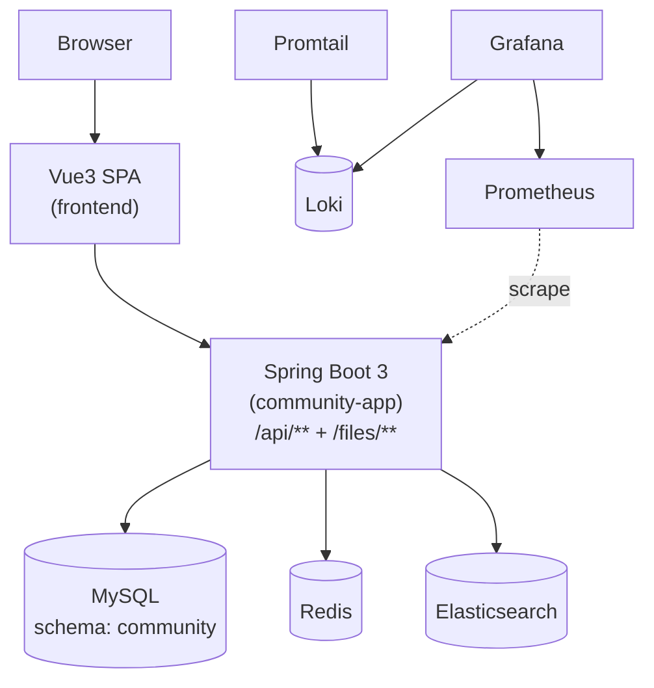

# 架构文档（与代码保持一致）

> 本项目当前形态：**单后端模块的包级单体（Package-Scoped Monolith）** + 前后端分离。  
> 对外业务入口为 `community-app`（Spring Boot 3，容器内默认 `8080`；本地 compose 映射为 `12882`）。  
> IM 作为独立服务保留：`im-realtime`（WebSocket，`18081`）与 `im-core`（HTTP，`18082`）。
> 对外 API 前缀稳定：`/api/**`；静态文件前缀稳定：`/files/**`。  
>
> 约定：本文档中的命令与路径默认以**仓库根目录**作为工作目录（除非特别说明）。

---

## 0. 边界 / SSOT 总表（速查）

> 目的：用一张表快速对齐“谁暴露 API / 谁 owns 数据 / 谁做鉴权（JWT 验签 + 授权矩阵）”。
>
> 说明：MySQL 已收敛为单一 schema（默认 `community`），但**数据所有权（SSOT）仍按模块划分**；
> 约束上建议保持“禁止跨模块 JOIN、跨模块通过聚焦的 service/dto 回源拿数据”，避免演化为“大泥球”。

| 能力/域 | 对外 API（入口） | 数据/状态 SSOT（owner） | 鉴权/授权 SSOT（执行位置） |
| --- | --- | --- | --- |
| 统一入口（edge） | `community-app`：`/api/**`、`/files/**` | - | `community-app`：统一 CORS；`/api/auth/login\|refresh\|logout` OriginGuard；统一异常/traceId/审计日志 |
| 认证与会话（auth） | `community-app`：`/api/auth/**` | refresh token：`user` 模块（MySQL `auth_refresh_token`）；验证码/重置码：`auth` 模块（Redis） | `community-app` SecurityFilterChain（JWT resource server）；cookie 会话入口额外 OriginGuard |
| 身份域（user） | `community-app`：`/api/users/**`、`/files/**` | `user` 模块（MySQL `user` 等） | `community-app` SecurityFilterChain（`/api/users/admin/**` 强制 ADMIN） |
| 内容域（content） | `community-app`：`/api/posts/**`、`/api/categories/**`、`/api/tags/**`、`/api/reports/**`、`/api/moderation/**` | `content` 模块（MySQL + Redis 缓存） | `community-app` SecurityFilterChain（写接口需登录；审核/置顶/加精/删除需 ADMIN/MODERATOR） |
| 社交域（social） | `community-app`：`/api/likes/**`、`/api/follows/**`、`/api/blocks/**` | `social` 模块（MySQL/Redis，见 `social.storage`） | `community-app` SecurityFilterChain（部分 GET 允许匿名） |
| 消息域（message） | `community-app`：`/api/messages/**`、`/api/notices/**` | `message` 模块（MySQL） | `community-app` SecurityFilterChain |
| 搜索域（search） | `community-app`：`/api/search/**` | `search` 模块（Elasticsearch + 幂等表） | `community-app` SecurityFilterChain（读 permitAll；reindex 走 `/api/ops/**`） |
| 分析域（analytics） | `community-app`：`/api/analytics/**` | `analytics` 模块（Redis） | `community-app` SecurityFilterChain（ADMIN/MODERATOR） |
| 运维平面（ops） | `community-app`：`/api/ops/**` | -（触发跨模块动作，如 reindex） | `community-app` SecurityFilterChain（ADMIN-only） |

---

## 1. 总体架构（单后端模块 + 前后端分离）

补充说明：
- **单体发布**：后端整体一起发布/回滚；因此“运行期耦合”是显式接受的取舍。
- **单体模块构建**：`community-bootstrap` 是主业务单体模块；IM 相关模块（`im-core`/`im-realtime`/`im-common`）独立构建与部署。
- **包级边界**：领域仍按 `com.nowcoder.community.auth`、`content`、`social`、`search` 等顶层包组织；域内默认按 Spring Boot 分层思路组织（controller/service/dto/entity/mapper），安全/事件/错误码也按职责落在各自域包内。

---

## 2. 组件与职责边界

### 2.1 前端（仓库根：`frontend/`）
- 技术栈：Vite + Vue3 + Vue Router + Pinia + Axios
- 运行形态（本地 compose）：容器内执行 `vite build` 后用 `vite preview` 对外提供静态站点（端口 `12881`）。
- API 调用策略：
  - 优先使用 `VITE_API_BASE_URL`（如配置）。
  - 否则在 `localhost/127.0.0.1:12881` 场景默认推导 API 基址为 `http://<host>:12882`（详见 `frontend/src/api/http.js`）。

### 2.2 后端单体入口（`backend/community-bootstrap/`）
- 唯一 deployable：`community-app`（`mvn -pl :community-bootstrap -am package`）
- 组装方式：
  - `CommunityBootstrapApplication` 统一 `@ComponentScan(basePackages="com.nowcoder.community")`
  - 排除各模块历史的 `@SpringBootApplication`（防止“多入口同时启动”）
- 统一基础设施（一个进程/一份配置）：
  - 单一 `spring.datasource`（MySQL schema `community`）
  - Redis / Elasticsearch（按需启用）
- 统一对外安全边界：`backend/community-bootstrap/.../CommunitySecurityConfig`
  - 对外路径稳定：`/api/**`、`/files/**`
  - `/api/ops/**` ADMIN-only（对高成本入口集中收敛）

### 2.3 领域包（以包为边界）

领域能力现在都位于 `backend/community-bootstrap/` 内部的包树下：
- `com.nowcoder.community.auth`：登录/刷新/登出、验证码、注册/激活、找回密码、登录风控
- `com.nowcoder.community.user`：用户资料、角色管理、头像上传与文件服务
- `com.nowcoder.community.content`：帖子/评论/回复、审核、举报、内容分数刷新
- `com.nowcoder.community.social`：点赞、关注、拉黑
- `com.nowcoder.community.message`：私信、通知
- `com.nowcoder.community.search`：搜索投影（ES）
- `com.nowcoder.community.analytics`：统计/分析
- `com.nowcoder.community.ops`：运维平面（`/api/ops/**`）

跨域协作默认通过对方的聚焦 service 或 domain-owned dto 完成；同 JVM 内部不再通过 `application`、`contracts.internal.*`、`ModuleCallSupport` 来模拟远程调用。

### 2.4 共享基础设施（同模块内包）
- `com.nowcoder.community.common.*`：错误码、业务异常、trace、统一 Web 响应、通用事件 envelope 等横切能力
- `com.nowcoder.community.infra.*`：安全、trace、web、idempotency、scheduler 等横切能力
- `com.nowcoder.community.bootstrap.*`：启动入口与装配代码

---

## 3. 运行拓扑与端口规划（本地 docker compose）

### 3.1 Compose 文件分工（以 `deploy/README.md` 为准）
- `deploy/docker-compose.yml`：业务必需全栈（frontend + `community-app` + IM + MySQL/Redis/Kafka/ES + MailHog），默认暴露业务入口端口（`12881/12882/18081/18082`）与 MailHog UI（`8025`，仅本机），但不暴露依赖端口（fail-closed）。
- `observability` profile：可选观测/日志栈（Prometheus/Grafana/Loki/Promtail/Alertmanager），默认仅绑定到 `127.0.0.1` 暴露端口（`12883+`）。

### 3.2 对外暴露端口（默认推荐）
- frontend：`http://localhost:12881`
- backend（community-app）：`http://localhost:12882`
- IM Realtime（WebSocket）：`ws://localhost:18081/ws/im`
- IM Core（HTTP）：`http://localhost:18082`
- MailHog UI（dev mailbox）：`http://localhost:8025`（仅本机）

### 3.3 观测/日志端口（可选开启）
- Grafana：`http://localhost:12883`（默认账号密码 `admin/admin`）
- Loki：`http://localhost:12884`
- Prometheus：`http://localhost:12885`
- Alertmanager：`http://localhost:12886`

> 说明：Redis/MySQL/ES 等内部依赖默认不暴露宿主机端口，避免误暴露与端口冲突。

---

## 4. 关键请求链路（端到端）

### 4.1 典型读路径：帖子列表
1. 浏览器请求 `http://localhost:12881`
2. 前端通过 Axios 请求 `http://localhost:12882/api/posts?order=latest&page=0&size=10`
3. `community-app` SecurityFilterChain 按路径规则鉴权（匿名读放行，写接口需登录/角色）
4. `content` 模块查询 MySQL/Redis 组装结果并返回

### 4.2 典型写路径：发帖 → 本地编排 → 事件投影
1. 前端 `POST /api/posts`
2. `content.service.PostFacadeService` 在本地完成参数清洗、幂等包装与命令调用
3. `PostCommandService` 在事务内写主存储并发布帖子领域事件
4. 帖子领域事件目前仍通过桥接层进入既有事件发布链路，用于搜索/通知等投影；reindex 等运维动作已收敛为单进程 single-flight 协调

---

## 5. 可观测性与日志检索

### 5.1 日志
- 采集：Promtail 读取 Docker 容器 json log（见 `deploy/observability/promtail-config.yml`）
- 存储：Loki
- 检索：Grafana → Explore → 选择 Loki

建议的检索线索：
- traceId：`community-app` 注入并透传 `X-Trace-Id`（便于串联一次请求内的日志）
- 审计日志：`backend/community-bootstrap/src/main/java/com/nowcoder/community/infra/web/AuditLogFilter.java` 会对非 GET 的 `/api/**` 打印审计日志（前缀类似 `"[audit][app=community-app]"`）

### 5.2 指标与告警
- Prometheus 抓取 `community-app` 的 `/actuator/prometheus`（见 `deploy/observability/prometheus.yml`）
  - `/actuator/health|info` 默认 permitAll
  - `/actuator/prometheus` 需要 basic-auth（ROLE_PROMETHEUS），密码缺失会 fail-closed
- Alertmanager 接收告警（规则见 `deploy/observability/alerts.yml`）
- Grafana 预置数据源：Prometheus + Loki（见 `deploy/observability/grafana/provisioning/datasources/datasources.yml`）

---

## 6. 本地启动（推荐方式）

1. 准备环境变量：`cp deploy/.env.example deploy/.env`
2. 启动（前端直连后端单体）：
   - `docker compose -f deploy/docker-compose.yml --env-file deploy/.env up -d --build`
3. （可选）开启观测/日志端口：
   - 在 `deploy/.env` 中添加 `COMPOSE_PROFILES=observability`，然后执行：`docker compose -f deploy/docker-compose.yml --env-file deploy/.env up -d`

更完整的启动与运维说明见：`deploy/README.md`。

---

## 7. 与代码一致性的检查清单（建议）
- 对外入口与安全装配：以 `backend/community-bootstrap/src/main/java/.../CommunitySecurityConfig.java` 和各领域 `api/security/*SecurityRules.java` 为准
- 端口：以 `deploy/docker-compose.yml`（业务 + observability profile）为准
- 观测：以 `deploy/observability/*` 与 `deploy/docker-compose.yml`（observability profile 的 service 定义）为准
