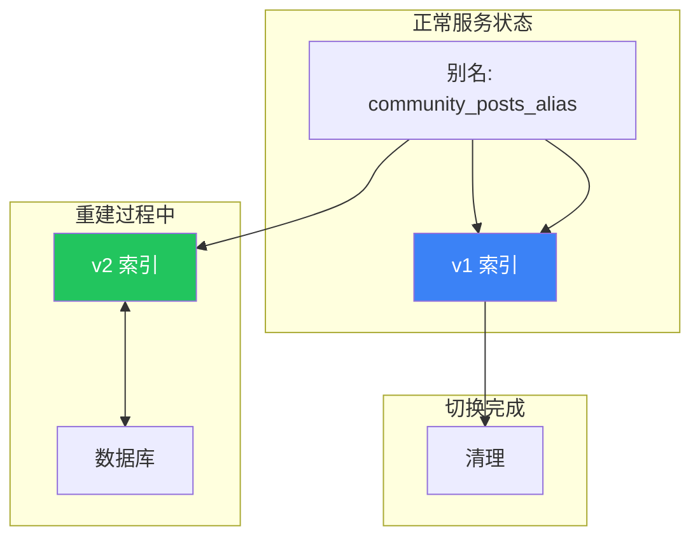

# Elasticsearch 实现架构与工作原理

本文档描述本项目Elasticsearch搜索引擎的设计实现、工作流程与架构特点。

---

## 1. 总体架构设计

本项目采用**可插拔搜索引擎架构**，Elasticsearch是可选实现之一，通过Spring Boot条件注解开关控制：

```java
@ConditionalOnProperty(name = "search.storage", havingValue = "es")
```

同时提供内存版实现(`InMemoryPostSearchRepository`)用于开发环境调试与单元测试，无需启动ES实例。

---

## 2. 索引设计：蓝绿部署模式

### 2.1 什么是ES蓝绿部署？
传统ES索引重建存在的问题：
- ❌ 重建过程中索引不可用，服务中断
- ❌ 重建失败会导致数据丢失或损坏
- ❌ 无法回滚到之前的版本

✅ **蓝绿部署是零停机索引重建方案**：
> 同时维护两个版本的索引："蓝"是当前正在服务的索引，"绿"是正在后台重建的新索引。重建完成后只需要原子切换别名，流量就会无感知的切到新索引。全程对外服务不中断，失败可以随时回滚。


> 🔵 v1 为当前服务的蓝索引 | 🟢 v2 为后台重建的绿索引

### 2.2 核心设计思想
**业务代码永远只接触固定别名，绝对不直接操作真实索引**

| 角色 | 名称 | 说明 |
|------|------|------|
| 访问别名 | `community_posts_alias` | 业务代码唯一入口，所有读写都指向此别名 |
| 真实索引 | `community_posts_vN` | 版本化命名，v1, v2, v3... 每次重建递增版本号 |
| 版本前缀 | `community_posts_v` | 索引命名约定 |

### 2.3 别名原子切换实现
```java
public void switchAlias(String newIndexName) {
    AliasActions actions = new AliasActions()
        .add(
            AliasAction.Add.builder()
                .alias(INDEX_ALIAS)
                .indices(newIndexName)
                .build()
        );
    
    // ✅ 这是原子操作，ES保证要么全部成功要么全部失败
    operations.indexOps(IndexCoordinates.of("*")).alias(actions);
    
    // 切换成功后再删除旧索引
    deleteOldIndices();
}
```

> 💡 **关键点**：别名切换是ES的原子操作，中间没有任何时间窗口会出现找不到索引的情况，对调用方完全透明。

> ✅ **实现细节**：实际代码中并未使用 v1/v2/v3 数字版本，而是使用精确到秒的 UTC 时间戳命名，保证每次重建索引名称唯一且可追溯。同一秒内多次重建会自动追加 `_1`/`_2` 后缀避免冲突。

### 2.2 文档结构 (`EsPostDocument`)

| 字段 | 类型 | 说明 |
|------|------|------|
| postId | Integer | 业务主键，同时作为ES文档ID |
| userId | Integer | 发布用户ID |
| categoryId | Integer | 分类ID |
| tags | List<String> | Keyword类型，精确匹配 |
| title | String | 分词检索 |
| content | String | 分词检索 |
| type | Integer | 帖子类型 |
| status | Integer | 状态标记 |
| createTime | Long | 存储为毫秒时间戳，避免日期序列化问题 |
| score | Double | 热度排序分 |

> ✅ **最佳实践**：时间字段存储为原始毫秒数，彻底避免Spring Data Elasticsearch与Jackson日期转换不一致导致的查询报错。

---

## 3. 数据同步机制

### 3.1 实时增量同步流程


### 3.2 代码实现细节

#### 事件监听处理器
```java
// 对应实现：com.nowcoder.community.search.event.PostOutboxHandler
// ✅ 反乱序设计：从不信任事件载荷中的数据，永远以数据库当前状态为准
@Component
public class PostOutboxHandler implements OutboxHandler {

    @Override
    public void handle(OutboxEvent event) {
        PostOutboxPayload payload = deserialize(event.payload());
        int postId = payload.getPostId();
        
        // 关键：直接从数据库读取最新状态，而不是使用事件中的数据
        PostProjectionView projection = postScanQueryApi.getPostProjectionAllowDeleted(postId);
        
        if (projection == null || projection.status() == 2) {
            postSearchRepository.delete(postId); // 已删除则从ES移除
        } else {
            postSearchRepository.upsert(toPayload(projection)); // 否则写入最新状态
        }
    }
}
```

> ✅ **核心设计**：彻底解决分布式系统事件乱序问题。即使收到"创建→删除→更新"乱序事件，最终永远以数据库真实状态为准，不会出现"已删除帖子复活"的情况 `PostOutboxHandler.java:61`

#### ES写入实现
```java
@Override
public void upsert(PostPayload post) {
    EsPostDocument doc = toDocument(post);
    if (doc == null) {
        return;
    }
    // 通过 alias 写入，自动路由到当前活跃索引（EsPostDocument 的 @Document indexName=INDEX_ALIAS）
    operations.save(doc);
}
```

### 3.3 可靠性保证
1.  **Outbox模式**：所有变更事件先写入数据库Outbox表，事务提交后才会投递，保证事件不丢失
2.  **至少一次投递**：通过 `OutboxWorkerScheduler`（Spring `@Scheduled` 轮询）+ `tryClaimProcessing`（DB 状态机 + 处理 lease）实现多实例安全消费
3.  **幂等处理**：`upsert` 天然幂等；同时搜索投影会基于当前 DB 状态投影，避免乱序事件导致“复活删除内容”
4.  **失败重试**：失败事件会回退为 `PENDING` 并写入 `next_retry_at`，`OutboxWorker` 采用指数退避与最大重试次数
5.  **租约恢复**：`recoverExpiredLeases` 会回收超时的 `PROCESSING` 事件，避免 worker 崩溃导致永久卡住

---

## 4. 全量索引重建机制

### 4.1 零停机重建流程

```
1. 触发重建请求
2. 获取Redis分布式锁，保证单实例运行
3. 生成新版本索引名称 community_posts_vYYYYMMDDHHmmss `PostIndexManager.java:57`
4. 创建新索引并应用最新Mapping
5. 启动后台心跳线程自动续期锁 `ReindexJobService.java:78`
6. 全量扫描数据库帖子表（游标分页避免深翻页）
7. 批量写入新版本索引（不影响当前服务）
8. ✅ 原子操作：将别名从旧索引切换到新索引
9. 后台异步清理超过保留数量的旧版本索引
10. 释放分布式锁
```

### 4.2 关键特点
- ✅ 对外服务零中断：切换别名是原子操作，毫秒级完成
- ✅ 重建过程中旧索引继续正常服务
- ✅ **Redis分布式锁**：通过Redis保证同一时间只允许一个重建任务运行 `ReindexJobService.java:47`
- ✅ **自动心跳续期**：重建任务启动后台线程自动续期锁，防止长任务超时导致锁丢失 `ReindexJobService.java:62`
- ✅ 失败安全：重建失败不会影响现有服务
- ✅ 支持手动触发与定时调度

### 4.3 历史索引保留机制
```java
// 保留最近N个历史索引，便于快速回滚
@Value("${search.index.keep-history:2}") int keepHistory
```

> ✅ **实现细节**：默认保留最近2个历史索引，重建完成后自动清理更早的版本。如需回滚，只需手动将别名切回上一个版本即可 `PostIndexManager.java:103`

---

## 5. 搜索查询实现

### 5.1 查询能力
| 功能 | 实现说明 |
|------|----------|
| 全文检索 | 对标题、内容字段进行分词模糊匹配 |
| 分类过滤 | categoryId 精确匹配 |
| 标签过滤 | 自动处理#前缀，精确匹配标签 |
| 排序策略 | 优先按热度分(score)降序，其次按创建时间降序 |
| 分页安全 | 限制单页最大50条，防止深度分页攻击 `ElasticsearchPostSearchRepository.java:77` |
| 关键词高亮 | 对匹配关键词自动添加高亮标记 |

#### 查询实现代码
```java
@Override
public List<SearchPostItem> search(String keyword, Integer categoryId, String tag, int page, int size) {
    int s = Math.min(50, Math.max(1, size)); // 强制限制最大50条
    
    Criteria criteria;
    if (StringUtils.hasText(keyword)) {
        criteria = new Criteria("title").contains(keyword).or(new Criteria("content").contains(keyword));
    } else {
        criteria = new Criteria("postId").exists(); // 无关键词时match-all降级
    }
    
    // 叠加分类、标签过滤条件
    if (categoryId != null) criteria = criteria.and("categoryId").is(categoryId);
    if (tag != null) criteria = criteria.and("tags").is(tag);
    
    // 排序：score DESC, createTime DESC
    query.addSort(Sort.by(Sort.Order.desc("score"), Sort.Order.desc("createTime")));
    
    return operations.search(query, EsPostDocument.class);
}
```

> ✅ **降级策略**：当没有搜索关键词时，自动退化为 Match All 查询，完美兼容纯分类/标签过滤场景 `ElasticsearchPostSearchRepository.java:86`

### 5.2 降级策略
当没有提供搜索关键词时，自动退化为 Match All 查询，兼容纯分类/标签过滤场景。

---

## 6. 运维管理

### 6.1 管理接口
| 接口 | 说明 |
|------|------|
| `POST /api/ops/search/reindex` | 手动触发全量重建 |
| 定时触发 | 可由外部调度器/脚本定时调用该接口（或通过平台任务触发） |

### 6.2 监控与观测
- 完整的日志埋点
- 索引重建进度跟踪
- 异常告警集成

---

## 7. 架构最佳实践

本项目ES集成体现了以下工业级设计原则：

### ✅ 故障隔离
ES集群完全故障不会导致主站不可用，业务读写不受影响

### ✅ 无阻塞架构
所有ES操作100%异步化，不阻塞数据库事务，不影响用户请求响应时间

### ✅ 平滑升级
索引结构变更、Mapping更新不需要停机，通过版本化索引+别名切换实现灰度发布

### ✅ 可测试性
内存版实现支持完整单元测试、集成测试，不需要外部依赖

### ✅ 最终一致性
在性能与一致性之间取得合理平衡，保证数据最终同步到ES

---

## 8. 部署配置

### 完整配置项
```yaml
search:
  storage: es                          # 启用ES实现，可选: es/in_memory（可选：es
  index.prefix: community_posts_v       # 索引名称前缀
  index.keep-history: 2                 # 保留历史索引数量，默认2
  reindex.lock-ttl: 30m              # 重建任务锁超时时间
  scan.page-size: 1000                # 全量重建分页大小
```

### 集群模式
支持ES集群部署，通过Spring Data Elasticsearch标准配置连接。
