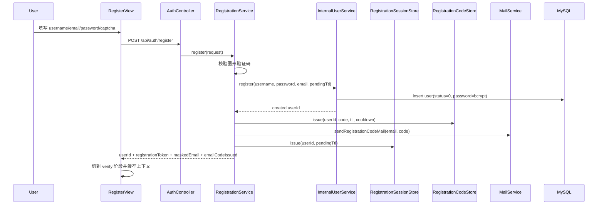
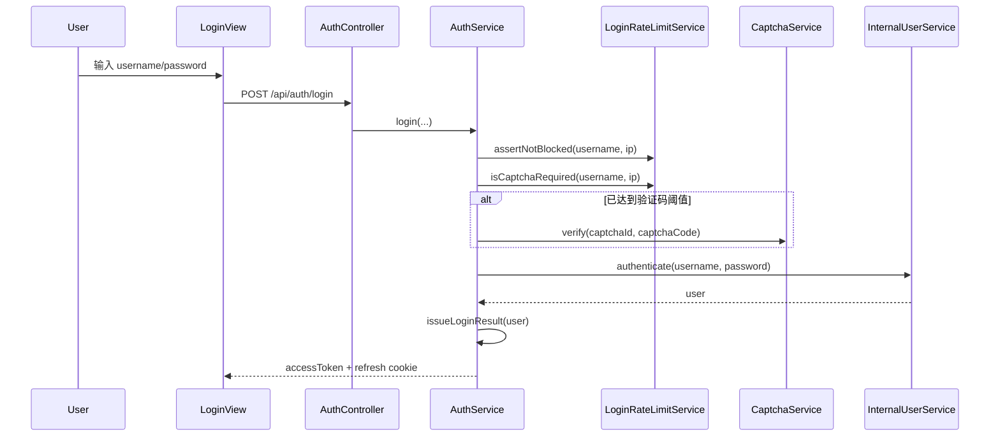

# 认证注册登录链路实现说明

本文档说明当前仓库中认证相关能力的实际实现路径，聚焦以下问题：

- 注册请求从哪里进入系统
- 用户何时被创建，何时算“已激活”
- 邮箱验证码如何签发、重发、校验与消费
- 普通密码登录何时要求图形验证码
- access token 与 refresh token 如何签发、续期与撤销
- 前端页面与会话恢复逻辑如何配合后端接口工作

相关设计文档：

- `docs/superpowers/specs/2026-03-23-registration-email-code-login-design.md`

---

## 1. 参与组件

认证主链路涉及以下组件：

- 前端：注册页、登录页、Pinia auth store、Axios 拦截器、路由守卫
- `community-app`：
  - `AuthController`：公开认证接口入口
  - `RegistrationService`：注册与验证码签发
  - `RegistrationVerificationService`：验证码重发、验证、激活并自动登录
  - `AuthService`：密码登录、refresh、logout、统一签发登录态
  - `InternalUserService`：用户创建、密码校验、激活、角色映射
- Redis：
  - 图形验证码
  - 登录失败计数与验证码兜底
  - 注册邮箱验证码
- MySQL：
  - `user` 表保存用户主数据
  - `auth_refresh_token` 表保存 refresh token hash
- 邮件通道：
  - SMTP 发信
  - 本地/测试环境日志降级

---

## 2. 对外认证接口

当前 `AuthController` 暴露的核心接口包括：

- `POST /api/auth/login`
- `POST /api/auth/refresh`
- `POST /api/auth/logout`
- `GET /api/auth/me`
- `POST /api/auth/register`
- `POST /api/auth/register/code/resend`
- `POST /api/auth/register/code/verify`
- `GET /api/auth/captcha`
- `POST /api/auth/captcha/verify`

匿名放行接口包括：

- `login`
- `refresh`
- `register`
- `register/code/resend`
- `register/code/verify`
- `captcha`

`/api/auth/me` 与 `/api/auth/logout` 需要已有登录态。

---

## 3. 注册主链路

### 3.1 主时序图

### 3.2 详细步骤

注册请求入口是 `POST /api/auth/register`。

后端处理顺序如下：

1. `RegistrationService.register()` 校验请求体不能为空
2. 强制要求 `captchaId` 与 `captchaCode`
3. `CaptchaService.verify(...)` 校验图形验证码；成功后立即一次性消费
4. `InternalUserService.register(...)` 创建用户
5. 生成 6 位数字邮箱验证码
6. 通过 `RegistrationCodeStore.issue(...)` 写入验证码
7. 通过 `MailService.sendRegistrationCodeMail(...)` 发信
8. 创建并返回注册上下文：
   - 响应中包含 `userId`（调试/展示用）
   - **响应中包含 `registrationToken`（后续重发/验证使用）**

当前注册接口的行为不是“创建即可登录”，而是“创建待激活用户并进入邮箱验证阶段”。

### 3.3 用户创建细节

`InternalUserService.register(...)` 会先做 pending user 冲突清理：

- 如果同用户名或同邮箱下存在已过期、且 `status=0` 的未激活用户，会先删除
- 之后再重新检查用户名与邮箱唯一性

新建用户时的关键字段：

- `password`：`bcrypt`
- `salt`：空字符串
- `type=0`
- `status=0`
- `create_time=now`

这表示用户此时已经存在于 `user` 表中，但尚未完成邮箱验证。

### 3.4 待激活用户过期语义

待激活用户的 TTL 由 `auth.registration.pending-user.ttl-seconds` 控制，当前默认值为 `1800` 秒。

如果用户超时未完成验证：

- `getPendingRegistrationUser(...)` 会把它视为过期上下文
- 过期记录会被删除
- 后端返回“注册已过期，请重新注册”

此外，`PendingRegistrationUserCleanupJob` 还会周期性清理过期未激活用户。

---

## 4. 注册邮箱验证码链路

### 4.1 重发验证码

`POST /api/auth/register/code/resend` 用于重发注册验证码。

请求字段：

- `registrationToken`
- `captchaId`
- `captchaCode`

行为约束：

- 必须再次通过图形验证码
- 只允许对仍处于 pending 状态的用户重发
- 服务端有 resend cooldown，默认 `60` 秒
- 新验证码签发后，仅最后一次发送的验证码有效
- `registrationToken` 会在服务端解析为 `userId`（存储在 `RegistrationSessionStore`，TTL 与 pending user TTL 一致）

### 4.2 验证验证码并自动登录

`POST /api/auth/register/code/verify` 用于提交邮箱验证码。

请求字段：

- `registrationToken`
- `code`

后端处理顺序：

1. `RegistrationVerificationService.verifyAndLogin(...)` 校验参数
2. `registrationToken -> userId`（缺失/过期视为注册上下文失效）
3. 确认该用户仍然是未激活 pending user
4. `RegistrationCodeStore.verifyAndConsume(...)` 执行原子比对与消费
5. 成功后调用 `InternalUserService.activateUser(userId)`，把 `status` 更新为 `1`
6. 调用 `AuthService.issueLoginResult(user)` 签发登录态
7. 响应体返回 `accessToken`，并通过 `Set-Cookie` 写入 refresh cookie
8. best-effort 删除注册上下文（避免 token 被复用）

这条链路的关键点是：

- 验证成功即激活
- 激活成功即直接登录
- 不要求用户再回到登录页手动输入密码

### 4.3 验证码存储与消费语义

当前注册验证码默认使用 Redis 存储。

实现约束包括：

- 只保留最后一次发送的验证码
- 默认 TTL 为 `600` 秒
- 默认最大失败次数为 `3`
- 验证成功后立即删除
- 连续输错达到阈值后作废当前验证码
- 校验逻辑是原子的，避免并发下重复成功

---

## 5. 普通密码登录链路

### 5.1 主时序图

### 5.2 登录前置保护

`AuthService.login()` 在真正校验密码前，会先执行以下保护：

1. 解析客户端 IP
2. 用 `LoginRateLimitService.assertNotBlocked(...)` 做限流拦截
3. 根据失败计数决定当前是否要求图形验证码
4. 如果需要验证码但未提供，返回 `CAPTCHA_REQUIRED`
5. 如果验证码错误，返回 `CAPTCHA_INVALID`

当前默认阈值：

- `window-seconds = 60`
- `max-failures-per-ip = 20`
- `max-failures-per-user = 5`
- `captcha-required-failures-per-ip = 5`
- `captcha-required-failures-per-user = 2`

### 5.3 用户名密码校验

`InternalUserService.authenticate(...)` 承担用户名密码校验：

- 根据 `username` 查用户
- 用户不存在则返回 `INVALID_CREDENTIALS`
- 如果 `status == 0`，返回 `USER_DISABLED`
- 密码匹配失败则返回 `INVALID_CREDENTIALS`

当前系统仍然只支持“用户名 + 密码”登录，不支持邮箱密码登录。

### 5.4 密码格式兼容

密码校验支持两类存量数据：

- 新格式：`bcrypt`
- 老格式：`MD5(password + salt)`

如果用户还是老格式密码：

- 登录校验通过后
- 会自动把密码升级写回为 `bcrypt`

---

## 6. 登录态签发、续期与撤销

### 6.1 access token

`AuthService.issueLoginResult(user)` 会统一签发 access token。

当前 access token 的特点：

- 由 `JwtTokenService` 生成
- 默认 TTL 为 `900` 秒
- claims 包含：
  - `sub = userId`
  - `username`
  - `authorities`

### 6.2 refresh token

同一个 `issueLoginResult(...)` 调用还会签发 refresh token，并作为 cookie 下发。

当前 refresh cookie 特点：

- 名称：`refresh_token`
- `HttpOnly = true`
- path：`/api/auth`
- `SameSite = Lax`
- `secure` 由配置控制
- 默认 TTL：`604800` 秒

### 6.3 refresh token 持久化

当前 refresh token 默认落 MySQL：

- 配置：`auth.refresh.store = db`
- 表：`auth_refresh_token`

数据库中保存的是 `token_hash(SHA-256)`，不是明文 refresh token。

这样做的目的：

- 降低明文凭据落库风险
- 支持 rotate
- 支持按 family 撤销整组 refresh token

### 6.4 refresh

`POST /api/auth/refresh` 的处理顺序：

1. 从 cookie 中读取 refresh token
2. 校验其是否存在、是否过期、是否已撤销
3. 读取对应用户
4. 如果用户不存在或仍处于 `status=0`，则拒绝 refresh
5. 消费旧 refresh token
6. 在同一 family 下签发新的 refresh token
7. 重新签发新的 access token

### 6.5 logout

`POST /api/auth/logout` 的行为：

1. 从 cookie 中读取 refresh token
2. 撤销当前 token
3. 撤销该 token 所属 family
4. 回写一个 `maxAge=0` 的空 refresh cookie

---

## 7. 当前用户信息与角色模型

`GET /api/auth/me` 返回内容来自已通过校验的 JWT：

- `userId`
- `username`
- `authorities`

角色由 `user.type` 映射：

- `0 -> ROLE_USER`
- `1 -> ROLE_ADMIN`
- `2 -> ROLE_MODERATOR`

因为 `/me` 直接读 JWT claim，不是实时查库，所以角色变化通常要等下一次 access token 重新签发后才会反映出来。

---

## 8. 前端注册与登录页面行为

### 8.1 注册页

当前注册页 `RegisterView.vue` 是两段式流程：

- `form` 阶段：填写用户名、邮箱、密码、图形验证码
- `verify` 阶段：填写邮箱验证码，可重发验证码

注册成功后前端会：

- 切换到 `verify` 阶段
- 清空密码和图形验证码输入
- 展示 `maskedEmail`
- 如后端返回调试码，则展示 `debugEmailCode`

为了让用户刷新页面后还能继续验证，前端会把注册上下文写入 `localStorage`：

- key：`community.register.pending`
- value 包含：
  - `userId`
  - `registrationToken`
  - `emailCodeIssued`
  - `maskedEmail`
  - `debugEmailCode`

### 8.2 登录页

当前登录页初始只展示：

- 用户名
- 密码

当后端返回 `10005` 或 `10006` 时，前端才切换为显示图形验证码输入框，并重新请求验证码图片。

### 8.3 验证成功后的前端收口

无论是普通登录成功，还是“注册验证码验证成功并自动登录”，前端收口逻辑都是：

1. 保存 `accessToken`
2. 调用 `/api/auth/me`
3. 将返回的用户信息写入 auth store
4. 跳转到 `redirect` 指定页面或帖子列表页

---

## 9. 前端会话恢复与 401 重试

前端不会把 `accessToken` 落地到本地持久化存储，而是只保存在 Pinia 内存中。

页面刷新后的会话恢复逻辑：

1. 如果内存中没有 `accessToken`
2. 先尝试 `POST /api/auth/refresh`
3. 成功后拿到新的 `accessToken`
4. 再调用 `GET /api/auth/me` 恢复当前用户信息

Axios 对普通业务接口的 `401` 也会自动触发一次 refresh：

- refresh 成功：重放原请求
- refresh 失败：清空 auth store，并跳到登录页

---

## 10. 当前关键配置

认证链路当前关键配置包括：

- `security.jwt.access-token-ttl-seconds`
- `security.jwt.refresh-token-ttl-seconds`
- `security.jwt.refresh-cookie-name`
- `security.jwt.refresh-cookie-path`
- `security.jwt.refresh-cookie-same-site`
- `security.jwt.refresh-cookie-secure`
- `auth.refresh.store`
- `auth.captcha.store`
- `auth.captcha.ttl-seconds`
- `auth.captcha.max-failures`
- `auth.registration.pending-user.ttl-seconds`
- `auth.registration.pending-user.cleanup-interval-ms`
- `auth.registration.code.store`
- `auth.registration.code.ttl-seconds`
- `auth.registration.code.max-failures`
- `auth.registration.code.resend-cooldown-seconds`
- `auth.registration.code.expose-code`
- `auth.registration.mail.enabled`
- `auth.registration.mail.from`
- `auth.registration.mail.subject`
- `auth.login-rate-limit.*`

本地或测试环境若未启用 SMTP：

- `AUTH_MAIL_ENABLED=false`
- 注册验证码会通过日志输出，而不是真实发信
