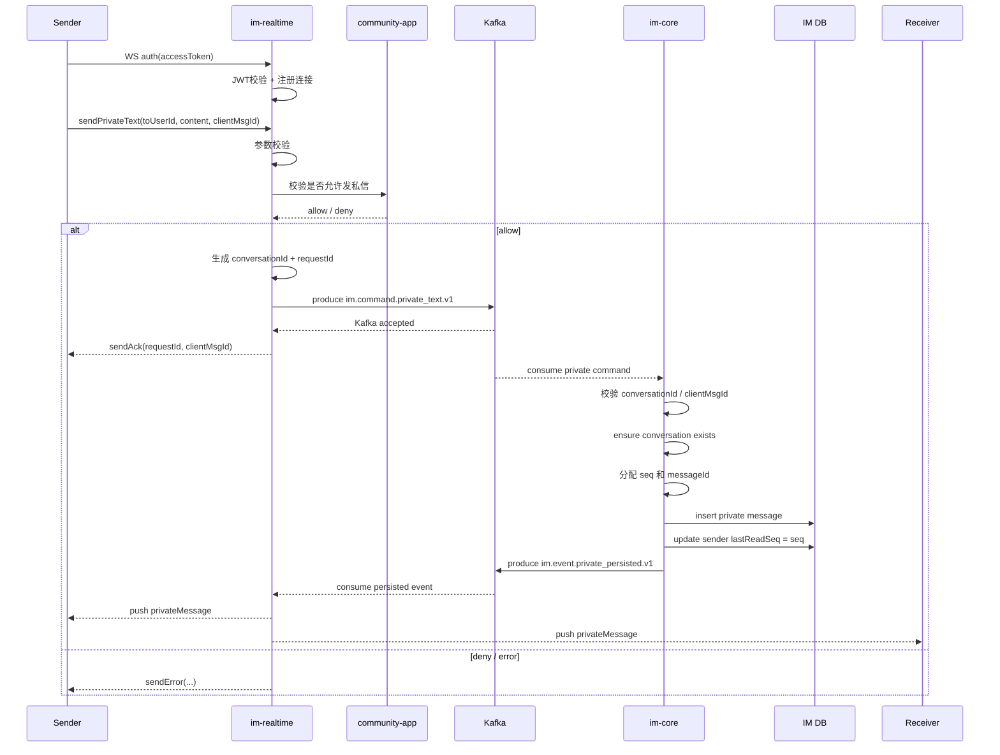
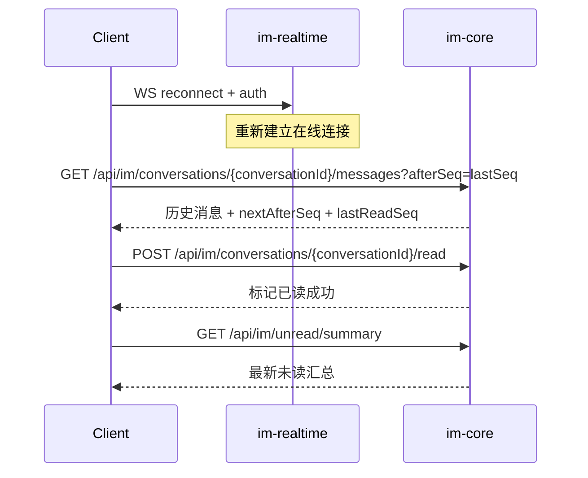

# IM 私信链路实现说明

本文档说明当前仓库中 IM 私信能力的实际实现路径，聚焦以下问题：

- 私信请求从哪里进入系统
- `im-realtime` 和 `im-core` 分别承担什么职责
- Kafka 在链路中的位置是什么
- 消息何时算“已接单”，何时算“已持久化”
- 断线重连后如何通过 HTTP 补齐历史和未读状态

相关总览文档：

- `docs/ARCHITECTURE.md`
- `docs/SYSTEM_DESIGN.md`
- `docs/LOAD_TESTING.md`

---

## 1. 参与组件

私信主链路涉及以下组件：

- 前端或 IM 客户端：对外私信入口固定为 `ws://localhost:12880/ws/im` 与 `http://localhost:12880/api/im/**`；这两类 client-facing entrypoint 由 `community-gateway` 暴露
- `im-realtime`：WebSocket 接入、鉴权、协议解析、治理校验、Kafka command 生产、在线推送
- `community-app`：仅提供发送治理校验接口，不提供消息读写 API
- Kafka：承担 `command` 与 `event` 的跨服务 backplane
- `im-core`：消息持久化、顺序号分配、幂等、历史查询、未读状态
- MySQL（`im_core` schema）：保存私信会话、消息和 read state

需要明确的角色拆分：
- `community-app` 只负责治理判定（`POST /api/im-governance/private-messages/validate`）以及站内通知等主站语义，不再暴露 legacy message HTTP 读写入口
- `community-im` 才是私信 owner：`im-realtime` 负责实时入口与在线推送，`im-core` 负责权威写路径和 `/api/im/**` HTTP 查询接口
核心 topic 常量定义在：

- `backend/community-im/im-common/src/main/java/com/nowcoder/community/im/common/ImTopics.java`

当前私信主链路使用的 topic：

- `im.command.private_text.v1`
- `im.event.private_persisted.v1`

---

## 2. 主时序图

---

## 3. 详细步骤

### 3.1 WebSocket 鉴权与连接建立

私信链路对外推荐入口是 `community-gateway` 暴露的：

- `ws://localhost:12880/ws/im`

gateway 会把这个 WebSocket 路径转发到 `im-realtime` 的 WebSocket handler：

- `backend/community-im/im-realtime/src/main/java/com/nowcoder/community/im/realtime/ws/ImWebSocketHandler.java`

关键行为：

1. 客户端先发送 `auth` 消息并携带 `accessToken`
2. `im-realtime` 使用 `JwtVerifier` 校验 token
3. 校验成功后，将连接注册进 `ConnectionRegistry`
4. 如果是首次绑定，还会把连接和用户建立关联，供后续在线推送使用

说明：

- 私信本身不依赖房间索引，但私信和群聊共用同一个 WebSocket 入口与连接模型
- 首次鉴权成功时，`im-realtime` 还会调用 `im-core` 的 internal API 拉取用户所在房间，完成房间本地索引 bootstrap；这一步主要服务于群聊链路
- 断线补拉、会话列表、已读和未读汇总等 HTTP 能力，对外统一走 `community-gateway` 的 `http://localhost:12880/api/im/**`
- `community-app` 不提供消息读写 HTTP API；如果看到旧的 message HTTP 入口，应视为已下线
关键代码：

- `handle(...)`
- `handleInboundText(...)`
- `handleAuth(...)`

---

### 3.2 发送私信请求进入 `im-realtime`

客户端发送私信时，WebSocket payload 的业务类型是：

- `sendPrivateText`

`im-realtime` 在 `handleSendPrivate(...)` 中完成第一层处理：

1. 确认当前连接已经完成鉴权
2. 校验 `toUserId`
3. 校验 `clientMsgId`
4. 校验 `content`
5. 校验当前连接里仍然持有可用于下游调用的 access token

如果以上本地校验失败，直接向发送方返回：

- `sendError(...)`
- 或 `authError(...)`

这一层的职责是“协议与入口守卫”，不负责最终持久化。

---

### 3.3 私信治理校验

本仓库的发送链路还要经过 `community-app` 的治理校验接口；这是 `community-app` 在该链路中的唯一职责。

调用方：

- `backend/community-im/im-realtime/src/main/java/com/nowcoder/community/im/realtime/client/CommunityGovernanceClient.java`

接口路径：

- `POST /api/im-governance/private-messages/validate`

`im-realtime` 会把用户 JWT 转发给 `community-app`，由社区主站判断当前请求是否允许发送消息，例如：

- 用户是否已登录且 token 有效
- 是否触发禁言、拉黑、目标用户不存在等治理规则

治理校验失败时，`im-realtime` 不会投递 Kafka command，而是立即给发送方返回 `sendError(...)`。

这里的设计重点是：

- 治理规则收口在业务主站
- WS 入口在投递 Kafka 之前前置校验
- `community-app` 不承担消息读写，只返回 allow / deny 的治理结论
- 不把治理责任下放给 `im-core` 的持久化层

---

### 3.4 组装 command 并写入 Kafka

治理校验通过后，`im-realtime` 会组装：

- `SendPrivateTextCommandV1`

command 中包含的关键字段有：

- `requestId`
- `clientMsgId`
- `fromUserId`
- `toUserId`
- `conversationId`
- `content`
- `clientSendAtEpochMs`

其中 `conversationId` 由 `fromUserId` 和 `toUserId` 推导得到，保证会话标识稳定。

随后，`im-realtime` 使用 `CommandProducer#sendPrivateText(...)` 将 command 投递到：

- `im.command.private_text.v1`

如果 Kafka 接受成功，`im-realtime` 就向发送方回一个：

- `sendAck`

这里需要特别注意：

- `sendAck` 的语义是“消息已通过入口校验并成功进入处理队列”
- `sendAck` 不代表消息已经落库
- 最终是否持久化成功，要看后续 `im-core` 消费与落库结果

---

### 3.5 `im-core` 消费 command 并持久化

`im-core` 通过 Kafka listener 消费私信 command：

- `backend/community-im/im-core/src/main/java/com/nowcoder/community/im/core/kafka/CommandConsumers.java`

消费方法：

- `onPrivateText(SendPrivateTextCommandV1 cmd)`

该方法内部会调用：

- `PrivateMessageService#persist(...)`

`persist(...)` 是私信权威写路径，主要做以下事情：

1. 再次校验 `cmd`、`clientMsgId`、`content`
2. 根据 `fromUserId` / `toUserId` 重新推导 `conversationId`
3. 检查 command 自带的 `conversationId` 是否与推导值一致
4. `ensureExists(...)`，确保会话记录存在
5. 按 `(conversationId, fromUserId, clientMsgId)` 做幂等检查
6. 如果是重复请求，直接返回已有消息对应的 persisted event
7. 如果不是重复请求，则分配新的 `seq` 和 `messageId`
8. 将私信写入 `im_private_message`
9. 将发送者自己的 `lastReadSeq` 推进到当前 `seq`
10. 返回 `PrivateMessagePersistedEventV1`

这一步是整条私信链路里真正定义“消息已持久化”的地方。

---

### 3.6 `im-core` 发布 persisted event

消息落库成功后，`im-core` 不会直接推送给在线客户端，而是先发布事件：

- `PrivateMessagePersistedEventV1`

发送 topic：

- `im.event.private_persisted.v1`

发布组件：

- `backend/community-im/im-core/src/main/java/com/nowcoder/community/im/core/kafka/EventProducer.java`

这样做的意义是：

- `im-core` 只负责权威状态和事件事实
- `im-realtime` 负责如何把事实分发到在线连接
- 存储与实时推送解耦，便于独立扩容

---

### 3.7 `im-realtime` 消费 persisted event 并推送

`im-realtime` 消费 `im.event.private_persisted.v1`：

- `backend/community-im/im-realtime/src/main/java/com/nowcoder/community/im/realtime/kafka/EventConsumers.java`

收到事件后，会交给：

- `PrivatePushService#pushPrivateMessage(...)`

推送行为很直接：

1. 将 event 序列化为 `privateMessage` JSON
2. 推送给 `toUserId` 的所有在线连接
3. 同时推送给 `fromUserId` 的所有在线连接

也就是说：

- 接收方在线时，会实时收到消息
- 发送方自己的其他在线端，也会收到同一条消息，便于多端同步

在线连接索引依赖：

- `ConnectionRegistry`

它负责维护：

- `connectionId -> WsConnection`
- `userId -> connectionId 集合`

---

## 4. 断线重连与补拉

私信推送是 best-effort，不把 WebSocket 推送结果当作唯一真相。

当用户断线、重连、切设备或临时错过实时推送时，恢复路径依赖 `im-core` 的 HTTP 查询接口。

对外客户端重连与补拉时，推荐继续走 `community-gateway` 的 client-facing entrypoint：

- WebSocket：`ws://localhost:12880/ws/im`
- HTTP：`http://localhost:12880/api/im/**`

恢复时序如下：

涉及接口：

- `GET /api/im/conversations`
- `GET /api/im/conversations/{conversationId}/messages`
- `POST /api/im/conversations/{conversationId}/read`
- `GET /api/im/unread/summary`

这些接口都由 `im-core` 提供，因为：

- 历史消息以 `im-core` 数据库为准
- 未读数由 `lastSeq - lastReadSeq` 计算
- 已读水位更新也要写回 `im-core`

对外访问这些接口时，路径保持不变，但推荐统一经由 `community-gateway` 的 `http://localhost:12880` 暴露。

---

## 5. 关键实现约束

### 5.1 `sendAck` 不等于“已落库”

当前链路中，`sendAck` 发生在：

- `im-realtime` 成功将 command 写入 Kafka 之后

它不表示：

- `im-core` 已经成功消费
- 消息已经成功落库
- 接收方已经收到推送

因此，从产品语义上更适合把它理解为：

- “服务已接单”

而不是：

- “最终发送成功”

---

### 5.2 幂等依赖 `clientMsgId`

`im-core` 使用 `clientMsgId` 做幂等去重。

含义是：

- 同一发送方对同一会话重复提交同一个 `clientMsgId`
- 不会生成两条不同的私信记录
- 会返回第一次写入对应的 `messageId` 和 `seq`

这可以覆盖：

- 前端重试
- 网络抖动导致的重复投递
- 上游重复发 command 的情况

---

### 5.3 已读水位由 `im-core` 维护

发送方自己的消息在落库后会立即推进自己的 `lastReadSeq`。

这意味着：

- 发送者不会把自己刚发的消息算作未读
- 未读统计的权威来源始终是 `im-core`

未读汇总实现位于：

- `backend/community-im/im-core/src/main/java/com/nowcoder/community/im/core/service/UnreadService.java`

其计算逻辑本质上是：

- `unreadCount = lastSeq - lastReadSeq`

---

## 6. 关键代码定位

### `im-realtime`

- WebSocket 入口：
  - `backend/community-im/im-realtime/src/main/java/com/nowcoder/community/im/realtime/ws/ImWebSocketHandler.java`
- 私信治理校验 client：
  - `backend/community-im/im-realtime/src/main/java/com/nowcoder/community/im/realtime/client/CommunityGovernanceClient.java`
- 向 Kafka 写 command：
  - `backend/community-im/im-realtime/src/main/java/com/nowcoder/community/im/realtime/kafka/CommandProducer.java`
- 消费 persisted event：
  - `backend/community-im/im-realtime/src/main/java/com/nowcoder/community/im/realtime/kafka/EventConsumers.java`
- 推送给在线用户：
  - `backend/community-im/im-realtime/src/main/java/com/nowcoder/community/im/realtime/push/PrivatePushService.java`
- 在线连接注册表：
  - `backend/community-im/im-realtime/src/main/java/com/nowcoder/community/im/realtime/presence/ConnectionRegistry.java`

### `im-core`

- 消费私信 command：
  - `backend/community-im/im-core/src/main/java/com/nowcoder/community/im/core/kafka/CommandConsumers.java`
- 私信持久化主服务：
  - `backend/community-im/im-core/src/main/java/com/nowcoder/community/im/core/service/PrivateMessageService.java`
- 发布 persisted event：
  - `backend/community-im/im-core/src/main/java/com/nowcoder/community/im/core/kafka/EventProducer.java`
- 会话列表 / 历史 / markRead：
  - `backend/community-im/im-core/src/main/java/com/nowcoder/community/im/core/controller/ConversationController.java`
- 未读汇总：
  - `backend/community-im/im-core/src/main/java/com/nowcoder/community/im/core/controller/UnreadController.java`
  - `backend/community-im/im-core/src/main/java/com/nowcoder/community/im/core/service/UnreadService.java`

---

## 7. 一句话总结

当前仓库中的 IM 私信实现遵循的是一条很明确的职责分工：

- `im-realtime` 负责“接入、校验、排队、实时推送”
- `im-core` 负责“落库、顺序、幂等、历史、未读”

因此，私信的正确性依赖：

- Kafka command/event 链路
- `im-core` 的权威持久化状态
- 客户端在断线场景下通过 HTTP 进行历史补拉与状态校准
