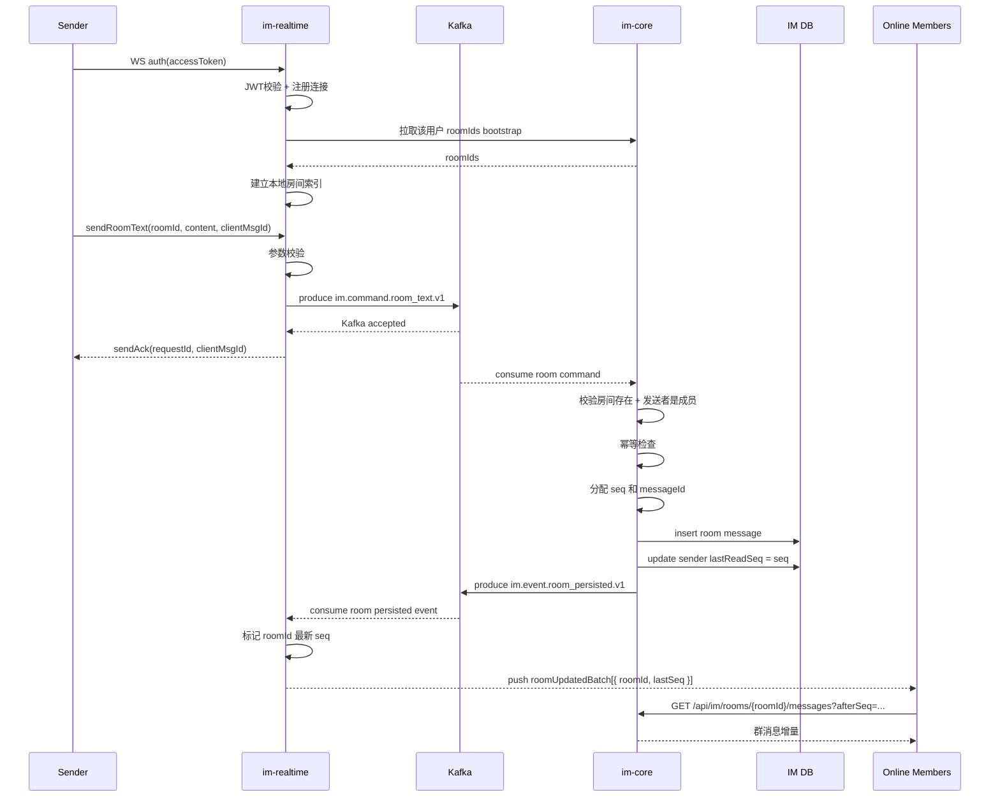
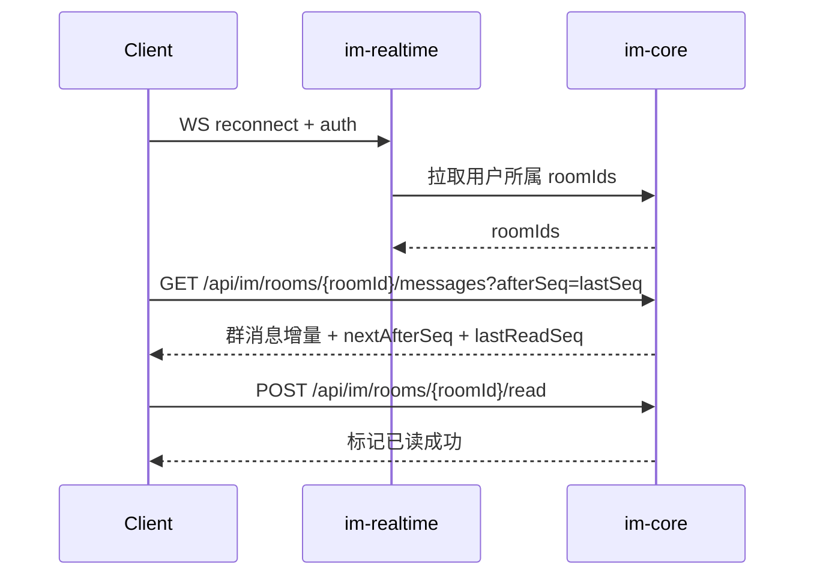

# IM 群聊链路实现说明

本文档说明当前仓库中 IM 群聊能力的实际实现路径，聚焦以下问题：

- 群聊请求从哪里进入系统
- `im-realtime` 和 `im-core` 分别承担什么职责
- 群聊成员关系如何同步到实时层
- Kafka 在链路中的位置是什么
- 在线推送发的是完整消息内容，还是只发房间更新通知
- 断线重连或收到更新后，客户端如何通过 HTTP 拉取群聊消息

相关总览文档：

- `docs/ARCHITECTURE.md`
- `docs/SYSTEM_DESIGN.md`
- `docs/LOAD_TESTING.md`

---

## 1. 参与组件

群聊主链路涉及以下组件：

- 前端或 IM 客户端：外部默认通过 `project-gateway` 暴露的 `ws://localhost:12880/ws/im` 与 `http://localhost:12880/api/im/**` 进入系统；`ws://localhost:18081/internal/ws/im` 和 `http://localhost:18082` 保留为回滚 / 排障时的直连路径
- `im-realtime`：WebSocket 接入、鉴权、协议解析、Kafka command 生产、房间在线索引、群聊更新推送
- Kafka：承担 `command` 与 `event` 的跨服务 backplane
- `im-core`：群消息持久化、顺序号分配、幂等、群成员校验、历史查询、未读状态
- MySQL（`im_core` schema）：保存房间、成员、群消息和 read state

核心 topic 常量定义在：

- `backend/im/im-common/src/main/java/com/nowcoder/community/im/contracts/ImTopics.java`

当前群聊主链路使用的 topic：

- `im.command.room_text.v1`
- `im.event.room_persisted.v1`
- `im.event.room_member_changed.v1`

---

## 2. 主时序图

---

## 3. 详细步骤

### 3.1 WebSocket 鉴权与房间 bootstrap

群聊和私信共用同一个对外 WebSocket 入口，外部客户端推荐通过 `project-gateway` 的：

- `ws://localhost:12880/ws/im`

接入；gateway 最终会把请求转发到：

- `backend/im/im-realtime/src/main/java/com/nowcoder/community/im/realtime/ws/ImWebSocketHandler.java`

连接鉴权成功后，`im-realtime` 会做两件和群聊直接相关的事情：

1. 把连接注册到 `ConnectionRegistry`
2. 调用 `im-core` 的 internal API 拉取当前用户所属房间列表

对应调用 client：

- `backend/im/im-realtime/src/main/java/com/nowcoder/community/im/realtime/client/ImCoreClient.java`

对应 internal API：

- `GET /internal/im/realtime/users/{userId}/rooms`

拉到 `roomIds` 之后，`im-realtime` 会把这些房间写入本地索引：

- `RoomLocalIndex`
- `WsConnection#joinRoom(...)`

这样做的目的，是让实时层知道“本机当前哪些连接属于哪些房间”，后面群聊更新才能只扇出给房间内在线用户。

对外客户端配套的房间历史、已读等 HTTP 请求，也推荐统一走 `project-gateway` 的 `http://localhost:12880/api/im/**`；`http://localhost:18082` 直连口保留为回滚 / 排障路径。

---

### 3.2 发送群消息请求进入 `im-realtime`

客户端发送群消息时，WebSocket payload 的业务类型是：

- `sendRoomText`

`im-realtime` 在 `handleSendRoom(...)` 中完成第一层处理：

1. 确认当前连接已经完成鉴权
2. 校验 `roomId`
3. 校验 `clientMsgId`
4. 校验 `content`
5. 生成 `requestId`
6. 组装 `SendRoomTextCommandV1`

和私信相比，当前群聊写路径有一个重要差异：

- 这里没有像私信那样调用 `community-app` 做前置治理校验
- 群成员合法性与房间存在性，交由 `im-core` 在持久化前校验

也就是说，`im-realtime` 在群聊链路里主要承担的是：

- WebSocket 协议入口
- 基础参数校验
- Kafka command 投递

---

### 3.3 组装 command 并写入 Kafka

`im-realtime` 会把群消息封装为：

- `SendRoomTextCommandV1`

其中包含的关键字段有：

- `requestId`
- `clientMsgId`
- `fromUserId`
- `roomId`
- `content`
- `clientSendAtEpochMs`

随后通过：

- `CommandProducer#sendRoomText(...)`

投递到：

- `im.command.room_text.v1`

如果 Kafka 接受成功，发送方会收到：

- `sendAck`

这里的 `sendAck` 语义与私信一致：

- 表示“请求已经通过实时层入口校验并进入处理队列”
- 不表示“消息已经持久化成功”

---

### 3.4 `im-core` 消费 room command 并持久化

`im-core` 通过 Kafka listener 消费群消息 command：

- `backend/im/im-core/src/main/java/com/nowcoder/community/im/core/kafka/CommandConsumers.java`

消费方法：

- `onRoomText(SendRoomTextCommandV1 cmd)`

该方法内部调用：

- `RoomMessageService#persist(...)`

这是群聊权威写路径，主要做以下事情：

1. 校验 `cmd`、`clientMsgId`、`content`
2. 校验房间是否存在
3. 校验发送者是否是该房间成员
4. 按 `(roomId, fromUserId, clientMsgId)` 做幂等检查
5. 如果是重复请求，直接返回已有消息对应的 persisted event
6. 如果不是重复请求，则为该房间分配新的 `seq` 和 `messageId`
7. 将群消息写入 `im_room_message`
8. 将发送者自己的 `lastReadSeq` 推进到当前 `seq`
9. 返回 `RoomMessagePersistedEventV1`

这一步是整条群聊链路里真正定义“消息已持久化”的地方。

---

### 3.5 `im-core` 发布 room persisted event

群消息落库成功后，`im-core` 会发布：

- `RoomMessagePersistedEventV1`

发送 topic：

- `im.event.room_persisted.v1`

这里需要特别注意这个 event 的设计：

- event 只包含 `roomId`、`seq`、`messageId`、`fromUserId`、`createdAtEpochMs`
- event 不包含消息 `content`

共享契约代码里对此有明确注释：

- `Room chat is pushed as state-only (no content): clients pull history by seq.`

这意味着当前群聊实时链路采用的是：

- state-only 更新通知
- 客户端按 `seq` 回拉消息正文

而不是：

- 服务端把完整群消息正文直接推给所有在线成员

---

### 3.6 `im-realtime` 消费 room persisted event

`im-realtime` 消费 `im.event.room_persisted.v1`：

- `backend/im/im-realtime/src/main/java/com/nowcoder/community/im/realtime/kafka/EventConsumers.java`

收到 `RoomMessagePersistedEventV1` 后，它不会直接推送消息内容，而是调用：

- `RoomFanoutCoalescer#markRoomUpdated(roomId, seq)`

后续链路分两层：

1. `RoomFanoutCoalescer`
2. `RoomUpdateCoalescer`

它们的职责分别是：

- 先在房间维度合并更新，只保留某个房间当前最新的 `seq`
- 再在连接维度合并更新，避免一个连接在短时间内收到大量重复房间通知

最终，在线连接收到的不是完整群消息，而是：

- `roomUpdatedBatch`

消息体形态大致是：

- `type = "roomUpdatedBatch"`
- `items = [{ roomId, lastSeq }, ...]`

也就是说，实时层通知客户端的是：

- 哪些房间发生了新消息
- 每个房间最新推进到了哪个 `lastSeq`

---

### 3.7 客户端根据 `roomUpdatedBatch` 回拉群消息

由于 `roomUpdatedBatch` 只携带房间更新状态，不携带正文，客户端在收到更新后需要主动调用 `im-core` HTTP API 拉取增量消息。对外默认入口是 `project-gateway` 的 `http://localhost:12880/api/im/**`，只有回滚 / 排障时才直连 `http://localhost:18082`：

- `GET /api/im/rooms/{roomId}/messages?afterSeq=...`

`RoomController#listMessages(...)` 会返回：

- `items`
- `nextAfterSeq`
- `lastReadSeq`

客户端随后可以按需要再调用：

- `POST /api/im/rooms/{roomId}/read`

推进已读水位。

因此，群聊“在线更新”的正确理解应该是：

- WebSocket 负责尽快告诉客户端“哪个房间有新消息”
- 消息内容仍然由客户端按 `seq` 从 `im-core` 拉取

当前前端代码里，对 `roomUpdatedBatch` 的最小处理是：

- 在 `frontend/src/App.vue` 里显示一个“群聊有新消息”的 toast

这进一步说明当前仓库里 `roomUpdatedBatch` 的语义就是更新通知，而不是正文下发。

---

## 4. 群成员变更与实时层索引同步

群聊链路还有一条独立但很重要的辅助链路：房间成员变化同步。

当用户创建房间、加入房间或离开房间时，这些动作都由 `im-core` 处理：

- `RoomController#createRoom(...)`
- `RoomController#joinRoom(...)`
- `RoomController#leaveRoom(...)`
- `RoomMembershipService`

`RoomMembershipService` 在事务提交后会发布：

- `RoomMemberChangedEventV1`

发送 topic：

- `im.event.room_member_changed.v1`

`im-realtime` 消费该 event 后：

- `JOINED`：把该用户当前所有在线连接加入对应房间索引
- `LEFT`：把该用户当前所有在线连接从对应房间索引中移除

这条链路的作用是保证：

- 新加入房间的用户，后续可以收到该房间的 `roomUpdatedBatch`
- 已退出房间的用户，不会继续收到这个房间的实时更新

---

## 5. 断线重连与恢复

群聊恢复分两部分：

### 5.1 连接级恢复

用户重连并重新完成 WebSocket `auth` 后，`im-realtime` 会再次从 `im-core` 拉取该用户当前所属房间列表，重建本地房间索引。对外客户端推荐继续通过 `project-gateway` 的 `ws://localhost:12880/ws/im` 重连；`ws://localhost:18081/ws/im` 直连口保留为回滚 / 排障路径。

这一步解决的是：

- 实时层“这个连接属于哪些房间”的在线态恢复

### 5.2 消息级恢复

群聊正文恢复依赖 `im-core` 的房间历史接口。对外默认仍经由 `project-gateway` 的 `http://localhost:12880/api/im/**` 访问，路径本身保持不变：

- `GET /api/im/rooms/{roomId}/messages?afterSeq=lastSeq`

恢复时序如下：

因此，群聊正确性依赖的不是“房间消息是否被完整推送到每个在线连接”，而是：

- `im-core` 中的权威消息序列
- 客户端按 `afterSeq` 的增量拉取能力

---

## 6. 关键实现约束

### 6.1 `sendAck` 不等于“已落库”

和私信一样，群聊里的 `sendAck` 发生在：

- `im-realtime` 成功将 room command 写入 Kafka 之后

它不表示：

- `im-core` 已经成功消费
- 群消息已经成功写入数据库
- 其他房间成员已经收到更新通知

因此，从产品语义上更适合把它理解为：

- “请求已进入后端处理队列”

---

### 6.2 群聊幂等依赖 `clientMsgId`

`im-core` 使用 `clientMsgId` 做群消息幂等去重。

含义是：

- 同一发送方在同一房间内重复提交同一个 `clientMsgId`
- 不会生成两条不同的群消息记录
- 会返回第一次写入对应的 `messageId` 和 `seq`

这可以覆盖：

- 前端重试
- 网络重复投递
- 上游重复发 command

---

### 6.3 群聊在线推送是 state-only，不是 full-message push

这是群聊和私信最重要的实现差异。

私信链路里，`im-realtime` 会把完整 `privateMessage` 直接推给在线用户。

群聊链路里，`im-realtime` 推的是：

- `roomUpdatedBatch`

它只告诉客户端：

- 哪些房间更新了
- 每个房间最新 `lastSeq` 是多少

消息正文需要客户端再通过 `im-core` HTTP API 拉取。

这套设计的好处是：

- 避免大房间里把完整正文广播给所有在线成员
- 把实时通知和正文拉取拆开，降低 fanout 压力
- 可以在客户端按需、按 `seq` 做增量同步

---

### 6.4 群成员关系以 `im-core` 为准

虽然 `im-realtime` 维护房间本地索引，但它并不是房间成员关系的权威来源。

权威来源始终是：

- `im-core` 中的房间与成员表

`im-realtime` 只是在消费 bootstrap 数据和 `RoomMemberChangedEventV1` 之后，维护一个“本机在线连接视角下的房间索引”。

因此，房间是否存在、用户是否有资格发言、某连接是否应该收到某房间更新，最终都要回到 `im-core` 的成员关系和事件事实。

---

## 7. 关键代码定位

### `im-realtime`

- WebSocket 入口：
  - `backend/im/im-realtime/src/main/java/com/nowcoder/community/im/realtime/ws/ImWebSocketHandler.java`
- `im-core` 房间 bootstrap client：
  - `backend/im/im-realtime/src/main/java/com/nowcoder/community/im/realtime/client/ImCoreClient.java`
- 向 Kafka 写 room command：
  - `backend/im/im-realtime/src/main/java/com/nowcoder/community/im/realtime/kafka/CommandProducer.java`
- 消费 room persisted / member changed event：
  - `backend/im/im-realtime/src/main/java/com/nowcoder/community/im/realtime/kafka/EventConsumers.java`
- 房间维度合并：
  - `backend/im/im-realtime/src/main/java/com/nowcoder/community/im/realtime/push/RoomFanoutCoalescer.java`
- 连接维度合并：
  - `backend/im/im-realtime/src/main/java/com/nowcoder/community/im/realtime/push/RoomUpdateCoalescer.java`
- 在线连接注册表：
  - `backend/im/im-realtime/src/main/java/com/nowcoder/community/im/realtime/presence/ConnectionRegistry.java`
- 房间本地索引：
  - `backend/im/im-realtime/src/main/java/com/nowcoder/community/im/realtime/presence/RoomLocalIndex.java`
- 连接对象中的房间状态：
  - `backend/im/im-realtime/src/main/java/com/nowcoder/community/im/realtime/presence/WsConnection.java`

### `im-core`

- 消费 room command：
  - `backend/im/im-core/src/main/java/com/nowcoder/community/im/core/kafka/CommandConsumers.java`
- 群消息持久化主服务：
  - `backend/im/im-core/src/main/java/com/nowcoder/community/im/core/service/RoomMessageService.java`
- 房间成员管理：
  - `backend/im/im-core/src/main/java/com/nowcoder/community/im/core/service/RoomMembershipService.java`
- 发布 room persisted / member changed event：
  - `backend/im/im-core/src/main/java/com/nowcoder/community/im/core/kafka/EventProducer.java`
- 房间创建 / join / leave / 历史 / markRead：
  - `backend/im/im-core/src/main/java/com/nowcoder/community/im/core/controller/RoomController.java`
- realtime bootstrap internal API：
  - `backend/im/im-core/src/main/java/com/nowcoder/community/im/core/controller/InternalRealtimeBootstrapController.java`

### 前端

- WebSocket client：
  - `frontend/src/im/imRealtimeClient.js`
- 当前对 `roomUpdatedBatch` 的处理：
  - `frontend/src/App.vue`

---

## 8. 一句话总结

当前仓库中的 IM 群聊实现遵循的是一条明确的职责分工：

- `im-realtime` 负责“接入、在线房间索引、更新通知扇出”
- `im-core` 负责“房间成员权威状态、落库、顺序、幂等、历史、未读”

群聊与私信最大的不同在于：

- 私信是“落库后直接推完整消息”
- 群聊是“落库后推房间更新通知，再由客户端按 `seq` 回拉正文”
