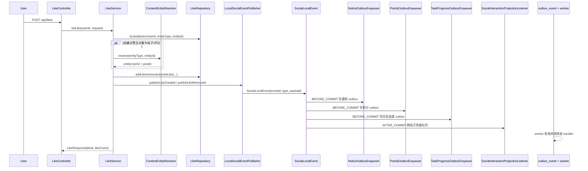

# 点赞 / 关注链路与 Outbox 实现说明

本文档说明当前仓库中点赞、关注及其下游事件链路的实际实现路径，聚焦以下问题：

- 点赞 / 关注请求从哪里进入系统
- 点赞的 toggle / set 语义如何判定
- 点赞 / 关注在 DB 与 Redis 模式下分别如何落状态
- `entityUserId`、`postId` 等事件字段从哪里来
- 社交事件会驱动哪些下游副作用
- 当前项目如何使用 `AFTER_COMMIT`、`BEFORE_COMMIT` 与 DB outbox

相关总览文档：

- `docs/ARCHITECTURE.md`
- `docs/SYSTEM_DESIGN.md`
- `docs/DATA_MODEL.md`
- `docs/superpowers/plans/2026-03-14-community-outbox-notice-points-search.md`

---

## 1. 当前默认配置

`backend/community-app/src/main/resources/application.yml` 当前主配置为：

- `social.storage: db`
- `social.events.publisher: local`
- `events.outbox.enabled: true`

这意味着：

- 社交主写路径默认以 MySQL 为 SSOT
- 点赞 / 关注成功后先发布本地 `SocialLocalEvent`
- 通知、积分、成长任务进度这类“必须最终达成”的副作用默认通过 DB outbox 投递
- 帖子热度刷新这类“尽力而为”的本地副作用仍使用 `AFTER_COMMIT`

如果切换到 `social.storage: redis`，当前代码仍可运行，但生产端一致性语义会明显复杂化，原因见本文第 8 节。

---

## 2. 参与组件

点赞 / 关注主链路涉及以下组件：

- `community-app`：
  - `LikeController`：点赞写接口与读接口入口
  - `FollowController`：关注写接口与读接口入口
  - `LikeService`：点赞业务规则、实体解析、状态变更、社交事件发布
  - `FollowService`：关注业务规则、状态变更、社交事件发布
  - `ContentEntityResolver`：点赞帖子 / 评论时回源 `content` 模块，解析 `entityUserId` 与 `postId`
  - `LocalSocialEventPublisher`：把 `LikePayload` / `FollowPayload` 封装成 `SocialLocalEvent`
- 社交存储：
  - `DbLikeRepository` / `DbFollowRepository`
  - `RedisLikeRepository` / `RedisFollowRepository`
- 下游副作用消费者：
  - `NoticeOutboxEnqueuer` / `NoticeOutboxHandler`
  - `PointsOutboxEnqueuer` / `PointsOutboxHandler`
  - `TaskProgressOutboxEnqueuer` / `TaskProgressOutboxHandler`
  - `SocialInteractionProjectionListener`
- 基础设施：
  - `JdbcOutboxEventStore`
  - `OutboxWorkerScheduler`
- 数据存储：
  - MySQL：点赞关系、关注关系、用户获赞计数、`outbox_event`
  - Redis：可选社交主存储或读加速层

---

## 3. 对外接口

### 3.1 点赞接口

当前 `LikeController` 暴露的核心接口包括：

- `POST /api/likes`
- `GET /api/likes/status`
- `GET /api/likes/count`
- `GET /api/likes/counts`
- `GET /api/likes/statuses`
- `GET /api/likes/users/{userId}/count`

写接口统一入口是 `POST /api/likes`。

### 3.2 关注接口

当前 `FollowController` 暴露的核心接口包括：

- `POST /api/follows`
- `DELETE /api/follows`
- `GET /api/follows/status`
- `GET /api/follows/{userId}/followees`
- `GET /api/follows/{userId}/followers`
- `GET /api/follows/{userId}/followees/count`
- `GET /api/follows/{userId}/followers/count`

写接口统一入口是：

- `POST /api/follows`
- `DELETE /api/follows`

---

## 4. 点赞主链路

### 4.1 主时序图（默认配置：DB + local publisher + outbox enabled）

### 4.2 请求语义

点赞请求体是 `LikeRequest`，关键字段包括：

- `entityType`
- `entityId`
- `liked`
- `entityUserId`
- `postId`

其中：

- `liked == null` 表示 toggle 语义，即服务端会根据当前状态自动翻转
- `liked == true / false` 表示 set 语义，即服务端会把点赞状态设为目标状态
- `entityUserId` 与 `postId` 虽然在请求体里存在，但当前服务端不信任客户端传值，真正写入事件 payload 的值由服务端自行解析

### 4.3 详细步骤

`LikeService.setLike(...)` 的处理顺序如下：

1. 校验 `actorUserId`
2. 校验 `entityType` 与 `entityId`
3. 查询当前是否已点赞
4. 根据 `liked` 字段决定目标状态：
   - `null`：翻转
   - `true / false`：设为目标状态
5. 仅在“创建点赞”窗口执行反骚扰校验：
   - 条件是 `!existed && liked`
   - 如果对象是帖子或评论，先回源内容模块解析目标归属用户
   - 若双方存在拉黑关系，则拒绝本次创建点赞
6. 根据当前配置选择持久化路径：
   - 非 Redis 路径：走 `handleSetLikeForNonRedisStorage(...)`
   - Redis 路径：走 `handleSetLikeForRedisStorage(...)`
7. 若状态确实发生变化，则构造 `LikePayload` 并发布：
   - `LikeCreated`
   - `LikeRemoved`
8. 最后重新查询并返回：
   - 当前是否已点赞
   - 当前实体点赞数

### 4.4 目标实体解析

点赞对象的可信元信息来自 `ContentEntityResolver`：

- 如果 `entityType == USER`，服务端直接把 `entityId` 当作 `entityUserId`
- 如果 `entityType == POST` 或 `COMMENT`，则通过 `ContentEntityService` 回源解析：
  - `entityUserId`：被点赞实体的归属用户
  - `postId`：所属帖子

该解析器默认采用 fail-closed 策略：

- 内容模块回源失败时直接抛错
- 解析结果不完整时直接抛错

因此点赞事件里的目标用户、所属帖子并不是“客户端声明”，而是“服务端权威解析”。

### 4.5 DB 模式下的状态变更

当 `social.storage = db` 时，点赞默认走 MySQL 路径：

- `addLike(...)` / `removeLike(...)` 维护点赞关系
- `incrementUserLikeCount(...)` 维护被赞用户的聚合获赞数
- 这两类写操作位于同一个 Spring 事务内
- 状态变更成功后再发布 `LikeCreated` / `LikeRemoved`

这一模式下，主业务写入和下游 outbox 入库都在同一个 DB 事务域中。

### 4.6 Redis 模式下的状态变更

当 `social.storage = redis` 时，点赞会改走 Redis 路径：

- `RedisLikeRepository.setLike(...)` 用 Lua 脚本同时更新：
  - 实体点赞集合
  - 被赞用户获赞计数
- 为了在 Redis 主写入与事务回滚之间尽量保持一致，`LikeService` 当前仍会：
  - 注册事务回滚补偿
  - 在事件发布失败时手工执行反向回滚

这说明当前 Redis 路径的复杂度主要集中在 service 层，而不是 outbox 本身。

### 4.7 点赞事件 payload 语义

`LikePayload` 当前包含：

- `actorUserId`：执行点赞 / 取消点赞的用户
- `entityType`
- `entityId`
- `entityUserId`：目标实体归属用户
- `postId`：目标实体所属帖子
- `createTime`

这些字段用于驱动通知、积分、任务进度、热度刷新等下游逻辑。

---

## 5. 关注主链路

### 5.1 请求语义

关注请求体是 `FollowRequest`，当前真正参与业务判定的字段只有：

- `entityType`
- `entityId`

当前关注能力只支持：

- `entityType == USER`

### 5.2 详细步骤

`FollowService.follow(...)` 的处理顺序如下：

1. 校验 `actorUserId`
2. 校验 `entityType` 与 `entityId`
3. 强制限制 `entityType == USER`
4. 禁止关注自己
5. 查询当前是否已关注
6. 仅在“新建关注”窗口执行拉黑关系校验：
   - 条件是 `!existed`
   - 若双方存在拉黑关系，则拒绝创建关注
7. 调 `followRepository.follow(...)` 创建关注关系
8. 如果确实是第一次创建，则构造 `FollowPayload`
9. 发布 `FollowCreated`

`unfollow(...)` 当前只做删除关注关系，不发布 `FollowRemoved` 事件。

### 5.3 DB 模式下的状态变更

当 `social.storage = db` 时：

- 关注关系落在 `social_follow` 表
- MySQL 唯一约束承担幂等保护
- 重复关注返回 `created=false`

这是当前主配置下的默认路径。

### 5.4 Redis 模式下的状态变更

当 `social.storage = redis` 时：

- `RedisFollowRepository` 用 Lua 脚本同时维护：
  - `followee:<userId>:<entityType>`
  - `follower:<entityType>:<entityId>`
- 如果脚本发现一侧存在、一侧缺失，还会尝试修复历史双写不一致
- 与点赞类似，service 层当前仍负责：
  - 事务回滚补偿注册
  - 事件发布失败时的手工补偿

### 5.5 关注事件 payload 语义

`FollowPayload` 当前包含：

- `actorUserId`
- `entityType`
- `entityId`
- `entityUserId`
- `createTime`

由于当前只支持关注用户，`entityId` 与 `entityUserId` 在语义上都指向被关注者。

---

## 6. 社交事件会驱动哪些下游副作用

当前点赞 / 关注事件的主要消费方如下：

| 事件 | 下游能力 | 作用对象 | 当前默认模式 |
| --- | --- | --- | --- |
| `LikeCreated` | 通知 | 被点赞用户 | outbox |
| `LikeCreated` | 积分 +1 | 被点赞用户 | outbox |
| `LikeRemoved` | 积分 -1 | 被点赞用户 | outbox |
| `LikeCreated` | 成长任务进度 | 被点赞用户 | outbox |
| `LikeCreated` / `LikeRemoved` | 帖子热度刷新 | 帖子 | `AFTER_COMMIT` |
| `FollowCreated` | 通知 | 被关注用户 | outbox |

如果 `events.outbox.enabled = false`，通知 / 积分 / 任务进度会退回 `AFTER_COMMIT` 直接处理。

### 6.1 通知

通知消费关注以下社交事件：

- `LikeCreated`
- `FollowCreated`

行为语义：

- 给 `entityUserId` 对应用户写一条站内通知
- 通知内容里保留源事件 `eventId`、`type` 和原始 payload

### 6.2 积分

积分只消费点赞事件：

- `LikeCreated`：给被赞用户 `+1`
- `LikeRemoved`：给被赞用户 `-1`

如果事件里的 `entityUserId` 不合法，或者点赞者和被点赞者是同一人，则直接跳过。

### 6.3 成长任务进度

任务进度当前只消费：

- `LikeCreated`

语义是把“收到一次点赞”视为某类成长事件，作用在被点赞用户上。

### 6.4 帖子热度刷新

`SocialInteractionProjectionListener` 目前仍是 `AFTER_COMMIT` 本地监听器：

- 消费 `LikeCreated` / `LikeRemoved`
- 仅处理 `entityType == POST`
- 解析出 `postId` 后把帖子加入 `PostScoreQueue`

这一能力当前没有走 outbox，属于“尽力而为”的本地副作用。

---

## 7. 当前项目中 Outbox 的工作方式

### 7.1 当 outbox 关闭时

如果 `events.outbox.enabled = false`，社交事件的典型处理方式是：

- `LikeService` / `FollowService` 发布 `SocialLocalEvent`
- `NoticeProjectionListener`、`PointsProjectionListener`、`TaskProgressProjectionListener`
  使用 `@TransactionalEventListener(phase = AFTER_COMMIT)` 直接处理副作用

特点：

- 简单
- 主事务提交后立即执行
- 监听器异常不会回滚主事务
- 失败通常只能记日志，可靠重试能力弱

### 7.2 当 outbox 开启时

如果 `events.outbox.enabled = true`，当前主配置会启用以下模式：

1. `LikeService` / `FollowService` 仍先发布 `SocialLocalEvent`
2. `BEFORE_COMMIT` enqueuer 在同一个 DB 事务里写 `outbox_event`
3. 主事务提交成功后，`OutboxWorkerScheduler` 周期性轮询 `outbox_event`
4. 对应 `OutboxHandler` 异步处理副作用
5. 失败时按 outbox 规则重试 / 延迟 / dead-letter

当前点赞 / 关注相关的 outbox topic 包括：

- `projection.notice`
- `projection.points`
- `projection.task-progress`

各 enqueuer 的 `event_id` 约定为：

- `<socialEventId>:notice`
- `<socialEventId>:points`
- `<socialEventId>:task-progress`

`event_key` 则按消费对象选择，例如：

- 通知：`toUserId`
- 积分：`userId`
- 任务进度：`userId`

### 7.3 当前代码里“怎么使用 outbox”

在当前项目里，“使用 outbox”并不是让 `LikeService` / `FollowService` 直接操作 `JdbcOutboxEventStore`，而是遵循下面这条链路：

1. 业务 service 先发布一个稳定的 `SocialLocalEvent`
2. 可靠副作用的生产方监听这个事件，并在 `BEFORE_COMMIT` 阶段写入 `outbox_event`
3. worker 再按 topic 调用对应 handler

这意味着：

- 点赞 / 关注 service 不应该直接调用通知、积分、任务服务
- 新增一个“必须最终达成”的社交副作用时，优先新增：
  - 一个 `BEFORE_COMMIT` enqueuer
  - 一个 `OutboxHandler`
- 如果副作用只是本地刷新、丢一次可接受，则优先考虑 `AFTER_COMMIT`

### 7.4 为什么点赞 / 关注天然适合 outbox

点赞 / 关注不是“只改一条主状态”的命令，它们通常会同时触发多类副作用：

- 通知
- 积分
- 成长任务进度
- 热度刷新

这些副作用具备三个典型特征：

- 数量多
- 对主 HTTP 响应并非强同步依赖
- 其中一部分失败后需要重试，不能简单丢掉

因此它们天然适合“主命令写成功后，再以事件方式可靠投递下游”的模型。

---

## 8. 当前边界与限制

当前 outbox 方案要分两层理解：

- 对下游消费者而言，outbox 已经承担了“可靠异步投递”的职责
- 对生产端而言，outbox 是否能和主写入放在同一个事务域，取决于社交主存储是不是 DB

### 8.1 在默认配置下

当配置为：

- `social.storage = db`
- `social.events.publisher = local`
- `events.outbox.enabled = true`

则：

- 社交主写入和 outbox 入库都在同一个 DB 事务内
- `LikeCreated` / `LikeRemoved` / `FollowCreated` 能稳定驱动可靠副作用
- 这是当前最清晰、最稳定的组合

### 8.2 在 Redis 主存储下

如果切到 `social.storage = redis`，当前 JDBC outbox 仍然可以保证“消费者侧重试”，但不能天然保证：

- Redis 主写入
- DB outbox 入库

这两者的原子一致性。

因此当前 Redis 路径里仍然存在：

- service 层手工回滚补偿
- 事务回滚时的同步注册
- 发布失败时的反向写

换句话说：

- outbox 当前已经很好地解决了“社交事件 -> 下游副作用”的可靠投递问题
- 但它没有自动消除 Redis 主写入路径中的生产端一致性复杂度

这也是为什么当前主配置选择 `social.storage = db`。

---

## 9. 维护者最小使用准则

如果未来要在点赞 / 关注后新增一个副作用，当前仓库更推荐按下面的边界接入：

### 9.1 需要“必须最终达成”的副作用

例如：

- 新的通知投影
- 新的积分 / 成长 / 奖励投影
- 对外部系统的可靠同步

推荐做法：

1. 先复用现有 `SocialLocalEvent`
2. 新增 `BEFORE_COMMIT` enqueuer
3. 写入独立 topic 的 outbox 记录
4. 新增 `OutboxHandler` 处理该 topic
5. 让 handler 自身具备幂等或可重试能力

### 9.2 只是本地、可丢失的副作用

例如：

- 本地缓存失效
- 热度刷新队列
- 一些可重扫的轻量投影

推荐做法：

- 使用 `@TransactionalEventListener(phase = AFTER_COMMIT)`
- 不要把它们直接塞回 `LikeService` / `FollowService`

### 9.3 不推荐的接入方式

当前不推荐在 `LikeService` / `FollowService` 中直接写：

- 下游服务调用
- 手工序列化下游 payload
- 下游重试逻辑
- 面向具体消费者的存储策略分支

service 更适合只负责：

- 业务规则
- 主状态变更
- 事件发布

而不是直接承担下游投影编排。

---

## 10. 关键代码定位

### 10.1 写接口与请求对象

- `backend/community-app/src/main/java/com/nowcoder/community/social/like/LikeController.java`
- `backend/community-app/src/main/java/com/nowcoder/community/social/follow/FollowController.java`
- `backend/community-app/src/main/java/com/nowcoder/community/social/like/dto/LikeRequest.java`
- `backend/community-app/src/main/java/com/nowcoder/community/social/follow/dto/FollowRequest.java`

### 10.2 主业务服务

- `backend/community-app/src/main/java/com/nowcoder/community/social/like/LikeService.java`
- `backend/community-app/src/main/java/com/nowcoder/community/social/follow/FollowService.java`
- `backend/community-app/src/main/java/com/nowcoder/community/social/service/ContentEntityResolver.java`

### 10.3 社交主存储

- `backend/community-app/src/main/java/com/nowcoder/community/social/like/LikeRepository.java`
- `backend/community-app/src/main/java/com/nowcoder/community/social/like/DbLikeRepository.java`
- `backend/community-app/src/main/java/com/nowcoder/community/social/like/RedisLikeRepository.java`
- `backend/community-app/src/main/java/com/nowcoder/community/social/follow/FollowRepository.java`
- `backend/community-app/src/main/java/com/nowcoder/community/social/follow/DbFollowRepository.java`
- `backend/community-app/src/main/java/com/nowcoder/community/social/follow/RedisFollowRepository.java`

### 10.4 社交事件与 payload

- `backend/community-app/src/main/java/com/nowcoder/community/social/event/SocialEventTypes.java`
- `backend/community-app/src/main/java/com/nowcoder/community/social/event/SocialLocalEvent.java`
- `backend/community-app/src/main/java/com/nowcoder/community/social/event/LocalSocialEventPublisher.java`
- `backend/community-app/src/main/java/com/nowcoder/community/social/event/payload/LikePayload.java`
- `backend/community-app/src/main/java/com/nowcoder/community/social/event/payload/FollowPayload.java`

### 10.5 Outbox 生产与消费

- `backend/community-app/src/main/java/com/nowcoder/community/message/event/NoticeOutboxEnqueuer.java`
- `backend/community-app/src/main/java/com/nowcoder/community/message/event/NoticeOutboxHandler.java`
- `backend/community-app/src/main/java/com/nowcoder/community/user/event/PointsOutboxEnqueuer.java`
- `backend/community-app/src/main/java/com/nowcoder/community/user/event/PointsOutboxHandler.java`
- `backend/community-app/src/main/java/com/nowcoder/community/growth/event/TaskProgressOutboxEnqueuer.java`
- `backend/community-app/src/main/java/com/nowcoder/community/growth/event/TaskProgressOutboxHandler.java`
- `backend/community-app/src/main/java/com/nowcoder/community/infra/outbox/JdbcOutboxEventStore.java`
- `backend/community-app/src/main/java/com/nowcoder/community/infra/outbox/OutboxWorkerScheduler.java`

### 10.6 非 outbox 的本地副作用与关闭 outbox 时的监听器

- `backend/community-app/src/main/java/com/nowcoder/community/content/event/SocialInteractionProjectionListener.java`
- `backend/community-app/src/main/java/com/nowcoder/community/message/event/NoticeProjectionListener.java`
- `backend/community-app/src/main/java/com/nowcoder/community/user/event/PointsProjectionListener.java`
- `backend/community-app/src/main/java/com/nowcoder/community/growth/event/TaskProgressProjectionListener.java`
