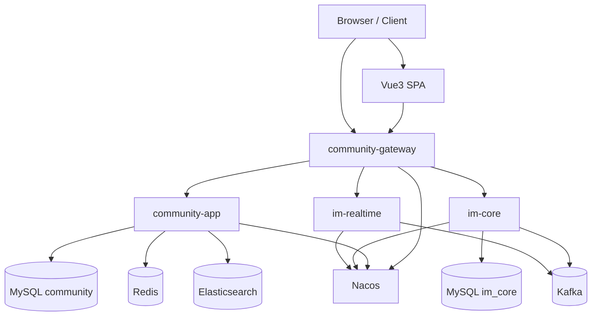

# 架构规则

本文档是 handbook 的架构规则 SSOT。它描述 deployable 边界、业务包边界、DDD Tactical Layering、跨域协作入口和守卫测试。系统协作机制见 [system-design.md](system-design.md)，业务链路见 [business-flows.md](business-flows.md)。

## 当前形态

本项目当前是 Maven 多模块后端 + Vue3 前端：

- `frontend/`：Vue3 SPA。
- `backend/community-gateway`：统一入口层，负责 HTTP / WebSocket 路由、CORS、trace 和边缘策略。
- `backend/community-app`：主业务 owner，是按包边界治理的 package-scoped monolith。
- `backend/community-im`：IM 聚合模块，包含 `im-common`、`im-core`、`im-realtime`。
- `backend/community-common/*`：共享 Web、安全、幂等、outbox、错误协议、trace 等横切能力。
- `deploy/`：本地 single / cluster 拓扑和可选 observability overlay。

默认对外业务入口为 `community-gateway`，本地通过 NGINX / gateway 暴露在 `12880`。对外 API 前缀稳定为 `/api/**`，静态文件前缀稳定为 `/files/**`，IM WebSocket 前缀稳定为 `/ws/im`；当前 gateway worker-proxy 的具体 WebSocket 路径是 `/ws/im/workers/{workerId}`，由 `/api/im/sessions` 返回。



## 能力边界速查

| 能力 | 对外入口 | SSOT / owner | 授权位置 |
| --- | --- | --- | --- |
| 认证与会话 | `/api/auth/**` | `auth` + user session 存储 | `community-app` |
| 用户资料与头像 | `/api/users/**`, `/files/**` | `user` | `community-app` |
| 内容 | `/api/posts/**`, `/api/bookmarks`, `/api/categories/**`, `/api/tags/**` | `content` | `community-app` |
| 举报与治理 | `/api/reports/**`, `/api/moderation/**` | `content` + `user` | `community-app` |
| 社交 | `/api/likes/**`, `/api/follows/**`, `/api/blocks/**` | `social` | `community-app` |
| 通知 | `/api/notices/**` | `notice`，复用 `community.message` 承载站内通知 | `community-app` |
| 搜索 | `/api/search/**`, `/api/ops/search/reindex` | `search` + ES alias/index | `community-app` |
| analytics | `/api/analytics/**` | `analytics` + Redis | `community-app` |
| growth | 当前无独立前台 HTTP 面 | `growth` 任务/等级底座 | owner API / event |
| market | `/api/market/**`, `/api/admin/market/**` | `market` | `community-app` |
| wallet | `/api/wallet/**`, `/api/wallet/admin/**` | `wallet` | `community-app` |
| IM 私信/群聊 | `/api/im/sessions`, `/ws/im/workers/**`, `/api/im/**` | `im-realtime` + `im-core` | IM 服务各自配置 |
| IM policy snapshot | `/internal/im/realtime/projections/**` | `user` / `social` SSOT，`community-app` 暴露 snapshot | internal scope JWT |
| ops | `/api/ops/**` | 触发 owner action，例如 search reindex | ADMIN-only |

## community-app 强制包形态

所有 `backend/community-app` 后端业务代码必须使用 strict DDD Tactical Layering。每个业务域的标准包形态是：

```text
com.nowcoder.community.<domain>
  controller
  application
    command
    result
  domain
    model
    service
    repository
    event
  infrastructure
    persistence
      mapper
      dataobject
    event
  api
    query
    action
    model
  contracts
    event
```

允许有少量域特定 adapter 包，但职责必须能映射回上面的层次。例如 owner API adapter 可以位于 `infrastructure.api`，Spring event / outbox adapter 可以位于 `infrastructure.event`。

## 非 business 代码边界

- `frontend/` 不承载后端 owner 规则。前端可以做交互校验、表单规范化、pending 状态展示和 refresh retry，但不能把浏览器字段当作 owner 事实来源。
- `community-gateway` 是入口和路由层，不承载主业务用例。新增浏览器入口、CORS、WebSocket proxy 或 trace 规则时，应保持 gateway-first，但业务授权和 owner 规则仍回到下游服务。
- `community-im` 独立承担 IM 消息权威状态和 realtime 连接态，不把私信/群消息重新塞回 `community-app` 的 legacy `message` 表。
- `community-common/*` 只能提供横切基础设施，不定义具体业务域 owner 语义。
- `deploy/` 和本地控制面只能描述运行拓扑和 dev-only 能力，不能成为业务规则来源。

## 层规则

### Controller / Listener / Handler / Bridge / Enqueuer / Job

- 只处理 HTTP / message / job 入口绑定、认证信息提取、基础参数转换、DTO 转换和 validation handoff。
- Inbound adapters include controllers, local event listeners, outbox handlers, event bridges, enqueuers, and scheduled jobs. They adapt input and call same-domain application services; they must not perform foreign owner `api.*`, foreign `application.*`, same-domain application helper/port, domain model/service/repository, or persistence collaboration before entering the same-domain application layer.
- same-domain 调用只能进入同域 `*ApplicationService`。
- 不直接调用 raw service、repository、mapper、domain service、infrastructure adapter。
- 不把 same-domain `api.*` 当内部入口使用。

### Application

- 是同域 use case 入口，命名为 `*ApplicationService`。
- 负责事务边界、幂等、actor/viewer 转换、command/result 装配、领域调用、领域事件发布和 foreign-domain `api.*` 调用。
- `application.command` / `application.result` / application-owned ports only express application semantics. They must not expose HTTP transport types such as `ResponseEntity`, `ResponseCookie`, `Resource`, `MediaType`, Servlet request/response types, or Spring Web upload types such as `MultipartFile`.
- 不直接依赖 MyBatis mapper 或 dataobject；持久化只通过 domain repository interface 或明确的 infrastructure port。

### Domain

- 承载业务模型、领域规则、领域服务、策略、仓储接口和领域事件。
- 不依赖 controller、application、infrastructure、MyBatis mapper/dataobject、HTTP DTO、Spring framework、owner-domain `api.*`。
- 不负责跨域编排，不把外部 API 或事件契约当作内部领域模型。

### Infrastructure

- 承载 MyBatis mapper、dataobject、repository 实现、Redis、Elasticsearch、outbox、Spring event publisher、Kafka adapter 等技术细节。
- 可以实现 domain repository interface 或应用层端口。
- 不向 domain 泄漏 mapper/dataobject 类型。

### API 与 Contracts

- `api.query`、`api.action`、`api.model` 是 owner-domain 对外发布的同步协作契约，只给 foreign domain 使用。
- 同域调用不得把 same-domain `api.*` 当 service locator。
- `contracts.event` 是 owner-domain 对外发布的异步事件契约。
- 同步 API 边界不得 import、返回或接收 `contracts.event` 类型；同步和异步字段相同也要分别定义 `api.model` 和 `contracts.event` payload。

## 跨域协作规则

同步跨域协作：

```text
caller ApplicationService
  -> owner-domain api.query / api.action
  -> owner ApplicationService / adapter
  -> owner domain
```

异步跨域协作：

```text
owner domain event
  -> infrastructure event adapter
  -> owner contracts.event
  -> listener / outbox handler
  -> consumer ApplicationService
```

禁止把以下类型作为跨域入口：

- `domain`
- `infrastructure`
- MyBatis mapper / dataobject
- root legacy `service`
- root legacy `entity`
- root legacy `mapper`
- producer 域内部 event implementation

## 禁止新增模式

不得新增以下模式：

- `Controller -> raw Service`
- `Controller -> UseCase`
- `Controller -> same-domain api.*`
- `ApplicationService -> MyBatis mapper`
- `Domain -> infrastructure`
- `Domain -> api.*`
- `UseCase + ApplicationService` 两套 competing entry style
- `CommandService`、`ActionService`、`FacadeService` 作为应用入口命名
- `app/query`、`app/command` 或新的 `*UseCase` 包

旧 `service`、`entity`、`mapper`、`app` 包只能作为迁移表面。触碰相关代码时，应继续把业务规则迁向 `domain`，把 MyBatis 细节迁向 `infrastructure.persistence`，把同域入口迁向 `application.*ApplicationService`。

## 主要领域包

- `auth`：登录、刷新、登出、验证码、注册/激活、找回密码、登录风控。
- `user`：用户资料、头像、refresh token session、处罚状态和用户摘要。
- `content`：帖子、评论、回复、收藏、分类订阅、标签、举报和内容治理动作。
- `social`：点赞、关注、拉黑。
- `notice`：站内通知投影、列表、未读、摘要、已读。
- `search`：帖子搜索、搜索投影、ES alias/index、reindex。
- `analytics`：UV / DAU / 请求采集与查询。
- `growth`：任务模板、任务进度、等级规则、奖励发放协作。
- `market`：listing、库存、订单、交付/发货、争议和自动确认。
- `wallet`：钱包账户、充值、提现、转账、冻结、总账双分录、冲正。
- `ops`：运维平面，触发 reindex 等 owner action。
- `im.projection`：主站提供给 IM realtime 的用户处罚/拉黑 policy snapshot。

## 共享基础设施

- `common-core`：统一错误协议、事件 envelope、基础工具。
- `common-web` / `common-webflux`：Servlet / WebFlux trace、错误响应、审计日志。
- `common-security`：JWT properties、decoder、subject / authority 解析。
- `common-idempotency`：HTTP 写接口幂等 guard 和存储抽象。
- `common-outbox`：DB outbox store、worker、scheduler、handler 分发。
- `com.nowcoder.community.infra.*`：`community-app` 内部安全、scheduler、startup validation、idempotency wiring 等应用级基础设施。

## 本地运行拓扑

本地入口统一通过 `deploy/deployment.sh`：

- `single`：单机开发拓扑。
- `cluster`：本地多副本 / 集群演练拓扑。
- `--scope infra`：只启动基础设施，便于 IDE 启动业务服务。
- `--observability`：叠加 Elasticsearch localhost 入口、Kibana、EDOT collector。

运行命令和端口见 [local-development.md](local-development.md)，观测和排障见 [operations.md](operations.md)。

## 守卫测试

后端架构规则由 ArchUnit 测试守卫：

- `DddLayeringArchTest`
- `ControllerBoundaryArchTest`
- `DomainBoundaryArchTest`
- `DtoBoundaryArchTest`
- `InfraBoundaryArchTest`
- `ListenerBoundaryArchTest`
- `TransactionBoundaryArchTest`

路径：

```text
backend/community-app/src/test/java/com/nowcoder/community/app/arch
```

当前 controller / listener / handler / bridge / enqueuer / job 应用边界 baseline 应保持为空；遗留的非协作面依赖只能收缩，不允许扩散。新增或修改架构规则时，必须同步更新本文件、[system-design.md](system-design.md)、严格 DDD 设计 spec 和对应 ArchUnit 测试。

## 文档守卫

架构规则变化必须同时更新 handbook 和守卫测试；业务实现变化不一定修改本文件，但只要改变了 owner、跨域协作入口、deployable 边界或禁止模式，就不能只改代码。

普通业务文档更新按职责分流：

- 链路和失败语义写到 [business-flows.md](business-flows.md)。
- 协作协议写到 [integration-contracts.md](integration-contracts.md)。
- 存储和 topic 写到 [data-and-storage.md](data-and-storage.md)。
- 运行排障写到 [operations.md](operations.md)。
