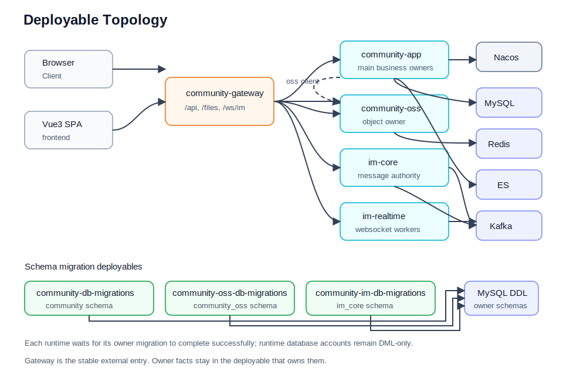
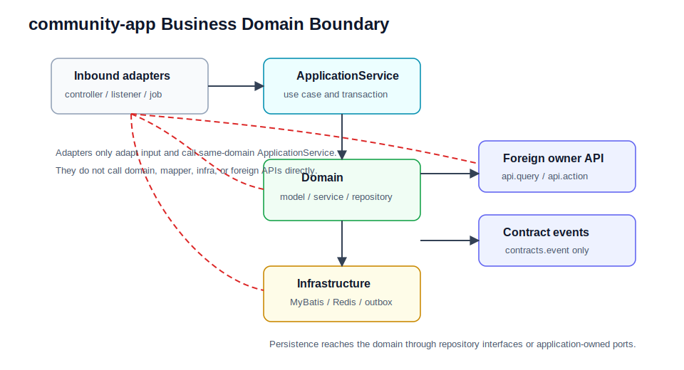

# 架构规则

本文档是 handbook 的架构规则 SSOT。它描述 deployable 边界、业务包边界、DDD Tactical Layering、跨域协作入口和守卫测试。系统协作机制见 [system-design.md](system-design.md)，业务链路见 [business-flows.md](business-flows.md)。

## 当前形态

本项目当前是 Maven 多模块后端 + Vue3 前端：

- `frontend/`：Vue3 SPA。
- `backend/community-gateway`：统一入口层，负责 HTTP / WebSocket 路由、CORS、trace 和边缘策略。
- `backend/community-app`：主业务 owner，是按包边界治理的 package-scoped monolith。
- `backend/community-oss`：独立 OSS deployable，负责对象元数据、版本、签名和公有文件访问。
- `backend/community-oss-client`：给业务服务调用 OSS 的 typed client。
- `backend/community-im`：IM 聚合模块，包含 `im-common`、`im-core`、`im-realtime`。
- `backend/community-db-migrations`：`community` schema 的 Flyway migration deployable。
- `backend/community-oss-db-migrations`：`community_oss` schema 的 Flyway migration deployable。
- `backend/community-im-db-migrations`：`im_core` schema 的 Flyway migration deployable。
- `backend/community-common/*`：共享 Web、安全、幂等、outbox、错误协议、trace 等横切能力。
- `deploy/`：本地 single / cluster 拓扑和默认启用的 observability overlay。

默认对外业务入口为 `community-gateway`，本地通过 NGINX / gateway 暴露在 `12880`。对外 API 前缀稳定为 `/api/**`，静态文件前缀稳定为 `/files/**`，其中 `/files/**` 由 `community-oss` 承担 canonical 对象读取；IM WebSocket 前缀稳定为 `/ws/im`；session bootstrap 由 `community-im-gateway` 负责，返回稳定的 `/ws/im`，worker 选择和内部桥接对客户端不可见。



## 能力边界速查

| 能力 | 对外入口 | SSOT / owner | 授权位置 |
| --- | --- | --- | --- |
| 认证与会话 | `/api/auth/**` | `auth`，包括 refresh session | `community-app` |
| 用户资料与头像 | `/api/users/**` | `user`；主页读取由 `profile` 聚合 | `community-app` |
| OSS 对象存储 | `/api/oss/**`, `/files/**` | `oss` | `community-oss` |
| 内容 | `/api/posts/**`, `/api/bookmarks`, `/api/categories/**`, `/api/tags/**` | `content` | `community-app` |
| 举报与治理 | `/api/reports/**`, `/api/moderation/**` | `content` + `user` | `community-app` |
| 社交 | `/api/likes/**`, `/api/follows/**`, `/api/blocks/**` | `social`；点赞写入由 `interaction` 编排 | `community-app` |
| 通知 | `/api/notices/**` | `notice` + `notice_record` 读模型 | `community-app` |
| 搜索 | `/api/search/**` | `search` + ES alias/index | `community-app` |
| analytics | `/api/analytics/**` | `analytics` + Redis | `community-app` |
| growth | 当前无独立前台 HTTP 面 | `growth` 任务/等级底座 | owner API / event |
| market | `/api/market/**`, `/api/admin/market/**` | `market` | `community-app` |
| wallet | `/api/wallet/**`, `/api/wallet/admin/**` | `wallet` | `community-app` |
| IM 私信/群聊 | `/api/im/sessions`, `/ws/im`, `/api/im/**` | `community-im-gateway` + `im-realtime` + `im-core` | IM 服务各自配置 |
| IM policy snapshot | `/internal/im/realtime/projections/**` | `user` / `social` SSOT，`community-app` 暴露 snapshot | internal scope JWT |

## community-app 强制包形态

所有 `backend/community-app` 后端业务代码必须使用 strict DDD Tactical Layering。每个业务域的标准包形态是：

```text
com.nowcoder.community.<domain>
  controller
  application
    command
    result
  domain
    model
    service
    repository
    event
  infrastructure
    persistence
      mapper
      dataobject
    event
  api
    query
    action
    model
  contracts
    event
```



允许有少量域特定 adapter 包，但职责必须能映射回上面的层次。例如 owner API adapter 可以位于 `infrastructure.api`，Spring event / outbox adapter 可以位于 `infrastructure.event`。

`drive` follows the same DDD tactical layering guardrails: controllers call same-domain application services, application services depend on drive domain contracts and application ports, and OSS collaboration is hidden behind drive infrastructure adapters.

## 非 business 代码边界

- `frontend/` 不承载后端 owner 规则。前端可以做交互校验、表单规范化、pending 状态展示和 refresh retry，但不能把浏览器字段当作 owner 事实来源。
- `community-gateway` 是入口和路由层，不承载主业务用例。新增浏览器入口、CORS、WebSocket proxy 或 trace 规则时，应保持 gateway-first，但业务授权和 owner 规则仍回到下游服务。
- `community-im` 独立承担 IM 消息权威状态和 realtime 连接态；主站通知读模型单独使用 `notice_record`。
- `community-common/*` 只能提供横切基础设施，不定义具体业务域 owner 语义。
- `deploy/` 和本地控制面只能描述运行拓扑和 dev-only 能力，不能成为业务规则来源。

## 层规则

### Controller / Listener / Handler / Bridge / Enqueuer / Job

- 只处理 HTTP / message / job 入口绑定、认证信息提取、基础参数转换、DTO 转换和 validation handoff。
- Inbound adapters include controllers, local event listeners, outbox handlers, event bridges, enqueuers, and scheduled jobs. They adapt input and call same-domain application services; they must not perform foreign owner `api.*`, foreign `application.*`, same-domain application helper/port, domain model/service/repository, or persistence collaboration before entering the same-domain application layer.
- same-domain 调用只能进入同域 `*ApplicationService`。
- 不直接调用 raw service、repository、mapper、domain service、infrastructure adapter。
- 不把 same-domain `api.*` 当内部入口使用。

### Application

- 是同域 use case 入口，命名为 `*ApplicationService`。
- 负责事务边界、幂等、actor/viewer 转换、command/result 装配、领域调用、领域事件发布和 foreign-domain `api.*` 调用。
- `application.command` / `application.result` / application-owned ports only express application semantics. They must not expose HTTP transport types such as `ResponseEntity`, `ResponseCookie`, `Resource`, `MediaType`, Servlet request/response types, or Spring Web upload types such as `MultipartFile`.
- 不直接依赖 MyBatis mapper 或 dataobject；持久化只通过 domain repository interface 或明确的 infrastructure port。
- 不新增以域名命名的聚合入口门面，例如 `AuthApplicationService`、`WalletApplicationService`、`MarketApplicationService`、`AdminWalletApplicationService`、`AdminMarketApplicationService` 这类只路由到同域多个更细 `*ApplicationService` 的类。controller / admin controller 应直接进入拥有该用例事务、幂等、审计和跨域协作语义的具体同域 `*ApplicationService`。

#### Application Service Collaboration

`ApplicationService` remains the same-domain use-case entry style. Controllers, listeners, jobs, outbox handlers, bridges, and enqueuers must enter only a same-domain `*ApplicationService`.

Same-domain `ApplicationService -> ApplicationService` collaboration is allowed only when the caller is an explicit process manager or larger use-case orchestrator. The class name must identify the process it owns, for example `MarketWalletActionProcessorApplicationService`, `MarketWalletActionRecoveryApplicationService`, `MarketOrderAutoConfirmApplicationService`, `NoticeProjectionApplicationService`, or `SearchPostProjectionApplicationService`.

Domain-named facade services such as `MarketApplicationService`, `WalletApplicationService`, or `ContentApplicationService` must not delegate to multiple same-domain application services. Reusable application helpers that are not use-case entries should use focused names such as `*Issuer`, `*Assembler`, `*Scheduler`, `*Coordinator`, or `*Component` and must stay in the application package only when they express application semantics.

Transactional methods must not rely on self-invocation for Spring proxy behavior. Public `@Transactional` overloads should delegate to a private non-annotated helper when they share an implementation.

### Domain

- 承载业务模型、领域规则、领域服务、策略、仓储接口和领域事件。
- 不依赖 controller、application、infrastructure、MyBatis mapper/dataobject、HTTP DTO、Spring framework、owner-domain `api.*`。
- 不负责跨域编排，不把外部 API 或事件契约当作内部领域模型。

### Infrastructure

- 承载 MyBatis mapper、dataobject、repository 实现、Redis、Elasticsearch、outbox、Spring event publisher、Kafka adapter 等技术细节。
- 可以实现 domain repository interface 或应用层端口。
- 不向 domain 泄漏 mapper/dataobject 类型。

### API 与 Contracts

- `api.query`、`api.action`、`api.model` 是 owner-domain 对外发布的同步协作契约，只给 foreign domain 使用。
- 同域调用不得把 same-domain `api.*` 当 service locator。
- `contracts.event` 是 owner-domain 对外发布的异步事件契约。
- 同步 API 边界不得 import、返回或接收 `contracts.event` 类型；同步和异步字段相同也要分别定义 `api.model` 和 `contracts.event` payload。

## 跨域协作规则

同步跨域协作：

```text
caller ApplicationService
  -> owner-domain api.query / api.action
  -> owner ApplicationService / adapter
  -> owner domain
```

异步跨域协作：

```text
owner domain event
  -> same-domain event bridge
  -> owner ApplicationService
  -> owner contracts.event -> eventbus.<owner>
  -> owner outbox handler -> <owner>.events
  -> consumer Kafka listener
  -> consumer ApplicationService
```

当前 Content、Social、User 的跨域事件都使用上述唯一链路。`projection.im.policy` 是 consumer 侧唯一保留的内部 projection outbox，不是第二条跨域发布路径。

禁止把以下类型作为跨域入口：

- `domain`
- `infrastructure`
- MyBatis mapper / dataobject
- root legacy `service`
- root legacy `entity`
- root legacy `mapper`
- producer 域内部 event implementation

## 禁止新增模式

不得新增以下模式：

- `Controller -> raw Service`
- `Controller -> UseCase`
- `Controller -> same-domain api.*`
- `Controller -> same-domain domain-named aggregate ApplicationService facade`
- `Controller / Listener / Handler / Bridge / Enqueuer / Job -> foreign api.*`
- `Controller / Listener / Handler / Bridge / Enqueuer / Job -> foreign application.*`
- `Controller / Listener / Handler / Bridge / Enqueuer / Job -> domain repository/service/model`
- `Controller / Listener / Handler / Bridge / Enqueuer / Job -> mapper/dataobject/persistence`
- `ApplicationService -> MyBatis mapper`
- `ApplicationService -> HTTP transport type`
- `Domain -> infrastructure`
- `Domain -> api.*`
- `api.* -> contracts.event`
- `UseCase + ApplicationService` 两套 competing entry style
- `CommandService`、`ActionService`、`FacadeService` 作为应用入口命名
- `AuthApplicationService` / `WalletApplicationService` 这类绕过 `FacadeService` 命名但实际只转发到同域多个应用服务的聚合入口
- `app/query`、`app/command` 或新的 `*UseCase` 包

旧 `service`、`entity`、`mapper`、`app` 包只能作为迁移表面。触碰相关代码时，应继续把业务规则迁向 `domain`，把 MyBatis 细节迁向 `infrastructure.persistence`，把同域入口迁向 `application.*ApplicationService`。

## 主要领域包

- `auth`：登录、刷新、登出、验证码、注册/激活、找回密码、登录风控和 refresh token session。
- `user`：用户账号、资料、头像、凭据、处罚状态和用户摘要。
- `profile`：用户主页同步聚合，只编排 user/social/content/growth owner query，不持有主事实。
- `interaction`：点赞写入同步编排，先解析 user/content 目标，再进入 social owner action。
- `content`：帖子、评论、回复、收藏、分类订阅、标签、举报和内容治理动作。
- `social`：点赞、关注、拉黑。
- `social` 严格互动链默认要求 `social.storage=db`；Redis-backed social storage 不是支持的 correctness runtime。
- `notice`：站内通知投影、列表、未读、摘要、已读。
- `search`：帖子搜索、搜索投影、ES alias/index。
- `analytics`：UV / DAU / 请求采集与查询。
- `growth`：任务模板、任务进度、等级规则、奖励发放协作。
- `market`：listing、库存、订单、交付/发货、争议和自动确认。
- `wallet`：钱包账户、充值、提现、转账、冻结、总账双分录、冲正。
- `im.projection`：主站提供给 IM realtime 的用户处罚/拉黑 policy snapshot。

## 共享基础设施

- `common-core`：统一错误协议、事件 envelope、基础工具。
- `common-web` / `common-webflux`：Servlet / WebFlux trace、错误响应、审计日志。
- `common-security`：JWT properties、decoder、subject / authority 解析。
- `common-idempotency`：HTTP 写接口幂等 guard 和存储抽象。
- `common-outbox`：DB outbox store、worker、scheduler、handler 分发。
- `com.nowcoder.community.infra.*`：`community-app` 内部安全、scheduler、startup validation、idempotency wiring 等应用级基础设施。

## 本地运行拓扑

本地入口统一通过 `deploy/deployment.sh`：

- `single`：单机开发拓扑。
- `cluster`：本地多副本 / 集群演练拓扑。
- `--scope infra`：只启动基础设施，便于 IDE 启动业务服务。
- `--no-observability`：关闭 observability overlay。

MySQL 主业务 schema 不再由 runtime service 或 first-boot final-state SQL 隐式升级。single / cluster 拓扑先运行 `community-db-migrations`、`community-oss-db-migrations`、`community-im-db-migrations`，对应 runtime service 通过 `service_completed_successfully` 等待 owner migration 成功后再启动。迁移账号拥有 DDL 权限，runtime 账号只保留 DML 权限；具体命令、history table 和 baseline 保护见 [data-and-storage.md](data-and-storage.md#flyway-migration-deployables)。

运行命令和端口见 [local-development.md](local-development.md)，观测和排障见 [operations.md](operations.md)。

## 守卫测试

后端架构规则由 ArchUnit 测试守卫：

- `DddLayeringArchTest`
- `ControllerBoundaryArchTest`
- `DomainBoundaryArchTest`
- `DtoBoundaryArchTest`
- `InfraBoundaryArchTest`
- `ListenerBoundaryArchTest`
- `TransactionBoundaryArchTest`

路径：

```text
backend/community-app/src/test/java/com/nowcoder/community/app/arch
```

当前 controller / listener / handler / bridge / enqueuer / job 应用边界 baseline 应保持为空；遗留的非协作面依赖只能收缩，不允许扩散。新增或修改架构规则时，必须同步更新本文件、[system-design.md](system-design.md)、严格 DDD 设计 spec 和对应 ArchUnit 测试。

## Architecture Verification

Use the Maven reactor form when validating architecture rules from a fresh checkout or after changing shared modules:

```bash
cd backend
mvn test -pl :community-app -am -Dtest='*ArchTest'
```

The narrower command below is still valid after local `0.0.1-SNAPSHOT` dependencies have been installed, but it can read stale artifacts from `~/.m2`:

```bash
cd backend
mvn test -pl :community-app -Dtest='*ArchTest'
```

## 文档守卫

架构规则变化必须同时更新 handbook 和守卫测试；业务实现变化不一定修改本文件，但只要改变了 owner、跨域协作入口、deployable 边界或禁止模式，就不能只改代码。

普通业务文档更新按职责分流：

- 链路和失败语义写到 [business-flows.md](business-flows.md)。
- 协作协议写到 [integration-contracts.md](integration-contracts.md)。
- 存储和 topic 写到 [data-and-storage.md](data-and-storage.md)。
- 运行排障写到 [operations.md](operations.md)。
