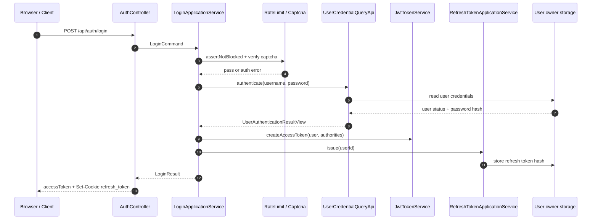
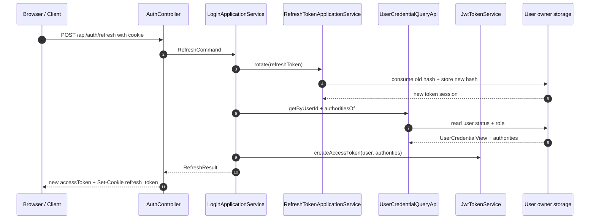
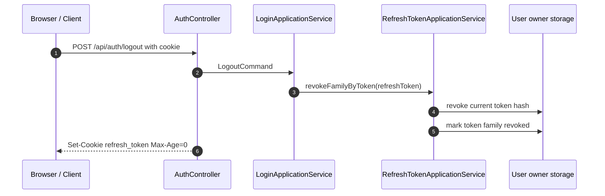
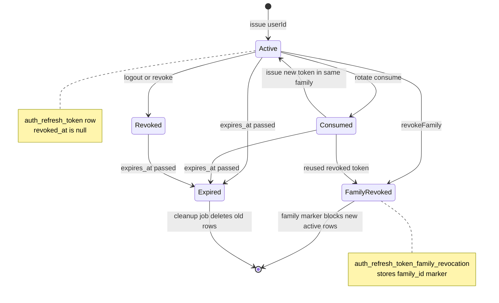

# 登录、刷新和会话流程

本文档描述 `community-app` 当前登录、refresh token 续期、logout 和后续 JWT 鉴权的代码链路。安全模型总览见 [security.md](security.md)，业务链路总览见 [business-flows.md](business-flows.md)。

## 入口和边界

认证相关入口由 `AuthSecurityRules` 放行：

- `POST /api/auth/login`
- `POST /api/auth/refresh`
- `POST /api/auth/logout`
- `GET /api/auth/captcha`
- `POST /api/auth/captcha/verify`

全局 API 安全配置在 `CommunitySecurityConfig`：`/api/**` 使用 stateless session，禁用 CSRF，并通过 Spring Security resource server 验证 Bearer JWT。除 `AuthSecurityRules` 显式放行的入口外，其余接口默认要求已认证。

`AuthOriginGuardFilter` 只覆盖 login / refresh / logout 这类 cookie 会话敏感入口。浏览器请求带 `Origin` 时，必须满足同源或 allowlist；无 `Origin` 的非浏览器客户端兼容放行。

## 登录入口

登录入口是 `AuthController.login(...)`，路径为 `POST /api/auth/login`。

controller 的职责只限 HTTP 适配：

1. 解析 `LoginRequest` 中的 `username`、`password`、`captchaId` 和 `captchaCode`。
2. 通过 `ClientIpResolver` 解析客户端 IP 和 IP 来源。
3. 组装 `LoginCommand`，调用 `AuthApplicationService.login(...)`。
4. 成功后将 `LoginResult.refreshCookie()` 写入 `Set-Cookie`。
5. 响应体只返回 `LoginResponse.accessToken`。

核心调用链：

```text
AuthController.login(...)
  -> AuthApplicationService.login(LoginCommand)
  -> LoginApplicationService.login(LoginCommand)
```

## 数据流总览

登录链路里的数据分成四类：HTTP 输入输出、应用层命令 / 结果、跨域 owner API 数据、存储数据。

三条接口的时序图分别放在对应流程章节：登录见“登录核心编排”，refresh 见“Refresh 续期”，logout 见“Logout”。本节只保留跨流程都成立的数据原则：access token 不写服务端存储；服务端只通过 JWT 签名和过期时间验证它。refresh token 明文只在浏览器 cookie 和请求 / 响应过程中出现，默认 DB store 只保存 SHA-256 hash。

## 运行时数据对象

| 层次 | 数据对象 | 关键字段 | 去向 / 存储 |
| --- | --- | --- | --- |
| HTTP | `LoginRequest` | `username`, `password`, `captchaId`, `captchaCode` | 浏览器 JSON -> `AuthController.login(...)` |
| HTTP | `LoginResponse`, `MeResponse` | `accessToken`；`userId`, `username`, `authorities` | controller -> 浏览器 JSON；`me` 来自已验证 JWT claim |
| application | `LoginCommand` | 登录凭证、验证码、`clientIp`, `clientIpSource` | controller 组装后进入 `LoginApplicationService` |
| application | `RefreshCommand`, `LogoutCommand` | `refreshToken` | 从 `refresh_token` cookie 读取 |
| application | `LoginResult`, `RefreshResult` | `accessToken`, `refreshCookie` | application 返回 controller |
| application | `RefreshCookieSpec` | cookie 名称、值、`HttpOnly`、`Secure`、`SameSite`、`Max-Age` | controller 转为 Spring `ResponseCookie` |
| owner API | `UserAuthenticationResultView` | `user`, `failure` | user owner -> auth application |
| owner API | `UserCredentialView` | `userId`, `username`, `status`, `type`, `headerUrl` | user owner 暴露账号状态和角色来源 |
| owner API | `RefreshTokenSessionView` | `tokenHash`, `userId`, `familyId`, `expiresAt`, `revokedAt` | user owner 暴露 refresh session 状态 |

## 数据归属矩阵

| 数据 | Owner / 存储 | 写入方 | 读取方 | 清理 / 失效 |
| --- | --- | --- | --- | --- |
| `password` 明文 | 不持久化 | 浏览器提交当前请求 | `UserCredentialApplicationService.authenticate(...)` 当前调用内使用 | 请求结束即丢弃；日志不记录 |
| `user.password`, `user.salt` | MySQL `user` | 注册、密码重置、历史密码升级 | user owner 认证流程 | 历史 MD5 校验成功后升级为 BCrypt |
| `user.status`, `user.type` | MySQL `user` | user owner | 登录、refresh、`authoritiesOf(...)` | 状态变更后需等下次 token 签发体现 |
| access token | 客户端 | `JwtTokenService.createAccessToken(...)` | Spring Security resource server、`/api/auth/me` | 服务端不保存，依赖短 TTL 过期 |
| refresh token 明文 | 浏览器 HttpOnly cookie | `RefreshTokenApplicationService.issue(...)` | refresh / logout 请求读取 cookie | refresh rotation、logout 或失败清 cookie |
| refresh token hash | MySQL `auth_refresh_token.token_hash` | `DbRefreshTokenRepository.store(...)` | `consume(...)`, `find(...)`, `revoke(...)` | `revoked_at` 非空、过期或 cleanup 删除 |
| token family marker | MySQL `auth_refresh_token_family_revocation` | `revokeFamily(...)` | `store(...)` 防止已撤销 family 回写 active token | 按 family 撤销语义长期保留或随清理策略处理 |
| 登录失败计数 | Redis `auth:login:fail:*` | `LoginRateLimitApplicationService.recordFailure(...)` | `assertNotBlocked(...)`, `isCaptchaRequired(...)` | 登录成功 `reset(...)` 删除，或 TTL 到期 |
| 验证码 | Redis `captcha:*`, `captcha:fail:*` | `CaptchaApplicationService.issue(...)` / mismatch 自增 | `CaptchaApplicationService.verify(...)` | 验证成功、失败过多、显式删除或 TTL 到期 |

敏感数据处理：

- `password` 只用于当前认证调用，不进入 auth 域持久化。
- `refreshToken` 明文只用于 cookie、请求读取和 hash 计算；默认 DB store 不落明文。
- `accessToken` 只返回给客户端，服务端不保存在线 session。
- 安全日志记录用户名、用户 ID、IP 和失败原因，不记录密码或 refresh token 明文。

## 登录核心编排

`LoginApplicationService.login(...)` 是登录状态机。它不直接查用户表，而是编排 auth 域能力，并通过 user owner 的同步 API 校验账号。

下图只表达登录成功主路径上的跨组件调用顺序。验证码缺失、验证码错误、账号禁用、密码错误和风控阻断会在 `LoginApplicationService.login(...)` 内提前抛错，不会进入 token 签发。



图中的 `Risk` 合并表示登录风控和验证码校验；`Store` 表示 user owner 管理的数据存储，包括用户凭证表和 refresh session 表。具体 Redis key、MySQL 字段和清理语义见“数据归属矩阵”“登录风控和验证码”和“Refresh Session DB 状态”。

主流程：

1. 从 `LoginCommand` 取 `username`、`password`、`captchaId`、`captchaCode`、`clientIp` 和 `clientIpSource`。
2. 调用 `LoginRateLimitApplicationService.assertNotBlocked(...)`，检查当前 IP / 用户名是否已经超过失败阈值。
3. 调用 `LoginRateLimitApplicationService.isCaptchaRequired(...)`，判断当前请求是否必须带验证码。
4. 如果需要验证码但请求没有 `captchaId` / `captchaCode`，记录一次失败，写安全日志，抛出 `AuthErrorCode.CAPTCHA_REQUIRED`。
5. 如果请求带验证码，调用 `CaptchaApplicationService.verify(...)`。验证失败时记录失败，写安全日志，抛出 `AuthErrorCode.CAPTCHA_INVALID`。
6. 调用 `AuthDomainService.requireCredentials(...)` 校验用户名和密码非空。空值按 `AuthErrorCode.INVALID_CREDENTIALS` 处理。
7. 调用 `UserCredentialQueryApi.authenticate(...)` 进入 user owner 域校验用户名、密码和账号状态。
8. user 域返回未认证时，`authenticationFailure(...)` 将结果转换为 `INVALID_CREDENTIALS` 或 `USER_DISABLED`。
9. 认证失败、账号禁用、验证码缺失和验证码错误都会调用 `LoginRateLimitApplicationService.recordFailure(...)`，并写结构化安全日志。
10. 认证成功后调用 `LoginRateLimitApplicationService.reset(...)` 清理该用户名 / IP 的失败计数。
11. 调用 `issueLoginResult(...)` 签发 access token 和 refresh token。
12. 写登录成功安全日志，并通过 `AnalyticsIngestActionApi.recordLoginSuccess(...)` 记录登录成功埋点。

失败语义：

- 用户名为空、密码为空、用户不存在、密码错误：`AuthErrorCode.INVALID_CREDENTIALS`。
- 用户 `status == 0`：`AuthErrorCode.USER_DISABLED`。
- 需要验证码但未提交：`AuthErrorCode.CAPTCHA_REQUIRED`。
- 验证码错误或过期：`AuthErrorCode.CAPTCHA_INVALID`。
- 达到登录失败阈值：`CommonErrorCode.TOO_MANY_REQUESTS`。
- 登录风控依赖异常：`CommonErrorCode.SERVICE_UNAVAILABLE`。

## 登录风控和验证码

登录风控由 `LoginRateLimitApplicationService` 编排，底层通过 `LoginRateLimitRepository` 计数。

默认配置：

```yaml
auth:
  login-rate-limit:
    enabled: true
    window-seconds: 60
    max-failures-per-ip: 20
    max-failures-per-user: 5
    captcha-required-failures-per-ip: 5
    captcha-required-failures-per-user: 2
```

关键行为：

- 失败计数按 IP 和用户名分别维护。
- 用户名失败 2 次或 IP 失败 5 次后要求验证码。
- 用户名失败 5 次或 IP 失败 20 次后直接拒绝登录。
- 登录成功后，当前用户名 / IP 的失败计数会被清理。
- 风控依赖异常时，阻断登录并返回服务不可用，避免 fail-open。

验证码由 `CaptchaApplicationService` 负责。默认 Redis store，TTL 60 秒，最多失败 3 次。`verify(...)` 使用 `CaptchaRepository.verifyAndConsume(...)`，匹配成功后验证码被消费；失败次数达到上限后删除验证码，要求重新获取。

Redis 运行态数据：

| 能力 | Key | Value / TTL | 生命周期 |
| --- | --- | --- | --- |
| 登录风控 | `auth:login:fail:ip:<ip>` | 失败次数；TTL 为 `auth.login-rate-limit.window-seconds` | `recordFailure(...)` 自增；登录成功 `reset(...)` 删除 |
| 登录风控 | `auth:login:fail:user:<username>` | 失败次数；TTL 为 `auth.login-rate-limit.window-seconds` | 用户名 trim 后转小写；登录成功删除 |
| 验证码 | `captcha:<captchaId>` | 验证码明文；TTL 为 `auth.captcha.ttl-seconds` | `issue(...)` 写入；匹配成功、失败过多或显式删除时删除 |
| 验证码 | `captcha:fail:<captchaId>` | 验证失败次数；TTL 与验证码对齐 | mismatch 后自增；验证码删除时同步删除 |

`LoginRateLimitDomainService.keyOf(...)` 规范化 Redis key。风控自增使用 Lua 脚本保证首次写入时设置 TTL。验证码比对大小写不敏感，`verifyAndConsume(...)` 成功后会同时删除验证码和失败次数，避免重复使用。

## 账号密码校验

auth 域通过 `UserCredentialQueryApi.authenticate(...)` 调 user owner。适配器是 `UserCredentialApiAdapter`，实际进入 `UserCredentialApplicationService.authenticate(...)`。

user owner 认证流程：

1. 通过 `UserCredentialDomainService.trim(...)` 规范化用户名和密码。
2. 用户名或密码为空时返回 `UserAuthenticationResult.invalidCredentials()`。
3. 通过 `UserRepository.findByUsername(...)` 查询用户。
4. 用户不存在时返回 `invalidCredentials()`，不暴露账号是否存在。
5. `user.status() == 0` 时返回 `UserAuthenticationResult.userDisabled(...)`。
6. `passwordMatches(...)` 校验密码。
7. 如果历史密码格式校验成功，调用 `userRepository.updatePassword(...)` 将密码升级为 BCrypt。
8. 校验通过后返回 `UserAuthenticationResult.authenticated(...)`，再由 `UserCredentialApiAdapter` 转为 `UserAuthenticationResultView` 给 auth 域。

密码格式：

- BCrypt：`BCryptPasswordEncoder.matches(rawPassword, encodedPassword)`。
- 历史格式：`MD5(rawPassword + salt)`，规则在 `UserCredentialDomainService.legacyPasswordMatches(...)`。

authorities 也由 user owner 计算：`UserCredentialApplicationService.authoritiesOf(...)` 根据 `user.type` 返回 `ROLE_ADMIN`、`ROLE_MODERATOR` 或 `ROLE_USER`。

用户凭证存储：

| 表 | 核心字段 | 用途 |
| --- | --- | --- |
| `user` | `id`, `username`, `password`, `salt`, `email` | 登录名、密码 hash 和历史 salt；`id` 是 JWT `sub` 与 refresh session `user_id` 来源 |
| `user` | `type`, `status`, `header_url` | `type` 决定角色；`status == 0` 视为禁用；`header_url` 暴露到 `UserCredentialView` |

`UserMapper.selectByName(...)` 从 `user` 表读取 `id, username, password, salt, email, type, status, header_url, create_time, score, mute_until, ban_until`。历史密码登录成功后，`UserMapper.updatePassword(...)` 只更新 `user.password` 为 BCrypt hash，`salt` 字段不再参与新密码校验。

## Token 签发

登录成功后，`LoginApplicationService.issueLoginResult(...)` 负责签发凭证：

```text
UserCredentialQueryApi.authoritiesOf(user)
  -> AuthTokenPort.createAccessToken(...)
  -> RefreshTokenApplicationService.issue(userId)
  -> LoginResult(accessToken, refreshCookie)
```

access token 由 `JwtTokenService.createAccessToken(...)` 签发：

- 签名算法：HS256。
- `sub`：用户 UUID。
- `username`：用户名。
- `authorities`：角色列表。
- `issuer`：`security.jwt.issuer`。
- `issuedAt` / `expiresAt`：签发和过期时间。

refresh token 由 `RefreshTokenApplicationService.issue(...)` 签发：

- 生成新的 token family。
- 生成随机 refresh token。
- 根据 `security.jwt.refresh-token-ttl-seconds` 计算过期时间。
- 通过 `RefreshTokenRepository.store(...)` 保存。
- 构造 HttpOnly refresh cookie。

默认 JWT / cookie 配置：

```yaml
security:
  jwt:
    issuer: community-auth
    access-token-ttl-seconds: 900
    refresh-token-ttl-seconds: 604800
    refresh-cookie-name: refresh_token
    refresh-cookie-path: /api/auth
    refresh-cookie-same-site: Lax
    refresh-cookie-secure: false
```

当前默认 `auth.refresh.store=db`。DB-backed 实现是 `DbRefreshTokenRepository`：auth application 先对 refresh token 做 SHA-256，再通过 user owner 的 `UserRefreshTokenSessionActionApi` / `UserRefreshTokenSessionQueryApi` 读写 `auth_refresh_token`，不会明文落库。

token / cookie 数据：

| 数据 | 内容 | 存储位置 |
| --- | --- | --- |
| access token | HS256 JWT；`sub`, `username`, `authorities`, `issuer`, `issuedAt`, `expiresAt` | 客户端持有；服务端不保存 |
| refresh token 明文 | 随机 UUID 去连字符字符串 | 浏览器 HttpOnly cookie；请求 / 响应过程中短暂使用 |
| refresh token hash | SHA-256 hex，64 字符 | 默认写入 `auth_refresh_token.token_hash` |
| token family | UUID 去连字符字符串 | `auth_refresh_token.family_id` 或 Redis family set |
| refresh cookie | `RefreshCookieSpec` 转成 `Set-Cookie` | 浏览器 cookie jar |

cookie 属性来自 `RefreshCookieSpec`：

- `name`：默认 `refresh_token`。
- `value`：refresh token 明文；清理 cookie 时是空字符串。
- `httpOnly`：固定 `true`。
- `secure`：来自 `security.jwt.refresh-cookie-secure`。
- `path`：默认 `/api/auth`，只覆盖 login / refresh / logout 等认证路径。
- `sameSite`：默认 `Lax`。
- `maxAgeSeconds`：签发时等于 refresh token TTL；清理时为 `0`。

## 后续鉴权

登录响应体返回的 access token 由前端放入后续业务请求：

```text
Authorization: Bearer <accessToken>
```

`CommunitySecurityConfig` 的 resource server 会验证 JWT 并构造 `Authentication`。业务 controller 从 Spring Security 当前认证对象读取登录用户。

`GET /api/auth/me` 直接读取已验证 JWT claim：

- `sub` 转为 `userId`。
- `username` 从 claim 读取。
- `authorities` 从 claim 读取。

`/api/auth/me` 不实时回源查库；角色变化通常要等下一次 access token 重新签发后体现。

## Refresh 续期

`POST /api/auth/refresh` 从 `refresh_token` cookie 读取 refresh token，进入 `LoginApplicationService.refresh(...)`。

下图只表达 refresh 成功主路径。旧 token 找不到、已过期、已撤销、新 token 写入失败、用户不存在或用户被禁用时，流程会提前失败；其中 `REFRESH_TOKEN_INVALID` 和 `USER_DISABLED` 会触发浏览器 refresh cookie 清理。



图中的 rotation 包含两个状态变化：旧 refresh token hash 被消费并写入 `revoked_at`，同一 family 下的新 refresh token hash 被保存为 active。更细的 token 状态变化见“Refresh Session DB 状态”。

主流程：

1. refresh token 为空时抛出 `AuthErrorCode.REFRESH_TOKEN_INVALID`。
2. `RefreshTokenApplicationService.rotate(...)` 消费旧 token。
3. 旧 token 找不到、已过期、已撤销或新 token 写入失败时，返回无效 refresh token。
4. 旋转成功后，通过新 refresh token 查出用户 ID。
5. 回源 user owner 查询用户凭证。
6. 用户不存在或 `status == 0` 时抛出 `AuthErrorCode.USER_DISABLED`。
7. 重新获取 authorities。
8. 签发新的 access token。
9. 返回新的 refresh cookie。

refresh token rotation 语义：

- 每次 refresh 都消费旧 refresh token。
- 成功后签发同一 family 下的新 refresh token。
- 旧 token 不再保持 active。
- 如果检测到已撤销 refresh token 被复用，`maybeRevokeFamilyForReusedToken(...)` 会按 grace window 判断是否撤销整个 family。

如果 refresh 失败且错误码是 `USER_DISABLED` 或 `REFRESH_TOKEN_INVALID`，`AuthController.refresh(...)` 会通过 `AuthApplicationService.clearRefreshCookie()` 写入 `maxAge=0` 的 refresh cookie。

## Logout

`POST /api/auth/logout` 从 cookie 读取 refresh token，进入 `LoginApplicationService.logout(...)`。

下图表达 logout 的服务端效果。logout 不需要重新校验用户密码，也不回源签发新 token；它只尽力撤销 refresh token family，并让浏览器删除 cookie。



如果请求里没有 refresh token，`LoginApplicationService.logout(...)` 不做 repository 操作，但 `AuthController.logout(...)` 仍会写 `Max-Age=0` 的 cookie 清理响应。

行为：

1. refresh token 为空时，只清浏览器 cookie，不做 repository 操作。
2. refresh token 存在时，调用 `RefreshTokenApplicationService.revokeFamilyByToken(...)`。
3. repository 先撤销当前 token。
4. 如果能找到该 token 所属 family，则撤销整个 family。
5. controller 写入 `maxAge=0` 的 refresh cookie，让浏览器清掉 `refresh_token`。

logout 不撤销已经签出的 access token；access token 继续依赖短 TTL 自然过期。退出登录的主要服务端效果是阻止 refresh token 继续续期。

## Refresh Session DB 状态

`auth_refresh_token` 是 DB refresh session 主状态：

- 保存 refresh token hash，不保存 refresh token 明文。
- 保存用户、family、过期时间和撤销时间。
- `store(...)` 在签发 refresh token 时写入 active session。
- `consume(...)` 在 refresh 时消费当前 active token。
- `revoke(...)` 用于单 token 撤销。
- `revokeFamily(...)` 用于 token family 族撤销。
- `revokeByUserId(...)` 用于密码重置后撤销该用户全部 refresh sessions。
- `deleteExpiredBefore(...)` 由 cleanup job 调用，只清理已过期 refresh session，不影响已经签出的 access token。

DB schema 精简视图：

| 表 | 字段 |
| --- | --- |
| `auth_refresh_token` | `token_hash char(64)` 主键、`user_id`, `family_id`, `expires_at`, `revoked_at`, `created_at` |
| `auth_refresh_token_family_revocation` | `family_id` 主键、`revoked_at` |

DB store 状态机：



默认 DB store 的代码路径仍遵守 DDD 边界：`RefreshTokenApplicationService` 通过 `DbRefreshTokenRepository` 计算 SHA-256，再调用 user owner 的 `UserRefreshTokenSessionActionApi` / `UserRefreshTokenSessionQueryApi`，最终由 `RefreshTokenSessionApplicationService` 和 `MyBatisRefreshTokenSessionRepository` 落到 `auth_refresh_token`。`auth_refresh_token_family_revocation` 还有防回写作用：`store(...)` 写新 token 时会检查 family 是否已经撤销；已撤销 family 不会重新写成 active。

可选 Redis refresh token store 不是默认路径。切换到 Redis store 时，核心 key 是 `auth:refresh:<refreshToken>`、`auth:refresh:revoked:<refreshToken>`、`auth:refresh:family:<familyId>` 和 `auth:refresh:family:revoked:<familyId>`，分别保存 active token、撤销 tombstone、family active set 和 family revocation marker。

当前 `application.yml` 默认 `auth.refresh.store: db`，所以上述 Redis key 是切换到 Redis store 时的实现语义，不是默认运行路径。

## 关键代码

| 类 | 职责 | 源码 |
| --- | --- | --- |
| `AuthController` | HTTP 入口、cookie 读写、DTO 转换 | [AuthController.java](../../backend/community-app/src/main/java/com/nowcoder/community/auth/controller/AuthController.java) |
| `AuthSecurityRules` | 放行 auth 公开入口 | [AuthSecurityRules.java](../../backend/community-app/src/main/java/com/nowcoder/community/auth/security/AuthSecurityRules.java) |
| `AuthOriginGuardFilter` | login / refresh / logout Origin 防护 | [AuthOriginGuardFilter.java](../../backend/community-app/src/main/java/com/nowcoder/community/auth/infrastructure/web/AuthOriginGuardFilter.java) |
| `AuthApplicationService` | auth 应用门面 | [AuthApplicationService.java](../../backend/community-app/src/main/java/com/nowcoder/community/auth/application/AuthApplicationService.java) |
| `LoginApplicationService` | login / refresh / logout 用例编排 | [LoginApplicationService.java](../../backend/community-app/src/main/java/com/nowcoder/community/auth/application/LoginApplicationService.java) |
| `LoginRateLimitApplicationService` | 登录失败计数和验证码门槛 | [LoginRateLimitApplicationService.java](../../backend/community-app/src/main/java/com/nowcoder/community/auth/application/LoginRateLimitApplicationService.java) |
| `CaptchaApplicationService` | 验证码签发和校验 | [CaptchaApplicationService.java](../../backend/community-app/src/main/java/com/nowcoder/community/auth/application/CaptchaApplicationService.java) |
| `RefreshTokenApplicationService` | refresh token 签发、旋转、撤销 | [RefreshTokenApplicationService.java](../../backend/community-app/src/main/java/com/nowcoder/community/auth/application/RefreshTokenApplicationService.java) |
| `DbRefreshTokenRepository` | refresh token hash 的 DB-backed adapter | [DbRefreshTokenRepository.java](../../backend/community-app/src/main/java/com/nowcoder/community/auth/application/DbRefreshTokenRepository.java) |
| `JwtTokenService` | access token 签发和验证 | [JwtTokenService.java](../../backend/community-app/src/main/java/com/nowcoder/community/auth/infrastructure/jwt/JwtTokenService.java) |
| `AuthDomainService` | auth 域基础凭证规则 | [AuthDomainService.java](../../backend/community-app/src/main/java/com/nowcoder/community/auth/domain/service/AuthDomainService.java) |
| `CaptchaDomainService` | 验证码域规则 | [CaptchaDomainService.java](../../backend/community-app/src/main/java/com/nowcoder/community/auth/domain/service/CaptchaDomainService.java) |
| `LoginRateLimitDomainService` | 风控 key 和阈值规则 | [LoginRateLimitDomainService.java](../../backend/community-app/src/main/java/com/nowcoder/community/auth/domain/service/LoginRateLimitDomainService.java) |
| `RefreshTokenDomainService` | refresh token 过期、复用判断规则 | [RefreshTokenDomainService.java](../../backend/community-app/src/main/java/com/nowcoder/community/auth/domain/service/RefreshTokenDomainService.java) |
| `UserCredentialApiAdapter` | user owner 同步 API adapter | [UserCredentialApiAdapter.java](../../backend/community-app/src/main/java/com/nowcoder/community/user/infrastructure/api/UserCredentialApiAdapter.java) |
| `UserCredentialApplicationService` | user owner 账号密码校验和角色计算 | [UserCredentialApplicationService.java](../../backend/community-app/src/main/java/com/nowcoder/community/user/application/UserCredentialApplicationService.java) |
| `RefreshTokenSessionApplicationService` | user owner refresh session 状态写入 / 查询 | [RefreshTokenSessionApplicationService.java](../../backend/community-app/src/main/java/com/nowcoder/community/user/application/RefreshTokenSessionApplicationService.java) |
