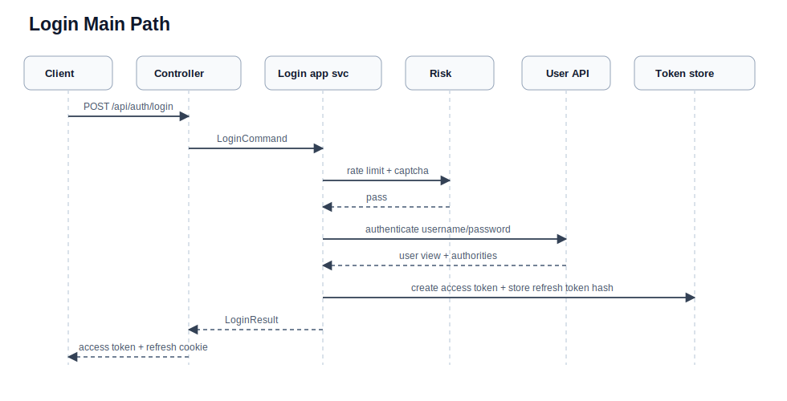
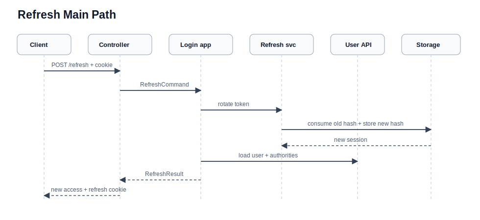
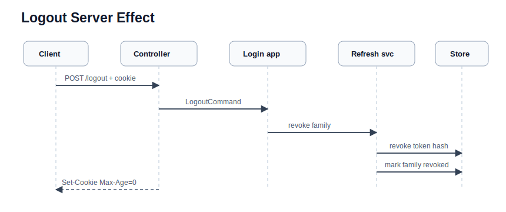
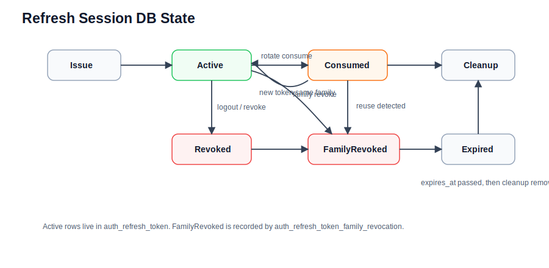

# Auth 登录、会话和续期流程

本文档描述 `community-app` 当前 auth 登录、注册验证后自动登录、refresh token 续期、logout、`/me` 和后续 JWT 鉴权链路。安全模型总览见 [security.md](security.md)，业务流程总览见 [business-flows.md](business-flows.md)。

## 核心模型

`community-app` 的浏览器会话由两类 token 组成：

| 凭证 | 载体 | 服务端状态 | 用途 |
| --- | --- | --- | --- |
| access token | `LoginResponse.accessToken`，由前端放入 `Authorization: Bearer ...` | 不保存在线 session，只验证 JWT 签名、issuer 和过期时间 | 访问 `/api/**` 受保护接口 |
| refresh token | `refresh_token` HttpOnly cookie | 默认 DB store 保存 SHA-256 hash 和 family 状态 | access token 过期后续期，logout / 密码重置后撤销 |

默认运行路径是：

```text
AuthController
  -> AuthApplicationService
      -> LoginApplicationService / RegistrationVerificationApplicationService
          -> auth domain service / auth repository interface
          -> user api.query / api.action
          -> analytics api.action
              -> auth infrastructure / user infrastructure
```

边界原则：

- controller 只做 HTTP binding、cookie 读写、认证对象提取和 DTO 转换。
- auth application 负责登录、续期、退出、验证码、风控、token 签发和跨域同步 API 编排。
- user owner 负责用户凭证、角色、账号状态和默认 DB refresh session 持久化。
- auth domain 不直接依赖 user owner、Spring Web、MyBatis、Redis 或 HTTP DTO。
- access token 不落库；refresh token 明文不落库。

## HTTP 入口

`CommunitySecurityConfig` 对 `/api/**` 和 `/internal/**` 使用 stateless session，禁用 CSRF，并通过 Spring Security resource server 验证 JWT。`AuthSecurityRules` 放行 auth 公开入口，其余接口默认要求认证。

| Endpoint | 认证要求 | 主要效果 |
| --- | --- | --- |
| `POST /api/auth/login` | public | 校验用户名密码，签发 access token，写 refresh cookie |
| `POST /api/auth/refresh` | public，依赖 refresh cookie | rotate refresh token，签发新 access token，写新 refresh cookie |
| `POST /api/auth/logout` | public，依赖 refresh cookie | 撤销 refresh token family，清 refresh cookie |
| `GET /api/auth/me` | Bearer JWT | 从已验证 JWT claim 返回当前用户 |
| `GET /api/auth/captcha` | public | 签发登录 / 注册 / 密码重置可复用的验证码 |
| `POST /api/auth/register` | public | 校验注册字段和图形验证码，创建 registration draft 并发送邮箱验证码 |
| `POST /api/auth/register/code/resend` | public | 校验 registration draft 和图形验证码，重发邮箱验证码 |
| `POST /api/auth/register/code/verify` | public | 注册验证码通过后创建用户并自动登录，写 refresh cookie |
| `POST /api/auth/password/reset/request` | public | 校验邮箱和图形验证码，发送密码重置链接 |
| `POST /api/auth/password/reset/confirm` | public | 重置密码，并撤销该用户所有 refresh sessions |

`AuthOriginGuardFilter` 覆盖所有 public 且会改变认证状态的 auth POST 入口：login、refresh、logout、register、register code resend / verify、password reset request / confirm。浏览器请求带 `Origin` 时必须同源或命中 allowlist；没有 `Origin` 的非浏览器客户端按服务端调用放行。

## 运行时数据

| 层次 | 类型 / 对象 | 关键字段 | 去向 |
| --- | --- | --- | --- |
| HTTP request | `LoginRequest` | `username`, `password`, `captchaId`, `captchaCode` | `AuthController.login(...)` |
| HTTP request | cookie `refresh_token` | refresh token 明文 | `refresh(...)` / `logout(...)` 读取 |
| HTTP response | `LoginResponse` | `accessToken` | 登录、注册验证、refresh 返回给客户端 |
| HTTP response | `Set-Cookie` | `refresh_token` | 登录、注册验证、refresh 写入；logout / refresh 失败清理 |
| application command | `LoginCommand` | 登录凭证、验证码、`clientIp`, `clientIpSource` | controller 组装后进入 auth application |
| application command | `RefreshCommand`, `LogoutCommand` | `refreshToken` | 从 cookie 读取后传入 application |
| application result | `LoginResult`, `RefreshResult` | `accessToken`, `RefreshCookieSpec` | application 返回 controller |
| owner API | `UserAuthenticationResultView` | `authenticated`, `failure`, `user` | user owner 认证结果 |
| owner API | `UserCredentialView` | `userId`, `username`, `status`, `type`, `headerUrl` | 角色计算、refresh 后回源校验 |
| owner API | `RefreshTokenSessionView` | `tokenHash`, `userId`, `familyId`, `expiresAt`, `revokedAt` | 默认 DB refresh store 状态 |

敏感数据处理：

- `password` 只在当前认证调用内使用，不进入 auth 持久化，也不写日志。
- refresh token 明文只存在于 cookie、当前请求 / 响应和 hash 计算过程。
- refresh token、registration token 和 password reset token 明文都由 auth application 使用统一的 256-bit `SecureRandom` 生成器生成，并使用 base64url 无填充编码。
- 注册邮箱验证码由同一安全随机生成器生成 6 位数字码。
- 默认 DB store 只保存 refresh token 的 SHA-256 hex hash。
- 安全日志记录用户名、用户 ID、IP、IP 来源和失败原因，不记录密码或 refresh token 明文。

## 登录流程

入口是 `AuthController.login(...)`，路径为 `POST /api/auth/login`。



controller 职责：

1. 校验并解析 `LoginRequest`。
2. 用 `ClientIpResolver` 解析客户端 IP 和来源。
3. 创建 `LoginCommand`，调用 `AuthApplicationService.login(...)`。
4. 将 `LoginResult.refreshCookie()` 转为 `Set-Cookie`。
5. 响应体只返回 `LoginResponse.accessToken`。

application 主流程：

1. `LoginRateLimitApplicationService.assertNotBlocked(...)` 检查 IP / 用户名失败计数。
2. `isCaptchaRequired(...)` 判断是否必须提交验证码。
3. 需要验证码但缺少 `captchaId` / `captchaCode` 时，记录失败并抛 `CAPTCHA_REQUIRED`。
4. 提交验证码时由 `CaptchaApplicationService.verify(...)` 校验；失败记录风控并抛 `CAPTCHA_INVALID`。
5. `AuthDomainService.requireCredentials(...)` 校验用户名和密码非空。
6. `UserCredentialQueryApi.authenticate(...)` 进入 user owner 校验账号状态和 BCrypt 密码。
7. 认证失败转换为 `INVALID_CREDENTIALS` 或 `USER_DISABLED`，并计入风控失败次数。
8. 认证成功后 `LoginRateLimitApplicationService.reset(...)` 清除当前用户名 / IP 失败计数。
9. `issueLoginResult(...)` 签发 access token 和 refresh token。
10. 写安全日志，并通过 `AnalyticsIngestActionApi.recordLoginSuccess(...)` 记录登录成功。

登录失败语义：

| 场景 | 错误 |
| --- | --- |
| 用户名 / 密码为空、用户不存在、密码错误 | `AuthErrorCode.INVALID_CREDENTIALS` |
| `user.status == 0` | `AuthErrorCode.USER_DISABLED` |
| 已达到验证码门槛但未提交验证码 | `AuthErrorCode.CAPTCHA_REQUIRED` |
| 验证码错误、过期或失败过多后被删除 | `AuthErrorCode.CAPTCHA_INVALID` |
| IP / 用户名达到失败阈值 | `CommonErrorCode.TOO_MANY_REQUESTS` |
| 登录风控或验证码依赖不可用 | `CommonErrorCode.SERVICE_UNAVAILABLE` |

## 注册验证后自动登录

`POST /api/auth/register/code/verify` 不是密码登录，但成功后同样返回登录态。

```text
AuthController.verifyRegisterCode(...)
  -> AuthApplicationService.verifyRegisterCode(...)
  -> RegistrationVerificationApplicationService.verifyAndLogin(...)
      -> RegistrationCodeRepository.verifyAndConsume(...)
      -> UserRegistrationActionApi.createVerifiedRegistrationUser(...)
      -> LoginApplicationService.issueLoginResult(...)
```

关键语义：

- registration draft 和邮箱验证码校验通过后才创建 active 用户。
- prepare registration 阶段会先由 user owner 检查用户名和邮箱是否已存在；验证码通过后的最终插入仍以数据库唯一约束处理竞态冲突。
- 创建用户成功后不再走用户名密码认证，而是对刚创建的 `UserCredentialView` 调 `issueLoginResult(...)`。
- 响应体仍是 `LoginResponse(accessToken)`，并写入 refresh cookie。
- `finally` 中 best-effort 删除 registration draft，避免重复使用。
- 如果 active 用户已经创建但自动登录签发 token 失败，返回 `REGISTRATION_ACTIVATED_LOGIN_REQUIRED`，前端清理注册上下文并提示用户直接登录，避免误导用户重复注册。

## JWT 和 `/me`

access token 由 `JwtTokenService.createAccessToken(...)` 签发：

| Claim / 属性 | 来源 |
| --- | --- |
| `alg` | HS256 |
| `iss` | `security.jwt.issuer` |
| `sub` | `UserCredentialView.userId()` |
| `username` | `UserCredentialView.username()` |
| `authorities` | `UserCredentialQueryApi.authoritiesOf(user)` |
| `iat`, `exp` | 当前时间和 `security.jwt.access-token-ttl-seconds` |

JWT 编解码由 `JwtCodecs` 创建，要求 `security.jwt.hmac-secret` 满足 HS256 secret 要求，并使用 configured issuer 做默认校验。`CommunitySecurityConfig` 的 resource server 验证 Bearer JWT 后，`AuthoritiesConverterFactory` 将 `authorities` claim 转为 Spring Security authority。

`GET /api/auth/me` 不回源查库，只读取已验证 JWT：

```text
CurrentUser.requireJwt(authentication)
  -> sub -> userId
  -> username claim
  -> authorities claim
```

因此用户角色或账号状态变化不会立刻反映到已签出的 access token；通常要等下一次 refresh 或重新登录后重新签发。

## Refresh 续期

入口是 `AuthController.refresh(...)`，路径为 `POST /api/auth/refresh`。refresh token 从 `refresh_token` cookie 读取，不从请求体读取。



主流程：

1. cookie 缺失或空值时抛 `REFRESH_TOKEN_INVALID`。
2. `RefreshTokenApplicationService.consume(...)` 消费旧 token。
3. 旧 token 找不到、已撤销或已过期时返回 invalid；被撤销 token 复用仍会走 family reuse 检测。
4. 使用已消费 token 中的 `userId` 回源 `UserCredentialQueryApi.getByUserId(...)` 校验用户仍存在且未禁用。
5. 用户不存在或被禁用时撤销该 `familyId`，抛 `USER_DISABLED`，controller 会清 refresh cookie。
6. 重新计算 authorities，签发新的 access token。
7. 通过 `RefreshTokenApplicationService.issueInFamily(...)` 写入同 family 的新 refresh token，并返回新的 refresh cookie。

rotation 语义：

- 每次 refresh 都消费旧 refresh token。
- 新 refresh token 复用同一个 `familyId`。
- 旧 token 不再 active。
- 新 refresh token 不会在用户存在性和状态校验前提前签发。
- 如果旧 token 已被撤销但又被复用，`maybeRevokeFamilyForReusedToken(...)` 会检查 `security.jwt.refresh-reuse-grace-seconds`；超过 grace window 且未过期时撤销整个 family。
- refresh 失败且错误是 `REFRESH_TOKEN_INVALID` 或 `USER_DISABLED` 时，controller 会额外写入 `Max-Age=0` 的 clear cookie。

## Logout

入口是 `AuthController.logout(...)`，路径为 `POST /api/auth/logout`。



logout 是 best-effort：

- 请求没有 refresh token 时，不做 repository 操作，但仍清浏览器 cookie。
- 请求带 refresh token 时，先查 token，撤销当前 token；如果能识别 family，再撤销整个 family。
- logout 不撤销已经签出的 access token；access token 继续依赖短 TTL 自然过期。

## 密码重置后的会话失效

`POST /api/auth/password/reset/confirm` 成功后会撤销该用户所有 refresh sessions：

```text
PasswordResetApplicationService.confirmReset(...)
  -> UserCredentialActionApi.resetPasswordAndRevokeRefreshSessions(...)
  -> UserCredentialApplicationService.resetPasswordAndRevokeRefreshSessions(...)
      -> updatePasswordOnly(...)
      -> RefreshTokenSessionRepository.revokeByUserId(userId)
```

这只影响 refresh token。已签出的 access token 不会被服务端集中撤销，仍等待短 TTL 过期。

密码重置请求会先校验验证码，再按邮箱/IP 维度使用 `auth:pwdreset:req:email:<email>` 和 `auth:pwdreset:req:ip:<ip>` 计数限流；未知邮箱也计数，但不会暴露是否存在。reset token 使用 256-bit base64url 明文，只存储在 Redis key 和邮件链接中。如果 reset token 已写入但邮件发送失败，auth 会 best-effort 删除该 token。如果 reset token 已被消费但 user owner 更新密码失败，auth 会用消费时捕获的剩余 TTL 恢复该 reset token，允许用户在原有效期内重试；不会把 token 延长回完整 TTL。

密码策略由 user owner 执行：长度 8 到 `ValidationLimits.PASSWORD_MAX`，至少包含两类字符，且拒绝首尾空白字符。前端和后端都不再静默 trim 密码字段。

## Refresh Session 存储

默认配置是 `auth.refresh.store: db`。auth 域使用 `RefreshTokenRepository` 接口，DB-backed 实现是 `DbRefreshTokenRepository`，但 refresh session 数据由 user owner 持久化：

```text
RefreshTokenApplicationService
  -> RefreshTokenRepository
  -> DbRefreshTokenRepository
  -> UserRefreshTokenSessionActionApi / UserRefreshTokenSessionQueryApi
  -> RefreshTokenSessionApplicationService
  -> MyBatisRefreshTokenSessionRepository
  -> auth_refresh_token / auth_refresh_token_family_revocation
```

DB schema 精简视图：

| 表 | 关键字段 | 说明 |
| --- | --- | --- |
| `auth_refresh_token` | `token_hash`, `user_id`, `family_id`, `expires_at`, `revoked_at`, `created_at` | refresh session 主表；`token_hash` 是 SHA-256 hex |
| `auth_refresh_token_family_revocation` | `family_id`, `revoked_at` | family 撤销标记；防止已撤销 family 写回 active token |

DB store 行为：

- `store(...)` 插入 active row；如果 family 已撤销，写入失败。
- `consume(...)` 只消费 `revoked_at is null` 且未过期的 active token，并设置 `revoked_at`。
- `find(...)` 返回 active 且未过期的 token；过期时会撤销并返回 null。
- `revoke(...)` 撤销单个 token。
- `revokeFamily(...)` 写 family marker，并撤销该 family 下所有 active token。
- `revokeByUserId(...)` 用于密码重置，撤销该用户所有 refresh sessions，并标记相关 family。
- `deleteExpiredBefore(...)` 由 cleanup job 删除过期 rows。

状态机：



`RefreshTokenCleanupJob` 每 `auth.refresh.cleanup.interval-ms` 执行一次；`auth.refresh.cleanup.enabled=false` 时跳过。该 job 只清理过期 refresh session，不影响 access token。

可选 Redis store 由 `RedisRefreshTokenRepository` 提供，只有 `auth.refresh.store=redis` 时启用。核心 key：

| Key | 内容 |
| --- | --- |
| `auth:refresh:<refreshToken>` | active refresh token record |
| `auth:refresh:revoked:<refreshToken>` | 被消费或撤销 token 的 tombstone，用于复用检测 |
| `auth:refresh:family:<familyId>` | family 下 active token set |
| `auth:refresh:family:revoked:<familyId>` | family 撤销 marker，阻止新 token 写入 |

## 登录风控和验证码

登录风控由 `LoginRateLimitApplicationService` 编排，底层通过 `LoginRateLimitRepository` 计数。默认 Redis key：

| Key | 生命周期 |
| --- | --- |
| `auth:login:fail:ip:<ip>` | 登录失败自增；TTL 为 `auth.login-rate-limit.window-seconds`；登录成功删除 |
| `auth:login:fail:user:<username>` | 用户名 trim 后转小写；登录失败自增；登录成功删除 |

默认阈值：

```yaml
auth:
  login-rate-limit:
    enabled: true
    window-seconds: 60
    max-failures-per-ip: 20
    max-failures-per-user: 5
    captcha-required-failures-per-ip: 5
    captcha-required-failures-per-user: 2
```

验证码由 `CaptchaApplicationService` 签发和校验：

| Key | 内容 / 生命周期 |
| --- | --- |
| `captcha:<captchaId>` | 验证码值；TTL 为 `auth.captcha.ttl-seconds` |
| `captcha:fail:<captchaId>` | 验证失败次数；TTL 与验证码对齐 |

默认验证码 TTL 60 秒，最多失败 3 次。验证码匹配成功后会消费；失败次数达到上限后删除，要求重新获取。验证码依赖异常时返回 `SERVICE_UNAVAILABLE`。

## 配置摘要

主要配置来自 `application.yml` 和 `JwtProperties`：

```yaml
security:
  jwt:
    hmac-secret: ${JWT_HMAC_SECRET:}
    issuer: ${JWT_ISSUER:community-auth}
    access-token-ttl-seconds: 900
    refresh-token-ttl-seconds: 604800
    refresh-reuse-grace-seconds: 10
    refresh-cookie-name: refresh_token
    refresh-cookie-path: /api/auth
    refresh-cookie-same-site: ${AUTH_REFRESH_COOKIE_SAME_SITE:Lax}
    refresh-cookie-secure: ${AUTH_REFRESH_COOKIE_SECURE:false}

gateway:
  origin-guard:
    enabled: true
    allowed-origins: ${AUTH_ORIGIN_GUARD_ALLOWED_ORIGINS:}
    fail-open-when-allowlist-empty: false

auth:
  refresh:
    store: db
    cleanup:
      enabled: ${AUTH_REFRESH_CLEANUP_ENABLED:true}
      interval-ms: ${AUTH_REFRESH_CLEANUP_INTERVAL_MS:3600000}
  captcha:
    store: redis
    ttl-seconds: 60
    max-failures: 3
  password-reset:
    reset-base-url: ${AUTH_PASSWORD_RESET_BASE_URL:}
    ttl-seconds: 600
    request-window-seconds: ${AUTH_PASSWORD_RESET_REQUEST_WINDOW_SECONDS:3600}
    max-requests-per-email: ${AUTH_PASSWORD_RESET_MAX_REQUESTS_PER_EMAIL:3}
    max-requests-per-ip: ${AUTH_PASSWORD_RESET_MAX_REQUESTS_PER_IP:20}
```

`RefreshCookieSpec` 转为 Spring `ResponseCookie` 时使用：

- `name`：默认 `refresh_token`。
- `value`：签发时是 refresh token 明文；清理时为空字符串。
- `httpOnly`：固定 `true`。
- `secure`：来自 `security.jwt.refresh-cookie-secure`。
- `path`：默认 `/api/auth`。
- `sameSite`：默认 `Lax`。
- `maxAgeSeconds`：签发时等于 refresh token TTL；清理时为 `0`。

## 关键代码

| 类 | 职责 | 源码 |
| --- | --- | --- |
| `AuthController` | HTTP 入口、cookie 读写、DTO 转换 | [AuthController.java](../../backend/community-app/src/main/java/com/nowcoder/community/auth/controller/AuthController.java) |
| `CommunitySecurityConfig` | `/api/**` stateless JWT 安全配置 | [CommunitySecurityConfig.java](../../backend/community-app/src/main/java/com/nowcoder/community/app/security/CommunitySecurityConfig.java) |
| `AuthSecurityRules` | 放行 auth public endpoint | [AuthSecurityRules.java](../../backend/community-app/src/main/java/com/nowcoder/community/auth/security/AuthSecurityRules.java) |
| `AuthOriginGuardFilter` | login / refresh / logout Origin 防护 | [AuthOriginGuardFilter.java](../../backend/community-app/src/main/java/com/nowcoder/community/auth/infrastructure/web/AuthOriginGuardFilter.java) |
| `AuthApplicationService` | auth 应用入口门面 | [AuthApplicationService.java](../../backend/community-app/src/main/java/com/nowcoder/community/auth/application/AuthApplicationService.java) |
| `LoginApplicationService` | login / refresh / logout 编排 | [LoginApplicationService.java](../../backend/community-app/src/main/java/com/nowcoder/community/auth/application/LoginApplicationService.java) |
| `RegistrationVerificationApplicationService` | 注册邮箱验证码验证和自动登录 | [RegistrationVerificationApplicationService.java](../../backend/community-app/src/main/java/com/nowcoder/community/auth/application/RegistrationVerificationApplicationService.java) |
| `PasswordResetApplicationService` | 密码重置和 refresh sessions 撤销入口 | [PasswordResetApplicationService.java](../../backend/community-app/src/main/java/com/nowcoder/community/auth/application/PasswordResetApplicationService.java) |
| `LoginRateLimitApplicationService` | 登录失败计数、验证码门槛和阻断 | [LoginRateLimitApplicationService.java](../../backend/community-app/src/main/java/com/nowcoder/community/auth/application/LoginRateLimitApplicationService.java) |
| `CaptchaApplicationService` | 验证码签发和校验 | [CaptchaApplicationService.java](../../backend/community-app/src/main/java/com/nowcoder/community/auth/application/CaptchaApplicationService.java) |
| `RefreshTokenApplicationService` | refresh token 签发、旋转、撤销和 cleanup 编排 | [RefreshTokenApplicationService.java](../../backend/community-app/src/main/java/com/nowcoder/community/auth/application/RefreshTokenApplicationService.java) |
| `DbRefreshTokenRepository` | DB-backed refresh token hash adapter | [DbRefreshTokenRepository.java](../../backend/community-app/src/main/java/com/nowcoder/community/auth/application/DbRefreshTokenRepository.java) |
| `RedisRefreshTokenRepository` | 可选 Redis-backed refresh token store | [RedisRefreshTokenRepository.java](../../backend/community-app/src/main/java/com/nowcoder/community/auth/infrastructure/persistence/RedisRefreshTokenRepository.java) |
| `JwtTokenService` | access token 签发 | [JwtTokenService.java](../../backend/community-app/src/main/java/com/nowcoder/community/auth/infrastructure/jwt/JwtTokenService.java) |
| `JwtCodecs` | JWT encoder / decoder 和 issuer 校验 | [JwtCodecs.java](../../backend/community-common/common-security/src/main/java/com/nowcoder/community/common/security/jwt/JwtCodecs.java) |
| `RefreshTokenDomainService` | refresh token 过期和复用撤销规则 | [RefreshTokenDomainService.java](../../backend/community-app/src/main/java/com/nowcoder/community/auth/domain/service/RefreshTokenDomainService.java) |
| `UserCredentialApiAdapter` | user owner credential API adapter | [UserCredentialApiAdapter.java](../../backend/community-app/src/main/java/com/nowcoder/community/user/infrastructure/api/UserCredentialApiAdapter.java) |
| `UserCredentialApplicationService` | user owner 账号密码校验、角色计算、密码重置 | [UserCredentialApplicationService.java](../../backend/community-app/src/main/java/com/nowcoder/community/user/application/UserCredentialApplicationService.java) |
| `RefreshTokenSessionApplicationService` | user owner refresh session 应用服务 | [RefreshTokenSessionApplicationService.java](../../backend/community-app/src/main/java/com/nowcoder/community/user/application/RefreshTokenSessionApplicationService.java) |
| `MyBatisRefreshTokenSessionRepository` | refresh session DB 持久化 | [MyBatisRefreshTokenSessionRepository.java](../../backend/community-app/src/main/java/com/nowcoder/community/user/infrastructure/persistence/MyBatisRefreshTokenSessionRepository.java) |
| `RefreshTokenCleanupJob` | 过期 refresh session 清理 job | [RefreshTokenCleanupJob.java](../../backend/community-app/src/main/java/com/nowcoder/community/auth/infrastructure/job/RefreshTokenCleanupJob.java) |
