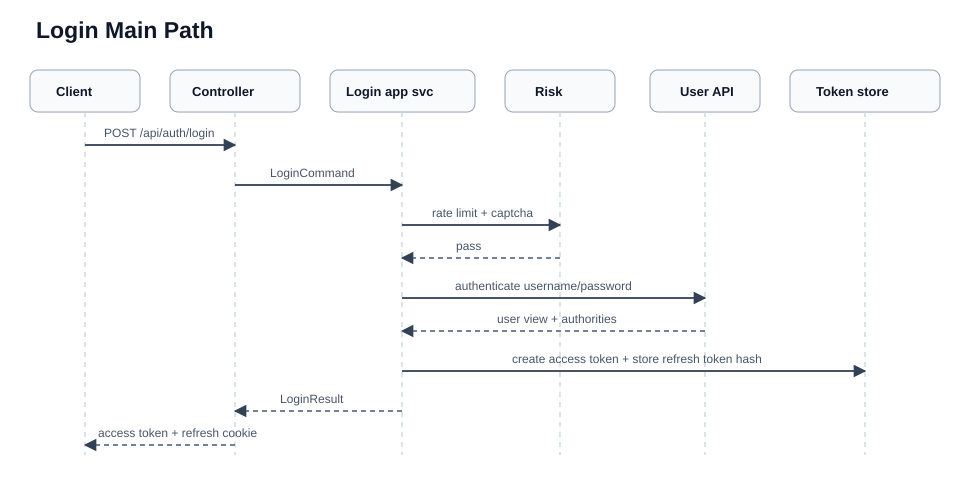
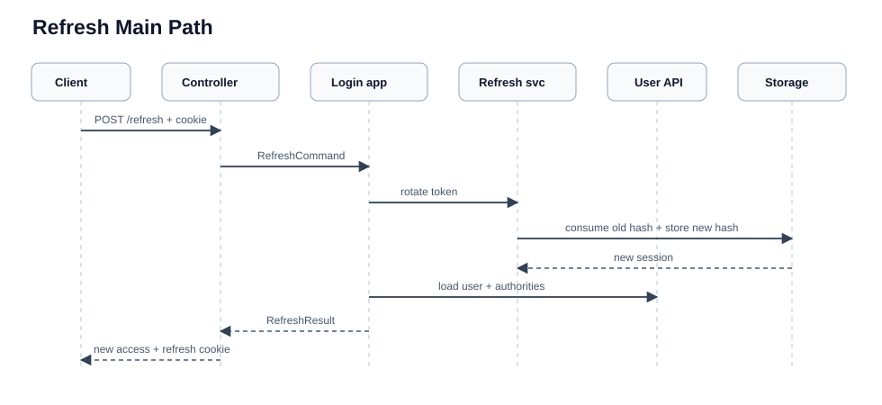
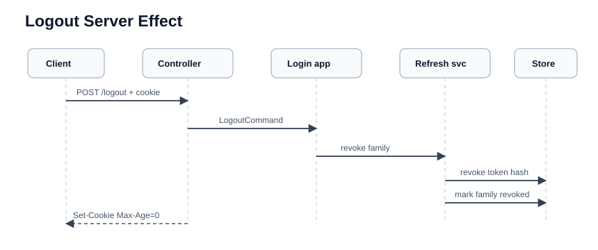
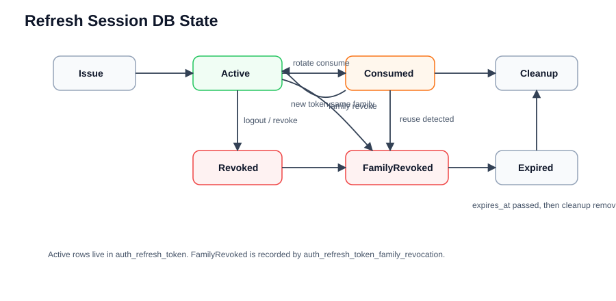

# Auth 登录、会话和续期流程

本文档描述 `community-app` 当前 auth 登录、注册验证后自动登录、refresh token 续期、logout、`/me` 和后续 JWT 鉴权链路。安全模型总览见 [security.md](security.md)，业务流程总览见 [business-flows.md](business-flows.md)。

## 核心模型

`community-app` 的浏览器会话由两类 token 组成：

| 凭证 | 载体 | 服务端状态 | 用途 |
| --- | --- | --- | --- |
| access token | `LoginResponse.accessToken`，由前端放入 `Authorization: Bearer ...` | 不保存在线 session；resource service 用 RSA 公钥校验 `RS256`、issuer、audience 和 JOSE type | 访问 `/api/**` 受保护接口 |
| refresh token | `refresh_token` HttpOnly cookie | DB store 保存 SHA-256 hash、family 状态和签发安全版本 | access token 过期后续期；logout 主动撤销，凭据/授权变化后续期时失效 |

默认运行路径是：

```text
AuthController
  -> LoginApplicationService / RegistrationApplicationService / RegistrationVerificationApplicationService
      -> auth domain service / auth repository interface
      -> user api.query / api.action
      -> analytics api.action
          -> auth infrastructure / user infrastructure
```

边界原则：

- controller 只做 HTTP binding、cookie 读写、认证对象提取和 DTO 转换。
- auth application 负责登录、续期、退出、验证码、风控、token 签发和跨域同步 API 编排。
- user owner 负责用户凭证、角色、账号状态和 `securityVersion`；auth owner 负责 refresh session 及其持久化。
- auth domain 不直接依赖 user owner、Spring Web、MyBatis、Redis 或 HTTP DTO。
- access token 不落库；refresh token 明文不落库。

## Token 内容

access token 是短期 JWT，由 `JwtTokenService.createAccessToken(...)` 签发，使用 `RS256` 签名。只有 `community-app` 持有 `security.jwt.access-private-key`；gateway、OSS 和 IM resource service 只配置 `security.jwt.access-public-key`。客户端可以解码看到 payload，但不能伪造或修改。当前 JOSE header 和 claims：

| Claim | 内容 |
| --- | --- |
| `typ` (JOSE header) | `at+jwt` |
| `alg` (JOSE header) | `RS256` |
| `iss` | `security.jwt.issuer`，默认 `community-auth` |
| `aud` | `security.jwt.access-token-audience`，默认 `community-api` |
| `iat` | 签发时间 |
| `exp` | 过期时间，默认 `iat + 900s` |
| `sub` | `userId` 字符串 |
| `username` | 用户名 |
| `authorities` | 当前用户权限 / 角色列表 |
| `security_version` | user owner 当前认证授权版本；带 JWT 的 `/api/**` 请求都会执行 freshness 校验 |

refresh token 不是 JWT，没有可解析 payload，也不包含 `userId`、`username` 或权限。它是 opaque token：`AuthSecretGenerator.opaqueToken()` 生成 32 字节 `SecureRandom` 随机数，再使用 base64url 无填充编码，通常约 43 个字符。服务端把明文 refresh token 写入 `refresh_token` HttpOnly cookie；DB store 只保存该明文的 SHA-256 hex hash。

数据库 refresh session 记录的是 refresh token 的服务端状态，而不是 token 本身的内容：

| 字段 | 说明 |
| --- | --- |
| `token_hash` | refresh token 明文的 SHA-256 hex |
| `user_id` | token 所属用户 |
| `family_id` | 同一登录 / rotation 链路的 token family |
| `security_version_at_issue` | 签发该 session 时的 user `securityVersion`；续期必须与当前值一致 |
| `expires_at` | refresh token 过期时间，默认 7 天 |
| `state` | `ACTIVE`、`PENDING_ROTATION`、`CONSUMED` 或 `REVOKED` |
| `pending_expires_at` | `PENDING_ROTATION` lease 截止时间；过期 pending 可恢复后重试 |
| `rotation_lease_id` | 当前 rotation owner 的 fencing token；finish / rollback 必须携带同一 lease |
| `revoked_at` | `CONSUMED` / `REVOKED` terminal tombstone 写入时间 |

## HTTP 入口

`CommunitySecurityConfig` 对 `/api/**` 和 `/internal/**` 使用独立 stateless filter chain，禁用 CSRF。`/api/**` 只接受 `typ=at+jwt`、`alg=RS256`、匹配 issuer/audience 的 access JWT，并在认证后对所有带 JWT 的请求执行 token freshness；`/internal/**` 只接受 `typ=service+jwt` 的 audience-bound service JWT，不执行 user `security_version` freshness。`AuthSecurityRules` 放行 auth 公开入口，其余接口默认要求认证。

| Endpoint | 认证要求 | 主要效果 |
| --- | --- | --- |
| `POST /api/auth/login` | public | 校验用户名密码，签发 access token，写 refresh cookie |
| `POST /api/auth/refresh` | public，依赖 refresh cookie | rotate refresh token，签发新 access token，写新 refresh cookie |
| `POST /api/auth/logout` | public，依赖 refresh cookie | 撤销 refresh token family，清 refresh cookie |
| `GET /api/auth/me` | Bearer JWT | 从已验证 JWT claim 返回当前用户 |
| `GET /api/auth/captcha` | public | 签发登录 / 注册 / 密码重置可复用的验证码 |
| `POST /api/auth/register` | public | 校验注册字段和图形验证码，创建 registration draft 并发送邮箱验证码 |
| `POST /api/auth/register/code/resend` | public | 校验 registration draft 和图形验证码，重发邮箱验证码 |
| `POST /api/auth/register/code/verify` | public | 注册验证码通过后创建用户并自动登录，写 refresh cookie |
| `POST /api/auth/password/reset/request` | public | 校验邮箱和图形验证码，发送密码重置链接 |
| `POST /api/auth/password/reset/confirm` | public | 重置密码并递增 user `securityVersion`；旧 refresh family 在续期时失效 |

`AuthOriginGuardFilter` 覆盖所有 public 且会改变认证状态的 auth POST 入口：login、refresh、logout、register、register code resend / verify、password reset request / confirm。浏览器请求带 `Origin` 时必须同源或命中 allowlist；没有 `Origin` 的非浏览器客户端按服务端调用放行。

## 运行时数据

| 层次 | 类型 / 对象 | 关键字段 | 去向 |
| --- | --- | --- | --- |
| HTTP request | `LoginRequest` | `username`, `password`, `captchaId`, `captchaCode` | `AuthController.login(...)` |
| HTTP request | cookie `refresh_token` | refresh token 明文 | `refresh(...)` / `logout(...)` 读取 |
| HTTP response | `LoginResponse` | `accessToken` | 登录、注册验证、refresh 返回给客户端 |
| HTTP response | `Set-Cookie` | `refresh_token` | 登录、注册验证、refresh 成功写入；logout 清理；refresh 失败不写该响应头 |
| application command | `LoginApplicationService.LoginCommand` | 登录凭证、验证码、`clientIp`, `clientIpSource` | controller 组装后进入 auth application |
| application command | `LoginApplicationService.RefreshCommand`, `LoginApplicationService.LogoutCommand` | `refreshToken` | 从 cookie 读取后传入 application |
| application result | `LoginResult`, `LoginApplicationService.RefreshResult` | `accessToken`, `RefreshCookieSpec` | application 返回 controller |
| owner API | `UserCredentialQueryApi.AuthenticationSubject` | `utf8mb4_unicode_ci:v1:<digest>` opaque 登录主体 | user owner 用 MySQL `utf8mb4_unicode_ci` 的 `WEIGHT_STRING` scalar 生成，不查询用户表，因此与账号是否存在无关 |
| owner API | `UserCredentialQueryApi.AuthenticationChallenge` | 稳定 `userId`（未知账号为 null）和一次性密码校验入口 | user owner 按数据库身份等价规则查询账号；`userId` 只约束本次密码校验，不参与风控分桶 |
| owner API | `UserAuthenticationResultView` | `authenticated`, `failure`, `user` | user owner 认证结果 |
| owner API | `UserCredentialView` | `userId`, `username`, `email`, `status`, `type`, `headerUrl`, `securityVersion`, `loginAllowed`, `refreshAllowed` | 角色计算、refresh 后回源校验和密码重置投递 |
| auth domain | `RefreshTokenSession` / `RefreshTokenRepository.StoredRefreshToken` | token hash、`userId`、`familyId`、`securityVersionAtIssue`、状态和 lease | auth repository 与 refresh application 之间的 session 状态 |

敏感数据处理：

- `password` 只在当前认证调用内使用，不进入 auth 持久化，也不写日志。
- refresh token 明文只存在于 cookie、当前请求 / 响应和 hash 计算过程。
- refresh token 和 registration token 明文由 auth application 使用统一的 256-bit `SecureRandom` 生成器生成，并使用 base64url 无填充编码；password reset token 则由随机 delivery ID 和独立 HMAC 密钥确定性派生，便于 outbox worker 在不持久化 bearer token 的前提下重建同一链接。
- 注册邮箱验证码由同一安全随机生成器生成 6 位数字码。
- DB store 只保存 refresh token 的 SHA-256 hex hash。
- 安全日志记录用户名、用户 ID、IP、IP 来源和失败原因，不记录密码或 refresh token 明文。

## 登录流程

入口是 `AuthController.login(...)`，路径为 `POST /api/auth/login`。



controller 职责：

1. 校验并解析 `LoginRequest`。
2. 用 `ClientIpResolver` 解析客户端 IP 和来源。
3. 创建 `LoginApplicationService.LoginCommand`，调用 `LoginApplicationService.login(...)`。
4. 将 `LoginResult.refreshCookie()` 转为 `Set-Cookie`。
5. 响应体只返回 `LoginResponse.accessToken`。

application 主流程：

1. `AuthDomainService.requireCredentials(...)` 先校验用户名和密码非空，并拒绝控制字符、Unicode format 字符、未配对 surrogate 以及不可见输入；失败只累计 IP 风控。
2. 在调用 user owner 和 MySQL 前，按 IP、trim 后但不做大小写、重音或兼容字符折叠的原始用户名输入，固定顺序获取 tokenized Redis ZSET permit。IP 使用 `login-ip` HMAC scope，临时输入使用 `login-input` scope；任一维度或 Redis 依赖失败都 fail-closed。
3. `UserCredentialQueryApi.authenticationSubject(...)` 由 user owner 调用不读取用户表的 MySQL scalar：在 `utf8mb4_unicode_ci` 下取得用户名的 `WEIGHT_STRING`，去除排序规则的尾随空格权重后做 SHA-256，返回 `utf8mb4_unicode_ci:v1:<digest>` opaque 主体。已知、未知和该排序规则下等价的用户名因此得到同一主体，不产生账号存在性分支。
4. auth 在保留 IP lease 时先获取 `auth:login:fail:subject:v3-<hmac>` 主体 lease；成功后把 permit 持有的租约替换为 IP + authoritative subject，并释放 `input:v3` 临时 lease。主体获取失败、原 lease 丢失或依赖异常都不能继续账号查询；整个流程不使用 `userId` 作为风控 key。
5. `UserCredentialQueryApi.prepareAuthentication(...)` 随后才按数据库真实身份等价规则查询一次账号，并再次用 user owner 的用户名策略校验查询返回的存量用户名。不存在账号、存量用户名含控制/format/不可见字符或密码 hash 非法时，都只返回无 userId、无真实 hash 的 dummy challenge；安全别名不能借数据库排序规则命中不安全旧账号。
6. permit 的 Lua 使用 Redis `TIME` 清理过期 token，并仅在 `已提交失败数 + 活跃 lease 数` 仍有余量时准入；后台心跳续租，任一续租或所有权校验失败都会 fail-closed。ZSET key 的 TTL 由所有存活成员的最晚 score 加清理余量决定，短租约节点不会截断其它长租约成员。
7. 在持有 IP + authoritative subject permit 时按合并后的失败数与活跃 lease 数判断 captcha；缺少验证码或校验失败先向 IP 和 authoritative subject 提交风控失败，再抛 `CAPTCHA_REQUIRED` / `CAPTCHA_INVALID`。
8. permit 所有权校验通过后，由 challenge 执行 BCrypt；账号不存在或 hash 非法时也执行固定 dummy BCrypt，禁用账号只有在密码正确后才返回禁用状态。完成 hash 后再次确认 lease 所有权。
9. 认证失败转换为 `INVALID_CREDENTIALS` 或 `USER_DISABLED`，先向 IP 和 authoritative subject 提交失败次数，再释放本次 permit；成功也在离开密码检查后释放。
10. 认证成功后 `LoginRateLimitApplicationService.resetSubject(...)` 只清除 authoritative subject 失败桶；共享 IP 桶保留到窗口自然过期。
11. `issueLoginResult(...)` 签发 access token 和 refresh token，写安全日志，并通过 `AnalyticsIngestActionApi.recordLoginSuccess(...)` 记录登录成功。

登录失败语义：

| 场景 | 错误 |
| --- | --- |
| 用户名 / 密码为空、用户不存在、密码错误 | `AuthErrorCode.INVALID_CREDENTIALS` |
| `user.status == 0` 或存在活跃封禁，且提交密码正确 | `AuthErrorCode.USER_DISABLED` |
| 已达到验证码门槛但未提交验证码 | `AuthErrorCode.CAPTCHA_REQUIRED` |
| 验证码错误、过期或失败过多后被删除 | `AuthErrorCode.CAPTCHA_INVALID` |
| IP / 数据库排序规则 authoritative subject 达到失败阈值 | `CommonErrorCode.TOO_MANY_REQUESTS` |
| 登录风控或验证码依赖不可用 | `CommonErrorCode.SERVICE_UNAVAILABLE` |

## 注册验证后自动登录

`POST /api/auth/register/code/verify` 不是密码登录，但成功后同样返回登录态。

```text
AuthController.verifyRegisterCode(...)
  -> RegistrationVerificationApplicationService.verifyAndLogin(...)
      -> RegistrationCodeRepository.verifyForConsumption(..., leaseId)
      -> UserRegistrationActionApi.createVerifiedRegistrationUser(...)
      -> RegistrationCodeRepository.consumePending(..., leaseId)
      -> LoginApplicationService.issueLoginResult(...)
```

关键语义：

- registration draft 和邮箱验证码校验通过后才创建 active 用户。
- register 入口在 captcha 和字段校验后、BCrypt 与 draft 创建前，按客户端 IP、规范化用户名和规范化邮箱原子增加 HMAC 伪名配额。
- prepare registration 阶段会先由 user owner 检查用户名和邮箱是否已存在；验证码通过后的最终插入仍以数据库唯一约束处理竞态冲突。
- 创建用户成功后不再走用户名密码认证，而是对刚创建的 `UserCredentialView` 调 `issueLoginResult(...)`。
- 响应体仍是 `LoginResponse(accessToken)`，并写入 refresh cookie。
- 注册码使用 `auth:regcode:v2:{<userId>}` Redis Hash 状态机；初次签发把 delivery ID 与 active code 绑定后写 `auth.registration-code-mail` outbox。resend 先原子消费可信 IP、邮箱、registration identity 三个 HMAC 配额，再让同一 UUID 同时担任 delivery ID 和 `PENDING_REPLACEMENT` lease。worker 发送前核对并续租，SMTP 成功后才 promote；重试只会重复发送同一 code，旧 delivery 无法覆盖新 replacement。失败次数耗尽后保留无 code 的 `EXHAUSTED` 冷却墓碑，立即重发不能绕过 cooldown。真实 legacy key 为 `auth:regcode:<userId>`；旧 writer 完全退出后，单个 legacy-key Lua 原子执行 `GET + PTTL + DEL`，随后以 v2 单 key Lua 条件导入，避免 Redis Cluster 跨 slot Lua。
- 验证成功先进入带 UUID lease 的 `PENDING_VERIFICATION`。创建用户失败时只有 owner 能 restore；创建成功后只有 owner 能 consume。过期 lease 可被后续请求接管，旧 owner 不能覆盖新状态。
- `finally` 中 best-effort 删除 registration draft，避免重复使用。
- 如果 active 用户已经创建但自动登录签发 token 失败，返回 `REGISTRATION_ACTIVATED_LOGIN_REQUIRED`，前端清理注册上下文并提示用户直接登录，避免误导用户重复注册。

## JWT 和 `/me`

access token 由 `JwtTokenService.createAccessToken(...)` 签发：

| Claim / 属性 | 来源 |
| --- | --- |
| `typ` (JOSE header) | `at+jwt` |
| `alg` (JOSE header) | RS256 |
| `iss` | `security.jwt.issuer` |
| `aud` | `security.jwt.access-token-audience` |
| `sub` | `UserCredentialView.userId()` |
| `username` | `UserCredentialView.username()` |
| `authorities` | `UserCredentialQueryApi.authoritiesOf(user)` |
| `iat`, `exp` | 当前时间和 `security.jwt.access-token-ttl-seconds` |
| `security_version` | `UserCredentialView.securityVersion()` |

JWT 编解码由 `JwtCodecs` 创建。access decoder 固定 `RS256`，并严格校验 issuer、audience 和 `typ=at+jwt`；service decoder 使用独立 `security.jwt.service-hmac-secret` 的 `HS256`，严格校验 `typ=service+jwt`、issuer 和目标 audience。`CommunitySecurityConfig` 的 resource server 验证 Bearer JWT 后，`AuthoritiesConverterFactory` 将 `authorities` claim 转为 Spring Security authority。

`GET /api/auth/me` 不回源查库，只读取已验证 JWT：

```text
CurrentUser.requireJwt(authentication)
  -> sub -> userId
  -> username claim
  -> authorities claim
```

因此用户角色或账号状态变化不会改变已签出的 token claims；通常要等下一次 refresh 或重新登录后重新签发。角色、密码或活跃账号级封禁提升 `security_version` 后，所有带该 access JWT 的 `/api/**` 请求都会被 freshness filter 立即拒绝；匿名 permitAll 请求不执行查询，`/internal/**` 由 service-token chain 独立保护。

## Refresh 续期

入口是 `AuthController.refresh(...)`，路径为 `POST /api/auth/refresh`。refresh token 从 `refresh_token` cookie 读取，不从请求体读取。



主流程：

1. cookie 缺失或空值时抛 `REFRESH_TOKEN_INVALID`。
2. `RefreshTokenApplicationService.beginRotation(...)` 把旧 refresh session 转入 `PENDING_ROTATION`，lease 为 30 秒。
3. 旧 token 找不到、已撤销、已过期或 family 已撤销时返回 invalid；被撤销 token 复用仍会走 family reuse 检测。
4. 使用 pending session 中的 `userId` 回源 `UserCredentialQueryApi.getByUserId(...)` 校验用户仍存在、允许登录且允许 refresh，并读取当前 `securityVersion`。
5. 用户不存在、`loginAllowed=false` 或 `refreshAllowed=false` 时撤销该 `familyId` 并抛 `USER_DISABLED`；失败响应不改写 refresh cookie。
6. pending session 的 `securityVersionAtIssue` 与 user 当前 `securityVersion` 不一致时，auth 拒绝 refresh 并撤销该 family。
7. 重新计算 authorities，签发新的 access token。
8. 生成同 family 的 replacement refresh token，并调用 `RefreshTokenApplicationService.finishRotation(...)`；finish 成功后旧 session 变为 `CONSUMED`，replacement session 变为 `ACTIVE`，并保存当前安全版本。

rotation 语义：

- 每次 refresh 都先把旧 refresh session 转入 `PENDING_ROTATION`，避免 begin 后的瞬时失败直接丢失旧 token。
- 新 refresh token 复用同一个 `familyId`。
- finish 成功后旧 token 不再 active，只作为 `CONSUMED` tombstone 用于复用检测和 logout family 识别。
- 新 refresh token 不会在用户存在性和状态校验前提前签发。
- begin 后若发生临时失败，auth 携带本次 `rotationLeaseId` 调 `rollbackPendingRotation(...)`；只有 lease owner 能把旧 session 恢复为 `ACTIVE`，否则撤销整个 family。
- pending lease 过期后再次 begin rotation 时，store 会先恢复过期 pending，再重新进入 pending 状态。
- 如果旧 token 已被撤销但又被复用，`maybeRevokeFamilyForReusedToken(...)` 会检查 `security.jwt.refresh-reuse-grace-seconds`；超过 grace window 且未过期时撤销整个 family。
- refresh 失败响应不写 `Set-Cookie`。服务端依靠 session/family 状态拒绝无效 token；浏览器端只在显式 logout 时清 cookie。这避免并发 refresh 中较晚到达的旧 token 失败响应清除较早成功响应刚轮换的新 cookie。

## Logout

入口是 `AuthController.logout(...)`，路径为 `POST /api/auth/logout`。



logout 是 best-effort：

- 请求没有 refresh token 时，不做 repository 操作，但仍清浏览器 cookie。
- 请求带 refresh token 时，可从 `ACTIVE`、`PENDING_ROTATION` 或 terminal tombstone 识别 family 并写撤销 marker；因此 logout 与并发 rotation 竞争时，replacement 不能在已撤销 family 中落地。
- controller 总是写 clear cookie；repository 是否识别 token 只影响服务端 family 撤销范围。
- logout 不撤销已经签出的 access token；access token 继续依赖短 TTL 自然过期。

## 凭据和授权变化后的会话失效

密码重置成功后，user owner 更新密码并递增 `securityVersion`：

```text
PasswordResetApplicationService.confirmReset(...)
  -> PasswordResetTokenRepository.beginConfirmation(..., leaseId)
  -> UserCredentialActionApi.updatePasswordIfSecurityVersion(...)
  -> UserCredentialApplicationService.updatePasswordIfSecurityVersion(...)
      -> UserRepository.nextUserSecurityVersion(...)
      -> UserRepository.updatePasswordIfSecurityVersion(...)
  -> PasswordResetTokenRepository.revokeGeneration(...)
  -> PasswordResetTokenRepository.finishConfirmation(..., leaseId)
```

角色变化以及新增或延长活跃账号级封禁也会递增 `securityVersion`。user 不同步调用 auth repository 删除 refresh rows；旧 refresh session 在下一次续期时因 `securityVersionAtIssue` 不匹配而被 auth 拒绝并撤销 family。已签出的 access token 不会被集中删除：`/api/**` 上的旧版本由 `TokenFreshnessFilter` 立即拒绝，其他 token 只能等待短 TTL 过期；internal service token 使用独立的签名和 audience 边界。

密码重置请求会先校验验证码并消耗 IP quota；查询 user owner 后，已存在账号以 user ID、未知账号以规范化邮箱作为 delivery quota 身份，从而让数据库排序规则判定为同一账号的所有输入共享同一桶。Redis key 只包含使用独立 `AUTH_PASSWORD_RESET_IDENTIFIER_HMAC_SECRET` 计算的 HMAC 标识，不包含邮箱、user ID 或 IP 明文。不存在、未激活和可用账号都执行同样的 quota、Redis token 和 outbox 写入，并返回相同受理响应；不可投递路径使用 dummy user 和空收件地址，handler 不调用 SMTP。邮件任务使用 `auth.password-reset-mail` 持久化 outbox；payload 携带不可逆 derivation key ID 支持密钥轮换，成功后被原子擦除。

reset token 是从随机 delivery ID 与独立密钥确定性派生的 256-bit base64url bearer value，使 worker 可在不持久化明文 token 的前提下重建邮件链接；Redis token key 只保存其 SHA-256 ID。记录携带签发时 `securityVersion`，确认时原子进入带 UUID fencing lease 的 `PENDING`；user owner 只在版本仍匹配时 CAS 改密。下游失败时同一 lease 只能在原剩余 TTL 内 rollback 为 `ACTIVE`；成功或版本已陈旧时撤销该用户的旧 generation 并完成 token，后签发的新 generation 不会被旧请求误删。

密码策略由 user owner 执行：长度 8 到 `ValidationLimits.PASSWORD_MAX`，UTF-8 编码最多 72 字节，至少包含两类字符，并拒绝 Unicode 首尾空白字符。前端和后端都不再静默 trim 密码字段。

## Refresh Session 存储

refresh session 固定使用数据库持久化；其领域接口、应用编排和基础设施实现都属于 auth：

```text
RefreshTokenApplicationService
  -> RefreshTokenRepository
  -> MyBatisRefreshTokenRepository
  -> RefreshTokenSessionMapper / RefreshTokenSessionDataObject
  -> auth_refresh_token / auth_refresh_token_family_revocation / auth_refresh_token_family_lock
```

DB schema 精简视图：

| 表 | 关键字段 | 说明 |
| --- | --- | --- |
| `auth_refresh_token` | `token_hash`, `user_id`, `family_id`, `security_version_at_issue`, `expires_at`, `state`, `pending_expires_at`, `rotation_lease_id`, `revoked_at`, `created_at` | refresh session 主表；`token_hash` 是 SHA-256 hex |
| `auth_refresh_token_family_revocation` | `family_id`, `revoked_at`, `expires_at` | 有界保留的 family 撤销标记；防止已撤销 family 写回 active token |
| `auth_refresh_token_family_lock` | `family_id`, `retain_until` | family 级持久互斥行；所有多行写入先锁该行，再访问 token 和撤销 marker |

DB store 行为：

- `store(...)` 插入带 `securityVersionAtIssue` 的 active row；如果 family 已撤销，写入失败。签发应用入口持有事务，保证 family 锁覆盖 marker 检查与 token 写入。
- `token_hash` 的 owner family 不可变；极低概率的 token hash 冲突会 fail closed，不会通过 upsert 把已有 session 改挂到另一个 family。
- `beginRotation(...)` 只把未过期的 `ACTIVE` row 转为 `PENDING_ROTATION`，同时写入 `pending_expires_at` 和随机 `rotation_lease_id`；如果发现过期 pending，会先恢复后再由新 lease 接管。
- `finishRotation(...)` 要求旧 row 仍是未过期 `PENDING_ROTATION`，且用户、family、安全版本和 lease 全部匹配；应用事务原子地插入 replacement 并把旧 row 标为 `CONSUMED`，最终 CAS 失败会回滚 replacement。
- `rollbackPendingRotation(...)` 只有相同 `rotation_lease_id` 能把 `PENDING_ROTATION` row 恢复为 `ACTIVE`。
- `find(...)` 返回 active 且未过期的 token；过期时会撤销并返回 null。
- `findRevoked(...)` 返回 `CONSUMED` / `REVOKED` terminal tombstone，用于 refresh reuse 检测和 logout family 识别。
- `revoke(...)` 撤销单个 token。
- `revokeFamily(...)` 写 family marker，并撤销该 family 下所有 active token。
- `deleteExpiredBefore(...)` 由 cleanup job 以每批 500 行、单次最多 200 批的方式排空过期 token、撤销 marker 和 family lock；每批独立提交，避免长事务和无限清理循环。

轮换完成、按 token 注销以及显式 family 注销统一采用 `family lock -> token / revocation marker` 锁序。按 token 操作会先做无锁快照定位 family，取得 family 锁后再以 `FOR UPDATE` 重读并校验 token，因此 logout 与 rotate 并发时只会得到“轮换后整族撤销”或“撤销先完成、轮换失败”两种结果，不会留下 active replacement。

状态机：



`RefreshTokenCleanupJob` 每 `auth.refresh.cleanup.interval-ms` 执行一次；`auth.refresh.cleanup.enabled=false` 时跳过。该 job 只清理过期 refresh session 及其 family 辅助行，不影响 access token。

## 登录风控和验证码

登录风控由 `LoginRateLimitApplicationService` 编排，底层通过 `LoginRateLimitRepository` 计数。默认 Redis key：

| Key | 生命周期 |
| --- | --- |
| `auth:login:fail:ip:v2-<hmac>` | IP 使用稳定 abuse-quota HMAC 密钥和 `login-ip` scope 生成伪名；登录失败自增；TTL 为 `auth.login-rate-limit.window-seconds`；成功登录不删除共享 IP 桶 |
| `auth:login:fail:input:v3-<hmac>` | trim 后的原始用户名输入使用 `login-input` scope 生成伪名，不做 Java Unicode 折叠；只为任何 user owner / MySQL 调用前的临时 permit 提供命名空间，authoritative subject lease 获取后立即释放该输入 lease |
| `auth:login:fail:subject:v3-<hmac>` | user owner 返回的 `utf8mb4_unicode_ci:v1:<digest>` 使用 `login-subject` scope 再生成 Redis 伪名；账号查询、captcha 和 BCrypt 前持有其 lease，所有登录失败在该桶自增，成功登录删除该桶 |
| `auth:login:inflight:{<完整 failure key>}:<完整 failure key>` | identity-lookup / password-check UUID token ZSET；failure String 与 lease ZSET 共享完整 hash tag，从而满足 Redis Cluster 单 slot Lua；key TTL 覆盖最晚到期的存活成员 |

登录 IP / 输入 / authoritative subject 伪名复用已经用于注册和密码重置配额的稳定 `auth.password-reset.quota-hmac-secret`，并通过 `login-ip` / `login-input` / `login-subject` 独立 scope 做域分离；它不复用 service JWT 或可轮换的邮件 delivery 密钥。该稳定密钥的轮换会切换整套 quota key，必须按运维手册执行受控停流。

默认阈值：

```yaml
auth:
  login-rate-limit:
    enabled: true
    window-seconds: 60
    max-failures-per-ip: 20
    max-failures-per-user: 5
    captcha-required-failures-per-ip: 5
    captcha-required-failures-per-user: 2
```

验证码由 `CaptchaApplicationService` 签发和校验：

| Key | 内容 / 生命周期 |
| --- | --- |
| `captcha:{<captchaId>}:value` | 验证码值；TTL 为 `auth.captcha.ttl-seconds` |
| `captcha:{<captchaId>}:fail` | 验证失败次数；TTL 与验证码对齐，同一 hash tag 支持单 Lua 原子校验 |

默认验证码 TTL 60 秒，最多失败 3 次。同一个 Lua 完成取值、匹配、失败递增与达到阈值后的删除，正确请求不能与并发错误请求一起越过失败预算。验证码依赖异常时返回 `SERVICE_UNAVAILABLE`。

## 配置摘要

主要配置来自 `application.yml` 和 `JwtProperties`：

```yaml
security:
  jwt:
    access-public-key: ${JWT_ACCESS_PUBLIC_KEY:}
    access-private-key: ${JWT_ACCESS_PRIVATE_KEY:}
    service-hmac-secret: ${JWT_SERVICE_HMAC_SECRET:}
    issuer: ${JWT_ISSUER:community-auth}
    access-token-audience: ${JWT_ACCESS_TOKEN_AUDIENCE:community-api}
    access-token-ttl-seconds: 900
    refresh-token-ttl-seconds: 604800
    refresh-reuse-grace-seconds: 10
    refresh-cookie-name: refresh_token
    refresh-cookie-path: /api/auth
    refresh-cookie-same-site: ${AUTH_REFRESH_COOKIE_SAME_SITE:Lax}
    refresh-cookie-secure: ${AUTH_REFRESH_COOKIE_SECURE:true}

gateway:
  origin-guard:
    enabled: true
    allowed-origins: ${AUTH_ORIGIN_GUARD_ALLOWED_ORIGINS:}
    fail-open-when-allowlist-empty: false

auth:
  refresh:
    store: db
    cleanup:
      enabled: ${AUTH_REFRESH_CLEANUP_ENABLED:true}
      interval-ms: ${AUTH_REFRESH_CLEANUP_INTERVAL_MS:3600000}
  captcha:
    store: redis
    ttl-seconds: ${AUTH_CAPTCHA_TTL_SECONDS:60}
    max-failures: ${AUTH_CAPTCHA_MAX_FAILURES:3}
    max-issue-requests-per-ip: ${AUTH_CAPTCHA_MAX_ISSUE_REQUESTS_PER_IP:10}
  password-reset:
    reset-base-url: ${AUTH_PASSWORD_RESET_BASE_URL:}
    identifier-hmac-secret: ${AUTH_PASSWORD_RESET_IDENTIFIER_HMAC_SECRET}
    ttl-seconds: ${AUTH_PASSWORD_RESET_TTL_SECONDS:600}
    request-window-seconds: ${AUTH_PASSWORD_RESET_REQUEST_WINDOW_SECONDS:3600}
    max-requests-per-email: ${AUTH_PASSWORD_RESET_MAX_REQUESTS_PER_EMAIL:3}
    max-requests-per-ip: ${AUTH_PASSWORD_RESET_MAX_REQUESTS_PER_IP:20}
```

`RefreshCookieSpec` 转为 Spring `ResponseCookie` 时使用：

- `name`：默认 `refresh_token`。
- `value`：签发时是 refresh token 明文；清理时为空字符串。
- `httpOnly`：固定 `true`。
- `secure`：来自 `security.jwt.refresh-cookie-secure`。
- `path`：默认 `/api/auth`。
- `sameSite`：默认 `Lax`。
- `maxAgeSeconds`：签发时等于 refresh token TTL；清理时为 `0`。

## 关键代码

| 类 | 职责 | 源码 |
| --- | --- | --- |
| `AuthController` | HTTP 入口、cookie 读写、DTO 转换 | [AuthController.java](../../backend/community-app/src/main/java/com/nowcoder/community/auth/controller/AuthController.java) |
| `CommunitySecurityConfig` | `/api/**` stateless JWT 安全配置 | [CommunitySecurityConfig.java](../../backend/community-app/src/main/java/com/nowcoder/community/app/security/CommunitySecurityConfig.java) |
| `AuthSecurityRules` | 放行 auth public endpoint | [AuthSecurityRules.java](../../backend/community-app/src/main/java/com/nowcoder/community/auth/security/AuthSecurityRules.java) |
| `AuthOriginGuardFilter` | login / refresh / logout Origin 防护 | [AuthOriginGuardFilter.java](../../backend/community-app/src/main/java/com/nowcoder/community/auth/infrastructure/web/AuthOriginGuardFilter.java) |
| `LoginApplicationService` | login / refresh / logout 编排 | [LoginApplicationService.java](../../backend/community-app/src/main/java/com/nowcoder/community/auth/application/LoginApplicationService.java) |
| `RegistrationVerificationApplicationService` | 注册邮箱验证码验证和自动登录 | [RegistrationVerificationApplicationService.java](../../backend/community-app/src/main/java/com/nowcoder/community/auth/application/RegistrationVerificationApplicationService.java) |
| `PasswordResetApplicationService` | 密码重置和 user `securityVersion` 更新入口 | [PasswordResetApplicationService.java](../../backend/community-app/src/main/java/com/nowcoder/community/auth/application/PasswordResetApplicationService.java) |
| `LoginRateLimitApplicationService` | 登录失败计数、验证码门槛和阻断 | [LoginRateLimitApplicationService.java](../../backend/community-app/src/main/java/com/nowcoder/community/auth/application/LoginRateLimitApplicationService.java) |
| `CaptchaApplicationService` | 验证码签发和校验 | [CaptchaApplicationService.java](../../backend/community-app/src/main/java/com/nowcoder/community/auth/application/CaptchaApplicationService.java) |
| `RefreshTokenApplicationService` | refresh token 签发、旋转、撤销和 cleanup 编排 | [RefreshTokenApplicationService.java](../../backend/community-app/src/main/java/com/nowcoder/community/auth/application/RefreshTokenApplicationService.java) |
| `MyBatisRefreshTokenRepository` | DB-backed refresh session、rotation 和 family adapter | [MyBatisRefreshTokenRepository.java](../../backend/community-app/src/main/java/com/nowcoder/community/auth/infrastructure/persistence/MyBatisRefreshTokenRepository.java) |
| `RefreshTokenSessionMapper` | auth refresh session MyBatis mapper | [RefreshTokenSessionMapper.java](../../backend/community-app/src/main/java/com/nowcoder/community/auth/infrastructure/persistence/mapper/RefreshTokenSessionMapper.java) |
| `JwtTokenService` | access token 签发 | [JwtTokenService.java](../../backend/community-app/src/main/java/com/nowcoder/community/auth/infrastructure/jwt/JwtTokenService.java) |
| `JwtCodecs` | JWT encoder / decoder 和 issuer 校验 | [JwtCodecs.java](../../backend/community-common/common-security/src/main/java/com/nowcoder/community/common/security/jwt/JwtCodecs.java) |
| `RefreshTokenDomainService` | refresh token 过期和复用撤销规则 | [RefreshTokenDomainService.java](../../backend/community-app/src/main/java/com/nowcoder/community/auth/domain/service/RefreshTokenDomainService.java) |
| `UserCredentialApiAdapter` | user owner credential API adapter | [UserCredentialApiAdapter.java](../../backend/community-app/src/main/java/com/nowcoder/community/user/infrastructure/api/UserCredentialApiAdapter.java) |
| `UserCredentialApplicationService` | user owner 账号密码校验、角色计算、密码重置 | [UserCredentialApplicationService.java](../../backend/community-app/src/main/java/com/nowcoder/community/user/application/UserCredentialApplicationService.java) |
| `RefreshTokenSessionDataObject` | auth refresh session persistence row | [RefreshTokenSessionDataObject.java](../../backend/community-app/src/main/java/com/nowcoder/community/auth/infrastructure/persistence/dataobject/RefreshTokenSessionDataObject.java) |
| `RefreshTokenCleanupJob` | 过期 refresh session 清理 job | [RefreshTokenCleanupJob.java](../../backend/community-app/src/main/java/com/nowcoder/community/auth/infrastructure/job/RefreshTokenCleanupJob.java) |
