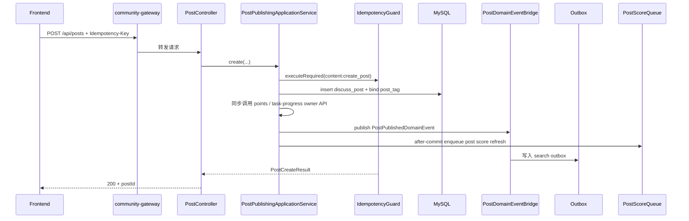
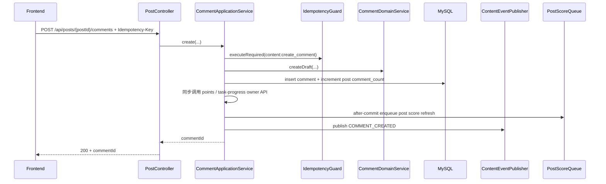

# 内容主链路实现说明（帖子、评论、收藏、分类订阅）

本文档说明当前仓库中主站 `content` 域最核心的用户链路是如何落地的，聚焦以下问题：

- 帖子列表、详情、发布、编辑、作者删除分别从哪里进入系统
- 评论与回复如何建模，为什么只允许回复“一级评论”
- `Idempotency-Key` 在帖子和评论链路上是怎么生效的
- 收藏、分类订阅、标签、分类接口在主链路中分别承担什么角色
- 内容写入后，搜索、通知、积分、任务进度、热度刷新分别如何被触发

本文档**不覆盖**：

- 举报与治理后台处置链路
- 点赞 / 关注 / 拉黑链路
- IM 链路

相关总览文档：

- `docs/handbook/CORE_LOGIC.md`
- `docs/handbook/ARCHITECTURE.md`
- `docs/handbook/SYSTEM_DESIGN.md`
- `docs/handbook/business-logic/social-like-follow-outbox-flow.md`

---

## 1. 参与组件

内容主链路涉及以下组件：

- 前端：通过 `community-gateway` 暴露的 `http://localhost:12880/api/**` 访问帖子、评论、收藏、订阅等接口
- `community-gateway`：负责浏览器入口级路由、CORS 和边缘策略
- `community-app`：
  - `content.controller.*`：对外 HTTP 入口
  - `content.api.action.*` / `content.api.query.*`：域内外协作边界
  - `content.application.*ApplicationService`：帖子、评论、收藏、分类、标签、订阅、治理等同域用例入口
  - `content.domain.*`：模型、领域服务、仓储接口和领域事件
  - `content.infrastructure.*`：MyBatis、Redis、事件桥接、本地 job 和 foreign API adapter
  - `content.domain.event.*` + `content.contracts.event.*`：帖子领域事件与跨域事件契约
- MySQL（`community` schema）：
  - `discuss_post`
  - `comment`
  - `bookmark`
  - `category`
  - `tag` / `post_tag`
  - `subscription_category`
- Redis / 内存队列：
  - `PostScoreQueue` 用于帖子热度刷新
- 本地 outbox：
  - 搜索投影
  - IM policy 投影（由拉黑/处罚变化驱动，不属于内容写路径）
- best-effort 本地监听：
  - 通知投影
- 同步 owner-domain API：
  - 积分投影
  - 任务进度投影

关键代码入口：

- `backend/community-app/src/main/java/com/nowcoder/community/content/controller/PostController.java`
- `backend/community-app/src/main/java/com/nowcoder/community/content/controller/BookmarkController.java`
- `backend/community-app/src/main/java/com/nowcoder/community/content/controller/SubscriptionController.java`
- `backend/community-app/src/main/java/com/nowcoder/community/content/controller/CategoryController.java`
- `backend/community-app/src/main/java/com/nowcoder/community/content/controller/TagController.java`

---

## 2. 对外接口范围

本文档涉及的对外接口包括：

- 帖子与评论：
  - `GET /api/posts`
  - `POST /api/posts`
  - `POST /api/posts/batch-summary`
  - `GET /api/posts/{postId}`
  - `PUT /api/posts/{postId}`
  - `DELETE /api/posts/{postId}`
  - `GET /api/posts/{postId}/comments`
  - `POST /api/posts/{postId}/comments`
  - `PUT /api/posts/{postId}/comments/{commentId}`
  - `GET /api/posts/{postId}/comments/{commentId}/replies`
- 收藏：
  - `PUT /api/posts/{postId}/bookmark`
  - `DELETE /api/posts/{postId}/bookmark`
  - `GET /api/bookmarks`
- 分类订阅：
  - `PUT /api/categories/{categoryId}/subscribe`
  - `DELETE /api/categories/{categoryId}/subscribe`
  - `GET /api/subscriptions/categories`
- 分类与标签：
  - `GET /api/categories`
  - `GET /api/tags/hot`
  - `GET /api/tags/suggest`

说明：

- 帖子置顶 / 加精 / 后台删除虽然也在 `PostController` 下，但属于治理动作，本文不展开
- 举报与版主处置属于另一条业务链路，本文不展开

---

## 3. 主体设计：谁 owns 什么

在 `content` 域里，可以先把能力分成四层：

1. **同域读模型入口**
- `PostReadApplicationService`
- `CommentReadApplicationService`

2. **同域写动作入口**
- `PostPublishingApplicationService`
- `CommentApplicationService`

跨域调用方仍通过 owner-domain `content.api.query` / `content.api.action` / `content.api.model` 协作，同域 controller 不直接把这些 API 当入口。

3. **领域主事实**
- 帖子：`DiscussPost`
- 评论：`Comment`
- 收藏：`bookmark`
- 分类订阅：`subscription_category`
- 标签绑定：`post_tag`

4. **异步下游**
- 搜索索引
- 站内通知
- 积分 / 钱包奖励
- 成长任务进度
- 帖子热度分数

所以内容域的稳定主线是：

```text
HTTP controller
  -> content.application.*ApplicationService
    -> content domain model / domain service / repository interface
    -> infrastructure persistence
    -> 领域事件 / contracts.event
    -> search outbox / notice after-commit / score queue / foreign owner API
```

---

## 4. 读路径：帖子列表与详情

### 4.1 帖子列表

`GET /api/posts` 的入口是 `PostController.list(...)`。

调用链如下：

1. controller 接收排序、分类、标签、是否仅看订阅、分页参数
2. 通过 `PostReadApplicationService.listPosts(...)` 进入同域应用读入口
3. `PostReadApplicationService` 决定是：
   - 普通列表：`PostContentRepository.listPosts(...)`
   - 仅看订阅：`SubscriptionRepository.listSubscribedCategoryIds(...)` 后再调 `PostContentRepository.listSubscribedPosts(...)`
4. 读出帖子后，再额外补齐：
   - 最后活动评论：`CommentContentRepository`
   - 标签：`TagContentRepository`
5. `PostSummaryAssembler` 组装成 `PostSummaryResult`

关键代码：

- `backend/community-app/src/main/java/com/nowcoder/community/content/controller/PostController.java`
- `backend/community-app/src/main/java/com/nowcoder/community/content/application/PostReadApplicationService.java`
- `backend/community-app/src/main/java/com/nowcoder/community/content/domain/repository/PostContentRepository.java`
- `backend/community-app/src/main/java/com/nowcoder/community/content/domain/repository/SubscriptionRepository.java`
- `backend/community-app/src/main/java/com/nowcoder/community/content/domain/repository/CommentContentRepository.java`
- `backend/community-app/src/main/java/com/nowcoder/community/content/application/PostSummaryAssembler.java`

注意点：

- `subscribed=true` 必须带登录态；匿名用户会被视为未授权
- 列表汇总时不会直接联表把所有信息一次查完，而是先拿帖子主列表，再补最后活动和标签

### 4.2 帖子详情

`GET /api/posts/{postId}` 的入口是 `PostController.detail(...)`。

调用链如下：

1. `PostReadApplicationService.getPostDetail(...)`
2. `PostContentRepository.getById(postId)` 读取帖子主事实
3. `TagContentRepository.getTagsByPostIds(...)` 补标签
4. `LikeQueryPort` 补点赞数与当前用户点赞状态
5. `BookmarkRepository.hasBookmarked(...)` 补收藏状态
6. `PostDetailAssembler` 组装结果

关键代码：

- `backend/community-app/src/main/java/com/nowcoder/community/content/application/PostReadApplicationService.java`
- `backend/community-app/src/main/java/com/nowcoder/community/content/application/PostDetailAssembler.java`

---

## 5. 写路径：发帖、编辑、作者删除

### 5.1 发帖主时序



### 5.2 发帖具体步骤

`POST /api/posts` 的链路如下：

1. `PostController.create(...)` 从认证信息里取出当前用户，并读取 `Idempotency-Key`
2. `PostPublishingApplicationService.create(...)` 先做：
   - `trim`
   - HTML 转义：`ContentTextCodec.escapeOnWrite(...)`
   - 敏感词过滤：`SensitiveFilter.filter(...)`
3. `IdempotencyGuard.executeRequired("content:create_post", ...)` 保证同一个用户、同一个 key 只执行一次副作用
4. `PostPublishingApplicationService` 在事务内完成：
   - `UserModerationGuard.assertCanSpeak(...)` 校验用户是否允许发言
   - `CategoryRepository.assertExists(...)` 校验分类存在
   - `PostPublishingDomainService.createDraft(...)` 创建领域草稿
   - `PostRepository.create(...)` 写入 `discuss_post`
   - `PostTagRepository.bindTagsToPost(...)` 绑定标签
   - `UserPointsAwardActionApi.awardPostPublished(...)` 同步发放发帖积分
   - `GrowthTaskProgressActionApi.triggerPostPublished(...)` 同步推进任务进度
   - `PostDomainEventPublisher.postPublished(...)` 发布帖子领域事件
   - `PostWriteSideEffectScheduler.schedulePostScoreRefresh(...)` 安排热度刷新

关键代码：

- `backend/community-app/src/main/java/com/nowcoder/community/content/application/PostPublishingApplicationService.java`
- `backend/community-common/common-idempotency/src/main/java/com/nowcoder/community/common/idempotency/IdempotencyGuard.java`
- `backend/community-app/src/main/java/com/nowcoder/community/content/domain/service/PostPublishingDomainService.java`
- `backend/community-app/src/main/java/com/nowcoder/community/content/domain/repository/PostRepository.java`
- `backend/community-app/src/main/java/com/nowcoder/community/content/domain/repository/PostTagRepository.java`

### 5.3 编辑帖子

`PUT /api/posts/{postId}` 走 `PostPublishingApplicationService.updatePost(...)`。

它的关键约束是：

- 只能编辑自己的帖子
- 已删除帖子不能编辑
- 超过 24 小时不能编辑
- 仍然要通过 `assertCanSpeak(...)`
- 分类与标签会做全量校验 / 替换

关键代码：

- `backend/community-app/src/main/java/com/nowcoder/community/content/application/PostPublishingApplicationService.java`

### 5.4 作者删除帖子

`DELETE /api/posts/{postId}` 走 `PostPublishingApplicationService.deleteByAuthor(...)`。

这里不是物理删除，而是：

- 校验必须是作者本人
- 调 `PostRepository.markDeletedByAuthor(...)`
- 把状态改成 `2`
- 写入删除人和原因 `author_delete`
- 发布 `postDeleted` 领域事件

关键代码：

- `backend/community-app/src/main/java/com/nowcoder/community/content/application/PostPublishingApplicationService.java`

---

## 6. 评论与回复链路

### 6.1 评论 / 回复主时序



### 6.2 评论与回复如何建模

`CommentApplicationService` 采用两种 `entityType`：

- `ENTITY_TYPE_POST`：一级评论，`entityId = postId`
- `ENTITY_TYPE_COMMENT`：回复，`entityId = parentCommentId`

但当前实现有一个非常重要的限制：

- 只允许回复“该帖子下的一级评论”
- 不允许对回复再继续套娃回复

原因是读侧接口只暴露：

- 帖子下评论列表
- 某条一级评论下回复列表

如果允许任意多层回复，当前读模型会不可达。

### 6.3 新增评论 / 回复

`POST /api/posts/{postId}/comments` 的链路如下：

1. `PostController.addComment(...)` 取登录用户和 `Idempotency-Key`
2. `CommentApplicationService.create(...)` 用 `IdempotencyGuard.executeRequired("content:create_comment", ...)` 包住真实副作用
3. `CommentApplicationService.createInsideTransaction(...)` 在事务内完成：
   - `assertCanSpeak(actorUserId)`
   - 校验帖子存在：`PostRepository.getRequiredSnapshot(postId)`
   - 如果是回复：
     - `entityId(commentId)` 必填
     - 目标评论必须存在、未删除
     - 目标评论必须是该帖下的一级评论
   - 目标用户与当前用户存在任意一侧拉黑关系时禁止评论 / 回复
   - 文本内容做转义与敏感词过滤
   - 写入 `comment`
   - `PostRepository.incrementCommentCount(postId, 1)`
   - `UserPointsAwardActionApi.awardCommentCreated(...)` 同步发放评论积分
   - `GrowthTaskProgressActionApi.triggerCommentCreated(...)` 同步推进任务进度
   - 提交后把 `postId` 放入 `PostScoreQueue`
   - 构造 `CommentPayload` 并发布 `COMMENT_CREATED`

关键代码：

- `backend/community-app/src/main/java/com/nowcoder/community/content/application/CommentApplicationService.java`
- `backend/community-app/src/main/java/com/nowcoder/community/content/domain/service/CommentDomainService.java`
- `backend/community-app/src/main/java/com/nowcoder/community/content/domain/repository/CommentRepository.java`

### 6.4 读取评论与回复

读取链路通过 `CommentReadApplicationService` 统一提供：

- `comments(postId, ...)`：查一级评论
- `replies(postId, commentId, ...)`：先校验该评论确实属于该帖子，再查回复

返回前会通过 `ContentTextCodec.decodeOnRead(...)` 把存储态内容还原成读态内容。

关键代码：

- `backend/community-app/src/main/java/com/nowcoder/community/content/application/CommentReadApplicationService.java`

### 6.5 编辑评论

`PUT /api/posts/{postId}/comments/{commentId}` 走 `CommentApplicationService.update(...)`。

它的关键约束是：

- 只能编辑自己的评论
- 目标帖子必须存在
- 评论必须存在且未删除
- 通过 `postId` 先做一次存在性校验，避免跨帖编辑
- 编辑后会更新 `updateTime` 与 `editCount`

---

## 7. 收藏、分类订阅、分类与标签

### 7.1 收藏

收藏入口是 `BookmarkController`，核心逻辑在 `BookmarkApplicationService`：

- `PUT /api/posts/{postId}/bookmark`
  - 先校验帖子存在且未删除
  - 再写 `bookmark`
- `DELETE /api/posts/{postId}/bookmark`
  - 直接按用户 + 帖子删除
- `GET /api/bookmarks`
  - 先查收藏帖子列表
  - 再补最后活动评论和标签
  - 最终组装成 `PostSummaryView`

这说明收藏不是独立内容副本，而是“用户对帖子主事实的引用关系”。

关键代码：

- `backend/community-app/src/main/java/com/nowcoder/community/content/controller/BookmarkController.java`
- `backend/community-app/src/main/java/com/nowcoder/community/content/application/BookmarkApplicationService.java`

### 7.2 分类订阅

分类订阅是“仅看订阅”筛选的基础状态，不是事件驱动的复杂链路。

关键动作：

- `PUT /api/categories/{categoryId}/subscribe`
- `DELETE /api/categories/{categoryId}/subscribe`
- `GET /api/subscriptions/categories`

`SubscriptionApplicationService` 的职责很简单：

- 校验分类存在
- 写 / 删 `subscription_category`
- 返回当前用户订阅的分类 id 列表

然后 `PostReadApplicationService.listPosts(..., subscribed=true, ...)` 会利用这份列表回查帖子。

关键代码：

- `backend/community-app/src/main/java/com/nowcoder/community/content/application/SubscriptionApplicationService.java`
- `backend/community-app/src/main/java/com/nowcoder/community/content/application/PostReadApplicationService.java`

### 7.3 分类

分类读取链路很薄：

- `GET /api/categories`
- `CategoryController -> CategoryApplicationService -> CategoryRepository -> infrastructure.persistence.mapper.CategoryMapper`

这里的分类主要承担：

- 发帖时的归类校验
- 帖子列表的按分类筛选
- 分类订阅

关键代码：

- `backend/community-app/src/main/java/com/nowcoder/community/content/controller/CategoryController.java`
- `backend/community-app/src/main/java/com/nowcoder/community/content/application/CategoryApplicationService.java`
- `backend/community-app/src/main/java/com/nowcoder/community/content/domain/repository/CategoryRepository.java`

### 7.4 标签

标签在内容主链路里承担两个职责：

1. 发帖 / 编辑时，把用户输入标准化后写入 `tag` / `post_tag`
2. 列表 / 详情 / 收藏页组装时，按 `postId` 回填标签名

`TagApplicationService` 当前的关键规则是：

- 单帖最多 5 个标签
- 单标签最长 20 字符
- 只允许中英文、数字、`_`、`-`
- 前端即便传一个带空格或逗号的字符串，后端也会做一次容错拆分
- 新标签通过 `ensureTagId(...)` 幂等创建
- 编辑帖子时通过 `replaceTagsForPost(...)` 全量替换

对外还提供两个辅助接口：

- `GET /api/tags/hot`
- `GET /api/tags/suggest`

关键代码：

- `backend/community-app/src/main/java/com/nowcoder/community/content/controller/TagController.java`
- `backend/community-app/src/main/java/com/nowcoder/community/content/application/TagApplicationService.java`

---

## 8. 内容写入后的下游效应

这一节最容易和主写链路混淆。要明确：**主事实先提交，下游投影后追平**。

### 8.1 帖子写入 -> 领域事件 -> 内容事件契约

帖子 create / update / delete 不会直接去调搜索或通知服务；发帖/评论积分与任务进度已经作为写用例内的同步 owner API 协作完成。

它们先走这条桥接链：

1. `PostDomainEventPublisher`
2. `PostDomainEventBridge`
3. `PostPayloadAssembler`
4. `LocalContentEventPublisher`
5. 形成 `ContentContractEvent`

关键代码：

- `backend/community-app/src/main/java/com/nowcoder/community/content/domain/event/PostDomainEventPublisher.java`
- `backend/community-app/src/main/java/com/nowcoder/community/content/infrastructure/event/PostDomainEventBridge.java`
- `backend/community-app/src/main/java/com/nowcoder/community/content/infrastructure/event/PostPayloadAssembler.java`
- `backend/community-app/src/main/java/com/nowcoder/community/content/infrastructure/event/LocalContentEventPublisher.java`

### 8.2 搜索投影

当前默认配置 `events.outbox.enabled=true`，所以帖子事件会先写入 outbox，再由 worker 异步投影到搜索：

- 入箱：`PostOutboxEnqueuer`
- 消费：`PostOutboxHandler`
- 实际投影：按当前数据库权威状态 upsert / delete 搜索索引

这意味着：

- 发帖成功后，搜索结果允许短暂滞后
- 删除帖子后，搜索索引会通过异步 handler 收敛删除

关键代码：

- `backend/community-app/src/main/java/com/nowcoder/community/search/infrastructure/event/PostOutboxEnqueuer.java`
- `backend/community-app/src/main/java/com/nowcoder/community/search/infrastructure/event/PostOutboxHandler.java`

### 8.3 评论通知

评论创建后会发布 `COMMENT_CREATED`，随后通知投影会把它转换成 `comment` topic 的站内通知。

关键代码：

- `backend/community-app/src/main/java/com/nowcoder/community/notice/infrastructure/event/NoticeProjectionListener.java`
- `backend/community-app/src/main/java/com/nowcoder/community/notice/application/NoticeProjectionApplicationService.java`
- `backend/community-app/src/main/java/com/nowcoder/community/notice/domain/service/NoticeProjectionDomainService.java`

注意：

- 帖子发布本身不会生成 notice
- 评论 / 回复才会向被互动用户写 notice

### 8.4 积分与任务进度

当前内容写路径还会同步驱动两个成长侧能力：

- `POST_PUBLISHED`：发帖人 +10 积分
- `COMMENT_CREATED`：评论人 +2 积分
- `POST_PUBLISHED` / `COMMENT_CREATED`：驱动任务进度推进

关键代码：

- `backend/community-app/src/main/java/com/nowcoder/community/user/api/action/UserPointsAwardActionApi.java`
- `backend/community-app/src/main/java/com/nowcoder/community/user/infrastructure/api/UserPointsAwardApiAdapter.java`
- `backend/community-app/src/main/java/com/nowcoder/community/user/application/UserPointsApplicationService.java`
- `backend/community-app/src/main/java/com/nowcoder/community/growth/api/action/GrowthTaskProgressActionApi.java`
- `backend/community-app/src/main/java/com/nowcoder/community/growth/infrastructure/api/GrowthTaskProgressActionApiAdapter.java`
- `backend/community-app/src/main/java/com/nowcoder/community/growth/application/TaskProgressApplicationService.java`

### 8.5 热度刷新

帖子热度不是在发帖或评论事务里直接算出来的，而是走 `PostScoreQueue`：

- 发帖 / 编辑：`PostWriteSideEffectScheduler.schedulePostScoreRefresh(...)`
- 评论：`CommentApplicationService` 在事务提交后入队
- 点赞变化：`SocialInteractionProjectionListener` 在 `AFTER_COMMIT` 阶段把帖子重新入队

真正刷新分数的是 `PostScoreRefresher`，它会周期性消费队列并根据：

- 是否加精
- 评论数
- 点赞数
- 发帖时间

重新计算 `score`。

关键代码：

- `backend/community-app/src/main/java/com/nowcoder/community/content/application/PostWriteSideEffectScheduler.java`
- `backend/community-app/src/main/java/com/nowcoder/community/content/application/CommentApplicationService.java`
- `backend/community-app/src/main/java/com/nowcoder/community/content/infrastructure/event/SocialInteractionProjectionListener.java`
- `backend/community-app/src/main/java/com/nowcoder/community/content/infrastructure/job/PostScoreRefresher.java`

---

## 9. 一致性、幂等与失败语义

### 9.1 HTTP 幂等

当前内容写路径中，显式接入 `IdempotencyGuard` 的有：

- 发帖：`content:create_post`
- 发评论：`content:create_comment`

这意味着：

- 首次请求执行真实副作用
- 同 key 重试复用成功结果
- 并发同 key 返回 `409`

编辑帖 / 删除帖 / 编辑评论当前没有走 `IdempotencyGuard`。

### 9.2 主事实与投影不是同一时刻完成

帖子或评论写入成功，并不等于：

- 搜索已经可查
- 通知已经可见
- 积分已经到账
- 任务进度已经更新

搜索属于 outbox 异步投影；通知属于 best-effort after-commit 读模型；积分和任务进度在内容写用例内同步调用 owner-domain API，是否可见取决于对应 owner 应用服务与钱包记账是否完成。

### 9.3 内容删除是软删除

帖子作者删除帖子时：

- 主表状态改为 `2`
- 读接口会把它视为不存在
- 搜索投影看到当前 DB 状态后会异步删除索引文档

---

## 10. 建议源码阅读顺序

如果你想从代码中顺着这条链路读下去，建议按下面顺序：

1. `backend/community-app/src/main/java/com/nowcoder/community/content/controller/PostController.java`
2. `backend/community-app/src/main/java/com/nowcoder/community/content/application/PostPublishingApplicationService.java`
3. `backend/community-app/src/main/java/com/nowcoder/community/content/application/CommentApplicationService.java`
4. `backend/community-app/src/main/java/com/nowcoder/community/content/application/PostReadApplicationService.java`
5. `backend/community-app/src/main/java/com/nowcoder/community/content/domain/service/PostPublishingDomainService.java`
6. `backend/community-app/src/main/java/com/nowcoder/community/content/domain/service/CommentDomainService.java`
7. `backend/community-app/src/main/java/com/nowcoder/community/content/infrastructure/event/PostDomainEventBridge.java`
8. `backend/community-app/src/main/java/com/nowcoder/community/search/infrastructure/event/PostOutboxEnqueuer.java`
9. `backend/community-app/src/main/java/com/nowcoder/community/notice/infrastructure/event/NoticeProjectionListener.java`
10. `backend/community-app/src/main/java/com/nowcoder/community/content/infrastructure/job/PostScoreRefresher.java`

---

## 11. 一句话总结

`content` 域的核心实现思路是：

- 帖子、评论、收藏、订阅这些主事实先在 owner-domain 内同步落库
- 帖子与评论写路径通过 `IdempotencyGuard` 防重复
- 帖子事件先转成稳定的 `ContentContractEvent`
- 搜索、通知、积分、任务进度和热度刷新作为下游异步追平

所以读这部分代码时，最重要的不是只盯住 controller，而是分清：

- 哪些是主事实
- 哪些是读模型组装
- 哪些是异步投影
