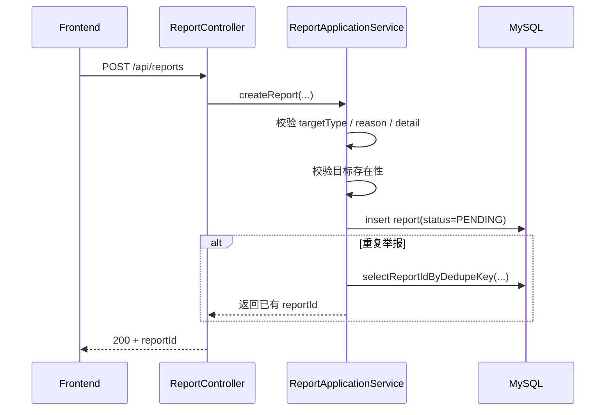
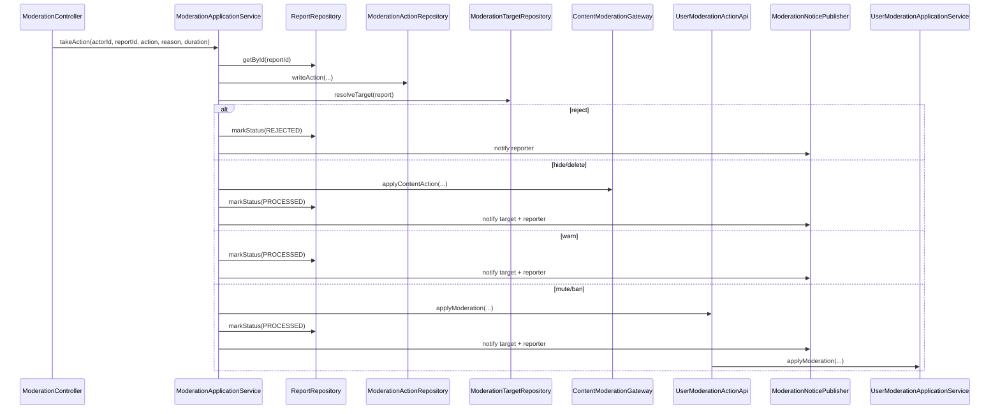

# 举报与治理处置链路实现说明

本文档说明当前仓库中内容举报与治理处置链路的实际实现路径，聚焦以下问题：

- 用户如何对帖子、评论、用户发起举报
- 举报在代码里如何去重、落库和分页查询
- 版主 / 管理员如何执行 `reject`、`hide`、`delete`、`warn`、`mute`、`ban`
- 为什么内容下线和用户处罚走的是两条不同的落地路径
- 治理动作执行后，举报状态、审计记录和通知如何收敛

本文档不展开：

- 帖子 / 评论的日常发布与读取链路
- 点赞 / 关注 / 拉黑链路
- IM 私信与群聊链路

相关文档：

- `docs/handbook/business-logic/content-post-comment-bookmark-subscription-flow.md`
- `docs/handbook/CORE_LOGIC.md`
- `docs/handbook/SYSTEM_DESIGN.md`

---

## 1. 参与组件

举报与治理链路涉及以下组件：

- 前端：用户提交举报，版主 / 管理员查看举报队列并执行处置
- `community-app`：
  - `ReportController`：举报入口
  - `ModerationController`：治理后台入口
  - `ReportApplicationService`：举报写入入口
  - `ModerationApplicationService`：举报队列读取、治理动作编排、审计、通知和状态更新
  - `ModerationDecisionDomainService`：治理动作、原因、处罚时长等领域规则
  - `ModerationTargetRepository`：把举报目标解析为真实对象与目标用户
  - `ContentModerationGateway` / `MyBatisContentModerationAdapter`：对帖子 / 评论执行下线动作
  - `UserModerationActionApi`：跨域同步调用 user owner 落地 mute / ban
  - `ModerationNoticePublisher`：向被处置人、举报人发布治理通知
- `user` 域：
  - `UserModerationApiAdapter`：user owner action/query API 适配器
  - `UserModerationApplicationService`：更新 `muteUntil` / `banUntil` 并发布 user policy changed 事件
- MySQL（`community` schema）：
  - `report`
  - `moderation_action`
  - `discuss_post`
  - `comment`
  - `user`

关键代码：

- `backend/community-app/src/main/java/com/nowcoder/community/content/controller/ReportController.java`
- `backend/community-app/src/main/java/com/nowcoder/community/content/controller/ModerationController.java`
- `backend/community-app/src/main/java/com/nowcoder/community/content/application/ReportApplicationService.java`
- `backend/community-app/src/main/java/com/nowcoder/community/content/application/ModerationApplicationService.java`

---

## 2. 对外接口

当前链路涉及的接口包括：

- 用户举报：
  - `POST /api/reports`
- 版主 / 管理员查看举报与审计：
  - `GET /api/moderation/reports`
  - `GET /api/moderation/actions`
- 版主 / 管理员执行处置：
  - `POST /api/moderation/actions`

`POST /api/moderation/actions` 当前支持的动作：

- `reject`
- `hide`
- `delete`
- `warn`
- `mute`
- `ban`

---

## 3. 举报写入链路

### 3.1 用户举报主时序

### 3.2 请求入口与目标类型

用户举报入口是 `ReportController.create(...)`。

它会把外部 `targetType` 解析成内部整数类型：

- `post` / `帖子` / `1`
- `comment` / `评论` / `2`
- `user` / `用户` / `3`

解析完成后，真正的写入由 `ReportApplicationService.create(...)` 负责。

### 3.3 举报写入规则

`ReportApplicationService.create(...)` / `ReportContentRepository.createReport(...)` 当前做了这些约束：

1. `reporterId`、`targetId` 必须合法
2. `targetType` 只能是帖子 / 评论 / 用户
3. `reason` 不能为空，且长度不能超过 64
4. `detail` 最长 512
5. 目标存在性校验：
   - 举报帖子：立即校验帖子存在
   - 举报评论：立即校验评论存在且未删除
   - 举报用户：写入阶段先不查 user，留到处置阶段再兜底
6. 新举报默认写成 `STATUS_PENDING`

### 3.4 去重语义

举报链路没有接入 `IdempotencyGuard`，而是走数据库层面的去重语义：

- 同一用户对同一目标重复举报
- `insert` 冲突后回查 `selectReportIdByDedupeKey(...)`
- 若存在已写入记录，直接返回已有 `reportId`

所以从调用语义看，它也是“幂等风格”的，但不是通过 `Idempotency-Key` 实现。

关键代码：

- `backend/community-app/src/main/java/com/nowcoder/community/content/application/ReportApplicationService.java`
- `backend/community-app/src/main/java/com/nowcoder/community/content/domain/repository/ReportContentRepository.java`
- `backend/community-app/src/main/java/com/nowcoder/community/content/infrastructure/persistence/MyBatisReportContentRepository.java`
- `backend/community-app/src/main/java/com/nowcoder/community/content/infrastructure/persistence/mapper/ReportMapper.java`

---

## 4. 治理后台读路径

治理后台入口是 `ModerationController`。

它暴露两类读接口：

- `GET /api/moderation/reports`
  - 看举报队列
  - 支持按 `status`、`targetType`、`reporterId`、分页过滤
- `GET /api/moderation/actions`
  - 看已执行的治理动作审计
  - 支持按 `actorId`、分页过滤

读路径比较薄：

- `ModerationController`
- `ModerationApplicationService`
- `ReportRepository` / `ModerationActionRepository`

这里要注意：

- controller 只做 HTTP 适配与 DTO 转换
- 读模型与治理动作编排都收敛在 `ModerationApplicationService`

---

## 5. 治理动作主链路

### 5.1 总体时序

### 5.2 编排中心：`ModerationApplicationService`

所有治理动作都收敛在：

- `backend/community-app/src/main/java/com/nowcoder/community/content/application/ModerationApplicationService.java`

它负责：

1. 校验 `actorId`、`reportId`、`action`、`reason`
2. 读取举报并确认仍是 `STATUS_PENDING`
3. 根据动作解析默认处罚时长：
   - `mute` 默认 24 小时
   - `ban` 默认 7 天
4. 写入治理审计记录
5. 解析真实目标
6. 按动作分支执行后续操作

支持的动作分支如下。

---

## 6. 各种治理动作分别怎么落地

### 6.1 `reject`

`reject` 表示驳回举报，不对帖子 / 评论 / 用户本身做修改。

当前行为：

- `report.status -> REJECTED`
- 给举报人发一条治理通知
- 不给被举报目标发通知

### 6.2 `hide` / `delete`

这两个动作都会进入 `ContentModerationGateway.applyContentAction(...)`，当前实现是 `MyBatisContentModerationAdapter`。

#### 对帖子

帖子当前的处置方式是：

- 调 `DiscussPostMapper.updateModerationDeleteMeta(...)`
- 把帖子状态改成 `2`
- 写入处置人、处置时间、删除原因
- 发布 `publishPostDeleted(...)`

也就是说，治理下线和作者删除一样，都是“软删除 + 事件扩散”，不是物理删行。

#### 对评论

评论当前的处置方式是：

- 调 `CommentMapper.updateModerationDeleteMeta(...)`
- 把评论状态改成 `1`
- 写入处置人、处置时间、删除原因
- 发布 `publishCommentDeleted(...)`

注意帖子和评论的“删除状态值”不是同一个数字：

- 帖子删除：`status = 2`
- 评论删除：`status = 1`

完成内容下线后：

- `report.status -> PROCESSED`
- 给被处置目标和举报人都发治理通知

关键代码：

- `backend/community-app/src/main/java/com/nowcoder/community/content/application/ContentModerationGateway.java`
- `backend/community-app/src/main/java/com/nowcoder/community/content/infrastructure/moderation/MyBatisContentModerationAdapter.java`

### 6.3 `warn`

`warn` 当前不会改帖子 / 评论 / 用户状态。

它的落地语义是：

- 记一条治理动作审计
- `report.status -> PROCESSED`
- 给被处置目标和举报人发治理通知

### 6.4 `mute` / `ban`

这两个动作不会直接在 content 域操作 `user` 表，而是通过 `UserModerationActionApi` 同步调用 user owner。

流程如下：

1. `ModerationApplicationService` 调 `UserModerationActionApi.applyModeration(...)`
2. `UserModerationApiAdapter` 委托 `UserModerationApplicationService.applyModeration(...)`
3. `UserModerationApplicationService` 更新 `user.mute_until` / `user.ban_until`
4. user 域发布 `UserPolicyChanged` 事件，供 IM policy outbox 投影

这意味着：

- 内容域负责“决定要处罚谁、处罚多久”
- 用户域负责“真正更新处罚状态”；当前是同步 owner API 协作，不是 after-commit command listener

完成后：

- `report.status -> PROCESSED`
- 给被处置目标和举报人都发治理通知

关键代码：

- `backend/community-app/src/main/java/com/nowcoder/community/user/api/action/UserModerationActionApi.java`
- `backend/community-app/src/main/java/com/nowcoder/community/user/infrastructure/api/UserModerationApiAdapter.java`
- `backend/community-app/src/main/java/com/nowcoder/community/user/application/UserModerationApplicationService.java`

---

## 7. 目标解析、审计与通知

### 7.1 目标解析

治理动作不会直接相信举报记录里的 `targetType + targetId` 就可执行，而是先用 `ModerationTargetResolver.resolveTarget(...)` 解析成：

- 目标类型
- 目标 id
- 目标用户 id

解析规则：

- 举报帖子：读 `discuss_post`，必须存在且未删除
- 举报评论：读 `comment`，必须存在且未删除
- 举报用户：直接把 `targetId` 视为目标用户 id

这样后续动作和通知都能稳定拿到 `targetUserId`。

### 7.2 治理审计

每次执行治理动作都会先通过 `ModerationAuditWriter.writeAction(...)` 写一条 `moderation_action` 记录。

当前审计字段包括：

- `id`
- `reportId`
- `actorId`
- `action`
- `reason`
- `durationSeconds`
- `createTime`

也就是说，即便后续动作失败，排查时也要先看 action 记录与事务是否最终提交。

### 7.3 治理通知

治理通知通过 `ModerationNoticePublisher.publish(...)` 统一构造 `ModerationPayload`，再发布 `publishModerationActionApplied(...)`。

通知投递对象有两类：

- `to_target`：被处置目标
- `to_reporter`：举报人

其中：

- `reject` 只通知举报人
- 其他动作同时通知被处置目标与举报人

这些通知后续会进入 `notice` 投影链路，写成 `moderation` topic 的站内通知。

---

## 8. 报告状态机

当前 `report` 的状态比较简单：

- `STATUS_PENDING = 0`
- `STATUS_PROCESSED = 1`
- `STATUS_REJECTED = 2`

状态迁移规则：

- 新举报：`PENDING`
- `reject`：`PENDING -> REJECTED`
- `hide/delete/warn/mute/ban`：`PENDING -> PROCESSED`

一条举报一旦不再是 `PENDING`，再次处置会被拒绝：

- `ModerationApplicationService` 会直接报“该举报已处理”

---

## 9. 失败路径与一致性语义

### 9.1 举报写入失败

举报写入阶段最重要的失败点有：

- `targetType` 非法
- `reason` / `detail` 非法
- 举报帖子或评论时目标已不存在
- 插入冲突但回查不到旧记录

其中重复举报不是失败，而是返回已有 `reportId`。

### 9.2 治理目标已失效

在治理动作真正执行时，目标可能已经变化：

- 帖子已被删
- 评论已被删

这时 `ModerationTargetRepository.resolveTarget(...)` 会报 `POST_NOT_FOUND` 或 `COMMENT_NOT_FOUND`，整条治理动作回滚。

### 9.3 用户处罚是同步 owner API 执行

`mute/ban` 的用户状态更新通过 `UserModerationActionApi` 同步回到 user owner application service。

这意味着：

- content 域不直接操作 `user` 表
- 用户处罚状态由 user 域在自己的 application service 中落地
- user policy changed 事件会继续驱动 IM policy outbox 投影

它和 notice / search 这类异步读模型不同：处罚状态本身不是 after-commit 追平。

### 9.4 内容下线和用户处罚为什么拆开

当前代码把这两类动作分开，是因为它们 owner 不同：

- 帖子 / 评论状态由 `content` 域 owns
- 用户禁言 / 封禁状态由 `user` 域 owns

因此治理编排在 `content`，真正状态落地分别回到各自 owner-domain。

---

## 10. 建议源码阅读顺序

建议按下面顺序读这条链路：

1. `backend/community-app/src/main/java/com/nowcoder/community/content/controller/ReportController.java`
2. `backend/community-app/src/main/java/com/nowcoder/community/content/application/ReportApplicationService.java`
3. `backend/community-app/src/main/java/com/nowcoder/community/content/controller/ModerationController.java`
4. `backend/community-app/src/main/java/com/nowcoder/community/content/application/ModerationApplicationService.java`
5. `backend/community-app/src/main/java/com/nowcoder/community/content/domain/service/ModerationDecisionDomainService.java`
6. `backend/community-app/src/main/java/com/nowcoder/community/content/domain/repository/ModerationTargetRepository.java`
7. `backend/community-app/src/main/java/com/nowcoder/community/content/infrastructure/moderation/MyBatisContentModerationAdapter.java`
8. `backend/community-app/src/main/java/com/nowcoder/community/content/application/ModerationNoticePublisher.java`
9. `backend/community-app/src/main/java/com/nowcoder/community/user/infrastructure/api/UserModerationApiAdapter.java`
10. `backend/community-app/src/main/java/com/nowcoder/community/user/application/UserModerationApplicationService.java`

---

## 11. 一句话总结

当前举报与治理链路的核心实现思路是：

- 举报先作为独立主事实写入 `report`
- 处置动作统一收敛在 `ModerationApplicationService`
- 内容下线直接改 `content` 主表并发布删除事件
- 用户禁言 / 封禁通过 `UserModerationActionApi` 同步交给 `user` 域
- 举报状态、治理审计和治理通知共同构成这条链路的收敛结果
