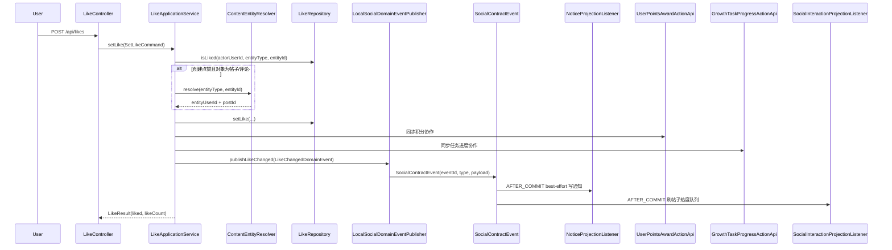

# 点赞 / 关注链路与下游副作用实现说明

本文档说明当前仓库中点赞、关注及其下游事件链路的实际实现路径，聚焦以下问题：

- 点赞 / 关注请求从哪里进入系统
- 点赞的 toggle / set 语义如何判定
- 点赞 / 关注在 DB 与 Redis 模式下分别如何落状态
- `entityUserId`、`postId` 等事件字段从哪里来
- 社交事件会驱动哪些下游副作用
- 当前项目如何使用同步 owner API 与 `AFTER_COMMIT` 本地监听

相关总览文档：

- `docs/handbook/ARCHITECTURE.md`
- `docs/handbook/SYSTEM_DESIGN.md`
- `docs/handbook/DATA_MODEL.md`

---

## 1. 当前默认配置

`backend/community-app/src/main/resources/application.yml` 当前主配置为：

- `social.storage: db`
- `social.events.publisher: local`
- `events.outbox.enabled: true`

这意味着：

- 社交主写路径默认以 MySQL 为 SSOT
- 点赞 / 关注成功后先发布本地 `SocialContractEvent`
- 点赞积分和成长任务进度在 `LikeApplicationService` 内同步调用 owner-domain `api.action`
- 通知由 `NoticeProjectionListener` 在 `AFTER_COMMIT` 阶段 best-effort 投影
- 帖子热度刷新这类“尽力而为”的本地副作用仍使用 `AFTER_COMMIT`

如果切换到 `social.storage: redis`，当前代码仍可运行，但生产端一致性语义会明显复杂化，原因见本文第 8 节。

---

## 2. 参与组件

点赞 / 关注主链路涉及以下组件：

- `community-app`：
  - `LikeController`：点赞写接口与读接口入口
  - `FollowController`：关注写接口与读接口入口
  - `LikeApplicationService`：点赞用例编排、事务边界、实体解析、状态变更、积分/任务同步协作、领域事件发布
  - `FollowApplicationService`：关注用例编排、事务边界、状态变更、领域事件发布
  - `LikeDomainService` / `FollowDomainService`：点赞、关注领域规则
  - `ContentEntityResolver`：application 层可信查询 helper，点赞帖子 / 评论时回源 `content` 模块解析 `entityUserId` 与 `postId`
  - `SocialDomainEventPublisher`：application 发布 social 领域事件的端口
  - `LocalSocialDomainEventPublisher`：infrastructure adapter，把 social 领域事件映射成 `SocialContractEvent`
- 社交存储：
  - `MyBatisLikeRepository` / `MyBatisFollowRepository`
  - `RedisLikeRepository` / `RedisFollowRepository`
  - `InMemoryLikeRepository` / `InMemoryFollowRepository`
- 下游副作用消费者：
  - `NoticeProjectionListener` / `NoticeProjectionApplicationService`
  - `UserPointsAwardActionApiAdapter` / `UserPointsApplicationService`
  - `GrowthTaskProgressActionApiAdapter` / `TaskProgressApplicationService`
  - `SocialInteractionProjectionListener`
- 数据存储：
  - MySQL：点赞关系、关注关系、用户获赞计数
  - Redis：可选社交主存储或读加速层

---

## 3. 对外接口

### 3.1 点赞接口

当前 `LikeController` 暴露的核心接口包括：

- `POST /api/likes`
- `GET /api/likes/status`
- `GET /api/likes/count`
- `GET /api/likes/counts`
- `GET /api/likes/statuses`
- `GET /api/likes/users/{userId}/count`

写接口统一入口是 `POST /api/likes`。

### 3.2 关注接口

当前 `FollowController` 暴露的核心接口包括：

- `POST /api/follows`
- `DELETE /api/follows`
- `GET /api/follows/status`
- `GET /api/follows/{userId}/followees`
- `GET /api/follows/{userId}/followers`
- `GET /api/follows/{userId}/followees/count`
- `GET /api/follows/{userId}/followers/count`

写接口统一入口是：

- `POST /api/follows`
- `DELETE /api/follows`

---

## 4. 点赞主链路

### 4.1 主时序图（默认配置：DB + local publisher）

### 4.2 请求语义

点赞请求体是 `LikeRequest`，关键字段包括：

- `entityType`
- `entityId`
- `liked`
- `entityUserId`
- `postId`

其中：

- `liked == null` 表示 toggle 语义，即服务端会根据当前状态自动翻转
- `liked == true / false` 表示 set 语义，即服务端会把点赞状态设为目标状态
- `entityUserId` 与 `postId` 虽然在请求体里存在，但当前服务端不信任客户端传值，真正写入事件 payload 的值由服务端自行解析

### 4.3 详细步骤

`LikeApplicationService.setLike(...)` 的处理顺序如下：

1. 校验 `actorUserId`
2. 校验 `entityType` 与 `entityId`
3. 查询当前是否已点赞
4. 根据 `liked` 字段决定目标状态：
   - `null`：翻转
   - `true / false`：设为目标状态
5. 仅在“创建点赞”窗口执行反骚扰校验：
   - 条件是 `!existed && liked`
   - 如果对象是帖子或评论，先回源内容模块解析目标归属用户
   - 若双方存在拉黑关系，则拒绝本次创建点赞
6. 通过 `LikeRepository.setLike(...)` 写入目标状态；DB、Redis、InMemory 的差异由 infrastructure repository 实现承接
7. 若状态确实发生变化，则构造 `LikeChangedDomainEvent`
8. application 先按需要调用 foreign owner-domain `UserPointsAwardActionApi` 与 `GrowthTaskProgressActionApi`
9. application 再通过 `SocialDomainEventPublisher.publishLikeChanged(...)` 发布领域事件，由 `LocalSocialDomainEventPublisher` 映射成：
   - `LikeCreated`
   - `LikeRemoved`
10. 最后重新查询并返回：
   - 当前是否已点赞
   - 当前实体点赞数

### 4.4 目标实体解析

点赞对象的可信元信息来自 `ContentEntityResolver`：

- 如果 `entityType == USER`，服务端直接把 `entityId` 当作 `entityUserId`
- 如果 `entityType == POST` 或 `COMMENT`，则通过 `ContentEntityQueryApi` 回源解析：
  - `entityUserId`：被点赞实体的归属用户
  - `postId`：所属帖子

该解析器默认采用 fail-closed 策略：

- 内容模块回源失败时直接抛错
- 解析结果不完整时直接抛错

因此点赞事件里的目标用户、所属帖子并不是“客户端声明”，而是“服务端权威解析”。

### 4.5 DB 模式下的状态变更

当 `social.storage = db` 时，点赞默认走 MySQL 路径：

- `addLike(...)` / `removeLike(...)` 维护点赞关系
- `incrementUserLikeCount(...)` 维护被赞用户的聚合获赞数
- 这两类写操作位于同一个 Spring 事务内
- 状态变更成功后再发布 `LikeCreated` / `LikeRemoved`

这一模式下，社交主业务写入在同一个 DB 事务域中；积分 / 任务进度同步 owner API 与事件发布失败会让当前用例回滚。

### 4.6 Redis 模式下的状态变更

当 `social.storage = redis` 时，点赞会改走 Redis 路径：

- `RedisLikeRepository.setLike(...)` 用 Lua 脚本同时更新：
  - 实体点赞集合
  - 被赞用户获赞计数
- repository 会声明自己需要显式补偿；
- `LikeApplicationService` 只依赖 repository 抽象，在 repository 声明“需要补偿”时才注册事务回滚补偿并在同步副作用或事件发布失败时执行反向回滚。

这说明当前 Redis 路径的复杂度主要集中在 storage adapter 的写语义上，而不是 outbox 本身。

### 4.7 点赞事件 payload 语义

`LikePayload` 当前包含：

- `actorUserId`：执行点赞 / 取消点赞的用户
- `entityType`
- `entityId`
- `entityUserId`：目标实体归属用户
- `postId`：目标实体所属帖子
- `createTime`

这些字段用于驱动通知、积分、任务进度、热度刷新等下游逻辑。

---

## 5. 关注主链路

### 5.1 请求语义

关注请求体是 `FollowRequest`，当前真正参与业务判定的字段只有：

- `entityType`
- `entityId`

当前关注能力只支持：

- `entityType == USER`

### 5.2 详细步骤

`FollowApplicationService.follow(...)` 的处理顺序如下：

1. 校验 `actorUserId`
2. 校验 `entityType` 与 `entityId`
3. 强制限制 `entityType == USER`
4. 禁止关注自己
5. 查询当前是否已关注
6. 仅在“新建关注”窗口执行拉黑关系校验：
   - 条件是 `!existed`
   - 若双方存在拉黑关系，则拒绝创建关注
7. 调 `followRepository.follow(...)` 创建关注关系
8. 如果确实是第一次创建，则构造 `FollowPayload`
9. 发布 `FollowCreated`

`unfollow(...)` 当前只做删除关注关系，不发布 `FollowRemoved` 事件。

### 5.3 DB 模式下的状态变更

当 `social.storage = db` 时：

- 关注关系落在 `social_follow` 表
- MySQL 唯一约束承担幂等保护
- 重复关注返回 `created=false`

这是当前主配置下的默认路径。

### 5.4 Redis 模式下的状态变更

当 `social.storage = redis` 时：

- `RedisFollowRepository` 用 Lua 脚本同时维护：
  - `followee:<userId>:<entityType>`
  - `follower:<entityType>:<entityId>`
- 如果脚本发现一侧存在、一侧缺失，还会尝试修复历史双写不一致
- 与点赞类似，repository 会把“需要显式补偿”作为能力暴露出来，service 只按 repository 能力决定是否注册事务回滚补偿和事件失败补偿。
- 与点赞类似，repository 会把“需要显式补偿”作为能力暴露出来，application service 只按 repository 能力决定是否注册事务回滚补偿和事件失败补偿。

### 5.5 关注事件 payload 语义

`FollowPayload` 当前包含：

- `actorUserId`
- `entityType`
- `entityId`
- `entityUserId`
- `createTime`

由于当前只支持关注用户，`entityId` 与 `entityUserId` 在语义上都指向被关注者。

---

## 6. 社交事件会驱动哪些下游副作用

当前点赞 / 关注事件的主要消费方如下：

| 事件 | 下游能力 | 作用对象 | 当前默认模式 |
| --- | --- | --- | --- |
| `LikeCreated` | 通知 | 被点赞用户 | `AFTER_COMMIT` best-effort |
| `LikeCreated` | 积分 +1 | 被点赞用户 | 同步 owner API |
| `LikeRemoved` | 积分 -1 | 被点赞用户 | 同步 owner API |
| `LikeCreated` | 成长任务进度 | 被点赞用户 | 同步 owner API |
| `LikeCreated` / `LikeRemoved` | 帖子热度刷新 | 帖子 | `AFTER_COMMIT` |
| `FollowCreated` | 通知 | 被关注用户 | `AFTER_COMMIT` best-effort |

### 6.1 通知

通知消费关注以下社交事件：

- `LikeCreated`
- `FollowCreated`

行为语义：

- 给 `entityUserId` 对应用户写一条站内通知
- 通知内容里保留源事件 `eventId`、`type` 和原始 payload

### 6.2 积分

积分只消费点赞事件：

- `LikeCreated`：给被赞用户 `+1`
- `LikeRemoved`：给被赞用户 `-1`

如果事件里的 `entityUserId` 不合法，或者点赞者和被点赞者是同一人，则直接跳过。

### 6.3 成长任务进度

任务进度当前只消费：

- `LikeCreated`

语义是把“收到一次点赞”视为某类成长事件，作用在被点赞用户上。

### 6.4 帖子热度刷新

`SocialInteractionProjectionListener` 目前仍是 `AFTER_COMMIT` 本地监听器：

- 消费 `LikeCreated` / `LikeRemoved`
- 仅处理 `entityType == POST`
- 解析出 `postId` 后把帖子加入 `PostScoreQueue`

这一能力当前没有走 outbox，属于“尽力而为”的本地副作用。

---

## 7. 当前项目中社交下游副作用的工作方式

在当前项目里，点赞 / 关注不再通过 notice / points / task-progress outbox 扇出，而是按语义分成两类：

1. 需要在当前用例内同步完成的 owner-domain 协作：
   - `UserPointsAwardActionApi`
   - `GrowthTaskProgressActionApi`
2. 主事务提交后 best-effort 追平的读模型 / 本地刷新：
   - `NoticeProjectionListener`
   - `SocialInteractionProjectionListener`

这意味着：

- social domain service 不应该调用通知、积分、任务服务
- social application service 可以在确实需要同步跨域协作时调用 foreign owner-domain `api.action`
- 如果副作用只是本地刷新、丢一次可接受，则优先考虑 `AFTER_COMMIT`

### 7.1 为什么点赞 / 关注要拆副作用语义

点赞 / 关注不是“只改一条主状态”的命令，它们通常会同时触发多类副作用：

- 通知
- 积分
- 成长任务进度
- 热度刷新

其中积分 / 任务进度属于用例内强协作；通知和热度刷新属于可稍后追平的读模型或本地刷新。当前代码选择让积分 / 任务进度同步落在 owner API，通知和热度刷新走 `AFTER_COMMIT`。

---

## 8. 当前边界与限制

当前社交链路要分两层理解：

- 社交主事实仍由 `LikeRepository` / `FollowRepository` owns
- 下游副作用不再统一进入 outbox；是否同步由 use case 语义决定

### 8.1 在默认配置下

当配置为：

- `social.storage = db`
- `social.events.publisher = local`
- `events.outbox.enabled = true`

则：

- 社交主写入在 DB 事务内完成
- 点赞积分和任务进度同步调用 owner API
- 通知和热度刷新在 `AFTER_COMMIT` 执行，失败不回滚社交主事务
- `events.outbox.enabled` 不会启用旧的 points / notice / task-progress social outbox adapter

### 8.2 在 Redis 主存储下

如果切到 `social.storage = redis`，当前代码仍然可以运行，但不能天然保证：

- Redis 主写入
- 同步 owner API 副作用
- 后续领域事件发布

这些动作的原子一致性。

因此当前 Redis 路径里仍然存在：

- application 层手工回滚补偿
- 事务回滚时的同步注册
- 发布失败时的反向写

换句话说：

- 当前同步 owner API 与 after-commit 副作用没有自动消除 Redis 主写入路径中的生产端一致性复杂度

这也是为什么当前主配置选择 `social.storage = db`。

---

## 9. 维护者最小使用准则

如果未来要在点赞 / 关注后新增一个副作用，当前仓库更推荐按下面的边界接入：

### 9.1 需要用例内强协作的副作用

例如：

- 新的积分 / 成长 / 奖励投影
- 写接口响应前必须完成的 owner 状态更新

推荐做法：

1. 定义 owner-domain `api.action` / `api.model`
2. 在 social application service 中调用该 owner API
3. 让 owner application service 自己负责事务、幂等和领域规则

### 9.2 只是本地、可丢失的副作用

例如：

- 本地缓存失效
- 热度刷新队列
- 一些可重扫的轻量投影

推荐做法：

- 使用 `@TransactionalEventListener(phase = AFTER_COMMIT)`
- 不要把它们直接塞回 domain service；优先监听 `contracts.event`

### 9.3 不推荐的接入方式

当前不推荐在 social domain service 中直接写：

- 下游服务调用
- 手工序列化下游 payload
- 下游重试逻辑
- 面向具体消费者的存储策略分支

social domain service 更适合只负责：

- 业务规则
- 主状态变更
- 领域规则与领域事件构造

下游投影编排应留在 application service、foreign `api.action` 或事件消费者中。

---

## 10. 关键代码定位

### 10.1 写接口与请求对象

- `backend/community-app/src/main/java/com/nowcoder/community/social/controller/LikeController.java`
- `backend/community-app/src/main/java/com/nowcoder/community/social/controller/FollowController.java`
- `backend/community-app/src/main/java/com/nowcoder/community/social/controller/dto/LikeRequest.java`
- `backend/community-app/src/main/java/com/nowcoder/community/social/controller/dto/FollowRequest.java`

### 10.2 主业务服务

- `backend/community-app/src/main/java/com/nowcoder/community/social/application/LikeApplicationService.java`
- `backend/community-app/src/main/java/com/nowcoder/community/social/application/FollowApplicationService.java`
- `backend/community-app/src/main/java/com/nowcoder/community/social/application/ContentEntityResolver.java`
- `backend/community-app/src/main/java/com/nowcoder/community/social/domain/service/LikeDomainService.java`
- `backend/community-app/src/main/java/com/nowcoder/community/social/domain/service/FollowDomainService.java`

### 10.3 社交主存储

- `backend/community-app/src/main/java/com/nowcoder/community/social/domain/repository/LikeRepository.java`
- `backend/community-app/src/main/java/com/nowcoder/community/social/infrastructure/persistence/MyBatisLikeRepository.java`
- `backend/community-app/src/main/java/com/nowcoder/community/social/infrastructure/persistence/RedisLikeRepository.java`
- `backend/community-app/src/main/java/com/nowcoder/community/social/domain/repository/FollowRepository.java`
- `backend/community-app/src/main/java/com/nowcoder/community/social/infrastructure/persistence/MyBatisFollowRepository.java`
- `backend/community-app/src/main/java/com/nowcoder/community/social/infrastructure/persistence/RedisFollowRepository.java`

### 10.4 社交事件与 payload

- `backend/community-app/src/main/java/com/nowcoder/community/social/contracts/event/SocialEventTypes.java`
- `backend/community-app/src/main/java/com/nowcoder/community/social/contracts/event/SocialContractEvent.java`
- `backend/community-app/src/main/java/com/nowcoder/community/social/domain/event/SocialDomainEventPublisher.java`
- `backend/community-app/src/main/java/com/nowcoder/community/social/infrastructure/event/LocalSocialDomainEventPublisher.java`
- `backend/community-app/src/main/java/com/nowcoder/community/social/contracts/event/LikePayload.java`
- `backend/community-app/src/main/java/com/nowcoder/community/social/contracts/event/FollowPayload.java`

### 10.5 同步 owner API 与本地监听

- `backend/community-app/src/main/java/com/nowcoder/community/user/api/action/UserPointsAwardActionApi.java`
- `backend/community-app/src/main/java/com/nowcoder/community/user/infrastructure/api/UserPointsAwardApiAdapter.java`
- `backend/community-app/src/main/java/com/nowcoder/community/user/application/UserPointsApplicationService.java`
- `backend/community-app/src/main/java/com/nowcoder/community/growth/api/action/GrowthTaskProgressActionApi.java`
- `backend/community-app/src/main/java/com/nowcoder/community/growth/infrastructure/api/GrowthTaskProgressActionApiAdapter.java`
- `backend/community-app/src/main/java/com/nowcoder/community/growth/application/TaskProgressApplicationService.java`

### 10.6 After-commit 本地副作用

- `backend/community-app/src/main/java/com/nowcoder/community/content/infrastructure/event/SocialInteractionProjectionListener.java`
- `backend/community-app/src/main/java/com/nowcoder/community/notice/infrastructure/event/NoticeProjectionListener.java`
