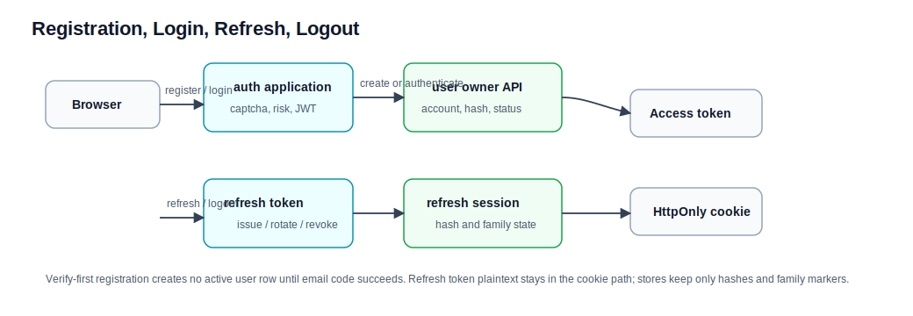

# 注册、登录和会话流程

本文解释用户从未登录到进入系统的完整链路。领域细节见 [../auth.md](../auth.md) 和 [../user.md](../user.md)。

## 参与领域

| 领域 | 职责 |
| --- | --- |
| auth | 注册流程、验证码、登录风控、JWT 签发、refresh token 策略和 session。 |
| user | 用户账号、密码 hash、用户状态、角色和 `securityVersion`。 |
| analytics | 登录成功和访问行为采集。 |

## 注册主流程

当前注册是 Verify-First：验证码通过前不插入正式 `user` row。

1. 浏览器提交注册请求到 auth controller。
2. controller 只做 HTTP binding、客户端信息提取和 DTO 转换，然后进入 `RegistrationApplicationService`。
3. auth 校验 captcha、用户名、密码、邮箱和邮件配置。
4. auth 调 `UserRegistrationActionApi.prepareRegistrationUser(...)`，让 user owner 规范化用户名/邮箱、前置检查用户名/邮箱冲突、生成预备 userId、计算 BCrypt 密码 hash 和默认头像。
5. auth 保存 `PreparedRegistrationDraft`，生成 256-bit base64url opaque `registrationToken`。
6. auth 发送安全随机生成的 6 位注册验证码；重发时先写 pending replacement code，邮件发送成功后才 promote，发送失败则 abort 并保留原 active code。
7. 用户提交验证码后，auth 先把验证码转入 pending 消费态，再创建用户。
8. auth 调 `UserRegistrationActionApi.createVerifiedRegistrationUser(...)`，由 user owner 插入 active 用户。
9. 注册成功后复用登录签发链路，返回 access token 和 refresh cookie。
10. draft/code 清理属于后续清理动作，不能让已创建用户回滚成未注册状态。

失败语义：

- 验证码错误或过期时不创建用户。
- 用户名或邮箱冲突由 user owner 判断；prepare 阶段先查重，最终插入仍由数据库唯一约束兜住竞态。
- 邮件发送失败时不能伪造注册成功。
- 用户已创建但自动登录 token 签发失败时，返回 `REGISTRATION_ACTIVATED_LOGIN_REQUIRED`，用户直接去登录。
- abandoned draft 过期后自然清理。

## 登录主流程

1. 浏览器提交用户名、密码和可能的验证码。
2. controller 进入 `LoginApplicationService`。
3. auth 检查用户名/IP 登录风控，决定是否需要 captcha。
4. 需要 captcha 但没有提交时返回 `CAPTCHA_REQUIRED`。
5. captcha 失败、账号禁用或密码错误都会计入失败次数。
6. auth 调 `UserCredentialQueryApi.authenticate(...)`，让 user owner 校验密码 hash 和用户状态。
7. 认证成功后，auth reset 失败计数。
8. auth 签发短期 access token。
9. auth 生成 256-bit base64url refresh token 明文返回到 HttpOnly cookie，服务端只保存 hash 和 refresh session 状态。
10. auth 记录安全日志，并可通过 analytics action API 记录登录成功。

## Refresh 和 Logout

refresh token 明文只出现在浏览器 HttpOnly cookie 和当前请求/响应中。

1. 浏览器业务请求遇到 401 后，前端调用 `/api/auth/refresh`。
2. auth 校验旧 refresh token，把旧 session 转入 `PENDING_ROTATION` 30 秒 lease。
3. auth 回源 user owner 校验用户仍允许登录和 refresh，并比较 session 的 `securityVersionAtIssue` 与当前 `securityVersion`。
4. 版本不一致时 auth 撤销 family 并清 cookie；一致时生成 replacement token。
5. auth repository finish rotation：旧 session 变为 `CONSUMED`，replacement session 变为 `ACTIVE` 并记录当前安全版本。
6. 返回新 access token 和新 refresh cookie。
7. begin 后遇到临时失败时 rollback 旧 session；无法安全 rollback 时撤销 family 并清 cookie。
8. logout 可从 active session 或 terminal tombstone 识别 family，并由 controller 写 clear cookie。

重要语义：

- access token 是短期 JWT，服务端不保存在线 access session。
- refresh token reuse 可触发 family 撤销。
- 密码、角色以及新增或延长活跃封禁会递增 user `securityVersion`；旧 refresh family 在下一次续期时由 auth 拒绝并撤销。

## 排查口径

| 现象 | 先查哪里 |
| --- | --- |
| 注册验证码通过但没用户 | auth draft/code 消费和 user create action。 |
| 登录密码正确但失败 | user 状态、密码 hash、auth 风控/captcha。 |
| refresh 失败 | refresh cookie、token hash、session 状态和 family 是否撤销。 |
| 登录成功但统计没变化 | analytics 采集，不要先怀疑登录主事务。 |
