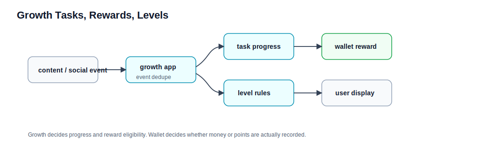

# 成长任务、奖励和等级流程

本文解释内容和社交事件如何推进成长任务，并最终触发钱包奖励。领域细节见 [../growth.md](../growth.md)、[../wallet.md](../wallet.md)。

## 参与领域

| 领域 | 职责 |
| --- | --- |
| growth | 任务模板、任务进度、事件去重、等级规则和奖励触发。 |
| content / social | 产生发帖、评论、点赞等源事件。 |
| wallet | 奖励入账和撤销的最终账本事实。 |
| user | 用户资料展示时可组合 growth 等级；奖励余额事实回源 wallet。 |

## 任务进度流程

1. content 或 social 发生业务事件。
2. owner transaction 经 `eventbus.content` / `eventbus.social` 发布到 `content.events` / `social.events`。
3. `TaskProgressEventBackboneKafkaListener` 识别目标事件并调用 `TaskProgressApplicationService`；非法目标 payload 进入 retry / `.dlq`。
4. growth 按事件类型查找 active 任务模板。
5. 根据周期类型计算 `periodKey`。
6. growth 先写 `user_task_event_log`，用 `sourceEventId` 做去重。
7. 确保存在当前用户、任务、周期的 `user_task_progress`。
8. 锁定进度行并推进 progress；like removed 按 relation key 撤销尚未 claimed 的原贡献。
9. domain service 判断是否未完成、达到待领取，或达到后自动发奖。
10. 已发过的奖励不重复发。

## 自动奖励流程

1. 任务达到自动发奖条件。
2. growth 生成稳定 reward grant id 或 requestId。
3. growth 调 `WalletRewardActionApi`。
4. wallet 确保用户钱包和平台奖励支出账户存在。
5. wallet 生成复式账本 posting。
6. wallet 通过 requestId 去重，避免重复奖励。

growth 只决定“应该奖励”；wallet 决定“奖励是否已经入账”。

## 等级流程

当前等级不是 user 表上的独立实时字段。查询等级时，growth 根据等级规则配置和任务完成统计实时计算。

这意味着：

- 修改等级规则会影响后续查询结果。
- 等级展示不是简单读取 user 字段。
- 任务进度缺失或事件未消费会影响等级计算。

## 当前明确边界

当前 growth 主要是任务模板、任务进度、事件去重、奖励触发和等级计算底座。不要默认存在独立签到 controller、任务中心 controller、手动领取奖励接口或奖励商城，除非后续明确设计并实现。

## 排查口径

| 现象 | 先查哪里 |
| --- | --- |
| 发帖后任务没涨 | 源事件是否进入 growth，`sourceEventId` 是否已被去重。 |
| 任务达成但没奖励 | 模板是否自动发奖，wallet requestId 是否已处理。 |
| 奖励重复 | wallet requestId 去重和 ledger 记录。 |
| 等级显示不符合预期 | 等级规则配置和任务完成统计。 |
