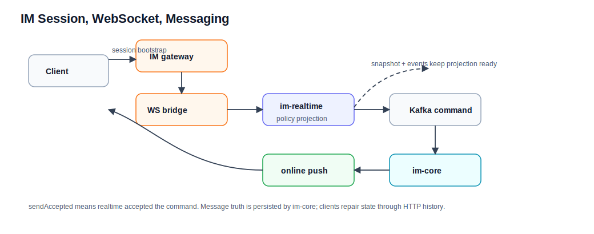

# IM Session、WebSocket 和消息流程

本文解释 IM 从打开 session 到发送消息的完整链路。领域细节见 [../im.md](../im.md)、[../social.md](../social.md)、[../user.md](../user.md)。

## 参与模块

| 模块或领域 | 职责 |
| --- | --- |
| community-im-gateway | 外部 session bootstrap、JWT 校验、session ticket、worker 选择和 `/ws/im` 外部桥接。 |
| im-realtime | WebSocket 连接态、在线用户连接、Kafka command 生产、在线推送、本地 policy/membership projection。 |
| im-core | 私聊会话、私聊消息、房间、房间成员、群消息、顺序号、已读水位和未读查询。 |
| community-app user/social | 用户处罚、用户存在性和拉黑关系主事实。 |

## Session bootstrap

1. 浏览器带 Bearer access token 调 `POST /api/im/sessions`。
2. `community-im-gateway` 校验 JWT。
3. gateway 解析 userId。
4. gateway 根据 userId 或连接策略选择 realtime worker。
5. gateway 生成短期 session ticket，包含 userId、workerId、过期时间等。
6. gateway 返回稳定外部 `wsUrl` 和 ticket。

`wsUrl` 是客户端访问 gateway 的地址，不是直接访问 worker 的内部地址。`PublicWsUrlFactory` 只使用显式配置的绝对 `ws` / `wss` 地址，不从请求 Host 或 forwarded header 派生，避免把 ticket 泄到非预期域名。

## WebSocket 连接

1. 客户端连接 `/ws/im`；connect 及后续 frame 都显式携带数值型 `schemaVersion: 1`，缺失、`null`、非整数或非 `1` 的版本会被拒绝。
2. gateway 接收首帧 connect 和 ticket；首帧缺失、超时、非文本或 ticket 无效会直接 reject 并关闭。
3. `ConnectTicketRouter` 根据 ticket 找到 worker。
4. gateway 建立到 worker 的内部 WebSocket bridge，并透传 `traceparent`。
5. `im-realtime` 先确认 projection ready，再校验 ticket。
6. realtime 创建 `WsConnection` 并注册到 `ConnectionRegistry`。
7. 连接绑定 userId、sessionId、traceId、workerId。
8. realtime 从 membership projection 中绑定该用户已加入的房间到本进程 `RoomLocalIndex`。

连接成功只表示 realtime 接入完成，不代表任何消息已发送或持久化。

## 私信发送

1. 客户端发送 `sendPrivateText` frame。
2. realtime 校验连接已认证。
3. realtime 校验 toUserId、clientMsgId 和 content。
4. realtime 用本地 policy projection 判断发送者是否禁言/封禁、目标用户是否存在、双方是否拉黑。
5. 判定失败时，realtime 直接推 reject。
6. 判定通过后，realtime 写 Kafka `SendPrivateTextCommand`。
7. realtime 可向发送端返回 accepted/ack，表示 command 已接收。
8. im-core 消费 command。
9. im-core 计算 conversationId。
10. im-core 先按 `(conversationId, fromUserId, clientMsgId)` 查幂等；命中时返回既有消息事实，不重复发布消息事实 event。
11. 幂等未命中时，im-core 回源 `community-app` owner decision 做最终校验。
12. owner decision 拒绝时发布 rejected event，不写私信表，Kafka command 视为业务完成。
13. owner decision 允许时，im-core 分配 conversation seq，写消息和会话状态。
14. 新消息发布 persisted fact event；每个成功发送尝试发布 committed send-result event。
15. realtime 消费 persisted event，推送给收发双方在线连接；消费 committed / rejected event，给发送端推送结果回执。
16. 离线或未收到推送的客户端通过 HTTP history 补拉。

## 群聊发送

群聊和私信的形态类似，但 owner 事实不同：

- room、member、group message、seq 和 read watermark 属于 im-core。
- realtime 使用本地 membership projection 做发送前快速判断。
- command accepted 不代表群消息已经持久化。
- persisted event 由共享 owner consumer 根据 Redis room presence 路由到 `im.command.room-fanout-routed` 的固定 worker inbox partition；single slot 为 `0`，cluster slots 为 `0/1/2`。
- target delivery 是 state-idempotent at-least-once；worker 重启后依靠 room/seq 最大值收敛，不承诺跨重启 exactly-once。
- 客户端需要通过 history 和 read watermark 修复本地状态。

## Policy projection

user 处罚、social 拉黑和 im-core 房间成员变化通过 snapshot + outbox/Kafka 增量事件同步到 realtime。entry / delta 必须携带显式正数 owner version；snapshot watermark 必填、非负且允许为 `0`，发生时间不参与版本计算。`ProjectionSyncCoordinator` 启动时先拉 policy/membership snapshot；snapshot 未就绪时，connect 和 send frame 会被 `projection_not_ready` 拒绝。本地 projection 只用于快速判定，不是权威事实。

常见滞后语义：

- 用户刚被禁言后，realtime projection 可能短暂未追平。
- Kafka command accepted 后，im-core 仍可能 rejected。
- 重复 `clientMsgId` 不会创建重复消息事实；不同 `requestId` 的重放会收到各自的 committed / rejected 发送结果。
- 在线推送失败不影响消息事实，客户端应通过 history 补拉。

## 排查口径

| 现象 | 先查哪里 |
| --- | --- |
| session 打不开 | access token、gateway session ticket、worker 选择。 |
| WS 连接失败 | ticket 是否过期、gateway bridge、realtime worker。 |
| 发送 accepted 但没消息 | im-core persisted/rejected event 和 history。 |
| 拉黑后仍短暂能发 | user/social 主事实和 realtime policy projection 延迟。 |
| 未读数异常 | im-core read watermark，不要只看在线推送。 |
