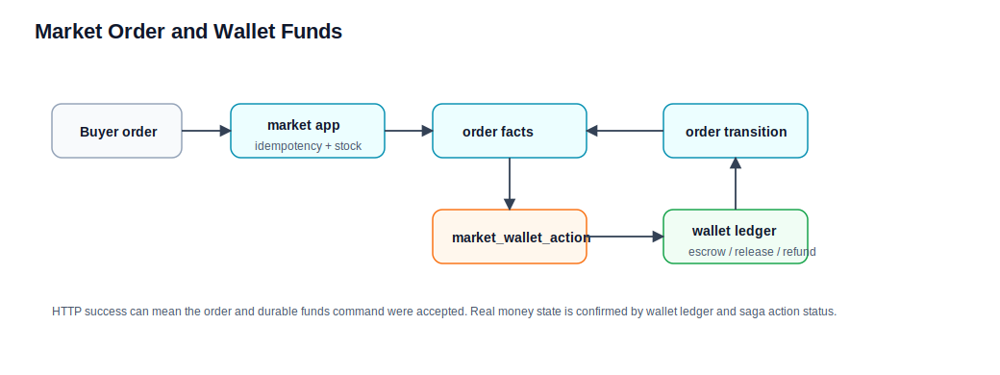

# 市场订单和钱包资金流程

本文解释市场交易如何和钱包账本协作。领域细节见 [../market.md](../market.md) 和 [../wallet.md](../wallet.md)。

## 参与领域

| 领域 | 职责 |
| --- | --- |
| market | 商品、库存、地址快照、订单、纠纷、自动确认和资金动作 saga。 |
| wallet | 用户账户、平台账户、复式账本、充值、提现、转账、奖励和市场资金入账。 |
| user | 买家、卖家、管理员身份和状态。 |

## 创建订单流程

1. 买家提交下单请求，携带 `Idempotency-Key`。
2. `MarketApplicationService.createOrder(...)` 计算 request fingerprint。
3. `IdempotencyGuard.executeRequired(...)` 包住下单动作。
4. `MarketOrderApplicationService.createOrder(...)` 校验买家、商品、数量和地址。
5. 如果同一买家和幂等键已有关联订单，校验 replay 参数一致后返回已有结果。
6. market 锁定商品并校验库存、状态和购买约束。
7. 如果商品需要地址，market 保存地址快照。
8. market 写订单。
9. finite stock 商品扣减库存；preloaded delivery 商品预留发货单元。
10. market 写入或 enqueue escrow 资金动作。
11. 返回订单当前状态。

HTTP 成功表示订单主事实和资金动作命令已按设计接单，不等于钱包账本已经完成所有动作。

## 支付托管和确认收货

市场资金动作通常通过 market-owned action 状态机推进。

1. 下单后创建 escrow action。
2. wallet owner 执行资金托管入账。
3. 订单进入可发货或待交付状态。
4. 卖家发货或系统交付后，订单进入 shipped / delivered。
5. 买家确认收货时，market 标记 release pending。
6. market enqueue release action。
7. wallet 将托管资金释放给卖家。
8. action 成功后，market 条件推进订单状态。

## 退款和纠纷

退款或纠纷不应该直接改钱包余额。

1. market 判断订单、角色、时限和纠纷状态。
2. market 写退款或纠纷主事实。
3. market 生成 refund / cancel / release 等资金 action。
4. wallet 根据 action 入账。
5. market 根据 action 结果推进订单或纠纷状态。

## 钱包账本口径

wallet 的核心事实是账户和 ledger。充值、提现、转账、奖励、管理员调整、市场资金动作都应落到统一账本规则。

关键语义：

- amount 必须符合 wallet command 规则。
- reward / adjustment / market action 使用 requestId 去重。
- 资金流动使用 debit / credit postings 表达。
- 余额展示来自 wallet owner，不来自 market。

## 排查口径

| 现象 | 先查哪里 |
| --- | --- |
| 下单重复返回已有订单 | market idempotency key、request fingerprint。 |
| 订单成功但余额没变 | market wallet action 状态和 wallet ledger。 |
| 确认收货后卖家未到账 | release action 是否 pending / succeeded / dead。 |
| 退款状态和余额不一致 | market 纠纷/退款状态、wallet refund posting、补偿任务。 |
