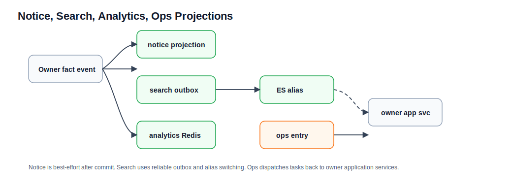

# 通知、搜索、分析和运维投影流程

本文解释几个偏读模型和运维入口的业务流程。领域细节见 [../notice-search-analytics-ops.md](../notice-search-analytics-ops.md)、[../../operations.md](../../operations.md)。

## 参与领域

| 领域 | 职责 |
| --- | --- |
| notice | 站内通知读模型、未读数、摘要和通知列表。 |
| search | Elasticsearch 帖子索引、查询语义、reindex 和 alias 切换。 |
| analytics | 请求完成后的 UV / DAU 等 Redis 统计。 |
| ops | 管理型重建、清理和补偿入口的分发。 |
| content / social / moderation | 通知和搜索的上游事实来源。 |

## 通知投影

1. content、social 或 moderation 发生业务事件。
2. owner 发布 contract event。
3. `NoticeProjectionListener` 在事务提交后接收事件。
4. `NoticeProjectionApplicationService` 计算收件人、topic 和内容快照。
5. `NoticeProjectionDomainService.shouldProject(...)` 判断是否应该生成通知。
6. notice 写通知读模型。
7. 通知列表、未读数和摘要只读 notice 自己的读模型。

语义：

- 点赞、评论、关注和治理事件可生成通知。
- `LIKE_REMOVED` 和 `FOLLOW_REMOVED` 当前不一定撤销通知。
- 通知是 after-commit best-effort，失败不回滚上游主事务。

## 搜索投影

1. content 帖子主事实变化。
2. content event 写入 search outbox。
3. outbox worker 触发 `PostOutboxHandler`。
4. handler 回源 content owner 当前状态。
5. search 根据当前状态决定 ES upsert 还是 delete。
6. 搜索接口读取 ES alias 指向的索引。

重建索引时：

1. ops 或 XXL job 触发 reindex。
2. search 使用 single-flight 避免多个 reindex 并发。
3. 新索引构建完成后，通过 alias 原子切换。
4. alias 切换前原索引始终可读。
5. 失败时保留原索引服务。

ES 是读模型，不是帖子事实。

## Analytics 采集

1. 请求完成后，`AnalyticsRequestCaptureFilter` 采集请求信息。
2. classifier 判断是否记录 UV / DAU。
3. `AnalyticsIngestApplicationService` 写 Redis 统计结构。
4. 登录成功也可以通过 action API 计入 DAU。

analytics 不拥有用户、会话或内容事实。它只是统计读模型。

## Ops 入口

ops 本身不拥有业务事实。它只提供管理员触发重建、清理、补偿的入口，然后分发到 owner domain 的 application service。

规则：

- ops 不直连 repository、mapper 或 dataobject。
- ops 不绕过 owner 修改业务事实。
- 长任务要有幂等、single-flight、状态和日志。

## 排查口径

| 现象 | 先查哪里 |
| --- | --- |
| 通知缺失 | 上游 contract event、notice projection listener、投影规则。 |
| 搜索结果缺失 | search outbox、outbox worker、ES alias、必要时 reindex。 |
| 访问统计异常 | capture filter、classifier、Redis 统计 key。 |
| 运维任务重复跑 | single-flight lock、job 状态、ops 分发入口。 |
