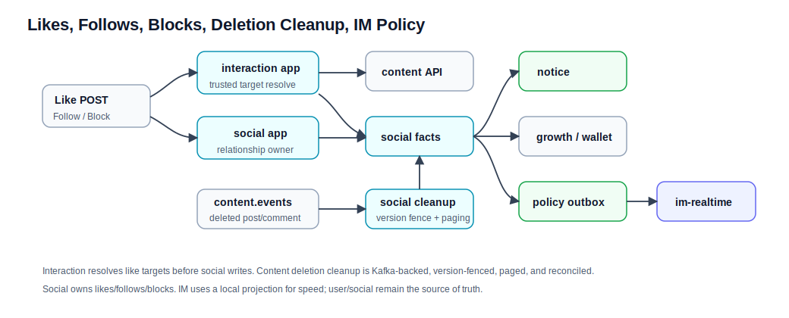

# 点赞、关注、拉黑、通知和 IM Policy 流程

本文解释社交互动如何影响内容展示、通知、成长任务和 IM 发送权限。领域细节见 [../social.md](../social.md)、[../content.md](../content.md)、[../notice-search-analytics-ops.md](../notice-search-analytics-ops.md)、[../im.md](../im.md)。

## 参与领域

| 领域 | 职责 |
| --- | --- |
| social | 点赞、关注、拉黑关系主事实。 |
| interaction | 点赞写入前的 user/content 目标解析和 social action 编排。 |
| content | 被点赞或评论的内容实体、作者和帖子归属。 |
| user | 用户存在性、资料和处罚事实。 |
| notice | 点赞、评论、关注、治理等事件生成的通知读模型。 |
| growth / wallet | 社交事件推进任务和奖励入账。 |
| IM realtime | 使用 user/social projection 做发送前快速判定。 |

## 点赞流程

1. `LikeInteractionController` 进入 `LikeInteractionApplicationService`。
2. interaction 校验 actor、`entityType` 和 `entityId`。
3. USER 目标回源 user；POST/COMMENT 目标通过 `ContentEntityQueryApi` 解析 `entityUserId` 和根 `postId`，不信任客户端声明。
4. interaction 调 `SocialLikeActionApi` 进入 `LikeApplicationService`。
5. social 再校验 resolved target，锁定内容目标的 `LikeTargetState`，deleted target 禁止新增点赞。
6. social 检查当前关系；`liked` 为空时 toggle，目标状态相同则幂等返回。
7. 新增点赞前检查双方拉黑关系，再写入或删除点赞关系。
8. social 发布 `LikeChangedDomainEvent`，映射为 contract event 并写 owner outbox。
9. social contract event 进入 Kafka 后，notice、growth、wallet reward 和 content hot-feed projection 等下游异步追平。

关键语义：

- 自己给自己点赞不会带来奖励收益。
- 被删除内容通过 `content.events -> SocialContentDeletionKafkaListener -> LikeApplicationService` 异步清理；每页 `200`，每条删除继续发 like-removed event。
- `SocialLikeCleanupReconciliationJob` 扫描 deleted target 上的遗留关系；默认关闭，batch `50`、delay `300s`。
- 取消点赞不一定撤销已经生成的通知，按 notice 投影规则执行。

## 关注流程

1. `FollowApplicationService.follow(...)` 校验 actor、目标实体和参数。
2. 重复关注视为幂等 no-op。
3. 新关注前检查双方拉黑关系。
4. social 写关注关系。
5. 发布 follow created event。
6. notice 可生成关注通知。

`unfollow(...)` 当前主要删除关注关系；是否发布 `FollowRemoved` contract event 以当前实现为准。

## 拉黑流程

1. `BlockApplicationService.block(...)` 校验 actor 和 target，禁止自拉黑。
2. 重复拉黑幂等返回。
3. social 写 block relation。
4. 新增成功后清理双向 follow。
5. 发布 `BlockRelationChangedDomainEvent(blocked=true)`。
6. social contract event 与 block 主事实同事务写入 `eventbus.social`，owner handler 发布 `social.events`。
7. `ImPolicyBackboneKafkaListener` 进入 `ImPolicyProjectionApplicationService`，按 source event 去重并写 `projection.im.policy`。
8. IM policy outbox handler 投递 Kafka 事件，im-realtime 消费后更新本地 policy projection。

解除拉黑时删除 block relation，并发布 `blocked=false` 事件让 IM projection 追平。

## 对 IM 的影响

IM realtime 发送私信前会用本地 policy projection 做快速判断：

- 发送者是否被禁言或封禁。
- 目标用户是否存在并可接收。
- 双方是否存在拉黑关系。

这个 projection 不是 SSOT。user 处罚事实在 user，拉黑事实在 social；projection 落后时，realtime 的快速判定可能短暂滞后，最终通过 snapshot 和 owner Kafka -> `projection.im.policy` 增量追平。

## 排查口径

| 现象 | 先查哪里 |
| --- | --- |
| 点赞目标用户不对 | content entity resolver，不要相信客户端 payload。 |
| 重复关注没有报错 | 这是幂等 no-op 语义。 |
| 拉黑后仍能短暂发送 IM | IM policy projection 是否追平，主事实仍查 social。 |
| 通知缺失 | `social.events` consumer lag / `.dlq` 和 notice projection source-event log。 |
