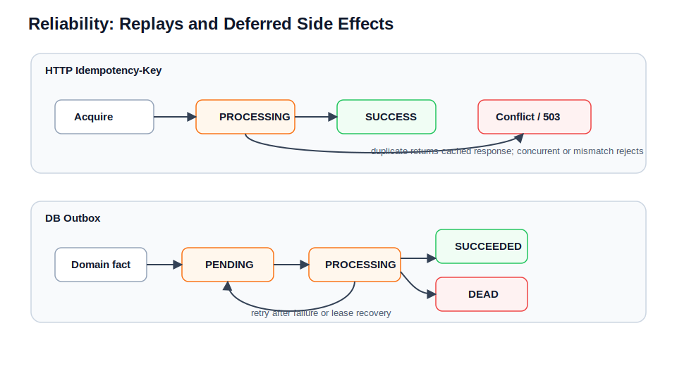

# 可靠性机制

本文档是幂等、outbox、重试、补偿、single-flight 和失败语义的 SSOT。业务链路只引用这些机制，不在各自章节重复展开。



## 可靠性地图

| 场景 | 机制 | 目标 |
| --- | --- | --- |
| 浏览器重复点击 / 网络重试 | HTTP `Idempotency-Key` | 同一次业务尝试只产生一次副作用 |
| 搜索 / IM policy 异步投影 | DB outbox | 主事务成功后可靠追平 |
| worker 崩溃 | outbox lease recovery | 回收卡住的 `PROCESSING` |
| handler 暂时失败 | retry + backoff | 自动重试 |
| handler 持续失败 | `DEAD` | 停止自动重试，留给人工处理 |
| 长任务多入口触发 | Redis single-flight | 集群内同一时间只执行一个 |
| 长任务锁过期 | heartbeat renew | 防止长任务中途丢锁 |
| 市场到钱包资金动作 | `market_wallet_action` saga command | 钱包落账脱离 market 事务，可重试、可恢复、可排查 |
| 清理/补偿任务 | 幂等任务设计 | 重跑不会产生错误副作用 |

## HTTP Idempotency-Key

`common-idempotency` 不是 servlet filter，而是业务显式调用的 guard。只有被 owner `ApplicationService` 用 `IdempotencyGuard.executeRequired(...)` 包裹的写操作才受保护。

目标：

- 同一 `userId + operation + Idempotency-Key` 只允许产生一次业务副作用。
- 并发同 key 请求返回 `409`。
- 已成功的同 key 请求直接复用上次成功响应。
- 幂等存储不可用时，required 入口 fail-closed，返回 `503`。

服务端幂等域：

```text
operation + userId + Idempotency-Key
```

当前覆盖接口：

| 功能 | HTTP 接口 | operation | 请求指纹 |
| --- | --- | --- | --- |
| 发帖 | `POST /api/posts` | `content:create_post` | 无 |
| 发表评论 | `POST /api/posts/{postId}/comments` | `content:create_comment` | 无 |
| 钱包充值 | `POST /api/wallet/recharges` | `wallet:recharge` | `amount` |
| 钱包提现 | `POST /api/wallet/withdrawals` | `wallet:withdraw` | `amount` |
| 钱包转账 | `POST /api/wallet/transfers` | `wallet:transfer` | `toUserId`, `amount` |
| 市场下单 | `POST /api/market/orders` | `market:create_order` | `listingId`, `quantity`, `addressId` |

客户端契约：

- 通过 header 传 `Idempotency-Key: <unique-key>`。
- 同一次业务尝试只生成一个 key。
- 超时重试、网关重试、用户手动重试都复用同一个 key。
- 新业务尝试必须生成新 key。
- 不要每次 HTTP 发送都生成新 key。
- 建议使用 UUID、ULID、雪花 ID 等高碰撞安全随机 key。
- 服务端 trim key，长度不能超过 128。
- 钱包充值、提现、转账和市场下单不接收 body `requestId`，幂等键只来自 header。

当前仓库前端状态：

- `frontend/src/api/http.js` 自动为发帖、评论、钱包写接口和市场下单注入 `Idempotency-Key`。
- 修改前端重试策略时，必须保证同一次业务尝试复用同一个 key，不能在 axios retry 或按钮重复点击时生成新值。

## 请求指纹

部分接口需要防止同 key 被不同参数复用。例如同一个 key 第一次充值 100，第二次充值 200，不能返回第一次响应。

请求指纹规则：

- `RequestFingerprint.sha256(...)` 生成 SHA-256。
- 输入是服务端拼出的 canonical semantic string，不是原始 JSON body。
- JSON 字段顺序、空白、格式化不影响指纹。

当前 canonical string：

```text
wallet:recharge|amount=<amount>
wallet:withdraw|amount=<amount>
wallet:transfer|toUserId=<toUserId>|amount=<amount>
market:create_order|listingId=<listingId>|quantity=<quantity>|addressId=<addressId-or-empty>
```

匹配语义：

- 同 key、同指纹、`SUCCESS`：返回缓存响应。
- 同 key、同指纹、`PROCESSING`：返回 `409`。
- 同 key、不同指纹：replay conflict，通常为 `409`。
- 内容类接口当前不传指纹，只按 `operation + userId + key` 去重。

## Idempotency 执行流程

```text
validate userId / operation / key / supplier
  -> normalize operation and key
  -> store.tryAcquireProcessing(...)
      -> first-time: run supplier
          -> success: saveSuccess(...)
          -> business exception: delete PROCESSING, allow retry
      -> existing SUCCESS: return cached response
      -> existing PROCESSING: 409
      -> race miss / unknown state: 503
```

返回语义：

| 场景 | 行为 |
| --- | --- |
| 缺少 required key | `400` |
| key 过长 | `400` |
| 首次请求成功 | 返回真实业务结果并保存 `SUCCESS` |
| 首次请求业务失败 | 删除 `PROCESSING`，透传业务异常，允许重试 |
| 成功后同 key 重试 | 返回缓存响应 |
| 并发同 key | `409` |
| 同 key 不同请求指纹 | replay conflict |
| 幂等存储不可用 | required 入口 `503` |
| 业务成功但保存 `SUCCESS` 失败 | 延长 `PROCESSING`，返回 `409`，提示结果确认中 |

状态和 TTL：

- `PROCESSING`：请求处理中，默认 TTL `30s`。
- `SUCCESS`：请求已成功，保存响应 JSON，默认 TTL `24h`。

注意：

- `processing-ttl` 过短，慢链路可能出现锁过期后二次执行窗口。
- `success-ttl` 过短，客户端成功后晚重试可能被当作新请求。
- 该机制是实用型 HTTP 幂等，不是严格 exactly-once。

## Idempotency 存储

默认配置：

```yaml
http:
  idempotency:
    enabled: true
    store: DB
```

可选：

```yaml
http:
  idempotency:
    enabled: true
    store: DB # DB 或 REDIS
    processing-ttl: 30s
    success-ttl: 24h
```

DB 方案：

- 表：`community.http_idempotency`。
- 唯一键：`(operation, user_id, idem_key)`。
- insert-first + 唯一键实现多实例互斥。
- `saveSuccess(...)` upsert `S` 状态、响应 JSON、成功过期时间。
- `get(...)` 读到过期记录会删除并返回空状态。

Redis 方案：

- key：`idem:<operation>:<userId>:<Idempotency-Key>`。
- `SETNX + TTL` 抢占 `PROCESSING`。
- 成功后普通 `SET` 保存 `SUCCESS`。
- `extendProcessing(...)` 使用 Lua，只在当前值仍为 `P` 时延长 TTL。

当前仓库默认 DB。Redis 更轻，但 Redis 抖动会直接影响关键写链路的幂等判断。

指标：

```text
http_idempotency_total{op="<operation>", outcome="<outcome>"}
```

常见 outcome：

- `first_time`
- `succeeded`
- `duplicate`
- `concurrent_conflict`
- `replay_conflict`
- `missing_key`
- `invalid_key`
- `failed`
- `store_error`
- `race_miss`
- `serialize_error`
- `unknown_state`

## 接入新的 HTTP 写接口

接入步骤：

1. 判断接口是否会产生不可重复副作用，例如订单、资金、发帖、评论、通知触发。
2. controller 接收 `Idempotency-Key` header。
3. owner `ApplicationService` 用 `IdempotencyGuard.executeRequired(...)` 包裹真实写操作。
4. 选择稳定 operation，推荐 `domain:verb_object`。
5. 判断是否需要请求指纹；如果同 key 不同参数必须拒绝，就传 request hash。
6. 返回值使用稳定 DTO，确保可 JSON 序列化 / 反序列化。
7. 补测试：缺 key、首次执行、成功重试、processing 并发、replay conflict、存储异常 `503`。

核心代码：

- `backend/community-common/common-idempotency`
- `IdempotencyGuard`
- `IdempotencyStore`
- `JdbcIdempotencyStore`
- `RedisIdempotencyStore`
- `backend/community-app/src/main/java/com/nowcoder/community/infra/idempotency/IdempotencyKeyResolver.java`
- `backend/community-app/src/main/java/com/nowcoder/community/infra/idempotency/RequestFingerprint.java`

## DB Outbox

Outbox 用于需要可靠追平的异步副作用。

当前接入：

- `projection.search.post`：帖子事件投影到搜索索引。
- IM policy projection：用户处罚 / 拉黑变化投递给 `im-realtime`。

生产端：

```text
domain event
  -> BEFORE_COMMIT enqueuer
  -> community.outbox_event
```

消费端：

```text
OutboxWorkerScheduler
  -> OutboxWorker.pollOnce
  -> recoverExpiredLeases
  -> load due PENDING events
  -> tryClaimProcessing
  -> dispatch by topic
  -> handler.handle
  -> markSucceeded / markFailed / markDead
```

为什么 enqueuer 用 `BEFORE_COMMIT`：

- outbox row 和主事实处于同一事务。
- 主事务回滚时 outbox row 一起回滚。
- 主事务提交后 worker 才能看到待投递事件。
- 避免主事实成功但事件丢失。

状态：

- `PENDING`：待处理或重试到期。
- `PROCESSING`：某 worker 已抢 lease。
- `SUCCEEDED`：副作用成功且已标记完成。
- `DEAD`：超过最大重试次数或不可自动恢复。

最小正确性：

- 标记 `SUCCEEDED` 之前，副作用必须已经成功。
- handler 必须幂等，因为至少一次投递。
- worker 崩溃时，lease 到期后由 `recoverExpiredLeases` 回收。
- handler 抛异常时，事件回到 `PENDING` 并设置 `next_retry_at`。
- 超过最大重试次数进入 `DEAD`。

`DEAD` 不是业务终点，只是自动重试终点。人工仍需确认副作用、修复 handler 或执行重放。

## Outbox Handler 幂等

worker 不保证 exactly-once，handler 必须自己保证幂等。

当前做法：

- 搜索投影 handler 不信任事件中的旧快照，而是回源 content owner 当前状态，再 upsert/delete ES。这样乱序事件不会让已删除帖子复活。
- IM policy projection 先写 `projection.im.policy` outbox，再由 handler 发布 Kafka 增量事件。`USER_POLICY` 使用 user owner 持久版本覆盖 userId 的消息权限；`BLOCK` 使用 social owner 持久版本覆盖 blocker / blocked 拉黑关系，重复或乱序投递不会产生累计副作用。
- IM 私信持久化不信任 realtime 本地 projection；`im-core` 在写权威消息表前回源 `community-app` owner decision。业务拒绝发布 `im.event.private-rejected` 并提交 offset，不进入 DLQ；owner API 不可用等系统失败仍按 Kafka retry / DLQ 处理。
- IM 消息事实 event 和发送结果 event 使用不同 outbox event id 空间。重复 `clientMsgId` 不会重复创建或发布消息事实；不同 `requestId` 的发送尝试会生成各自的 committed / rejected 回执事件。
- IM policy handler 对坏 JSON、缺少必需时间字段或 Kafka 发布失败会抛异常，交给 outbox retry / DEAD；缺少 userId 或 block 双方 id 的 payload 当前会被跳过。

新增 handler 要回答：

- 重复执行是否安全。
- 副作用成功但标记失败后再次执行是否安全。
- 乱序事件是否会破坏最终状态。
- 进入 `DEAD` 后如何排查和修复。

## Single-flight

Single-flight 用于集群内保护长任务或高风险任务，例如批量补偿、清理和手工恢复任务。

- 执行前获取分布式执行权。
- 长任务启动 heartbeat 续期。
- 任务完成后释放锁。

没有 single-flight 时，同类任务可能在多个入口并发执行。

## Market Wallet Action Saga

`market_wallet_action` 是 market owner 的 durable business command，用于 escrow、release 和 refund。它不是普通 outbox projection：订单/争议状态、钱包 requestId、wallet txn id、失败原因和可恢复状态都需要被业务查询和排障。

生产端：

```text
MarketOrderApplicationService / MarketDisputeApplicationService
  -> market local transaction
  -> order / dispute / inventory state
  -> market_wallet_action(PENDING)
```

消费端：

```text
MarketWalletActionProcessorHandler
  -> MarketWalletActionProcessorApplicationService.processDue
  -> claim PROCESSING with lease
  -> WalletMarketActionApi
  -> MarketOrderSagaApplicationService conditional transition
  -> mark SUCCEEDED / RETRYING / FAILED / CANCELLED
```

状态：

- `PENDING`：等待 processor 处理。
- `PROCESSING`：已被 processor claim，带 `processing_lease_until`。
- `RETRYING`：可恢复失败，等待 `next_retry_at`。
- `SUCCEEDED`：wallet action 已应用或确认 no-op 完成。
- `CANCELLED`：前置条件已取消，通常用于 escrow no-op。
- `FAILED`：不可自动成功的业务失败，保留失败原因。
- `DEAD`：预留给自动重试终点或人工处置。

幂等点：

- command 层：`market_wallet_action.request_id` 唯一，格式为 `market-order:<orderId>:<action>`。
- wallet 层：`wallet_txn.request_id` 唯一。
- market 状态层：订单 / 争议推进使用条件更新，只从期望状态前进。

恢复语义：

- processor 成功调用 wallet 后崩溃，恢复任务通过已有 `wallet_txn_id` 继续推进订单状态并标记 action succeeded。
- 订单处于资金 pending 状态但缺少 command 时，恢复任务会补写对应 escrow / release / refund command。
- pending 订单应补写哪一种资金 command 由 `MarketOrder.pendingWalletActionType()` 判断，避免恢复任务维护一份独立订单状态映射。
- escrow 还没落账就取消时，escrow action 可变成 `CANCELLED` + `NOOP`，订单无退款取消，并恢复 market 侧库存。
- escrow 已落账但订单已接受取消时，saga 会把订单转成 refund pending 并补写 refund command。
- release / refund 遇到可恢复钱包错误会回到 retrying；不会把订单静默推进为完成。

可观察状态：

- 订单资金状态长时间停在 pending 时，先查 `market_wallet_action` 是否存在对应 command。
- command 处于 `PENDING` / `RETRYING` 时，检查 processor 是否 claim due action。
- command 处于 `PROCESSING` 且 lease 已过期时，检查 recovery 是否恢复 lease。
- command 已有 `wallet_txn_id` 但 market 未推进时，recovery 应用已有 wallet 结果继续推进，不重复记账。
- command 处于 `FAILED` / `DEAD` 时，需要结合 `failure_code`、`last_error` 和订单状态人工判断是否重试、修数据或退款/放款补偿。

## Scheduler 补偿语义

后台任务分三类：

- 清理型：例如过期待激活用户清理，天然幂等。
- 追平型：例如 outbox worker，按状态机重试。
- 自动动作型：例如市场自动确认，需要 owner domain 判断状态和时间窗口，只写 release command。
- 资金恢复型：例如 `marketWalletActionProcessor` / `marketWalletActionRecovery`，按 market wallet action saga 状态机处理。

原则：

- job 入口不拼业务规则。
- owner `ApplicationService` 或 owner action API 决定事务、幂等、失败语义。
- 重跑任务不应产生错误累计副作用。
- 任务失败要留下可检索日志和必要状态。

## Fail-open / Fail-closed 选择

默认规则：

- 认证、授权、OriginGuard、JWT secret、trusted proxy、prod SMTP、固定验证码：fail-closed。
- 必须幂等的写入口：幂等存储异常时 fail-closed。
- Outbox 开启但缺 store：fail-closed。
- 搜索投影失败：不阻断主写路径，交给 outbox 重试。
- 通知投影失败：best-effort，记录日志，不回滚主事务。
- analytics 采集失败：应避免影响主业务响应，具体以当前实现为准。
- 市场钱包 release / refund 失败：优先保留 pending / retryable 状态，不把订单静默完成。
- 市场钱包 escrow 业务失败：订单进入失败或无退款取消路径，并恢复 market 侧库存 / 预加载库存。

每个新增能力都要明确：依赖失败时是拒绝当前请求、异步重试，还是记录日志后继续。

## 测试位置

幂等模块：

- `IdempotencyGuardFingerprintTest`
- `IdempotencyGuardStoreFailureTest`
- `JdbcIdempotencyStoreTest`
- `RedisIdempotencyStoreTest`

应用侧：

- `IdempotencyGuardSerializationFailureTest`
- `IdempotencyGuardTtlTest`
- `IdempotencySchemaPersistenceTest`
- `WalletControllerTest`
- `MarketControllerTest`

Outbox 和 scheduler：

- `backend/community-common/common-outbox/src/test/...`
- `backend/community-app/src/test/...` 中 search / IM policy / scheduler 相关测试。

Market wallet action saga：

- `MarketWalletActionProcessorApplicationServiceTest`
- `MarketWalletActionRecoveryApplicationServiceTest`
- `MarketOrderApplicationServiceTest`
- `MarketDisputeApplicationServiceTest`
- `MarketOrderAutoConfirmSingleOrderApplicationServiceUnitTest`
- `MarketWalletActionMapperPersistenceTest`
