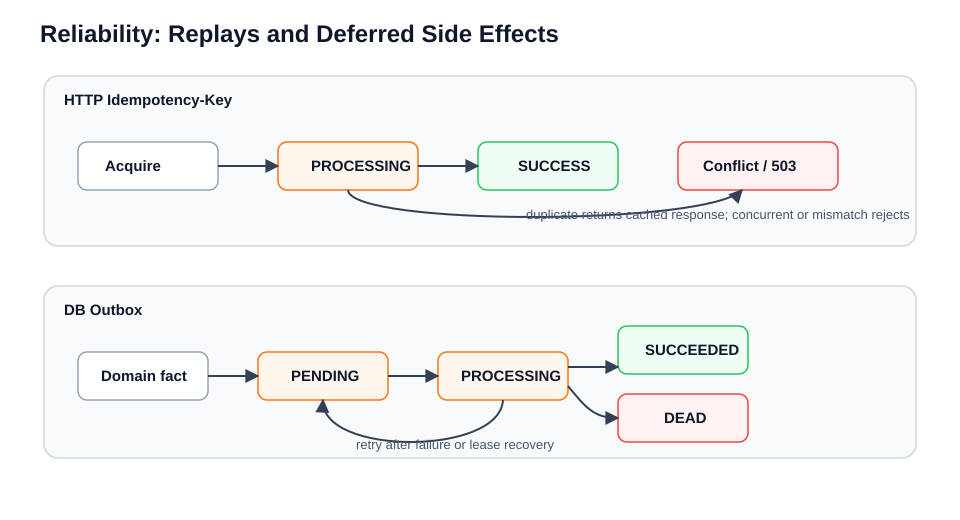

# 可靠性机制

本文档是幂等、outbox、重试、补偿、single-flight 和失败语义的 SSOT。业务链路只引用这些机制，不在各自章节重复展开。owner contract event、projection topic 和 Kafka dispatch 的当前接入点见 [异步事件骨干](core-logic/async-event-backbone.md)。



## 可靠性地图

| 场景 | 机制 | 目标 |
| --- | --- | --- |
| 浏览器重复点击 / 网络重试 | HTTP `Idempotency-Key` | 同一次业务尝试只产生一次副作用 |
| Search / Notice / Growth / Reward / Hot feed | owner outbox -> Kafka consumer | 主事务成功后通过 retry / `.dlq` 可靠追平 |
| 内容媒体引用 | desired state + deterministic outbox command + version fencing | OSS bind/release 可重试且旧 command 不覆盖新意图 |
| 内容删除后的点赞 | owner event + target deletion fence + reconciliation | 异步清理全部关系并发布 like-removed 事件 |
| OSS 代理上传 | claim version + attempt blob key + recovery | 崩溃后可判断 reset 或 fenced finalize |
| IM policy 内部投影 | owner Kafka -> `projection.im.policy` outbox | 消费端确定性去重后可靠发布到 IM Kafka |
| worker 崩溃 | outbox lease recovery | 回收卡住的 `PROCESSING` |
| handler 暂时失败 | retry + backoff | 自动重试 |
| handler 持续失败 | `DEAD` | 停止自动重试，留给人工处理 |
| 长任务多入口触发 | Redis single-flight | 集群内同一时间只执行一个 |
| 长任务锁过期 | heartbeat renew | 防止长任务中途丢锁 |
| 市场到钱包资金动作 | `market_wallet_action` saga command | 钱包落账脱离 market 事务，可重试、可恢复、可排查 |
| 清理/补偿任务 | 幂等任务设计 | 重跑不会产生错误副作用 |

## P3 Hot Path Cache Protection

P3-A 保护 BBS 热路径读链路：hot feed、board hot feed 和 post detail 使用 hot key 预热、TTL jitter、single-flight 回源保护和 poison payload cleanup。Redis 仍然只是派生缓存，不是业务事实源。

失败语义：

- Redis 正常但热 feed cache miss：可按配置使用 latest fallback 回源并回填 hot feed / summary cache。
- Redis 读失败：feed 返回 degraded 结果或 fallback 结果，metric 记录 `degraded`。
- fallback 已被其他节点 single-flight 占用：feed 返回空 degraded-safe 页面并记录 `singleflight_busy`，不继续打 repository。
- post detail cache miss：仍从 owner repository 装配 viewer-neutral shell；不能因为 single-flight busy 返回空 detail。
- malformed summary/detail/feed/counter cache payload：读取时按 key/member/field 做 best-effort cleanup，不把异常 payload 当成业务事实。hot-feed 分页会先清理目标 offset 之前的非法 UUID member，再继续补读到当前页上限，避免清理造成后续页整体左移而跳过有效帖子。

## HTTP Idempotency-Key

`common-idempotency` 不是 servlet filter，而是业务显式调用的 guard。只有被 owner `ApplicationService` 用 `IdempotencyGuard.executeRequired(...)` 包裹的写操作才受保护。

目标：

- 同一 `userId + operation + Idempotency-Key` 只允许产生一次业务副作用。
- 并发同 key 请求返回 `409`。
- 已成功的同 key 请求直接复用上次成功响应。
- 幂等存储不可用时，required 入口 fail-closed，返回 `503`。

服务端幂等域：

```text
operation + userId + Idempotency-Key
```

当前覆盖接口：

| 功能 | HTTP 接口 | operation | 请求指纹 |
| --- | --- | --- | --- |
| 发帖 | `POST /api/posts` | `content:create_post` | `title`, `categoryId`, `tags`, `blocks` |
| 发表评论 | `POST /api/posts/{postId}/comments` | `content:create_comment` | `postId`, `parentCommentId`, `content` |
| 测试积分发放 | `POST /api/wallet/recharges` | `wallet:recharge` | `amount` |
| 测试积分销毁 | `POST /api/wallet/withdrawals` | `wallet:withdraw` | `amount` |
| 钱包转账 | `POST /api/wallet/transfers` | `wallet:transfer` | `toUserId`, `amount` |
| 市场下单 | `POST /api/market/orders` | `market:create_order` | `listingId`, `quantity`, `addressId` |

客户端契约：

- 通过 header 传 `Idempotency-Key: <unique-key>`。
- 同一次业务尝试只生成一个 key。
- 超时重试、网关重试、用户手动重试都复用同一个 key。
- 新业务尝试必须生成新 key。
- 不要每次 HTTP 发送都生成新 key。
- 建议使用 UUID、ULID、雪花 ID 等高碰撞安全随机 key。
- 服务端 trim key，长度不能超过 128。
- 测试积分发放/销毁、钱包转账和市场下单不接收 body `requestId`，幂等键只来自 header。

当前仓库前端状态：

- `frontend/src/api/http.js` 不生成 `Idempotency-Key`；发帖、评论、钱包写接口和市场下单由页面持有 `WriteAttempt` 并把 key 显式传给 API service。
- 首次发送激活 attempt；传输失败和用户人工重试保留同一个 key，成功、取消、切换账号 / 页面或修改业务意图后结束旧 attempt。
- 高风险 API service 缺少 `WriteAttempt` 时直接报错，避免 axios retry 或按钮重复点击静默变成新的业务尝试。

## 请求指纹

部分接口需要防止同 key 被不同参数复用。例如同一个 key 第一次领取测试积分 100，第二次领取 200，不能返回第一次响应。

请求指纹规则：

- `RequestFingerprint.sha256(...)` 生成 SHA-256。
- 输入是服务端拼出的 canonical semantic string，不是原始 JSON body。
- JSON 字段顺序、空白、格式化不影响指纹。

当前 canonical string：

```text
content:create_post|title=<title>|categoryId=<categoryId>|tags=[<tag>,...]|blocks=[type=<type>;text=<text>;assetId=<assetId>;language=<language>;caption=<caption>;displayName=<displayName>;metadata={<key>=<value>,...},...]
content:create_comment|postId=<postId>|parentCommentId=<parentCommentId>|content=<content>
wallet:recharge|amount=<amount>
wallet:withdraw|amount=<amount>
wallet:transfer|toUserId=<toUserId>|amount=<amount>
market:create_order|listingId=<listingId>|quantity=<quantity>|addressId=<addressId-or-empty>
```

匹配语义：

- 同 key、同指纹、`SUCCESS`：返回缓存响应。
- 同 key、同指纹、`PROCESSING`：返回 `409`。
- 同 key、不同指纹：replay conflict，通常为 `409`。
- 内容类接口使用 owner `ApplicationService` 拼出的业务语义指纹；重复 key 且业务语义变化会被拒绝。

评论输入从客户端接收人迁移为服务端 parent 事实时，canonical string 会删除旧版
`replyToUserId` 段。旧实例必须先停止写入；兼容窗口内复用旧版 key 的请求可能因历史 hash
返回 replay conflict。客户端遇到该冲突应先查询评论结果并与用户确认，不能自动换新 key 重写，
否则旧请求已成功时可能产生重复评论。

## Idempotency 执行流程

```text
validate userId / operation / key / supplier
  -> normalize operation and key
  -> store.tryAcquireProcessing(...)
      -> first-time: run supplier
          -> success: saveSuccess(...)
          -> business exception: delete PROCESSING, allow retry
      -> existing SUCCESS: return cached response
      -> existing PROCESSING: 409
      -> race miss / unknown state: 503
```

返回语义：

| 场景 | 行为 |
| --- | --- |
| 缺少 required key | `400` |
| key 过长 | `400` |
| 首次请求成功 | 返回真实业务结果并保存 `SUCCESS` |
| 首次请求业务失败 | 删除 `PROCESSING`，透传业务异常，允许重试 |
| 成功后同 key 重试 | 返回缓存响应 |
| 并发同 key | `409` |
| 同 key 不同请求指纹 | replay conflict |
| 幂等存储不可用 | required 入口 `503` |
| 业务成功但保存 `SUCCESS` 失败 | 延长 `PROCESSING`，返回 `409`，提示结果确认中 |

状态和 TTL：

- `PROCESSING`：请求处理中，默认 TTL `30s`。
- `SUCCESS`：请求已成功，保存响应 JSON，默认 TTL `24h`。

注意：

- `processing-ttl` 过短，慢链路可能出现锁过期后二次执行窗口。
- `success-ttl` 过短，客户端成功后晚重试可能被当作新请求。
- 该机制是实用型 HTTP 幂等，不是严格 exactly-once。

## Idempotency 存储

默认配置：

```yaml
http:
  idempotency:
    enabled: true
    store: DB
```

可选：

```yaml
http:
  idempotency:
    enabled: true
    store: DB # DB 或 REDIS
    processing-ttl: 30s
    success-ttl: 24h
```

DB 方案：

- 表：`community.http_idempotency`。
- 唯一键：`(operation, user_id, idem_key)`。
- insert-first + 唯一键实现多实例互斥。
- `saveSuccess(...)` upsert `S` 状态、响应 JSON、成功过期时间。
- `get(...)` 读到过期记录会删除并返回空状态。

Redis 方案：

- key：`idem:<operation>:<userId>:<Idempotency-Key>`。
- `SETNX + TTL` 抢占 `PROCESSING`，值固定为 `P\n<requestHash>`。
- 成功后普通 `SET` 保存 `S\n<requestHash>\n<responseJson>`。
- `requestHash` 必填；不读取无 fingerprint 的旧 Redis 编码。
- `extendProcessing(...)` 使用 Lua，只在当前值仍为 `P` 时延长 TTL。

当前仓库默认 DB。Redis 更轻，但 Redis 抖动会直接影响关键写链路的幂等判断。

指标：

```text
http_idempotency_total{op="<operation>", outcome="<outcome>"}
```

常见 outcome：

- `first_time`
- `succeeded`
- `duplicate`
- `concurrent_conflict`
- `replay_conflict`
- `missing_key`
- `invalid_key`
- `failed`
- `store_error`
- `race_miss`
- `serialize_error`
- `unknown_state`

## 接入新的 HTTP 写接口

接入步骤：

1. 判断接口是否会产生不可重复副作用，例如订单、资金、发帖、评论、通知触发。
2. controller 接收 `Idempotency-Key` header。
3. owner `ApplicationService` 用 `IdempotencyGuard.executeRequired(...)` 包裹真实写操作。
4. 选择稳定 operation，推荐 `domain:verb_object`。
5. 为请求构造并传入稳定的 request hash；同 key 不同参数必须拒绝。
6. 返回值使用稳定 DTO，确保可 JSON 序列化 / 反序列化。
7. 补测试：缺 key、首次执行、成功重试、processing 并发、replay conflict、存储异常 `503`。

核心代码：

- `backend/community-common/common-idempotency`
- `IdempotencyGuard`
- `IdempotencyStore`
- `JdbcIdempotencyStore`
- `RedisIdempotencyStore`
- `backend/community-app/src/main/java/com/nowcoder/community/infra/idempotency/IdempotencyKeyResolver.java`
- `backend/community-app/src/main/java/com/nowcoder/community/infra/idempotency/RequestFingerprint.java`

## DB Outbox

Outbox 用于需要可靠追平的异步副作用。

当前接入：

- `eventbus.content`：content owner 的帖子 / 评论 contract event，通过 outbox handler dispatch 到 Kafka。
- `eventbus.social`：social owner 的点赞 / 关注 / 拉黑 contract event，通过 outbox handler dispatch 到 Kafka。
- `eventbus.user`：user owner 的 policy contract event，通过 outbox handler dispatch 到 Kafka。
- `projection.im.policy`：唯一内部 projection outbox，把用户处罚 / 拉黑变化投递给 `im-realtime`。

生产端：

```text
domain event
  -> BEFORE_COMMIT enqueuer
  -> community.outbox_event
```

消费端：

```text
OutboxWorkerScheduler
  -> OutboxWorker.pollOnce
  -> recoverExpiredLeases
  -> load due PENDING events
  -> tryClaimProcessing
  -> reload by lease token
  -> dispatch by topic
  -> handler.handle + fenced lease heartbeat
  -> markSucceeded / markFailed / markDead
```

为什么 enqueuer 用 `BEFORE_COMMIT`：

- outbox row 和主事实处于同一事务。
- 主事务回滚时 outbox row 一起回滚。
- 主事务提交后 worker 才能看到待投递事件。
- 避免主事实成功但事件丢失。

状态：

- `PENDING`：待处理或重试到期。
- `PROCESSING`：某 worker 已抢 lease。
- `SUCCEEDED`：副作用成功且已标记完成；状态转换同时清空 payload，避免长期保留邮箱等敏感投递数据。
- `DEAD`：超过最大重试次数或不可自动恢复；普通重试耗尽行保留 payload 供治理，显式 terminal 行在同一状态更新中擦除 payload。

最小正确性：

- 标记 `SUCCEEDED` 之前，副作用必须已经成功。
- handler 必须幂等或显式支持重复副作用，因为系统提供至少一次投递。
- handler 执行期间，worker 约每个 lease 周期的三分之一用 `rowId + leaseToken + 未过期 deadline` CAS 续租；旧 token 或已经到期的 token 不能复活 lease。耗时超过初始 lease 的存活 handler 不会被另一个正常 worker 回收并并发重放。
- `markSucceeded`、`markFailed` 和 `markDead` 都同时校验 lease token 与未过期 deadline；失去 lease 的旧 worker 不得写回状态。
- worker 崩溃时，lease 到期后由 `recoverExpiredLeases` 回收。每轮最多扫描 `events.outbox.recover-limit` 条（默认 `200`、硬上限 `500`），并按扫描到的 token + deadline 逐行 CAS，不能覆盖并发续租。
- handler 抛异常时，事件回到 `PENDING` 并设置 `next_retry_at`。
- worker claim 必须在条件更新中再次校验 `next_retry_at <= pollNow`，不能让另一实例持有的旧 poll 结果绕过 backoff。
- claim 成功后必须按 lease token 回读当前 row，再用新鲜的 payload / retry count 派发；不得继续使用 claim 前的候选快照，否则 `DEAD -> PENDING` 复活会产生 ABA 误判。
- 超过最大重试次数进入 `DEAD`。handler 可对过期、坏 payload 等不可恢复输入抛 `OutboxTerminalException`，worker 会立即执行带 lease fence 的 `DEAD + payload scrub`，不浪费重试预算也不长期保留邮箱、验证码等敏感数据。
- 当前 content media command 的确定性 event ID 再次 enqueue 冲突时，可按 event ID 原位执行 `DEAD -> PENDING`；该更新清空 retry、lease 和旧错误，且绝不覆盖 `PENDING`、`PROCESSING` 或 `SUCCEEDED`。其他 producer 需要显式选择并实现同类恢复，不能仅凭确定性 ID 假定会自动重排。

心跳不把 outbox 提升为 exactly-once：进程仍可能在外部副作用成功后、`SUCCEEDED` 提交前退出。handler 必须继续以 event ID 或等价业务键实现幂等；SMTP 无法事务性确认时可能重复投递，但 password-reset mail 会用同一 delivery ID 派生同一有效链接，注册与重置邮件也使用稳定 `Message-ID`。`markSucceeded` 以 lease fence 更新状态并在同一 SQL 中擦除 payload；可恢复失败和普通重试耗尽的 DEAD 保留 payload，显式 terminal DEAD 则原子擦除。

`DEAD` 不是业务终点，只是自动重试终点。人工仍需确认副作用、修复 handler 或执行重放。

P2 BBS 业务切片的 replay 边界：

| 切片 | outbox topic | replay 能力 | 不包含 |
| --- | --- | --- | --- |
| 发帖 / 评论事实事件 | `eventbus.content` | `DEAD` outbox row 可由 `/api/ops/outbox/events/{outboxId}/replay` 排回 `PENDING`，再由正常 worker 重新 dispatch | Kafka consumer 内部失败不会自动变成 common-outbox `DEAD`，除非 consumer 自己写入下游 outbox row |
| 点赞 / 关注事实事件 | `eventbus.social` | 同上，重放保持原 outbox payload 和 source event identity | 同上 |
| 用户策略事实事件 | `eventbus.user` | 同上，重放保持原 outbox payload 和 source event identity | 同上 |
| IM policy projection outbox | `projection.im.policy` | 已落 outbox row 的失败可按 common-outbox 状态机重试 / DEAD / replay | owner Kafka listener 尚未落 outbox 的失败由 consumer retry / DLQ 负责 |

## Outbox Governance

管理员可靠性治理 API 位于 `/api/ops/outbox/**`，并要求 `ROLE_ADMIN`。

- `GET /api/ops/outbox/backlog` 返回按 topic 分组的 `PENDING`、`PROCESSING` 和 `DEAD` 数量。
- `GET /api/ops/outbox/events` 支持按 `status`、`topic`、`eventId`、`createdFrom`、`createdTo` 和 `limit` 过滤。
- `POST /api/ops/outbox/events/{outboxId}/replay` 只会把 `DEAD` 行重新排回 `PENDING`。
- `POST /api/ops/outbox/replay-batch` 只允许在显式 `topic`、`status=DEAD`、`createdFrom`、`createdTo` 和 `limit` 范围内批量重新排队。

Replay 不会直接调用 handler。它会清零 retry count、把 `next_retry_at` 设为当前时间、把操作人原因写入 `last_error`，然后交回正常 `OutboxWorker` 路径去 claim 和处理。

批量 replay 复用单行 replay 判定，不做 SQL 批量盲改，也不直接调用 handler。它会返回每行的 `REPLAYED`、`REJECTED` 或 `NOT_REQUEUED` 结果，并允许部分成功。范围和限额是强制条件，`limit` 最大为 `500`。

以下情况会拒绝 replay：

- 行状态不是 `DEAD`。
- topic 没有注册 handler。
- payload 为空。
- operator 没有提供非空 reason。

批量 replay 还会拒绝：

- `status` 不是 `DEAD`。
- 缺少创建时间范围。
- `createdFrom` 晚于 `createdTo`。
- `limit` 不在 `1..500`。

单条和批量 replay 都写治理审计，并记录 outbox replay 指标。批量 replay 会写一条父审计和逐行子审计，审计摘要只保存治理结果，不保存原始 payload。

## Outbox Handler 幂等

worker 不保证 exactly-once，handler 必须自己保证幂等。

当前做法：

- 搜索 Kafka listener 进入 application 后回源 content owner 当前状态，再 upsert/delete ES；全文档按 `aggregateVersion` 单调覆盖，同版本 score 只按更大的 `scoreVersion` 更新。score CAS 与 `PostScoreUpdated` outbox 原子提交，乱序事件既不会永久保留旧分数，也不会让已删除帖子复活。
- content eventbus payload 使用稳定 source event id、aggregate metadata 和 owner fact fields。Search / notice / growth projection 以 source event id 或回源当前状态处理重复和乱序重放。
- social eventbus payload 使用稳定 source event id、relation key、actor、target 和 state change 语义。Notice / growth 以 source event id、relation key 或 owner version 处理重复和乱序；hot-feed 把 social 事件视为当前事实重算信号，不把节点时间戳当作单调水位。
- IM policy projection 先写 `projection.im.policy` outbox，再由 handler 发布 Kafka 增量事件。`USER_POLICY` 使用 user owner 持久版本覆盖 userId 的消息权限；`BLOCK` 使用 social owner 持久版本覆盖 blocker / blocked 拉黑关系，重复或乱序投递不会产生累计副作用。
- IM 私信持久化不信任 realtime 本地 projection；`im-core` 在写权威消息表前回源 `community-app` owner decision。业务拒绝发布 `im.event.private-rejected` 并提交 offset，不进入 DLQ；owner API 不可用等系统失败仍按 Kafka retry / DLQ 处理。
- IM 消息事实 event 和发送结果 event 使用不同 outbox event id 空间。重复 `clientMsgId` 不会重复创建或发布消息事实；不同 `requestId` 的发送尝试会生成各自的 committed / rejected 回执事件。
- IM policy owner Kafka listener 对缺失 event ID、正数 owner version、时间或主体标识的目标事件抛错并进入 retry / DLQ；outbox handler 对坏 JSON、缺少必需字段或 Kafka 发布失败抛错，交给 outbox retry / DEAD。

新增 handler 要回答：

- 重复执行是否安全。
- 副作用成功但标记失败后再次执行是否安全。
- 乱序事件是否会破坏最终状态。
- 进入 `DEAD` 后如何排查和修复。

## Content Media Upload And Reference Recovery

帖子媒体有两条彼此独立的可靠性状态线。

上传状态：

```text
PREPARED -> COMPLETING -> OBJECT_COMPLETED -> COMPLETED
                              \
                               -> FAILED
```

- `uploadOperationVersion` 在 completion claim 时递增；所有 object-completed、completed、failed 和 reset 更新都带期望版本。
- OSS complete 在数据库事务外执行，canonical metadata 和最终状态分别在新事务内提交。
- recovery 扫描 stale `COMPLETING/OBJECT_COMPLETED`：已写 metadata 的补 `COMPLETED`；远端未知则重置供重试；远端不存在标 `FAILED`；远端存在则补 metadata 后完成。
- Nacos seed：enabled `true`、batch `50`、stale `300s`、delay `60s`。

引用状态：

```text
UNBOUND -> BIND_PENDING -> BOUND -> RELEASE_PENDING -> RELEASED
```

- 主事务只写 desired state、递增 `referenceOperationVersion` 并 enqueue `command.content.post-media-reference`。
- outbox event ID 固定为 `content-media-reference:<assetId>:<operationVersion>:<operation>`。
- handler 在事务外调用 OSS bind/release，再以相同 version 在新事务内标记完成；command version 已落后时直接 no-op。
- reconciliation 重发 `BIND_PENDING/RELEASE_PENDING`，并修复 `deleted_post`、`remote_missing`、`remote_active` 三类漂移。相同确定性 ID 已存在时，publisher 只会原位重排 `DEAD` row；只有新建或重排成功，reconciler 才记录 `scheduled`。
- Nacos seed：enabled `true`、batch `50`、delay `300s`。

这两条状态线都不承诺 exactly-once remote call；正确性来自幂等 OSS reference ID、确定性 outbox ID、单调 operation version 和周期对账。

## Social Deleted-Content Like Cleanup

内容删除只提交 content 主事实和 contract event。social cleanup 的路径是：

```text
content.events
  -> SocialContentDeletionKafkaListener
  -> LikeApplicationService.cleanupDeletedContentLikes
  -> LikeTargetState(DELETED, sourceVersion)
  -> scan/delete likes in pages of 200
  -> like-removed owner events
```

- listener 只接受完整的帖子/评论删除事件；缺少 event ID、发生时间、正数 owner version 或实体 ID 时抛错进入 retry / `.dlq`。
- `LikeTargetState` 只接受更大的 `sourceVersion`，重复和乱序删除事件不会重复推进 fence；deleted target 也会阻止新的点赞写入。COMMENT like 先锁根帖 fence 再锁 comment fence，因此 POST 删除提交后，早先解析但尚未落库的 COMMENT like 也不能穿透 tombstone。
- `social_like.post_id` 是内容关系所属根帖的持久引用。帖子自身点赞继续按 target + actor 扫描，子评论点赞使用 `idx_like_post_entity_user(entity_type,post_id,entity_id,user_id)` 按根帖稳定扫描；USER like 的 `post_id` 保持 `NULL`，不会进入内容清理。
- deletion fence 和每页最多 200 条关系清理分别使用独立 `REQUIRES_NEW` 短事务；已提交页不会因后续页失败而回滚，reconciliation 从剩余关系继续，不从头制造一个无界事务。
- 每条实际删除的关系继续发布 like-removed event，使 wallet、growth、notice 和 hot-feed 走正常消费路径。
- `SocialLikeCleanupReconciliationJob` 扫描仍有点赞的 deleted target 并重跑 owner cleanup。代码默认 disabled，batch `50`、delay `300s`。

## Drive Upload Completion Recovery

Drive completion 使用 `PREPARED -> COMPLETING -> OBJECT_COMPLETED -> COMPLETED`；明确业务终止或 OSS 取消成功后进入 `CLEANUP_PENDING`，远端对象确认清除后才转为 `FAILED`。

- `COMPLETING` 和 `OBJECT_COMPLETED` 进入状态时分别把一小时稳定截止时间写入 `expires_at`。`updated_at` 只用于 recovery 排序和退避，恢复尝试通过状态 CAS 推进它，因此固定 batch 中的永久失败项不会挡住后续上传。
- 已确认 active 的对象始终继续 finalization，包括超过截止时间后；父目录失效、同名冲突或配额提交失败等明确业务终止才释放 reservation 并进入清理。
- 数据库、repository 或 OSS 的未知异常保持当前可恢复状态。超过截止时间本身不会把 `OBJECT_COMPLETED` 降级为清理任务。
- Drive 只有在 OSS lifecycle response 同时匹配 object ID、`status=PURGED`、`purged=true` 且 `deletePending=false` 时确认清理成功；其余结果保持 `CLEANUP_PENDING` 重试。

## OSS Upload Claim Recovery

OSS upload session 主路径使用 `READY -> UPLOADING -> COMPLETED`。complete 先条件 claim session 并递增 `claimVersion`，本次 blob 写入 key 为 `<base>.claim-<claimVersion>`。

- 旧 complete 尝试只能写自己的 attempt key，不能覆盖新 claim。
- finalize 同时校验 session ID 和 claim version；失去 claim 后不能激活 object/version。
- `ObjectUploadRecoveryApplicationService` 先验证 object/version metadata，再 head 当前 attempt key。
- 没有 blob 时，以原 claim version 重置到 `READY` 并续期；有 blob 时校验 content type、length、checksum 后走同一个 fenced finalize。
- metadata 不一致或恢复异常只记录当前 claim 的观察信息，不会越过新 claim。
- 内部取消以同一个 `claimVersion` fence 与 completion 原子竞争；取消获胜后进入 `CANCELLED_CLEANUP_PENDING`，立即删除该 session 的全部历史 attempt key。
- pending cancellation 在 35 分钟静默窗口内由 recovery 重复清理，到达截止时间且删除成功后才转为 `CANCELLED`；清理失败会推进 `updatedAt`，不能长期占住固定 recovery batch。
- S3-compatible 整个 API call 的超时默认且最大为 30 分钟；超限配置启动失败。首次 `UPLOADING` 观察和 `PUT_FAILED` recovery 使用 35 分钟硬下限，不能提前 reset 合法的在途 PUT；`RECOVERY_FAILED` 使用 5 分钟重试窗口，避免一次临时 HEAD/metadata 故障把下一次恢复推迟 35 分钟。
- Recovery 默认启用。Nacos seed：batch `100`、upload stale `2100s`、cancellation stale `300s`、delay `60s`。

## Single-flight

Single-flight 用于集群内保护长任务或高风险任务，例如批量补偿、清理和手工恢复任务。

- 执行前获取分布式执行权。
- 长任务启动 heartbeat 续期。
- 任务完成后释放锁。

没有 single-flight 时，同类任务可能在多个入口并发执行。

## Market Wallet Action Saga

`market_wallet_action` 是 market owner 的 durable business command，用于 escrow、release 和 refund。它不是普通 outbox projection：订单/争议状态、钱包 requestId、wallet txn id、失败原因和可恢复状态都需要被业务查询和排障。

生产端：

```text
MarketOrderApplicationService / MarketDisputeApplicationService
  -> market local transaction
  -> order / dispute / inventory state
  -> market_wallet_action(PENDING)
```

消费端：

```text
MarketWalletActionProcessorHandler
  -> MarketWalletActionProcessorApplicationService.processDue
  -> due/status/retry CAS claim PROCESSING with lease token
  -> reload current action by lease token
  -> WalletMarketActionApi
  -> persist wallet_txn_id under lease
  -> REQUIRES_NEW: lock order -> lock action -> saga + fenced action terminal state
  -> mark SUCCEEDED / RETRYING / FAILED / CANCELLED (CAS loss rolls back saga)
```

状态：

- `PENDING`：等待 processor 处理。
- `PROCESSING`：已被 processor claim，带 `processing_lease_until`。
- `RETRYING`：可恢复失败，等待 `next_retry_at`。
- `SUCCEEDED`：wallet action 已应用或确认 no-op 完成。
- `CANCELLED`：前置条件已取消，通常用于 escrow no-op。
- `FAILED`：不可自动成功的业务失败，保留失败原因。
- `DEAD`：预留给自动重试终点或人工处置。

幂等点：

- command 层：`market_wallet_action.request_id` 唯一，格式为 `market-order:<orderId>:<action>`。
- wallet 层：`wallet_txn.request_id` 唯一。
- market 状态层：订单 / 争议推进使用条件更新，只从期望状态前进。

恢复语义：

- due 查询和 claim 都检查 `next_retry_at` 与 retry budget；claim 还 CAS 候选的 `status + retry_count`，因此并发 worker 的旧快照不能绕过 backoff 或最大重试次数。
- 过期 lease 先按 deadline 有限扫描，再逐条 CAS 原 `lease_token + processing_lease_until + retry_count`。未耗尽时使用同一指数 backoff，耗尽时进入 `DEAD`。
- recovery 批次入口不持有长事务；每个 lease/action/order 使用独立短事务，单条异常不会回滚已完成记录，也不会阻断后续候选。
- processor 成功调用 wallet 后崩溃，恢复任务通过已有 `wallet_txn_id` 继续推进订单状态并标记 action succeeded。
- wallet 成功结果先单独持久化到 action；因此 saga 推进前后的进程崩溃都可用同一个 wallet requestId / txnId 重放，不会因 action CAS 丢失而提交孤立订单或库存副作用。
- 订单处于资金 pending 状态但缺少 command 时，恢复任务会补写对应 escrow / release / refund command；若本次补写失败，会在 `market_order.wallet_recovery_next_attempt_at` 持久化下一次时间，有限扫描只取到期订单。
- 自动恢复只接纳已有 wallet transaction 的事实，或 RELEASE / REFUND 的明确可恢复失败码；永久业务失败不会反复进入队列。查询按订单恢复截止时间稳定排序，因此永久失败前缀和缺失 action 都不能饿死后续候选。
- pending 订单应补写哪一种资金 command 由 `MarketOrder.pendingWalletActionType()` 判断，避免恢复任务维护一份独立订单状态映射。
- escrow 还没落账就取消时，escrow action 可变成 `CANCELLED` + `NOOP`，订单无退款取消，并恢复 market 侧库存。
- escrow 已落账但订单已接受取消时，saga 会把订单转成 refund pending 并补写 refund command。
- release / refund 遇到可恢复钱包错误会回到 retrying；不会把订单静默推进为完成。
- `RETRYING` escrow 不可被取消逻辑标成无资金 `NOOP`；只有从未 claim 的 `PENDING` action 允许该路径。

可观察状态：

- 订单资金状态长时间停在 pending 时，先查 `market_wallet_action` 是否存在对应 command。
- command 处于 `PENDING` / `RETRYING` 时，检查 processor 是否 claim due action。
- command 处于 `PROCESSING` 且 lease 已过期时，检查 recovery 是否恢复 lease。
- command 已有 `wallet_txn_id` 但 market 未推进时，recovery 应用已有 wallet 结果继续推进，不重复记账。
- command 处于 `FAILED` / `DEAD` 时，需要结合 `failure_code`、`last_error` 和订单状态人工判断是否重试、修数据或退款/放款补偿。

## Scheduler 补偿语义

后台任务分三类：

- 清理型：例如过期待激活用户清理，天然幂等。
- 追平型：例如 outbox worker，按状态机重试。
- 自动动作型：例如市场自动确认，需要 owner domain 判断状态和时间窗口，只写 release command。
- 资金恢复型：例如 `marketWalletActionProcessor` / `marketWalletActionRecovery`，按 market wallet action saga 状态机处理。

原则：

- job 入口不拼业务规则。
- owner `ApplicationService` 或 owner action API 决定事务、幂等、失败语义。
- 重跑任务不应产生错误累计副作用。
- 任务失败要留下可检索日志和必要状态。

## Compensation Governance

管理员可通过 `POST /api/ops/compensations/{jobName}/trigger` 触发允许列表内的补偿入口。请求必须提供 `limit` 和非空 `reason`，`limit` 最大为 `500`。当前 P1 允许列表为：

- `outboxRecoverExpiredLeases`
- `searchPostProjectionRepair`
- `hotFeedProjectionRepair`
- `growthTaskProjectionRepair`
- `noticeProjectionRepair`

`outboxRecoverExpiredLeases` 是技术 outbox 恢复动作，可以通过 ops-owned technical port 回收过期 `PROCESSING` lease。projection repair 是 owner domain 能力，必须由对应 owner `api.action` 进入 owner `ApplicationService` 后决定如何修复。没有接入 owner repair action 的作业会返回 `SKIPPED` 并写审计；ops 不允许直接扫描 owner repository、mapper 或修改业务事实。

补偿触发结果包含 `jobName`、`accepted`、`processedCount`、`repairedCount`、`skippedCount`、`result` 和 `message`。所有触发都会记录 `community_compensation_trigger_total{job.name,result}`、`community_governance_action_total{action,result}` 和治理审计。

## Hot-Cache Governance

Hot-feed 缓存治理入口位于 `/api/ops/hot-cache/**`，由 ops 应用层调用 content owner 的 `api.query` / `api.action` 合同：

- `GET /api/ops/hot-cache/status?scope=global|board&boardId=<uuid?>` 查询 rank version、缓存条数、summary cache 可用性、降级信号和最近预热时间。
- `POST /api/ops/hot-cache/prewarm` 按 `scope`、可选 `boardId` 和 `limit` 预热 hot-feed 缓存，`limit` 最大为 `500`。
- `GET /api/ops/hot-cache/degradation` 查询当前手工降级信号。
- `POST /api/ops/hot-cache/degradation` 设置或清除手工降级信号。

预热由 content owner 使用当前帖子事实写入 hot-feed 和 summary cache。降级信号是运行态状态，不是帖子、评论、点赞或分数事实。ops 只记录治理审计和指标，不直接修改 content 业务事实。

## Governance Audit

治理审计表记录高风险可靠性操作。字段包括：

- `action`
- `actor_user_id`
- `target_type`
- `target_id`
- `scope`
- `reason`
- `request_json`
- `result`
- `summary_json`
- `trace_id`
- `created_at`

每个变更型治理操作必须提供非空 `reason` 并写审计。审计不能保存 token、cookie、authorization header、Redis key、原始 outbox payload 或用户生成内容。读状态接口默认只记录指标，不写低价值审计行。

## Fail-open / Fail-closed 选择

默认规则：

- 认证、授权、OriginGuard、access JWT RSA / service JWT HMAC 凭据、trusted proxy、prod SMTP、固定验证码：fail-closed。
- 必须幂等的写入口：幂等存储异常时 fail-closed。
- Outbox 开启但缺 store：fail-closed。
- 搜索投影失败：不阻断已提交的 owner 主写路径，交给 `content.events` consumer retry / `.dlq`，必要时 reindex。
- 通知投影失败：不回滚已提交的 owner 事务，交给 owner Kafka consumer retry / `.dlq`，不是本地 best-effort listener。
- 帖子详情缓存读 / 写失败：fail-open 到 content 源数据，响应仍叠加 counter 和 viewer state。
- 热榜 fallback 读路径的 feed cache warm-up / summary cache backfill 失败：fail-open，返回源数据 fallback 结果和 rank version。
- analytics 采集失败：filter 只在请求链正常完成后采集，并捕获 classifier、publish 或同步 ingest 异常；失败只节流记录日志，不改变已经完成的 HTTP status/body。
- 市场钱包 release / refund 失败：优先保留 pending / retryable 状态，不把订单静默完成。
- 市场钱包 escrow 业务失败：订单进入失败或无退款取消路径，并恢复 market 侧库存 / 预加载库存。

每个新增能力都要明确：依赖失败时是拒绝当前请求、异步重试，还是记录日志后继续。

## 测试位置

幂等模块：

- `IdempotencyGuardFingerprintTest`
- `IdempotencyGuardStoreFailureTest`
- `JdbcIdempotencyStoreTest`
- `RedisIdempotencyStoreTest`

应用侧：

- `IdempotencyGuardSerializationFailureTest`
- `IdempotencyGuardTtlTest`
- `IdempotencySchemaPersistenceTest`
- `WalletControllerTest`
- `MarketControllerTest`

Outbox 和 scheduler：

- `backend/community-common/common-outbox/src/test/...`
- `backend/community-app/src/test/...` 中 search / IM policy / scheduler 相关测试。
- `OutboxGovernanceApplicationServiceTest`
- `OutboxOpsControllerTest`
- `CompensationGovernanceApplicationServiceTest`
- `CompensationOpsControllerTest`
- `CompensationGovernanceApplicationServiceTest`（补偿路由已内联）
- `MyBatisGovernanceAuditRepositoryTest`
- `ReliabilityGovernanceMetricsTest`

Hot-cache governance：

- `HotFeedCacheGovernanceApplicationServiceTest`
- `HotCacheGovernanceApplicationServiceTest`
- `HotCacheOpsControllerTest`

Market wallet action saga：

- `MarketWalletActionProcessorApplicationServiceTest`
- `MarketWalletActionRecoveryApplicationServiceTest`
- `MarketOrderApplicationServiceTest`
- `MarketDisputeApplicationServiceTest`
- `MarketOrderAutoConfirmerUnitTest`
- `MarketWalletActionMapperPersistenceTest`
