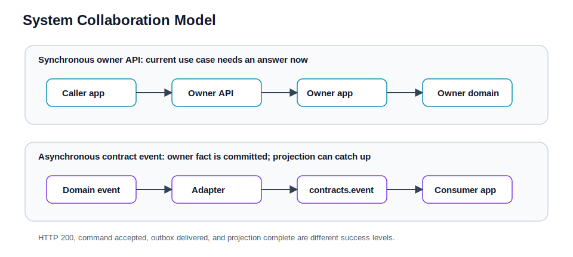

# 系统设计

本文档是系统协作模型 SSOT，解释同步 API、异步事件、最终一致、投影、幂等和失败处理如何组合。强制分层规则见 [architecture.md](architecture.md)，业务实现链路见 [business-flows.md](business-flows.md)。

## 设计目标

当前系统优先保证这些性质：

- 对外入口稳定：浏览器默认经 `community-gateway`，业务 API 保持 `/api/**`，文件保持 `/files/**` 并路由到 `community-oss`，IM WebSocket 前缀保持 `/ws/im`；`/api/im/sessions` 由 `community-im-gateway` 返回稳定的 `/ws/im`，worker 选择和内部桥接对客户端透明。
- owner 清晰：主业务由 `community-app` 按包 owner 治理，IM 消息权威状态由 `community-im` 承担。
- 同步协作显式：跨域同步调用只走 owner-domain `api.query` / `api.action` / `api.model`。
- 异步协作显式：跨域事件只走 owner-domain `contracts.event`。
- 主写路径优先正确：请求线程内完成主事实写入、领域规则、必要同步协作和事务提交。
- 下游投影按语义选择：可靠 outbox、best-effort listener、同步 owner API 或实时回源，不强行统一。
- 失败可观察：重复提交、投影失败、scheduler、DLQ / DEAD 状态都要有日志或指标入口。



## 同步请求模型

典型读路径：

```text
Client
  -> community-gateway
  -> owner service
  -> SecurityFilterChain / ApiSecurityRules
  -> controller
  -> owner ApplicationService
  -> domain / repository
  -> Result<T>
```

典型写路径：

```text
Client + Authorization + Idempotency-Key
  -> community-gateway
  -> community-app / im service
  -> controller / listener / handler / bridge / enqueuer / job
  -> owner ApplicationService
  -> transaction
  -> domain rules
  -> repository interface
  -> infrastructure persistence
  -> domain event / contract event / outbox
```

同域 controller、listener、outbox handler、event bridge、enqueuer、job 都只进入同域 `ApplicationService`。跨域同步协作发生在 application 层，通过 foreign owner-domain `api.query` / `api.action` 完成；inbound adapter 不在 application 边界之前直接调用 foreign owner `api.*`、foreign `application.*`、same-domain application helper/port、domain model/service/repository 或 persistence 实现。

## 错误协议

对外 HTTP 使用统一 `Result<T>` 包体，并让 HTTP status 表达错误类别：

- 参数错误：`400`
- 未认证：`401`
- 无权限：`403`
- 资源不存在：`404`
- 并发/幂等冲突：`409`
- 依赖不可用或关键基础设施故障：`503`
- 未预期服务端错误：`500`

`Result.code` 表达业务细分错误码。Servlet / WebFlux 服务统一回写 `traceparent`，便于 Kibana 按 trace 关联。

客户端侧不能只依赖 HTTP 200 判断完整业务终态。资金、IM 和投影类链路还要看业务状态字段、IM event/history 或后台 action/outbox 状态。

## 同步跨域协作

跨域同步调用只允许使用 owner-domain API：

```text
caller ApplicationService
  -> owner-domain api.query / api.action
  -> owner adapter / owner ApplicationService
  -> owner domain
```

当前典型协作：

- social 点赞/关注解析内容 owner：`content.api.query`。
- content 发帖/评论同步推进 growth task 和 wallet / points 相关 owner action。
- market 下单/退款/放款先写 `market_wallet_action` durable command，再由 market processor 调用 `wallet.api.action`。
- user / social 为 IM policy snapshot 暴露同步查询面。

原则：

- `api.model` 是同步协作模型，不复用 `contracts.event`。
- domain 不依赖 `api.*`。
- same-domain 调用不绕回 same-domain `api.*`。
- 尽量避免跨域 JOIN；聚合优先 owner API + batch / cache。

## 异步事件协作

异步事件分三层：

1. domain event：域内语义，属于 owner 实现细节。
2. owner-domain `contracts.event`：跨域异步契约，生产方 owns semantics。
3. transport / outbox / Kafka payload：技术交付形态。

当前 `community-app` 内部跨域事件 contract 主要由：

- `content.contracts.event.*`
- `social.contracts.event.*`

`common.event.EventEnvelope` 保留为通用 envelope 能力，但不是包级单体内部投影协作的默认入口。同步 `api.model` 和异步 `contracts.event` 是两套 public contract，即使字段相同也不复用类型。

## 投影和最终一致

当前下游副作用不是统一走 outbox，而是按业务语义拆分：

| 下游 | 交付模式 | 语义 |
| --- | --- | --- |
| search post projection | DB outbox | 可靠追平，可重试，handler 幂等 upsert/delete ES |
| IM policy projection | DB outbox -> Kafka | user punishment / social block 变化发布给 `im-realtime` |
| notice projection | local after-commit listener | best-effort，失败只记录日志，不回滚主事务 |
| growth task progress | 同步 owner API | 当前用例内推进，失败按用例语义回滚 |
| wallet reward | 同步 owner API | 资金事实 owner 同步落账 |
| market fund action | `market_wallet_action` saga command -> wallet owner API | 市场事务先提交资金命令，后台 processor 调钱包并推进订单/争议状态 |
| analytics | filter / application 写 Redis | 采集口径以当前配置和代码入口为准 |

因此“HTTP 成功”不等于“所有投影完成”。业务读模型若可能延迟，应提供补偿或明确 best-effort 语义。

## Outbox 设计

Outbox 用于需要可靠追平的异步副作用：

```text
domain event
  -> BEFORE_COMMIT enqueuer
  -> community.outbox_event
  -> OutboxWorkerScheduler
  -> OutboxWorker
  -> topic handler
  -> external side effect / projection
```

最小正确性：

- outbox row 必须在主事务内写入，避免“主事务成功但事件丢失”。
- worker 标记 `SUCCEEDED` 之前，副作用必须已经成功提交。
- handler 必须幂等，因为 outbox 是至少一次投递。
- handler 失败时进入重试；超过最大次数进入 `DEAD`，`DEAD` 是自动重试终点，不是业务终点。
- lease 过期要能恢复，避免 worker 崩溃造成永久卡住。

完整细节见 [reliability.md](reliability.md)。

## HTTP 幂等

部分高风险 HTTP 写接口使用 `Idempotency-Key`：

```text
operation + userId + Idempotency-Key
```

当前覆盖：

- `POST /api/posts`
- `POST /api/posts/{postId}/comments`
- `POST /api/wallet/recharges`
- `POST /api/wallet/withdrawals`
- `POST /api/wallet/transfers`
- `POST /api/market/orders`

语义：

- 首次请求执行业务并保存成功响应。
- 成功后同 key 重试返回缓存响应。
- 并发同 key 返回 `409`。
- 同 key 不同请求指纹返回 replay conflict。
- 必须幂等的入口在幂等存储不可用时 fail-closed，返回 `503`。

完整契约见 [reliability.md](reliability.md) 和 [integration-contracts.md](integration-contracts.md)。

## IM 系统设计

IM 独立于 `community-app`，并拆成统一外部入口下的三层：

- `community-im-gateway`：IM session bootstrap、稳定 `/ws/im` 对外桥接、worker 选择和内部转发。
- `im-realtime`：内部 worker WebSocket、JWT 鉴权、本地 policy projection、Kafka command 生产、在线连接和推送。
- `im-core`：消息权威状态、顺序号、幂等、历史查询、未读状态、房间与成员关系。
- Kafka：command / event backplane。

设计取舍：

- WebSocket accepted 不等于 persisted。
- 在线推送是优化路径，正确性依赖 HTTP backfill。
- 私信用 `clientMsgId` 做 `(conversationId, fromUserId, clientMsgId)` 幂等。
- 群聊用 `clientMsgId` 做 `(roomId, fromUserId, clientMsgId)` 幂等。
- 群聊在线推送是 state-only update，不直接把完整消息当唯一交付方式。
- `im-realtime` 通过 internal scope JWT 从 `im-core` 和 `community-app` 拉取 membership / policy snapshot。

## OSS 文件服务

`community-oss` 是对象存储和文件下载的 owner：

- 浏览器同步 API 走 `/api/oss/**`。
- 公共文件下载走 `/files/**`，路由固定到 `community-oss`。
- `community-app`、`community-im`、`drive` 和后续业务服务通过 `community-oss-client` 消费 OSS，不直接碰存储后端。
- OSS 只依赖 `ObjectStore` 抽象，dev 可以用 local filesystem 或单节点 Garage，prod 应使用至少 3 节点 Garage 并开启副本和监控。
- 未来切换 Ceph RGW 只替换对象存储 adapter 和配置，不改业务 API。

## Search 设计

搜索是最终一致读模型：

- 查询入口：`GET /api/search/posts`。
- 投影入口：content 事件 -> search outbox -> `PostOutboxHandler` -> search application。
- `PostOutboxHandler` 只负责 outbox payload 适配；search application 回源 content owner 当前状态，再 upsert/delete ES，避免乱序事件把已删除内容复活。
- ES 使用固定 alias `community_posts_alias`，运行时由 `PostIndexManager` 负责 alias 初始化和版本化索引准备。

## Scheduler / Ops 设计

当前后台任务分为：

- 本地 `@Scheduled`：例如 outbox worker、帖子热度刷新等需要应用内持续执行的任务。
- XXL-Job：例如 `marketOrderAutoConfirm`、`marketWalletActionProcessor`、`marketWalletActionRecovery` 这类可由控制面触发的离散任务。

调度入口不直接拼业务规则，仍然回到 owner `ApplicationService` 或 owner action API。

任务语义按类别区分：

- 清理型任务可以重复执行，目标是收敛过期或无效状态。
- 追平型任务从持久状态机读取待处理项，例如 outbox 或 `market_wallet_action`。
- 自动动作型任务只写 owner command，例如市场自动确认只写 release command，不在 job 中直接记账。
- 长任务或集群互斥任务需要 single-flight、lease 或条件更新保护。

## Runtime Observability 设计

业务无关运行态日志由共享 `community-common-observability` 提供，属于基础设施能力，不进入任何业务 domain 或 application 编排。后端服务通过 Spring Boot auto-configuration 接入，日志通过 SLF4J/MDC 写入现有 Logback JSON pipeline，再由 observability volume、EDOT collector、Elasticsearch 和 Kibana 查询。

主要后端 deployable 覆盖 JVM 启动摘要、应用生命周期、JVM 内存/GC/direct memory/class loading、executor 压力、Hikari 连接池等待、MyBatis 慢 SQL、Redis/Kafka/OSS/HTTP client 技术事件、日志系统压力、调度任务、缓存命中率、安全/限流技术事件和进程资源阈值。`community-app` 负责单体内的 Servlet、MyBatis、Kafka、RestClient 和 OSS client 观测；`community-oss` 在 `ObjectStore` 边界记录 OSS bucket、大小区间、慢操作和错误；`im-core` / `im-realtime` 接入 Kafka lag/rebalance/producer 技术日志；WebFlux deployable 通过 `WebClient.Builder` customizer 记录出站 HTTP client 慢调用和错误。字段同时写入 `event.category/action/outcome` 和兼容的 `community.category/action/outcome`，便于新旧查询口径共存。

运行态日志只记录稳定、低基数、已清洗字段，例如 `jvm.gc.pause.ms`、`executor.queue.size`、`db.pool.pending`、`url.path`、`duration.ms` 和阈值字段。它不记录请求 body、cookie、Authorization、SQL bind、Redis key、Kafka payload 或对象存储密钥。连续数值和告警仍主要由 metrics/OTel 承担，日志用于启动摘要、阈值跨越、慢操作和失败上下文。

自动化挂钩集中在共享基础设施层：Spring lifecycle listener、GC notification listener、周期性快照 scheduler、Servlet filter、MyBatis interceptor、`RestClient.Builder` / `WebClient.Builder` customizer、Kafka producer/rebalance/record interceptors、OSS client wrapper 和 `ObjectStore` wrapper。无法安全全局拦截的入口暴露专用 logger API，由对应 infrastructure adapter 在不泄漏业务载荷的前提下调用。

## Fail-closed 策略

关键安全与一致性能力默认 fail-closed：

- prod 下 JWT HMAC secret 缺失、过短或为占位值会阻断启动。
- prod 下 trusted proxy 开启但 CIDR 为空或全信任会阻断启动。
- prod 下固定验证码、注册验证码/重置链接回传、SMTP 缺失等认证误配会阻断启动。
- OriginGuard allowlist 缺失时拒绝敏感 cookie 会话入口。
- 必须幂等的写入口在幂等存储不可用时返回 `503`。
- outbox handler 遇到未知/坏 payload 不 silent drop，应失败、重试或进入 DEAD。
- 市场资金 action 不能因为钱包失败就把订单静默推进完成态；应保留 pending / retry / failed 状态，让 processor、recovery 或人工排查继续处理。

## 演进原则

- 新业务优先按 [architecture.md](architecture.md) 的 DDD Tactical Layering 建模，不扩展旧 `service/entity/mapper/app` 表面。
- 新跨域同步协作先设计 owner `api.model`，再暴露 `api.query` 或 `api.action`。
- 新跨域异步协作先设计 owner `contracts.event`，再决定 local listener、outbox 或 Kafka。
- 新可靠投影默认要求 handler 幂等、可重试、可观测。
- 新高风险 HTTP 写接口要评估是否接入 `Idempotency-Key`。
- 新运维入口统一走 scheduler / XXL owner action 或独立 owner admin API，不新增裸 `/internal/**` 管理面。
