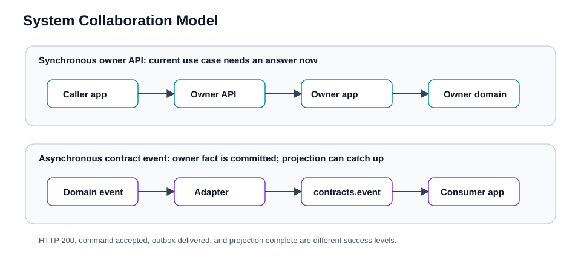

# 系统设计

本文档是系统协作模型 SSOT，解释同步 API、异步事件、最终一致、投影、幂等和失败处理如何组合。强制分层规则见 [architecture.md](architecture.md)，业务实现链路见 [business-flows.md](business-flows.md)。

## 设计目标

当前系统优先保证这些性质：

- 对外入口稳定：浏览器默认经 `community-gateway`，业务 API 保持 `/api/**`，文件保持 `/files/**` 并路由到 `community-oss`，IM WebSocket 前缀保持 `/ws/im`；`/api/im/sessions` 由 `community-im-gateway` 返回稳定的 `/ws/im`，worker 选择和内部桥接对客户端透明。
- owner 清晰：主业务由 `community-app` 按包 owner 治理，IM 消息权威状态由 `community-im` 承担。
- 同步协作显式：跨域同步调用只走 owner-domain `api.query` / `api.action` / `api.model`。
- 异步协作显式：跨域事件只走 owner-domain `contracts.event`。
- 主写路径优先正确：请求线程内完成主事实写入、领域规则、必要同步协作和事务提交。
- 下游投影按语义选择：可靠 outbox、best-effort listener、同步 owner API 或实时回源，不强行统一。
- 失败可观察：重复提交、投影失败、scheduler、DLQ / DEAD 状态都要有日志或指标入口。



## 同步请求模型

典型读路径：

```text
Client
  -> community-gateway
  -> owner service
  -> SecurityFilterChain / ApiSecurityRules
  -> controller
  -> owner ApplicationService / pure application Query
  -> domain / repository
  -> Result<T>
```

典型写路径：

```text
Client + Authorization + Idempotency-Key
  -> community-gateway
  -> community-app / im service
  -> controller / listener / handler / bridge / enqueuer / job
  -> owner ApplicationService
  -> transaction
  -> domain rules when the use case has domain behavior
  -> repository interface
  -> infrastructure persistence
  -> contract event outbox, or an internal domain event when local subscribers exist
```

同域 controller 通常进入 `ApplicationService`。只有无业务规则、无跨域编排、无幂等或写事务，并且可以直接返回 transport-free read model 的读取，才可以进入同域 application `*Query`，由 infrastructure adapter 直接实现。其他 inbound adapter 进入一个公开的同域 application entry，不为固定类名增加转发层。跨域同步协作发生在 application 层，通过 foreign owner-domain `api.query` / `api.action` 完成；inbound adapter 不在 application 边界之前直接调用 foreign owner `api.*`、foreign `application.*`、domain model/service/repository 或 persistence 实现。

## 并发写入边界

领域对象负责表达状态迁移规则，但内存中的 read-check-write 不是并发控制。凡是校验依赖已读取状态，repository 必须把这个前提带到数据库，并检查 CAS、行锁或唯一约束的裁决结果；失败统一按并发冲突处理，不能继续写出部分新状态。

当前关键边界：

- `discuss_post.aggregate_version` 是 Post 聚合的单调版本。编辑、置顶、加精和删除都以快照版本做 CAS，成功后递增一次；正文 blocks、tags、media desired state 与元数据处于同一事务，CAS 失败会整体回滚。热榜派生 `score` 不推进聚合版本，但写入必须匹配当前活跃 Post 的版本，并原子递增独立的 `score_version`。
- score CAS 与 `PostScoreUpdated` outbox 在同一个 `REQUIRES_NEW` 短事务提交。搜索投影以 `aggregateVersion` 保护全文档，以 `scoreVersion` 只保护 score 字段，避免 content/search 与 hot-feed 两个消费组并发时把同一聚合版本的旧分数永久留在 ES。
- Post 状态只有 `0=普通`、`1=加精`、`2=删除`；`type=1` 表示置顶。只有删除会把帖子从 hot feed 驱逐，加精仍参与热度计算和 feed 投影。
- 帖子 contract event 使用成功写入后的 `aggregate_version`，不再用 `update_time` 充当事件版本。评论创建、编辑和删除通过 `status != 2` 的条件更新确认帖子仍可写，同时推进 Post 版本；创建/删除事件在 `postAggregateVersion` 中携带成功写入后的版本，条件失败时整个评论事务回滚。
- 用户处罚更新携带 `expectedPolicyVersion`；market listing 状态迁移在锁定当前行后仍以期望状态 CAS；活动默认地址由数据库唯一约束保证每个用户至多一个。

事务边界同时受资源规模约束：一个事务只覆盖有界 DB 工作，不包住未定数量的分页循环，也不包住 OSS / HTTP / MQ 调用。批量任务按固定页提交独立短事务，远程调用在事务外完成后再由短事务提交结果。

## 错误协议

对外 HTTP 使用统一 `Result<T>` 包体，并让 HTTP status 表达错误类别：

- 参数错误：`400`
- 未认证：`401`
- 无权限：`403`
- 资源不存在：`404`
- 并发/幂等冲突：`409`
- 依赖不可用或关键基础设施故障：`503`
- 未预期服务端错误：`500`

`Result.code` 表达业务细分错误码。Servlet / WebFlux 服务统一回写 `traceparent`，便于 Kibana 按 trace 关联。

客户端侧不能只依赖 HTTP 200 判断完整业务终态。资金、IM 和投影类链路还要看业务状态字段、IM event/history 或后台 action/outbox 状态。

## 同步跨域协作

跨域同步调用只允许使用 owner-domain API：

```text
caller ApplicationService
  -> owner-domain api.query / api.action
  -> owner ApplicationService implementing the API / substantive adapter
  -> owner domain
```

当前典型协作：

- `interaction` 的点赞写入先通过 user/content owner query 解析可信目标，再调用 `social.api.action`；social 的点赞 HTTP controller 只承担读取入口。
- `profile` 通过 user/social/content/growth owner query 同步组装用户主页，不复制这些 owner 的主事实。
- content 发帖/评论同步回源 user owner 判断发言资格；growth task 和 wallet reward projection 通过 content contract event、outbox 和 Kafka consumer 追平。
- market 下单/退款/放款先写 `market_wallet_action` durable command，再由 market processor 调用 `wallet.api.action`。
- user / social 为 IM policy snapshot 暴露同步查询面。

原则：

- `api.model` 是同步协作模型，不复用 `contracts.event`。
- API request/result 可以嵌套在 API 接口中；Owner ApplicationService 可以直接实现 API。
- 当前多数 owner API 由 ApplicationService 直接实现；`infrastructure.api` 只保留 4 个负责错误翻译、协议投影或配置策略的 reviewed adapter，不为纯 delegate 增加一层。
- domain 不依赖 `api.*`。
- same-domain 调用不绕回 same-domain `api.*`。
- 架构守卫检查 business / adapter domain application 跨域只能依赖 published API，并检查核心域同步依赖图无环；不冻结具体类到具体 API model 的 edge 清单。
- 尽量避免跨域 JOIN；聚合优先 owner API + batch / cache。

## 异步事件协作

异步事件最多分三层：

1. domain event：可选的域内语义，只在有独立本地订阅者时存在。
2. owner-domain `contracts.event`：跨域异步契约，生产方 owns semantics。
3. transport / outbox / Kafka payload：技术交付形态。

单一跨域 durable reaction 不要求经过 domain event 和 Spring bridge。Owner ApplicationService 可以在主事务内直接通过 application port 写 contract event outbox；content 的帖子和评论链路都采用这一形态，主代码当前没有本地 Spring event bridge。

当前 `community-app` 内部跨域事件 contract 主要由：

- `content.contracts.event.*`
- `social.contracts.event.*`
- `user.contracts.event.*`

`common.event.EventEnvelope` 保留为通用 envelope 能力，但不是包级单体内部投影协作的默认入口。同步 `api.model` 和异步 `contracts.event` 是两套 public contract，即使字段相同也不复用类型。

content、social、user 的 owner event dispatch 共用 `common-json` 提供的 envelope 校验、codec 调用和 handler dispatch 支撑；各 owner 仍保留自己的 application 入口、contract event、错误文本和 wire contract。IM policy 的异构事件翻译不复用这层支撑。

## 投影和最终一致

owner 跨域事件统一先走 owner outbox 到 Kafka；consumer 从 Kafka listener 进入本域 ApplicationService。只有 IM policy 在消费 owner Kafka 后保留一层内部 projection outbox：

| 下游 | 交付模式 | 语义 |
| --- | --- | --- |
| search post projection | `content.events` -> Kafka listener | 回源 content 当前事实后 upsert/delete ES |
| IM policy projection | `user.events` / `social.events` -> `projection.im.policy` -> IM Kafka | 确定性 source event 去重后发布给 `im-realtime` |
| notice projection | owner Kafka -> listener | source event 去重后写通知读模型 |
| growth task progress | owner Kafka -> listener | `user_task_event_log` 去重并保留 like-removal rollback |
| wallet reward | `content.events` / `social.events` -> `WalletRewardKafkaListener` -> wallet application | wallet 以 `wallet-reward:<sourceId>` 幂等落账 |
| hot feed | owner Kafka -> listener | 根据 owner event 更新热流状态 |
| market fund action | `market_wallet_action` saga command -> wallet owner API | 市场事务先提交资金命令，后台 processor 调钱包并推进订单/争议状态 |
| analytics | filter -> capture application -> `analytics.request` -> listener -> Redis | 固定通过 Kafka 异步交付；采集失败只记录日志，不改变已完成的业务响应 |

social 严格互动链固定使用数据库；其 contract event 固定通过 `eventbus.social -> social.events` 发布。

hot-feed guard 让新 Post event 与携带 `postAggregateVersion` 的 comment event 共享 `post` lane，从而按同一个 Post 单调时钟判旧；legacy Post、缺少该字段的 legacy comment 和 social 信号只按 event ID 去重，不把 epoch timestamp 当作水位。所有普通事件都在每帖锁内回源当前 Post/like 事实重算，因此跨 topic 到达顺序和节点时钟回拨不会改变最终 score。`PostDeleted` 另外建立有界 tombstone，普通投影在保护窗口内不能把已删除内容写回；Redis feed 以 `(aggregateVersion, scoreVersion)` 字典序拒绝旧预热快照覆盖新排名。

帖子更新和删除在 owner 事务提交后立即执行本域 feed / summary / detail 失效，不等待 outbox 经 Kafka 回环；Kafka 投影仍负责跨实例最终追平和失败后的重试。更新执行普通失效，删除执行带保护窗口的 terminal eviction。

因此“HTTP 成功”不等于“所有投影完成”。业务读模型若可能延迟，应提供补偿或明确 best-effort 语义。

## Outbox 设计

Outbox 用于需要可靠追平的异步副作用：

```text
owner transaction
  -> eventbus.<owner>
  -> OutboxWorker
  -> owner outbox handler
  -> <owner>.events
```

最小正确性：

- outbox row 必须在主事务内写入，避免“主事务成功但事件丢失”。
- worker 标记 `SUCCEEDED` 之前，副作用必须已经成功提交。
- handler 必须幂等，因为 outbox 是至少一次投递。
- handler 失败时进入重试；超过最大次数进入 `DEAD`，`DEAD` 是自动重试终点，不是业务终点。
- content media command 的确定性 event ID 再次 enqueue 发生唯一键冲突时，只允许把同一条 `DEAD` row 原位重排为 `PENDING`；其他状态不得伪装成已重新调度。
- lease 过期要能恢复，避免 worker 崩溃造成永久卡住。

完整细节见 [reliability.md](reliability.md)。

## HTTP 幂等

部分高风险 HTTP 写接口使用 `Idempotency-Key`：

```text
operation + userId + Idempotency-Key
```

当前覆盖：

- `POST /api/posts`
- `POST /api/posts/{postId}/comments`
- `POST /api/wallet/recharges`
- `POST /api/wallet/withdrawals`
- `POST /api/wallet/transfers`
- `POST /api/market/orders`

语义：

- 首次请求执行业务并保存成功响应。
- 成功后同 key 重试返回缓存响应。
- 并发同 key 返回 `409`。
- 同 key 不同请求指纹返回 replay conflict。
- 必须幂等的入口在幂等存储不可用时 fail-closed，返回 `503`。

完整契约见 [reliability.md](reliability.md) 和 [integration-contracts.md](integration-contracts.md)。

## IM 系统设计

IM 独立于 `community-app`，并拆成统一外部入口下的三层：

- `community-im-gateway`：IM session bootstrap、稳定 `/ws/im` 对外桥接、worker 选择和内部转发。
- `im-realtime`：内部 worker WebSocket、JWT 鉴权、本地 policy projection、Kafka command 生产、在线连接和推送。
- `im-core`：消息权威状态、顺序号、幂等、历史查询、未读状态、房间与成员关系。
- Kafka：command / event backplane。

设计取舍：

- WebSocket accepted 不等于 persisted。
- 在线推送是优化路径，正确性依赖 HTTP backfill。
- 私信用 `clientMsgId` 做 `(conversationId, fromUserId, clientMsgId)` 幂等。
- 私信持久化前由 `im-core` 通过 internal owner decision API 回源 `community-app`，最终校验发送方/接收方存在性、处罚状态和双向拉黑关系；`im-realtime` 的本地 policy projection 只用于连接层快速拒绝。
- `im-core` 不缓存允许裁决，只短 TTL 缓存拒绝裁决（默认 500ms，带容量上限），避免被禁言或拉黑用户高频发送时每条消息都打到 owner，同时不让旧 allow 造成最终写入漏洞。
- 群聊用 `clientMsgId` 做 `(roomId, fromUserId, clientMsgId)` 幂等。
- 群聊在线推送是 state-only update，不直接把完整消息当唯一交付方式。
- `im-realtime` 通过 internal scope JWT 从 `im-core` 和 `community-app` 拉取 membership / policy snapshot。
- IM command/event/projection/WebSocket frame 都显式写 `schemaVersion: 1`，并且只接受整数 `1`；projection version 必须是正数 owner version，snapshot watermark 必填且非负。
- room fanout 只使用 Redis presence、共享 owner consumer 和 `im.command.room-fanout-routed` Kafka worker inbox；single slot 为 `0`，cluster slots 为 `0/1/2`。

## OSS 文件服务

`community-oss` 是对象存储和文件下载的 owner：

- 浏览器同步 API 走 `/api/oss/**`。
- 公共文件下载走 `/files/**`，路由固定到 `community-oss`。
- `community-app`、`community-im`、`drive` 和后续业务服务通过 `community-oss-client` 消费 OSS，不直接碰存储后端。
- OSS 只依赖 `ObjectStore` 抽象，dev 可以用 local filesystem 或单节点 Garage，prod 应使用至少 3 节点 Garage 并开启副本和监控。
- 未来切换 Ceph RGW 只替换对象存储 adapter 和配置，不改业务 API。

## Search 设计

搜索是最终一致读模型：

- 查询入口：`GET /api/search/posts`。
- 投影入口：`content.events -> SearchPostProjectionKafkaListener -> SearchPostProjectionApplicationService`。
- search application 回源 content owner 当前状态，再 upsert/delete ES，避免乱序事件把已删除内容复活。
- Post 全文档只接受更大的 `aggregateVersion`；相同聚合版本只允许更大的 `scoreVersion` 更新 `score`，不能覆盖标题、正文、标签或删除状态。
- ES 使用固定 alias `community_posts_alias`，运行时由 `PostIndexManager` 负责 alias 初始化和版本化索引准备。
- 全量重建由可选 `SearchReindexScheduler` 进入 search application，通过 content owner 游标 API 扫描；`search.reindex.cron` 默认关闭，Redis single-flight 防止集群并发执行，在线投影双写隔离目标，完整成功后才原子切换 alias。

## Scheduler / Ops 设计

当前后台任务统一使用 Spring `@Scheduled`，包括 outbox worker、hot-path 预热、counter snapshot flush、市场自动确认和钱包动作处理/恢复。

调度入口不直接拼业务规则，仍然回到 owner `ApplicationService` 或 owner action API。

任务语义按类别区分：

- 清理型任务可以重复执行，目标是收敛过期或无效状态。
- 追平型任务从持久状态机读取待处理项，例如 outbox 或 `market_wallet_action`。
- 自动动作型任务只写 owner command，例如市场自动确认只写 release command，不在 job 中直接记账。
- 长任务或集群互斥任务需要 single-flight、lease 或条件更新保护。

## Schema 快照与前向迁移设计

`deploy/database/business/current-state/010_current_schema.sql` 是 `community`、`community_oss`、`im_core` 的空库当前态快照。它包含最终建表语句与必要引用数据，不包含版本化演进、历史表或 development 身份数据。schema 名固定，Compose 和 runtime JDBC URL 不支持改名。

MySQL entrypoint 在空主库卷上先创建最小权限账号，再执行当前态快照。single 只有一个 MySQL；cluster 只初始化 primary，并在放行迁移前由 replication bootstrap 建立两个 replica 的 GTID 复制。业务服务、Mock Data Studio 和 development seed 都使用 DML-only 账号，不能在 runtime 启动路径中补表。

`community` 的结构变更同时维护最终快照和 `deploy/database/business/migrations` 前向序列。独立 one-shot 使用专用 DDL 账号、固定脚本位置、named lock、SHA-256 history 和逐项幂等 DDL，成功后 runtime 才能启动；应用进程从不接收迁移凭证。可丢弃环境仍可 clean reset，保留数据的环境只能备份后向前迁移，不支持 down migration。

## Config And Discovery 设计

Nacos 同时承担服务注册中心和非密钥配置中心职责。所有 runtime service 通过
`spring.config.import` 导入 `community-shared.yaml` 和自身 service dataId；本地
和测试 profile 使用 `optional:nacos:`，允许 IDE 启动回退到 packaged defaults。

生产类运行应设置 required imports：

- `NACOS_CONFIG_IMPORT_SHARED`
- `NACOS_CONFIG_IMPORT_SERVICE`

`deploy/config/nacos/*.yaml` 是可发布到 Nacos 的 seed 配置，只放动态策略、路由、
降级、限流、前端 runtime、IM worker 元数据等非密钥配置。access JWT RSA 私钥、service JWT
HMAC secret、数据库密码、对象存储 access key 和 Nacos 凭据必须来自 `.env`、Secret
manager 或部署平台 Secret，不进入 Nacos Config dataId。

服务注册 metadata 只放低基数运行态标签，例如 role、release track、draining、
workerId、wsPath、wsPort、capacity 和 shardGroup。metadata 不承载用户态数据、
业务明细、token、凭据或带认证信息的 URL。

## Runtime Observability 设计

业务无关运行态观测由 Spring Boot Actuator、Micrometer、Prometheus 和 OpenTelemetry 提供。应用代码只保留业务指标、trace 上下文传播和业务审计日志，不再维护一套重复的 JVM、HTTP、数据库、Redis、Kafka 或 OSS 运行态日志框架。

写请求审计由 `common-web.AuditLogFilter` 统一记录，用户管理等领域审计由 owner infrastructure adapter 记录。审计日志不得包含请求体、cookie、Authorization、SQL bind、Redis key、Kafka payload 或对象存储密钥。

## Fail-closed 策略

关键安全与一致性能力默认 fail-closed：

- access verifier 缺少至少 2048-bit RSA public key 会阻断启动；`community-app` 作为签发端还要求匹配的 private key。service JWT HMAC secret 缺失、过短或为占位值同样 fail-closed。
- prod 且 `community.nacos.config.required=true` 时，缺失 `NACOS_CONFIG_IMPORT_SHARED` 或 `NACOS_CONFIG_IMPORT_SERVICE` 会阻断启动。
- prod 下 trusted proxy 开启但 CIDR 为空或全信任会阻断启动。
- prod 下固定验证码、注册验证码/重置链接回传、SMTP 缺失等认证误配会阻断启动。
- OriginGuard 启用且 fail-closed 时，allowlist 缺失会阻断启动并拒绝 `/api/auth/**` 敏感写入口。
- 必须幂等的写入口在幂等存储不可用时返回 `503`。
- outbox handler 遇到未知/坏 payload 不 silent drop，应失败、重试或进入 DEAD。
- 市场资金 action 不能因为钱包失败就把订单静默推进完成态；应保留 pending / retry / failed 状态，让 processor、recovery 或人工排查继续处理。

## 演进原则

- 新业务按 [architecture.md](architecture.md) 的轻量领域分层建模，不扩展旧 `service/entity/mapper/app` 表面，也不预建空的战术 DDD 类型。
- 新跨域同步协作先设计 owner `api.query` 或 `api.action`；用例专用 request/result 优先嵌套在接口中。
- 新跨域异步协作先设计 owner `contracts.event` 和 outbox；只有存在独立本地订阅者时才增加 domain event 或 local listener。
- 新可靠投影默认要求 handler 幂等、可重试、可观测。
- 新高风险 HTTP 写接口要评估是否接入 `Idempotency-Key`。
- 新运维入口统一走 scheduler、owner action 或独立 owner admin API，不新增裸 `/internal/**` 管理面。
