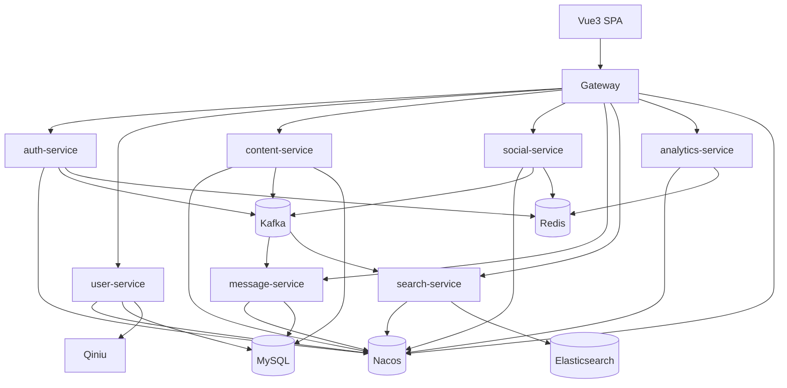

# 技术设计：Boot 3 + Java 17 + Vue3 + Nacos 微服务化拆分

## Technical Solution

### Core Technologies
- Java 17 / Spring Boot 3.x
- Spring Cloud / Spring Cloud Alibaba Nacos（注册发现/配置中心）
- Spring Cloud Gateway（统一入口）
- Spring Security 6（资源服务器模式）
- JWT（Access Token + Refresh Token）
- MyBatis + MySQL（核心数据）
- Redis（高频关系与统计/缓存）
- Kafka（领域事件）
- Elasticsearch（全文搜索）
- Quartz（热帖分数刷新，目标态可迁移为 content-service 内部任务）
- Vue 3（前端，Vite 构建）

### Implementation Key Points
1. **先统一基础设施与规范：** 统一 API 返回、错误码、traceId、配置加载方式。
2. **网关统一治理：** CORS、鉴权前置、限流、灰度路由、日志与 trace 透传。
3. **事件驱动为主：** 搜索索引、通知生成、热帖分数刷新触发等优先通过事件解耦。
4. **数据归属清晰：** 一个服务拥有自己的数据模型与表归属，跨服务只走 API/事件。

---

## Architecture Design

---

## Architecture Decision ADR

### ADR-001: Boot 3 + Java 17 + Nacos 微服务底座
**Context:** 项目必须升级到 Boot 3；并希望进行微服务化拆分以支持独立部署与前后端分离。  
**Decision:** 采用 Java 17 + Spring Boot 3.x + Spring Cloud + Spring Cloud Alibaba Nacos，建立微服务底座（Gateway + 服务注册发现 + 配置中心）。  
**Rationale:** 统一基础设施能力，减少自建成本；与前后端分离（Vue3）配套；对后续服务扩展与治理更友好。  
**Alternatives:**  
- 继续单体（拒绝原因：无法满足拆分目标与治理诉求）  
- 维持 Boot 2（拒绝原因：与“必须升级 Boot 3”约束冲突）  
**Impact:** Jakarta 迁移与依赖升级工作量大；需要严格控制版本矩阵与回归成本。

### ADR-002: SPA 鉴权采用 JWT + Refresh Token，网关统一校验
**Context:** 微服务下不适合复制单体的 cookie ticket + ThreadLocal 认证方式。  
**Decision:** 采用 JWT Access Token（短期）+ Refresh Token（长期，建议旋转刷新）；Gateway 作为统一入口进行鉴权与路由。  
**Rationale:** 服务间无需共享 session 状态；利于前后端分离；便于统一安全策略与治理。  
**Alternatives:**  
- Redis Session（拒绝原因：服务间耦合与扩展性差，且不利于多语言/跨边界扩展）  
**Impact:** 需要补齐 token 失效策略、刷新策略与安全风险控制（XSS/CSRF/重放）。

---

## API Design（目标态约定）

### 统一约定
- 所有业务 API 统一前缀：`/api`
- 统一返回：`code/message/data/traceId`
- 认证：`Authorization: Bearer <access_token>`

### 示例
- `POST /api/auth/login`
- `GET /api/posts`
- `POST /api/posts`
- `POST /api/likes`

---

## Data Model（目标态策略）

### 迁移期建议
- 先做到“逻辑归属清晰”：服务内 DAO 只操作归属表。
- 数据库拆分策略可分阶段：
  1) 共享数据库（不同 schema/表归属清晰）  
  2) 服务独立库（需要数据迁移与运维配套）

### 事件可靠性
- 建议逐步引入 Outbox Pattern（本地事务写业务表 + outbox 表，异步投递 Kafka）
- 消费端基于 `eventId` 幂等去重，避免重复通知/重复索引

---

## Security and Performance
- **Security：**
  - 网关统一 CORS、限流、黑白名单与鉴权
  - Refresh Token 建议使用 HttpOnly Cookie 或旋转刷新策略
  - 禁止在仓库中提交 Nacos/DB/Redis/Kafka/七牛等敏感配置
  - 输入校验与权限控制必须在服务端完成（前端只做体验增强）
- **Performance：**
  - 高频关系域（点赞/关注）优先走 Redis
  - 读多写少旁路能力（搜索/通知/统计）优先事件驱动异步化

---

## Testing and Deployment
- **Testing：**
  - 单元测试：领域逻辑
  - 集成测试：Kafka/Redis/ES/DB 关键链路（建议 Testcontainers 或 docker compose）
  - E2E：Vue3 + Gateway + 核心服务的冒烟链路（登录、发帖、点赞、搜索）
- **Deployment：**
  - 本地：docker compose 启动 Nacos/MySQL/Redis/Kafka/ES
  - 生产：各服务独立部署，Gateway 支持灰度与回滚

