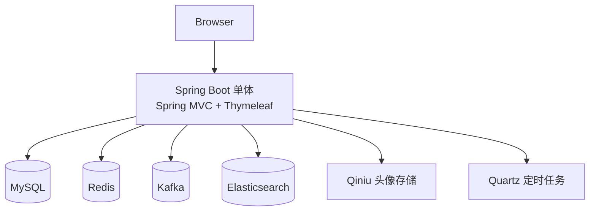
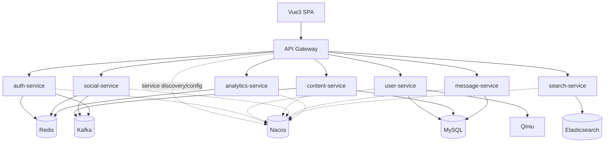
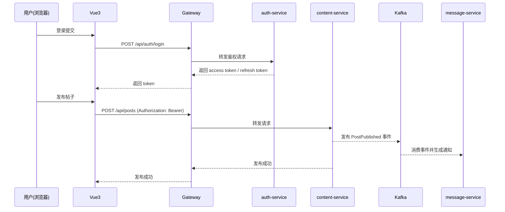

# 架构设计

## 1. 当前总体架构（微服务全链路）

```mermaid
flowchart TD
    Browser[Browser] --> SPA[Vue3 SPA\n(frontend)]
    SPA --> GW[Gateway]

    GW --> Auth[auth-service]
    GW --> User[user-service]
    GW --> Content[content-service]
    GW --> Social[social-service]
    GW --> Msg[message-service]
    GW --> Search[search-service]
    GW --> Ana[analytics-service]

    GW -. service discovery/config .-> Nacos[(Nacos)]

    Auth --> MySQL[(MySQL)]
    User --> MySQL
    Content --> MySQL
    Msg --> MySQL
    Search --> MySQL

    Auth --> Redis[(Redis)]
    Social --> Redis
    Content --> Redis
    Ana --> Redis

    Content --> Kafka[(Kafka)]
    Social --> Kafka
    Msg --> Kafka
    Search --> Kafka

    Search --> ES[(Elasticsearch)]

    Prom[Prometheus] -. scrape .-> GW
    Prom -. scrape .-> Auth
    Prom -. scrape .-> User
    Prom -. scrape .-> Content
    Prom -. scrape .-> Social
    Prom -. scrape .-> Msg
    Prom -. scrape .-> Search
    Prom -. scrape .-> Ana
```

## 1.1 legacy-community 的定位（仅保留源码）

本仓库保留 `legacy-community/` 源码用于对照与迁移参考，但不再在 docker compose 中引入 legacy-community，也不再提供入口切流/回滚脚本。

建议的验证路径：
- 全依赖启动：`deploy/docker-compose.yml`
- 自动化门禁：`mvn test`（后端）+ `npm -C frontend test`（前端）

---

## 2. 历史架构（单体）



---

## 3. 目标总体架构（Boot 3 + 微服务 + 前后端分离）



---

## 4. 技术栈
- **Backend：** Java 17 / Spring Boot 3.x / Spring Cloud / Spring Cloud Alibaba Nacos
- **Frontend：** Vue 3
- **Data：** MySQL / Redis / Kafka / Elasticsearch / Qiniu

---

## 5. 核心流程示例（目标态）



---

## 6. 一致性与幂等（旁路服务）

本项目的搜索/通知/统计等能力属于“旁路能力”，核心原则是 **最终一致**，而不是强一致：

- **写路径（核心域）：** `content-service` / `social-service` 在写入主存储后发布事件（Kafka）。
- **P0 修复（幽灵事件）：** 当写路径处于 DB 事务中时，Kafka 发送必须延后到事务提交后（After-Commit），避免“DB 回滚但事件已发出”。
- **读路径（旁路域）：** `search-service` / `message-service` / `analytics-service` 消费事件或由 gateway 采集写入，异步更新旁路数据。
- **最终一致窗口：** 允许短时间内“已发帖但搜索未命中”“已点赞但通知稍后到达”等现象，通过重试/重建索引等手段补偿。

幂等与去重策略（最低要求）：

- **事件 envelope 统一携带 `eventId` / `traceId` / `version`**（详见 `helloagents/plan/202601161428_boot3_ms_vue3_nacos/event-contract.md`）。
- **消费端幂等：** message-service 采用 `consumed_event` 表记录已消费 `eventId`，避免重复通知/重复副作用。
- **索引重建：** search-service 提供 reindex 能力用于迁移期冷启动与修复（`/api/search/internal/reindex` / `/internal/search/reindex`），重建数据通过 content-service 内部 API 拉取。

> 进一步增强（可选）：引入 Outbox Pattern（业务表 + outbox 表同事务写入，异步投递 Kafka），可提升“写入与发事件”的一致性。

---

## 6. 重大架构决策（ADR 索引）

| adr_id | title | date | status | affected_modules | details |
|--------|-------|------|--------|------------------|---------|
| ADR-001 | Boot 3 + Java 17 + Nacos 微服务底座 | 2026-01-16 | ✅Adopted | gateway/auth/user/content/social/message/search/analytics | [Link](../plan/202601161428_boot3_ms_vue3_nacos/how.md#adr-001-boot-3--java-17--nacos-微服务底座) |
| ADR-002 | SPA 鉴权采用 JWT + Refresh Token，网关统一校验 | 2026-01-16 | ✅Adopted | gateway/auth | [Link](../plan/202601161428_boot3_ms_vue3_nacos/how.md#adr-002-spa-鉴权采用-jwt--refresh-token网关统一校验) |
| ADR-003 | Kafka 事件序列化（迭代 1）采用 JSON + 字段级契约 | 2026-01-16 | ✅Adopted | content/search/message/social | [Link](../plan/202601161428_boot3_ms_vue3_nacos/how.md#adr-003-kafka-事件序列化迭代-1采用-json--字段级契约) |
| ADR-004 | UV/DAU 采集（迭代 1）由 Gateway Filter 采集，写入 analytics-service | 2026-01-16 | ✅Adopted | gateway/analytics | [Link](../plan/202601161428_boot3_ms_vue3_nacos/how.md#adr-004-uvdau-采集迭代-1由-gateway-filter-采集写入-analytics-service-redis) |
| ADR-005 | auth-service 与 user-service 职责边界（迭代 3） | 2026-01-16 | ✅Adopted | auth/user | [Link](../plan/202601161428_boot3_ms_vue3_nacos/how.md#adr-005-auth-service-与-user-service-职责边界迭代-3) |
| ADR-006 | 页面聚合策略：Vue3 直连多服务，经由 Gateway 路由 | 2026-01-16 | ✅Adopted | frontend/gateway | [Link](../plan/202601161428_boot3_ms_vue3_nacos/how.md#adr-006-页面聚合策略vue3-直连多服务经由-gateway-路由) |
| ADR-007 | 数据拆分策略阶段（共享库 → 独立库） | 2026-01-16 | ✅Adopted | user/content/social/message/search/auth | [Link](../plan/202601161428_boot3_ms_vue3_nacos/how.md#adr-007-数据拆分策略阶段共享库--独立库) |
| ADR-008 | P0 选择 After-Commit 而非 Outbox（先止血） | 2026-01-18 | ✅Adopted | common/content/social/message | [Link](../history/2026-01/202601182111_prod_hardening_p0/how.md#adr-008-p0-选择-after-commit-而非-outbox先止血) |
