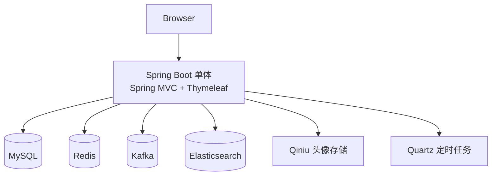
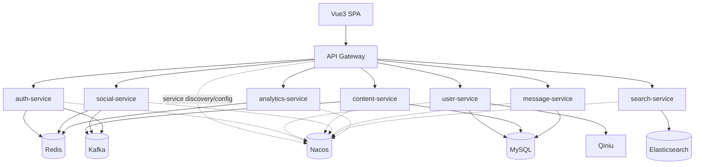
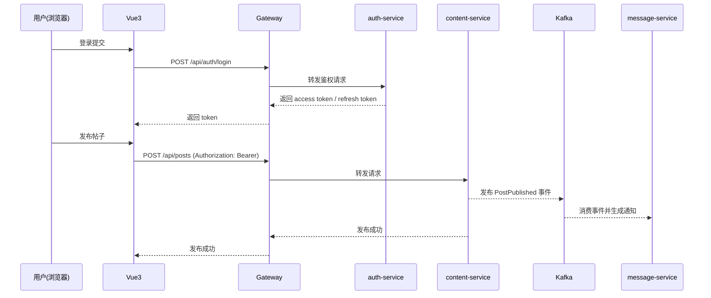

# 架构设计

## 1. 当前总体架构（单体）

---

## 2. 目标总体架构（Boot 3 + 微服务 + 前后端分离）

---

## 3. 技术栈
- **Backend：** Java 17 / Spring Boot 3.x / Spring Cloud / Spring Cloud Alibaba Nacos
- **Frontend：** Vue 3
- **Data：** MySQL / Redis / Kafka / Elasticsearch / Qiniu

---

## 4. 核心流程示例（目标态）

---

## 5. 重大架构决策（ADR 索引）

| adr_id | title | date | status | affected_modules | details |
|--------|-------|------|--------|------------------|---------|
| ADR-001 | Boot 3 + Java 17 + Nacos 微服务底座 | 2026-01-16 | ✅Adopted | gateway/auth/user/content/social/message/search/analytics | [Link](../plan/202601161428_boot3_ms_vue3_nacos/how.md#adr-001-boot-3--java-17--nacos-微服务底座) |

